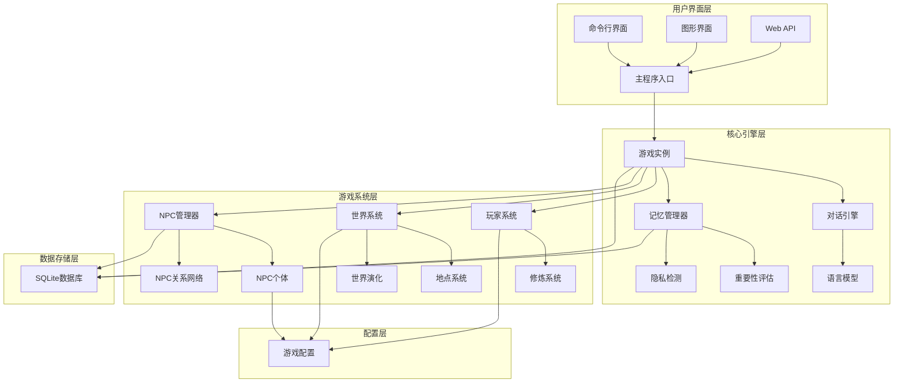
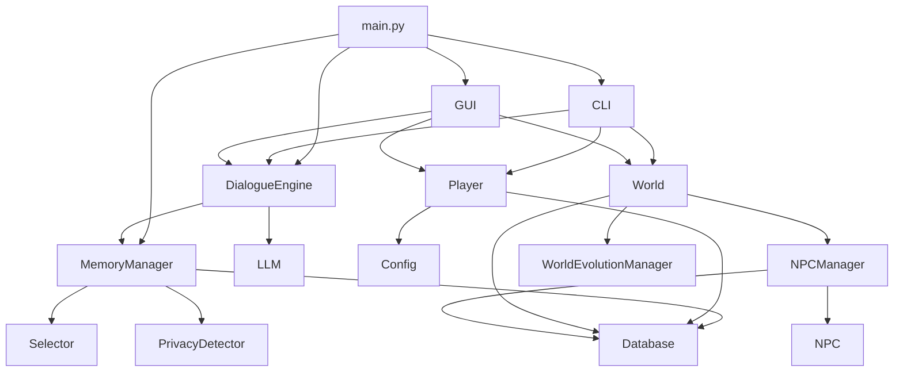

# 修仙世界 - AI驱动文字修仙游戏 Code Wiki

## 1. 项目概述

修仙世界是一个由AI驱动的沉浸式文字修仙游戏，融合传统修仙文化与现代AI技术，打造真实的修仙体验。游戏支持丰富的修仙系统，包括境界突破、功法学习、NPC交互等核心玩法。

### 1.1 核心特性

- **七层境界体系**：凡人 → 练气 → 筑基 → 金丹 → 元婴 → 化神 → 渡劫 → 大乘
- **灵根系统**：天灵根、双灵根、三灵根、四灵根、五灵根，不同资质决定修炼速度
- **AI驱动对话**：智能NPC交互，AI评判系统，内容过滤
- **无限生成世界**：动态地图生成，NPC独立系统，妖兽生态
- **丰富游戏系统**：功法系统，道具系统，门派系统，事件系统

### 1.2 技术栈

- **Python 3.8+**：核心编程语言
- **SQLite**：本地数据存储
- **llama-cpp-python**：本地LLM推理（可选）
- **FastAPI**：Web API框架（可选）

## 2. 项目架构

### 2.1 目录结构

```
ai_learning_system/
├── core/                    # 核心AI模块
│   ├── dialogue_engine.py   # 对话引擎
│   ├── memory.py           # 记忆管理
│   ├── selector.py         # 重要性评分
│   ├── forgetter.py        # 遗忘机制
│   └── judge.py            # 判断决策
├── game/                    # 游戏系统
│   ├── player.py           # 玩家系统
│   ├── cultivation.py      # 修炼系统
│   ├── world.py            # 世界系统
│   ├── npc/                # NPC系统
│   ├── generator.py        # 无限生成器
│   └── events.py           # 事件系统
├── config/                  # 游戏配置
│   ├── game_config.py      # 游戏数值配置
│   ├── cultivation_realms.py # 境界配置
│   ├── techniques.py       # 功法配置
│   └── items.py            # 道具配置
├── interface/              # 用户接口
│   ├── cli.py              # 命令行界面
│   ├── gui/                # 图形界面
│   └── web_api.py          # Web API
├── storage/                # 数据存储
│   └── database.py         # SQLite数据库
├── utils/                  # 工具模块
│   ├── colors.py           # 终端颜色
│   └── logger.py           # 日志记录
├── main.py                 # 程序入口
└── requirements.txt        # 依赖列表
```

### 2.2 核心架构图



## 3. 主要模块职责

### 3.1 核心AI模块 (core/)

#### 3.1.1 对话引擎 (dialogue_engine.py)

- **职责**：处理用户输入、意图识别和回复生成，支持修仙主题
- **主要功能**：
  - 加载和管理语言模型（llama-cpp-python、gpt4all、ctransformers）
  - 识别用户意图（问候、提问、命令等）
  - 构建修仙主题的对话提示词
  - 生成符合修仙设定的回复
  - 管理对话历史和上下文

#### 3.1.2 记忆管理 (memory.py)

- **职责**：管理AI的记忆存储、检索和生命周期
- **主要功能**：
  - 添加新记忆并评估重要性
  - 隐私检测和敏感信息处理
  - 记忆搜索和关联
  - 记忆访问统计和更新
  - 计算记忆保留时间

#### 3.1.3 重要性评估 (selector.py)

- **职责**：评估记忆内容的重要性
- **主要功能**：
  - 基于规则和模式评估内容重要性
  - 判断内容是否值得记忆

#### 3.1.4 遗忘机制 (forgetter.py)

- **职责**：管理记忆的遗忘过程
- **主要功能**：
  - 基于时间和重要性清理记忆
  - 优化记忆存储

#### 3.1.5 判断决策 (judge.py)

- **职责**：对AI回复进行评判和过滤
- **主要功能**：
  - 评估回复质量
  - 过滤不符合修仙设定的内容
  - 给予修为奖励

### 3.2 游戏系统模块 (game/)

#### 3.2.1 玩家系统 (player.py)

- **职责**：管理玩家属性、状态、存档等
- **主要功能**：
  - 玩家属性管理（境界、修为、寿元等）
  - 修炼和突破系统
  - 功法学习和练习
  - 背包和道具系统
  - 战斗属性计算
  - 社交关系管理

#### 3.2.2 世界系统 (world.py)

- **职责**：管理地图、时间等，支持动态生成地点
- **主要功能**：
  - 地点管理（静态和动态生成）
  - 时间系统
  - 地点连接和导航
  - NPC管理集成
  - 世界演化系统

#### 3.2.3 NPC系统 (npc/)

- **职责**：管理NPC的生成、行为和关系
- **主要功能**：
  - NPC生成和属性管理
  - NPC独立行为系统
  - NPC关系网络
  - NPC社交和互动
  - NPC目标系统

#### 3.2.4 修炼系统 (cultivation.py)

- **职责**：管理玩家的修炼过程和境界突破
- **主要功能**：
  - 修为计算和积累
  - 境界突破机制
  - 突破成功率计算
  - 突破失败处理

#### 3.2.5 战斗系统 (combat.py)

- **职责**：处理玩家与妖兽、NPC的战斗
- **主要功能**：
  - 战斗属性计算
  - 战斗流程管理
  - 战斗结果判定
  - 战斗奖励分配

### 3.3 配置模块 (config/)

- **职责**：管理游戏的各种配置和设定
- **主要文件**：
  - game_config.py：游戏核心配置
  - cultivation_realms.py：境界配置
  - techniques.py：功法配置
  - items.py：道具配置
  - enemies.py：敌人配置
  - prompts.py：提示词配置

### 3.4 界面模块 (interface/)

#### 3.4.1 命令行界面 (cli.py)

- **职责**：提供命令行交互界面
- **主要功能**：
  - 命令解析和执行
  - 游戏状态显示
  - 用户输入处理

#### 3.4.2 图形界面 (gui/)

- **职责**：提供图形化交互界面
- **主要功能**：
  - 主窗口管理
  - 各种游戏面板
  - 动画效果
  - 用户交互处理

### 3.5 存储模块 (storage/)

#### 3.5.1 数据库 (database.py)

- **职责**：管理游戏数据的存储和检索
- **主要功能**：
  - SQLite数据库操作
  - 记忆存储和检索
  - NPC数据管理
  - 游戏进度保存

### 3.6 工具模块 (utils/)

- **职责**：提供各种辅助功能
- **主要文件**：
  - colors.py：终端颜色处理
  - logger.py：日志记录
  - llm_client.py：语言模型客户端
  - privacy_detector.py：隐私检测
  - scheduler.py：任务调度

## 4. 关键类与函数

### 4.1 核心类

#### 4.1.1 AILearningSystem (main.py)

- **职责**：AI学习系统主类，负责协调数据库、记忆管理器和CLI界面
- **主要方法**：
  - `run()`：启动AI学习系统
  - `_initialize()`：初始化系统组件
  - `_start_cli()`：启动CLI界面
  - `cleanup()`：清理系统资源

#### 4.1.2 DialogueEngine (core/dialogue_engine.py)

- **职责**：处理对话流程，生成回复
- **主要方法**：
  - `load_model(model_path)`：加载语言模型
  - `detect_intent(message)`：检测用户消息意图
  - `chat(message)`：主对话接口
  - `generate_with_model(message, context)`：使用语言模型生成回复
  - `build_prompt(message, context)`：构建模型输入提示词

#### 4.1.3 MemoryManager (core/memory.py)

- **职责**：管理记忆的增删改查和生命周期
- **主要方法**：
  - `add_memory(content, source)`：添加新记忆
  - `get_memory(memory_id)`：获取记忆
  - `search_memories(query)`：搜索记忆
  - `get_recent_dialogue(limit)`：获取最近的对话记录
  - `save_dialogue(user_message, ai_response)`：保存对话记录
  - `get_user_preferences()`：获取用户偏好

#### 4.1.4 Player (game/player.py)

- **职责**：管理玩家属性和状态
- **主要方法**：
  - `_init_new_player()`：初始化新玩家
  - `get_realm_name()`：获取境界名称
  - `get_cultivation_speed()`：获取修炼速度
  - `learn_technique(technique_name)`：学习功法
  - `practice_technique(technique_name)`：练习功法
  - `add_item(item_name, count)`：添加道具到背包
  - `use_item(item_name)`：使用道具
  - `can_breakthrough()`：检查是否可以突破
  - `advance_time(days)`：推进时间
  - `die(cause)`：死亡处理
  - `reincarnate(inheritance)`：转世重生

#### 4.1.5 World (game/world.py)

- **职责**：管理游戏世界，包括地点、时间和NPC
- **主要方法**：
  - `_init_locations()`：初始化地点
  - `get_location(name)`：获取地点
  - `can_enter(location_name, realm_level)`：检查是否可以进入地点
  - `get_accessible_locations(current_location, realm_level)`：获取可到达的地点
  - `add_generated_location(gen_loc)`：添加动态生成的地点
  - `connect_locations(loc1_name, loc2_name, bidirectional)`：建立两个地点之间的连接
  - `update_npcs(current_time, player_location)`：更新所有NPC
  - `get_npcs_in_location(location)`：获取地点的所有NPC

#### 4.1.6 NPCManager (game/npc/manager.py)

- **职责**：管理NPC的生成和行为
- **主要方法**：
  - `generate_npcs_for_location(location, count, db)`：为地点生成NPC
  - `get_npcs_in_location(location)`：获取地点的NPC
  - `get_npc_by_name(name)`：根据名字获取NPC
  - `update_all(current_time, player_location)`：更新所有NPC
  - `socialize_npcs(npc_id1, npc_id2)`：两个NPC之间进行社交

### 4.2 核心函数

#### 4.2.1 main() (main.py)

- **职责**：程序入口点，解析命令行参数，创建AILearningSystem实例并运行
- **参数**：命令行参数，支持--cli和--gui模式
- **返回值**：无

#### 4.2.2 calculate_cultivation_speed() (config/cultivation_realms.py)

- **职责**：计算修炼速度
- **参数**：灵根类型
- **返回值**：修炼速度系数

#### 4.2.3 get_realm_info() (config/cultivation_realms.py)

- **职责**：获取境界信息
- **参数**：境界等级
- **返回值**：境界信息对象

#### 4.2.4 generate_spirit_root() (config/cultivation_realms.py)

- **职责**：随机生成灵根
- **参数**：无
- **返回值**：灵根类型和信息

## 5. 依赖关系

### 5.1 核心依赖

| 依赖项 | 版本/说明 | 用途 | 来源 |
|-------|-----------|------|------|
| Python | 3.8+ | 核心编程语言 | 系统 |
| SQLite | 内置 | 本地数据存储 | 系统 |
| llama-cpp-python | 可选 | 本地LLM推理 | requirements.txt |
| gpt4all | 可选 | 本地LLM推理 | requirements.txt |
| ctransformers | 可选 | 本地LLM推理 | requirements.txt |
| FastAPI | 可选 | Web API框架 | requirements.txt |
| PyQt5 | 可选 | GUI界面 | requirements.txt |

### 5.2 模块依赖关系



## 6. 项目运行方式

### 6.1 安装

```bash
# 安装依赖
cd ai_learning_system
pip install -r requirements.txt
```

### 6.2 运行游戏

#### 6.2.1 命令行模式

```bash
# 启动游戏
cd ai_learning_system
python main.py
# 或明确指定CLI模式
python main.py --cli
```

#### 6.2.2 图形界面模式

```bash
# 启动GUI模式
cd ai_learning_system
python main.py --gui
```

### 6.3 游戏指令

#### 6.3.1 修炼相关

| 指令 | 说明 |
|------|------|
| `/修炼` 或 `/xiulian` | 闭关修炼，增加修为 |
| `/突破` 或 `/tupo` | 尝试突破当前境界 |
| `/状态` 或 `/status` | 查看自身状态 |

#### 6.3.2 移动探索

| 指令 | 说明 |
|------|------|
| `/前往 <地点>` 或 `/go` | 前往指定地点 |
| `/地图` 或 `/map` | 查看世界地图 |
| `/探索` 或 `/explore` | 探索新区域 |
| `/秘境` 或 `/secret` | 查看秘境列表 |

#### 6.3.3 NPC交互

| 指令 | 说明 |
|------|------|
| `/交谈 <NPC名字>` | 与NPC对话 |
| `/npcs` | 查看当前地点的NPC |
| `/npc <名字>` | 查看NPC详细信息 |
| `/门派` | 查看门派列表 |

#### 6.3.4 功法道具

| 指令 | 说明 |
|------|------|
| `/功法` | 查看已学功法 |
| `/学习 <功法名>` | 学习功法 |
| `/背包` | 查看背包内容 |
| `/使用 <道具名>` | 使用道具 |

#### 6.3.5 系统指令

| 指令 | 说明 |
|------|------|
| `/help` | 显示帮助信息 |
| `/quit` 或 `/exit` | 退出游戏并保存 |
| `/新建角色` | 创建新角色 |
| `/加载 <角色名>` | 加载指定角色 |

#### 6.3.6 管理员指令

| 指令 | 说明 |
|------|------|
| `/admin exp <数值>` | 增加修为 |
| `/admin realm <等级>` | 设置境界 |
| `/admin heal` | 恢复满状态 |
| `/gm npc <数量>` | 生成NPC |
| `/gm map [数量] [名字] [境界]` | 生成新地图 |

## 7. 配置说明

### 7.1 模型配置

将GGUF格式的模型文件放入 `models/` 目录，游戏会自动加载。

### 7.2 游戏配置

修改 `config/game_config.py` 可调整游戏数值：

- 修炼速度
- 突破成功率
- 寿元上限
- 事件触发概率

### 7.3 境界配置

修改 `config/cultivation_realms.py` 可调整境界系统：

- 境界名称和描述
- 每个境界的寿元上限
- 突破所需经验
- 境界图标和称谓

### 7.4 功法配置

修改 `config/techniques.py` 可调整功法系统：

- 功法名称和描述
- 学习条件
- 修炼速度加成
- 战斗力加成

## 8. 开发指南

### 8.1 代码规范

- 遵循PEP 8规范
- 添加必要的注释
- 测试游戏功能正常

### 8.2 扩展游戏内容

#### 8.2.1 添加新地点

在 `config/game_config.py` 的 `world.locations` 中添加新地点配置。

#### 8.2.2 添加新功法

在 `config/techniques.py` 中添加新功法配置。

#### 8.2.3 添加新道具

在 `config/items.py` 中添加新道具配置。

#### 8.2.4 添加新NPC类型

在 `game/npc/models.py` 中添加新NPC类型。

### 8.3 调试技巧

- 使用 `/admin` 命令调整玩家状态
- 使用 `/gm` 命令生成NPC和地图
- 查看 `storage/game.db` 数据库文件了解游戏状态

## 9. 常见问题

### 9.1 模型加载失败

- 确保模型文件格式正确（GGUF格式）
- 确保模型文件大小合理（至少100MB）
- 检查是否安装了相应的模型库（llama-cpp-python或ctransformers）

### 9.2 游戏运行缓慢

- 尝试使用更轻量的模型
- 减少同时生成的NPC数量
- 关闭不必要的功能

### 9.3 存档丢失

- 确保游戏正常退出（使用 `/quit` 或 `/exit` 命令）
- 定期备份 `storage/game.db` 文件

## 10. 未来发展方向

- 增强NPC智能和自主性
- 扩展世界内容和事件系统
- 增加多人交互功能
- 优化AI模型和推理速度
- 开发移动版本

---

*修仙之路漫漫，祝道友早日飞升！*
