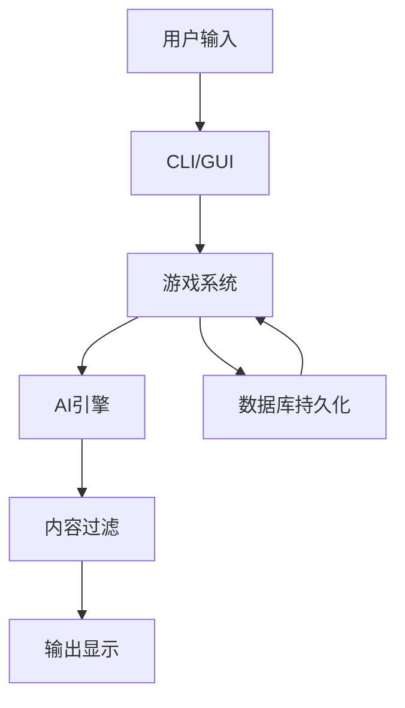

# 修仙世界 -# 修仙世界 - AI驱动文字修仙游戏 Code Wiki

## 1. 项目概述

#### 修仙世界 - AI驱动文字修仙游戏 Code Wiki

## 1. 项目概述

### 1.1 项目简介

修仙世界是一个由AI驱动的沉浸式文字修仙游戏# 修仙世界 - AI驱动文字修仙游戏 Code Wiki

## 1. 项目概述

### 1.1 项目简介

修仙世界是一个由AI驱动的沉浸式文字修仙游戏，融合传统修仙文化与现代AI技术，打造真实的修仙体验。玩家可以在游戏# 修仙世界 - AI驱动文字修仙游戏 Code Wiki

## 1. 项目概述

### 1.1 项目简介

修仙世界是一个由AI驱动的沉浸式文字修仙游戏，融合传统修仙文化与现代AI技术，打造真实的修仙体验。玩家可以在游戏中体验完整的修仙过程，包括修炼、突破、探索、与NPC交互等。

### 1.2 核心特性# 修仙世界 - AI驱动文字修仙游戏 Code Wiki

## 1. 项目概述

### 1.1 项目简介

修仙世界是一个由AI驱动的沉浸式文字修仙游戏，融合传统修仙文化与现代AI技术，打造真实的修仙体验。玩家可以在游戏中体验完整的修仙过程，包括修炼、突破、探索、与NPC交互等。

### 1.2 核心特性

- **七层境界体系**：凡人# 修仙世界 - AI驱动文字修仙游戏 Code Wiki

## 1. 项目概述

### 1.1 项目简介

修仙世界是一个由AI驱动的沉浸式文字修仙游戏，融合传统修仙文化与现代AI技术，打造真实的修仙体验。玩家可以在游戏中体验完整的修仙过程，包括修炼、突破、探索、与NPC交互等。

### 1.2 核心特性

- **七层境界体系**：凡人 → 练气 → 筑基 → 金丹 → 元婴 → 化神 → 渡劫# 修仙世界 - AI驱动文字修仙游戏 Code Wiki

## 1. 项目概述

### 1.1 项目简介

修仙世界是一个由AI驱动的沉浸式文字修仙游戏，融合传统修仙文化与现代AI技术，打造真实的修仙体验。玩家可以在游戏中体验完整的修仙过程，包括修炼、突破、探索、与NPC交互等。

### 1.2 核心特性

- **七层境界体系**：凡人 → 练气 → 筑基 → 金丹 → 元婴 → 化神 → 渡劫 → 大乘
- **灵根系统**# 修仙世界 - AI驱动文字修仙游戏 Code Wiki

## 1. 项目概述

### 1.1 项目简介

修仙世界是一个由AI驱动的沉浸式文字修仙游戏，融合传统修仙文化与现代AI技术，打造真实的修仙体验。玩家可以在游戏中体验完整的修仙过程，包括修炼、突破、探索、与NPC交互等。

### 1.2 核心特性

- **七层境界体系**：凡人 → 练气 → 筑基 → 金丹 → 元婴 → 化神 → 渡劫 → 大乘
- **灵根系统**：天灵根、双灵根、三灵# 修仙世界 - AI驱动文字修仙游戏 Code Wiki

## 1. 项目概述

### 1.1 项目简介

修仙世界是一个由AI驱动的沉浸式文字修仙游戏，融合传统修仙文化与现代AI技术，打造真实的修仙体验。玩家可以在游戏中体验完整的修仙过程，包括修炼、突破、探索、与NPC交互等。

### 1.2 核心特性

- **七层境界体系**：凡人 → 练气 → 筑基 → 金丹 → 元婴 → 化神 → 渡劫 → 大乘
- **灵根系统**：天灵根、双灵根、三灵根、四灵根、五灵根，不同资质决定修炼速度
- **寿元# 修仙世界 - AI驱动文字修仙游戏 Code Wiki

## 1. 项目概述

### 1.1 项目简介

修仙世界是一个由AI驱动的沉浸式文字修仙游戏，融合传统修仙文化与现代AI技术，打造真实的修仙体验。玩家可以在游戏中体验完整的修仙过程，包括修炼、突破、探索、与NPC交互等。

### 1.2 核心特性

- **七层境界体系**：凡人 → 练气 → 筑基 → 金丹 → 元婴 → 化神 → 渡劫 → 大乘
- **灵根系统**：天灵根、双灵根、三灵根、四灵根、五灵根，不同资质决定修炼速度
- **寿元限制**：每个境界都有寿元上限，时间紧迫，必须抓紧修炼
- **# 修仙世界 - AI驱动文字修仙游戏 Code Wiki

## 1. 项目概述

### 1.1 项目简介

修仙世界是一个由AI驱动的沉浸式文字修仙游戏，融合传统修仙文化与现代AI技术，打造真实的修仙体验。玩家可以在游戏中体验完整的修仙过程，包括修炼、突破、探索、与NPC交互等。

### 1.2 核心特性

- **七层境界体系**：凡人 → 练气 → 筑基 → 金丹 → 元婴 → 化神 → 渡劫 → 大乘
- **灵根系统**：天灵根、双灵根、三灵根、四灵根、五灵根，不同资质决定修炼速度
- **寿元限制**：每个境界都有寿元上限，时间紧迫，必须抓紧修炼
- **AI驱动对话**：与修仙世界中的NPC进行自然对话，AI回复会经过天道评判# 修仙世界 - AI驱动文字修仙游戏 Code Wiki

## 1. 项目概述

### 1.1 项目简介

修仙世界是一个由AI驱动的沉浸式文字修仙游戏，融合传统修仙文化与现代AI技术，打造真实的修仙体验。玩家可以在游戏中体验完整的修仙过程，包括修炼、突破、探索、与NPC交互等。

### 1.2 核心特性

- **七层境界体系**：凡人 → 练气 → 筑基 → 金丹 → 元婴 → 化神 → 渡劫 → 大乘
- **灵根系统**：天灵根、双灵根、三灵根、四灵根、五灵根，不同资质决定修炼速度
- **寿元限制**：每个境界都有寿元上限，时间紧迫，必须抓紧修炼
- **AI驱动对话**：与修仙世界中的NPC进行自然对话，AI回复会经过天道评判
- **无限生成世界**：动态地图生成，探索无限生成的秘境、洞府、# 修仙世界 - AI驱动文字修仙游戏 Code Wiki

## 1. 项目概述

### 1.1 项目简介

修仙世界是一个由AI驱动的沉浸式文字修仙游戏，融合传统修仙文化与现代AI技术，打造真实的修仙体验。玩家可以在游戏中体验完整的修仙过程，包括修炼、突破、探索、与NPC交互等。

### 1.2 核心特性

- **七层境界体系**：凡人 → 练气 → 筑基 → 金丹 → 元婴 → 化神 → 渡劫 → 大乘
- **灵根系统**：天灵根、双灵根、三灵根、四灵根、五灵根，不同资质决定修炼速度
- **寿元限制**：每个境界都有寿元上限，时间紧迫，必须抓紧修炼
- **AI驱动对话**：与修仙世界中的NPC进行自然对话，AI回复会经过天道评判
- **无限生成世界**：动态地图生成，探索无限生成的秘境、洞府、山脉
- **NPC独立系统**：每个NPC都有自己的目标、记忆、关系# 修仙世界 - AI驱动文字修仙游戏 Code Wiki

## 1. 项目概述

### 1.1 项目简介

修仙世界是一个由AI驱动的沉浸式文字修仙游戏，融合传统修仙文化与现代AI技术，打造真实的修仙体验。玩家可以在游戏中体验完整的修仙过程，包括修炼、突破、探索、与NPC交互等。

### 1.2 核心特性

- **七层境界体系**：凡人 → 练气 → 筑基 → 金丹 → 元婴 → 化神 → 渡劫 → 大乘
- **灵根系统**：天灵根、双灵根、三灵根、四灵根、五灵根，不同资质决定修炼速度
- **寿元限制**：每个境界都有寿元上限，时间紧迫，必须抓紧修炼
- **AI驱动对话**：与修仙世界中的NPC进行自然对话，AI回复会经过天道评判
- **无限生成世界**：动态地图生成，探索无限生成的秘境、洞府、山脉
- **NPC独立系统**：每个NPC都有自己的目标、记忆、关系网
- **丰富游戏系统**：功法系统、道具系统、门派系统、事件系统# 修仙世界 - AI驱动文字修仙游戏 Code Wiki

## 1. 项目概述

### 1.1 项目简介

修仙世界是一个由AI驱动的沉浸式文字修仙游戏，融合传统修仙文化与现代AI技术，打造真实的修仙体验。玩家可以在游戏中体验完整的修仙过程，包括修炼、突破、探索、与NPC交互等。

### 1.2 核心特性

- **七层境界体系**：凡人 → 练气 → 筑基 → 金丹 → 元婴 → 化神 → 渡劫 → 大乘
- **灵根系统**：天灵根、双灵根、三灵根、四灵根、五灵根，不同资质决定修炼速度
- **寿元限制**：每个境界都有寿元上限，时间紧迫，必须抓紧修炼
- **AI驱动对话**：与修仙世界中的NPC进行自然对话，AI回复会经过天道评判
- **无限生成世界**：动态地图生成，探索无限生成的秘境、洞府、山脉
- **NPC独立系统**：每个NPC都有自己的目标、记忆、关系网
- **丰富游戏系统**：功法系统、道具系统、门派系统、事件系统等

## 2. 项目结构

### 2.1 目录结构# 修仙世界 - AI驱动文字修仙游戏 Code Wiki

## 1. 项目概述

### 1.1 项目简介

修仙世界是一个由AI驱动的沉浸式文字修仙游戏，融合传统修仙文化与现代AI技术，打造真实的修仙体验。玩家可以在游戏中体验完整的修仙过程，包括修炼、突破、探索、与NPC交互等。

### 1.2 核心特性

- **七层境界体系**：凡人 → 练气 → 筑基 → 金丹 → 元婴 → 化神 → 渡劫 → 大乘
- **灵根系统**：天灵根、双灵根、三灵根、四灵根、五灵根，不同资质决定修炼速度
- **寿元限制**：每个境界都有寿元上限，时间紧迫，必须抓紧修炼
- **AI驱动对话**：与修仙世界中的NPC进行自然对话，AI回复会经过天道评判
- **无限生成世界**：动态地图生成，探索无限生成的秘境、洞府、山脉
- **NPC独立系统**：每个NPC都有自己的目标、记忆、关系网
- **丰富游戏系统**：功法系统、道具系统、门派系统、事件系统等

## 2. 项目结构

### 2.1 目录结构

```
ai_learning_system/
# 修仙世界 - AI驱动文字修仙游戏 Code Wiki

## 1. 项目概述

### 1.1 项目简介

修仙世界是一个由AI驱动的沉浸式文字修仙游戏，融合传统修仙文化与现代AI技术，打造真实的修仙体验。玩家可以在游戏中体验完整的修仙过程，包括修炼、突破、探索、与NPC交互等。

### 1.2 核心特性

- **七层境界体系**：凡人 → 练气 → 筑基 → 金丹 → 元婴 → 化神 → 渡劫 → 大乘
- **灵根系统**：天灵根、双灵根、三灵根、四灵根、五灵根，不同资质决定修炼速度
- **寿元限制**：每个境界都有寿元上限，时间紧迫，必须抓紧修炼
- **AI驱动对话**：与修仙世界中的NPC进行自然对话，AI回复会经过天道评判
- **无限生成世界**：动态地图生成，探索无限生成的秘境、洞府、山脉
- **NPC独立系统**：每个NPC都有自己的目标、记忆、关系网
- **丰富游戏系统**：功法系统、道具系统、门派系统、事件系统等

## 2. 项目结构

### 2.1 目录结构

```
ai_learning_system/
├── core/                    # 核心AI模块
# 修仙世界 - AI驱动文字修仙游戏 Code Wiki

## 1. 项目概述

### 1.1 项目简介

修仙世界是一个由AI驱动的沉浸式文字修仙游戏，融合传统修仙文化与现代AI技术，打造真实的修仙体验。玩家可以在游戏中体验完整的修仙过程，包括修炼、突破、探索、与NPC交互等。

### 1.2 核心特性

- **七层境界体系**：凡人 → 练气 → 筑基 → 金丹 → 元婴 → 化神 → 渡劫 → 大乘
- **灵根系统**：天灵根、双灵根、三灵根、四灵根、五灵根，不同资质决定修炼速度
- **寿元限制**：每个境界都有寿元上限，时间紧迫，必须抓紧修炼
- **AI驱动对话**：与修仙世界中的NPC进行自然对话，AI回复会经过天道评判
- **无限生成世界**：动态地图生成，探索无限生成的秘境、洞府、山脉
- **NPC独立系统**：每个NPC都有自己的目标、记忆、关系网
- **丰富游戏系统**：功法系统、道具系统、门派系统、事件系统等

## 2. 项目结构

### 2.1 目录结构

```
ai_learning_system/
├── core/                    # 核心AI模块
│   ├── dialogue_engine.py   # 对话引擎
│   ├── memory.py           ## 修仙世界 - AI驱动文字修仙游戏 Code Wiki

## 1. 项目概述

### 1.1 项目简介

修仙世界是一个由AI驱动的沉浸式文字修仙游戏，融合传统修仙文化与现代AI技术，打造真实的修仙体验。玩家可以在游戏中体验完整的修仙过程，包括修炼、突破、探索、与NPC交互等。

### 1.2 核心特性

- **七层境界体系**：凡人 → 练气 → 筑基 → 金丹 → 元婴 → 化神 → 渡劫 → 大乘
- **灵根系统**：天灵根、双灵根、三灵根、四灵根、五灵根，不同资质决定修炼速度
- **寿元限制**：每个境界都有寿元上限，时间紧迫，必须抓紧修炼
- **AI驱动对话**：与修仙世界中的NPC进行自然对话，AI回复会经过天道评判
- **无限生成世界**：动态地图生成，探索无限生成的秘境、洞府、山脉
- **NPC独立系统**：每个NPC都有自己的目标、记忆、关系网
- **丰富游戏系统**：功法系统、道具系统、门派系统、事件系统等

## 2. 项目结构

### 2.1 目录结构

```
ai_learning_system/
├── core/                    # 核心AI模块
│   ├── dialogue_engine.py   # 对话引擎
│   ├── memory.py           # 记忆管理
│   ├── selector.py         ## 修仙世界 - AI驱动文字修仙游戏 Code Wiki

## 1. 项目概述

### 1.1 项目简介

修仙世界是一个由AI驱动的沉浸式文字修仙游戏，融合传统修仙文化与现代AI技术，打造真实的修仙体验。玩家可以在游戏中体验完整的修仙过程，包括修炼、突破、探索、与NPC交互等。

### 1.2 核心特性

- **七层境界体系**：凡人 → 练气 → 筑基 → 金丹 → 元婴 → 化神 → 渡劫 → 大乘
- **灵根系统**：天灵根、双灵根、三灵根、四灵根、五灵根，不同资质决定修炼速度
- **寿元限制**：每个境界都有寿元上限，时间紧迫，必须抓紧修炼
- **AI驱动对话**：与修仙世界中的NPC进行自然对话，AI回复会经过天道评判
- **无限生成世界**：动态地图生成，探索无限生成的秘境、洞府、山脉
- **NPC独立系统**：每个NPC都有自己的目标、记忆、关系网
- **丰富游戏系统**：功法系统、道具系统、门派系统、事件系统等

## 2. 项目结构

### 2.1 目录结构

```
ai_learning_system/
├── core/                    # 核心AI模块
│   ├── dialogue_engine.py   # 对话引擎
│   ├── memory.py           # 记忆管理
│   ├── selector.py         # 重要性评分
│   ├── forgetter# 修仙世界 - AI驱动文字修仙游戏 Code Wiki

## 1. 项目概述

### 1.1 项目简介

修仙世界是一个由AI驱动的沉浸式文字修仙游戏，融合传统修仙文化与现代AI技术，打造真实的修仙体验。玩家可以在游戏中体验完整的修仙过程，包括修炼、突破、探索、与NPC交互等。

### 1.2 核心特性

- **七层境界体系**：凡人 → 练气 → 筑基 → 金丹 → 元婴 → 化神 → 渡劫 → 大乘
- **灵根系统**：天灵根、双灵根、三灵根、四灵根、五灵根，不同资质决定修炼速度
- **寿元限制**：每个境界都有寿元上限，时间紧迫，必须抓紧修炼
- **AI驱动对话**：与修仙世界中的NPC进行自然对话，AI回复会经过天道评判
- **无限生成世界**：动态地图生成，探索无限生成的秘境、洞府、山脉
- **NPC独立系统**：每个NPC都有自己的目标、记忆、关系网
- **丰富游戏系统**：功法系统、道具系统、门派系统、事件系统等

## 2. 项目结构

### 2.1 目录结构

```
ai_learning_system/
├── core/                    # 核心AI模块
│   ├── dialogue_engine.py   # 对话引擎
│   ├── memory.py           # 记忆管理
│   ├── selector.py         # 重要性评分
│   ├── forgetter.py        # 遗忘机制
│   └── judge.py            # 判断决策
├── game# 修仙世界 - AI驱动文字修仙游戏 Code Wiki

## 1. 项目概述

### 1.1 项目简介

修仙世界是一个由AI驱动的沉浸式文字修仙游戏，融合传统修仙文化与现代AI技术，打造真实的修仙体验。玩家可以在游戏中体验完整的修仙过程，包括修炼、突破、探索、与NPC交互等。

### 1.2 核心特性

- **七层境界体系**：凡人 → 练气 → 筑基 → 金丹 → 元婴 → 化神 → 渡劫 → 大乘
- **灵根系统**：天灵根、双灵根、三灵根、四灵根、五灵根，不同资质决定修炼速度
- **寿元限制**：每个境界都有寿元上限，时间紧迫，必须抓紧修炼
- **AI驱动对话**：与修仙世界中的NPC进行自然对话，AI回复会经过天道评判
- **无限生成世界**：动态地图生成，探索无限生成的秘境、洞府、山脉
- **NPC独立系统**：每个NPC都有自己的目标、记忆、关系网
- **丰富游戏系统**：功法系统、道具系统、门派系统、事件系统等

## 2. 项目结构

### 2.1 目录结构

```
ai_learning_system/
├── core/                    # 核心AI模块
│   ├── dialogue_engine.py   # 对话引擎
│   ├── memory.py           # 记忆管理
│   ├── selector.py         # 重要性评分
│   ├── forgetter.py        # 遗忘机制
│   └── judge.py            # 判断决策
├── game/                    # 游戏系统
│   ├── player.py           # 玩家系统
│# 修仙世界 - AI驱动文字修仙游戏 Code Wiki

## 1. 项目概述

### 1.1 项目简介

修仙世界是一个由AI驱动的沉浸式文字修仙游戏，融合传统修仙文化与现代AI技术，打造真实的修仙体验。玩家可以在游戏中体验完整的修仙过程，包括修炼、突破、探索、与NPC交互等。

### 1.2 核心特性

- **七层境界体系**：凡人 → 练气 → 筑基 → 金丹 → 元婴 → 化神 → 渡劫 → 大乘
- **灵根系统**：天灵根、双灵根、三灵根、四灵根、五灵根，不同资质决定修炼速度
- **寿元限制**：每个境界都有寿元上限，时间紧迫，必须抓紧修炼
- **AI驱动对话**：与修仙世界中的NPC进行自然对话，AI回复会经过天道评判
- **无限生成世界**：动态地图生成，探索无限生成的秘境、洞府、山脉
- **NPC独立系统**：每个NPC都有自己的目标、记忆、关系网
- **丰富游戏系统**：功法系统、道具系统、门派系统、事件系统等

## 2. 项目结构

### 2.1 目录结构

```
ai_learning_system/
├── core/                    # 核心AI模块
│   ├── dialogue_engine.py   # 对话引擎
│   ├── memory.py           # 记忆管理
│   ├── selector.py         # 重要性评分
│   ├── forgetter.py        # 遗忘机制
│   └── judge.py            # 判断决策
├── game/                    # 游戏系统
│   ├── player.py           # 玩家系统
│   ├── world.py            # 世界系统
│   ├── npc/                # NPC系统
# 修仙世界 - AI驱动文字修仙游戏 Code Wiki

## 1. 项目概述

### 1.1 项目简介

修仙世界是一个由AI驱动的沉浸式文字修仙游戏，融合传统修仙文化与现代AI技术，打造真实的修仙体验。玩家可以在游戏中体验完整的修仙过程，包括修炼、突破、探索、与NPC交互等。

### 1.2 核心特性

- **七层境界体系**：凡人 → 练气 → 筑基 → 金丹 → 元婴 → 化神 → 渡劫 → 大乘
- **灵根系统**：天灵根、双灵根、三灵根、四灵根、五灵根，不同资质决定修炼速度
- **寿元限制**：每个境界都有寿元上限，时间紧迫，必须抓紧修炼
- **AI驱动对话**：与修仙世界中的NPC进行自然对话，AI回复会经过天道评判
- **无限生成世界**：动态地图生成，探索无限生成的秘境、洞府、山脉
- **NPC独立系统**：每个NPC都有自己的目标、记忆、关系网
- **丰富游戏系统**：功法系统、道具系统、门派系统、事件系统等

## 2. 项目结构

### 2.1 目录结构

```
ai_learning_system/
├── core/                    # 核心AI模块
│   ├── dialogue_engine.py   # 对话引擎
│   ├── memory.py           # 记忆管理
│   ├── selector.py         # 重要性评分
│   ├── forgetter.py        # 遗忘机制
│   └── judge.py            # 判断决策
├── game/                    # 游戏系统
│   ├── player.py           # 玩家系统
│   ├── world.py            # 世界系统
│   ├── npc/                # NPC系统
│   │   ├── core.py         # NPC核心
│   │   ├── manager.py# 修仙世界 - AI驱动文字修仙游戏 Code Wiki

## 1. 项目概述

### 1.1 项目简介

修仙世界是一个由AI驱动的沉浸式文字修仙游戏，融合传统修仙文化与现代AI技术，打造真实的修仙体验。玩家可以在游戏中体验完整的修仙过程，包括修炼、突破、探索、与NPC交互等。

### 1.2 核心特性

- **七层境界体系**：凡人 → 练气 → 筑基 → 金丹 → 元婴 → 化神 → 渡劫 → 大乘
- **灵根系统**：天灵根、双灵根、三灵根、四灵根、五灵根，不同资质决定修炼速度
- **寿元限制**：每个境界都有寿元上限，时间紧迫，必须抓紧修炼
- **AI驱动对话**：与修仙世界中的NPC进行自然对话，AI回复会经过天道评判
- **无限生成世界**：动态地图生成，探索无限生成的秘境、洞府、山脉
- **NPC独立系统**：每个NPC都有自己的目标、记忆、关系网
- **丰富游戏系统**：功法系统、道具系统、门派系统、事件系统等

## 2. 项目结构

### 2.1 目录结构

```
ai_learning_system/
├── core/                    # 核心AI模块
│   ├── dialogue_engine.py   # 对话引擎
│   ├── memory.py           # 记忆管理
│   ├── selector.py         # 重要性评分
│   ├── forgetter.py        # 遗忘机制
│   └── judge.py            # 判断决策
├── game/                    # 游戏系统
│   ├── player.py           # 玩家系统
│   ├── world.py            # 世界系统
│   ├── npc/                # NPC系统
│   │   ├── core.py         # NPC核心
│   │   ├── manager.py      # NPC管理器
│   │   └── models.py       # NPC模型
│   ├──# 修仙世界 - AI驱动文字修仙游戏 Code Wiki

## 1. 项目概述

### 1.1 项目简介

修仙世界是一个由AI驱动的沉浸式文字修仙游戏，融合传统修仙文化与现代AI技术，打造真实的修仙体验。玩家可以在游戏中体验完整的修仙过程，包括修炼、突破、探索、与NPC交互等。

### 1.2 核心特性

- **七层境界体系**：凡人 → 练气 → 筑基 → 金丹 → 元婴 → 化神 → 渡劫 → 大乘
- **灵根系统**：天灵根、双灵根、三灵根、四灵根、五灵根，不同资质决定修炼速度
- **寿元限制**：每个境界都有寿元上限，时间紧迫，必须抓紧修炼
- **AI驱动对话**：与修仙世界中的NPC进行自然对话，AI回复会经过天道评判
- **无限生成世界**：动态地图生成，探索无限生成的秘境、洞府、山脉
- **NPC独立系统**：每个NPC都有自己的目标、记忆、关系网
- **丰富游戏系统**：功法系统、道具系统、门派系统、事件系统等

## 2. 项目结构

### 2.1 目录结构

```
ai_learning_system/
├── core/                    # 核心AI模块
│   ├── dialogue_engine.py   # 对话引擎
│   ├── memory.py           # 记忆管理
│   ├── selector.py         # 重要性评分
│   ├── forgetter.py        # 遗忘机制
│   └── judge.py            # 判断决策
├── game/                    # 游戏系统
│   ├── player.py           # 玩家系统
│   ├── world.py            # 世界系统
│   ├── npc/                # NPC系统
│   │   ├── core.py         # NPC核心
│   │   ├── manager.py      # NPC管理器
│   │   └── models.py       # NPC模型
│   ├── cultivation.py      # 修炼系统
│   ├── combat.py           # 战斗系统
│# 修仙世界 - AI驱动文字修仙游戏 Code Wiki

## 1. 项目概述

### 1.1 项目简介

修仙世界是一个由AI驱动的沉浸式文字修仙游戏，融合传统修仙文化与现代AI技术，打造真实的修仙体验。玩家可以在游戏中体验完整的修仙过程，包括修炼、突破、探索、与NPC交互等。

### 1.2 核心特性

- **七层境界体系**：凡人 → 练气 → 筑基 → 金丹 → 元婴 → 化神 → 渡劫 → 大乘
- **灵根系统**：天灵根、双灵根、三灵根、四灵根、五灵根，不同资质决定修炼速度
- **寿元限制**：每个境界都有寿元上限，时间紧迫，必须抓紧修炼
- **AI驱动对话**：与修仙世界中的NPC进行自然对话，AI回复会经过天道评判
- **无限生成世界**：动态地图生成，探索无限生成的秘境、洞府、山脉
- **NPC独立系统**：每个NPC都有自己的目标、记忆、关系网
- **丰富游戏系统**：功法系统、道具系统、门派系统、事件系统等

## 2. 项目结构

### 2.1 目录结构

```
ai_learning_system/
├── core/                    # 核心AI模块
│   ├── dialogue_engine.py   # 对话引擎
│   ├── memory.py           # 记忆管理
│   ├── selector.py         # 重要性评分
│   ├── forgetter.py        # 遗忘机制
│   └── judge.py            # 判断决策
├── game/                    # 游戏系统
│   ├── player.py           # 玩家系统
│   ├── world.py            # 世界系统
│   ├── npc/                # NPC系统
│   │   ├── core.py         # NPC核心
│   │   ├── manager.py      # NPC管理器
│   │   └── models.py       # NPC模型
│   ├── cultivation.py      # 修炼系统
│   ├── combat.py           # 战斗系统
│   ├── events.py           # 事件系统
│   └── ...                 # 其他游戏# 修仙世界 - AI驱动文字修仙游戏 Code Wiki

## 1. 项目概述

### 1.1 项目简介

修仙世界是一个由AI驱动的沉浸式文字修仙游戏，融合传统修仙文化与现代AI技术，打造真实的修仙体验。玩家可以在游戏中体验完整的修仙过程，包括修炼、突破、探索、与NPC交互等。

### 1.2 核心特性

- **七层境界体系**：凡人 → 练气 → 筑基 → 金丹 → 元婴 → 化神 → 渡劫 → 大乘
- **灵根系统**：天灵根、双灵根、三灵根、四灵根、五灵根，不同资质决定修炼速度
- **寿元限制**：每个境界都有寿元上限，时间紧迫，必须抓紧修炼
- **AI驱动对话**：与修仙世界中的NPC进行自然对话，AI回复会经过天道评判
- **无限生成世界**：动态地图生成，探索无限生成的秘境、洞府、山脉
- **NPC独立系统**：每个NPC都有自己的目标、记忆、关系网
- **丰富游戏系统**：功法系统、道具系统、门派系统、事件系统等

## 2. 项目结构

### 2.1 目录结构

```
ai_learning_system/
├── core/                    # 核心AI模块
│   ├── dialogue_engine.py   # 对话引擎
│   ├── memory.py           # 记忆管理
│   ├── selector.py         # 重要性评分
│   ├── forgetter.py        # 遗忘机制
│   └── judge.py            # 判断决策
├── game/                    # 游戏系统
│   ├── player.py           # 玩家系统
│   ├── world.py            # 世界系统
│   ├── npc/                # NPC系统
│   │   ├── core.py         # NPC核心
│   │   ├── manager.py      # NPC管理器
│   │   └── models.py       # NPC模型
│   ├── cultivation.py      # 修炼系统
│   ├── combat.py           # 战斗系统
│   ├── events.py           # 事件系统
│   └── ...                 # 其他游戏系统
├── config/                  # 游戏配置
│   ├── game_config.py      ## 修仙世界 - AI驱动文字修仙游戏 Code Wiki

## 1. 项目概述

### 1.1 项目简介

修仙世界是一个由AI驱动的沉浸式文字修仙游戏，融合传统修仙文化与现代AI技术，打造真实的修仙体验。玩家可以在游戏中体验完整的修仙过程，包括修炼、突破、探索、与NPC交互等。

### 1.2 核心特性

- **七层境界体系**：凡人 → 练气 → 筑基 → 金丹 → 元婴 → 化神 → 渡劫 → 大乘
- **灵根系统**：天灵根、双灵根、三灵根、四灵根、五灵根，不同资质决定修炼速度
- **寿元限制**：每个境界都有寿元上限，时间紧迫，必须抓紧修炼
- **AI驱动对话**：与修仙世界中的NPC进行自然对话，AI回复会经过天道评判
- **无限生成世界**：动态地图生成，探索无限生成的秘境、洞府、山脉
- **NPC独立系统**：每个NPC都有自己的目标、记忆、关系网
- **丰富游戏系统**：功法系统、道具系统、门派系统、事件系统等

## 2. 项目结构

### 2.1 目录结构

```
ai_learning_system/
├── core/                    # 核心AI模块
│   ├── dialogue_engine.py   # 对话引擎
│   ├── memory.py           # 记忆管理
│   ├── selector.py         # 重要性评分
│   ├── forgetter.py        # 遗忘机制
│   └── judge.py            # 判断决策
├── game/                    # 游戏系统
│   ├── player.py           # 玩家系统
│   ├── world.py            # 世界系统
│   ├── npc/                # NPC系统
│   │   ├── core.py         # NPC核心
│   │   ├── manager.py      # NPC管理器
│   │   └── models.py       # NPC模型
│   ├── cultivation.py      # 修炼系统
│   ├── combat.py           # 战斗系统
│   ├── events.py           # 事件系统
│   └── ...                 # 其他游戏系统
├── config/                  # 游戏配置
│   ├── game_config.py      # 游戏数值配置
│   ├── cultivation_realms.py # 境界配置
│   ├── techniques# 修仙世界 - AI驱动文字修仙游戏 Code Wiki

## 1. 项目概述

### 1.1 项目简介

修仙世界是一个由AI驱动的沉浸式文字修仙游戏，融合传统修仙文化与现代AI技术，打造真实的修仙体验。玩家可以在游戏中体验完整的修仙过程，包括修炼、突破、探索、与NPC交互等。

### 1.2 核心特性

- **七层境界体系**：凡人 → 练气 → 筑基 → 金丹 → 元婴 → 化神 → 渡劫 → 大乘
- **灵根系统**：天灵根、双灵根、三灵根、四灵根、五灵根，不同资质决定修炼速度
- **寿元限制**：每个境界都有寿元上限，时间紧迫，必须抓紧修炼
- **AI驱动对话**：与修仙世界中的NPC进行自然对话，AI回复会经过天道评判
- **无限生成世界**：动态地图生成，探索无限生成的秘境、洞府、山脉
- **NPC独立系统**：每个NPC都有自己的目标、记忆、关系网
- **丰富游戏系统**：功法系统、道具系统、门派系统、事件系统等

## 2. 项目结构

### 2.1 目录结构

```
ai_learning_system/
├── core/                    # 核心AI模块
│   ├── dialogue_engine.py   # 对话引擎
│   ├── memory.py           # 记忆管理
│   ├── selector.py         # 重要性评分
│   ├── forgetter.py        # 遗忘机制
│   └── judge.py            # 判断决策
├── game/                    # 游戏系统
│   ├── player.py           # 玩家系统
│   ├── world.py            # 世界系统
│   ├── npc/                # NPC系统
│   │   ├── core.py         # NPC核心
│   │   ├── manager.py      # NPC管理器
│   │   └── models.py       # NPC模型
│   ├── cultivation.py      # 修炼系统
│   ├── combat.py           # 战斗系统
│   ├── events.py           # 事件系统
│   └── ...                 # 其他游戏系统
├── config/                  # 游戏配置
│   ├── game_config.py      # 游戏数值配置
│   ├── cultivation_realms.py # 境界配置
│   ├── techniques.py       # 功法配置
│   └# 修仙世界 - AI驱动文字修仙游戏 Code Wiki

## 1. 项目概述

### 1.1 项目简介

修仙世界是一个由AI驱动的沉浸式文字修仙游戏，融合传统修仙文化与现代AI技术，打造真实的修仙体验。玩家可以在游戏中体验完整的修仙过程，包括修炼、突破、探索、与NPC交互等。

### 1.2 核心特性

- **七层境界体系**：凡人 → 练气 → 筑基 → 金丹 → 元婴 → 化神 → 渡劫 → 大乘
- **灵根系统**：天灵根、双灵根、三灵根、四灵根、五灵根，不同资质决定修炼速度
- **寿元限制**：每个境界都有寿元上限，时间紧迫，必须抓紧修炼
- **AI驱动对话**：与修仙世界中的NPC进行自然对话，AI回复会经过天道评判
- **无限生成世界**：动态地图生成，探索无限生成的秘境、洞府、山脉
- **NPC独立系统**：每个NPC都有自己的目标、记忆、关系网
- **丰富游戏系统**：功法系统、道具系统、门派系统、事件系统等

## 2. 项目结构

### 2.1 目录结构

```
ai_learning_system/
├── core/                    # 核心AI模块
│   ├── dialogue_engine.py   # 对话引擎
│   ├── memory.py           # 记忆管理
│   ├── selector.py         # 重要性评分
│   ├── forgetter.py        # 遗忘机制
│   └── judge.py            # 判断决策
├── game/                    # 游戏系统
│   ├── player.py           # 玩家系统
│   ├── world.py            # 世界系统
│   ├── npc/                # NPC系统
│   │   ├── core.py         # NPC核心
│   │   ├── manager.py      # NPC管理器
│   │   └── models.py       # NPC模型
│   ├── cultivation.py      # 修炼系统
│   ├── combat.py           # 战斗系统
│   ├── events.py           # 事件系统
│   └── ...                 # 其他游戏系统
├── config/                  # 游戏配置
│   ├── game_config.py      # 游戏数值配置
│   ├── cultivation_realms.py # 境界配置
│   ├── techniques.py       # 功法配置
│   └── items.py            # 道具配置
├── interface/              # 用户接口
│   ├──# 修仙世界 - AI驱动文字修仙游戏 Code Wiki

## 1. 项目概述

### 1.1 项目简介

修仙世界是一个由AI驱动的沉浸式文字修仙游戏，融合传统修仙文化与现代AI技术，打造真实的修仙体验。玩家可以在游戏中体验完整的修仙过程，包括修炼、突破、探索、与NPC交互等。

### 1.2 核心特性

- **七层境界体系**：凡人 → 练气 → 筑基 → 金丹 → 元婴 → 化神 → 渡劫 → 大乘
- **灵根系统**：天灵根、双灵根、三灵根、四灵根、五灵根，不同资质决定修炼速度
- **寿元限制**：每个境界都有寿元上限，时间紧迫，必须抓紧修炼
- **AI驱动对话**：与修仙世界中的NPC进行自然对话，AI回复会经过天道评判
- **无限生成世界**：动态地图生成，探索无限生成的秘境、洞府、山脉
- **NPC独立系统**：每个NPC都有自己的目标、记忆、关系网
- **丰富游戏系统**：功法系统、道具系统、门派系统、事件系统等

## 2. 项目结构

### 2.1 目录结构

```
ai_learning_system/
├── core/                    # 核心AI模块
│   ├── dialogue_engine.py   # 对话引擎
│   ├── memory.py           # 记忆管理
│   ├── selector.py         # 重要性评分
│   ├── forgetter.py        # 遗忘机制
│   └── judge.py            # 判断决策
├── game/                    # 游戏系统
│   ├── player.py           # 玩家系统
│   ├── world.py            # 世界系统
│   ├── npc/                # NPC系统
│   │   ├── core.py         # NPC核心
│   │   ├── manager.py      # NPC管理器
│   │   └── models.py       # NPC模型
│   ├── cultivation.py      # 修炼系统
│   ├── combat.py           # 战斗系统
│   ├── events.py           # 事件系统
│   └── ...                 # 其他游戏系统
├── config/                  # 游戏配置
│   ├── game_config.py      # 游戏数值配置
│   ├── cultivation_realms.py # 境界配置
│   ├── techniques.py       # 功法配置
│   └── items.py            # 道具配置
├── interface/              # 用户接口
│   ├── cli.py              # 命令行界面
│# 修仙世界 - AI驱动文字修仙游戏 Code Wiki

## 1. 项目概述

### 1.1 项目简介

修仙世界是一个由AI驱动的沉浸式文字修仙游戏，融合传统修仙文化与现代AI技术，打造真实的修仙体验。玩家可以在游戏中体验完整的修仙过程，包括修炼、突破、探索、与NPC交互等。

### 1.2 核心特性

- **七层境界体系**：凡人 → 练气 → 筑基 → 金丹 → 元婴 → 化神 → 渡劫 → 大乘
- **灵根系统**：天灵根、双灵根、三灵根、四灵根、五灵根，不同资质决定修炼速度
- **寿元限制**：每个境界都有寿元上限，时间紧迫，必须抓紧修炼
- **AI驱动对话**：与修仙世界中的NPC进行自然对话，AI回复会经过天道评判
- **无限生成世界**：动态地图生成，探索无限生成的秘境、洞府、山脉
- **NPC独立系统**：每个NPC都有自己的目标、记忆、关系网
- **丰富游戏系统**：功法系统、道具系统、门派系统、事件系统等

## 2. 项目结构

### 2.1 目录结构

```
ai_learning_system/
├── core/                    # 核心AI模块
│   ├── dialogue_engine.py   # 对话引擎
│   ├── memory.py           # 记忆管理
│   ├── selector.py         # 重要性评分
│   ├── forgetter.py        # 遗忘机制
│   └── judge.py            # 判断决策
├── game/                    # 游戏系统
│   ├── player.py           # 玩家系统
│   ├── world.py            # 世界系统
│   ├── npc/                # NPC系统
│   │   ├── core.py         # NPC核心
│   │   ├── manager.py      # NPC管理器
│   │   └── models.py       # NPC模型
│   ├── cultivation.py      # 修炼系统
│   ├── combat.py           # 战斗系统
│   ├── events.py           # 事件系统
│   └── ...                 # 其他游戏系统
├── config/                  # 游戏配置
│   ├── game_config.py      # 游戏数值配置
│   ├── cultivation_realms.py # 境界配置
│   ├── techniques.py       # 功法配置
│   └── items.py            # 道具配置
├── interface/              # 用户接口
│   ├── cli.py              # 命令行界面
│   ├── gui/                # 图形界面
│   └── web_api.py          # Web# 修仙世界 - AI驱动文字修仙游戏 Code Wiki

## 1. 项目概述

### 1.1 项目简介

修仙世界是一个由AI驱动的沉浸式文字修仙游戏，融合传统修仙文化与现代AI技术，打造真实的修仙体验。玩家可以在游戏中体验完整的修仙过程，包括修炼、突破、探索、与NPC交互等。

### 1.2 核心特性

- **七层境界体系**：凡人 → 练气 → 筑基 → 金丹 → 元婴 → 化神 → 渡劫 → 大乘
- **灵根系统**：天灵根、双灵根、三灵根、四灵根、五灵根，不同资质决定修炼速度
- **寿元限制**：每个境界都有寿元上限，时间紧迫，必须抓紧修炼
- **AI驱动对话**：与修仙世界中的NPC进行自然对话，AI回复会经过天道评判
- **无限生成世界**：动态地图生成，探索无限生成的秘境、洞府、山脉
- **NPC独立系统**：每个NPC都有自己的目标、记忆、关系网
- **丰富游戏系统**：功法系统、道具系统、门派系统、事件系统等

## 2. 项目结构

### 2.1 目录结构

```
ai_learning_system/
├── core/                    # 核心AI模块
│   ├── dialogue_engine.py   # 对话引擎
│   ├── memory.py           # 记忆管理
│   ├── selector.py         # 重要性评分
│   ├── forgetter.py        # 遗忘机制
│   └── judge.py            # 判断决策
├── game/                    # 游戏系统
│   ├── player.py           # 玩家系统
│   ├── world.py            # 世界系统
│   ├── npc/                # NPC系统
│   │   ├── core.py         # NPC核心
│   │   ├── manager.py      # NPC管理器
│   │   └── models.py       # NPC模型
│   ├── cultivation.py      # 修炼系统
│   ├── combat.py           # 战斗系统
│   ├── events.py           # 事件系统
│   └── ...                 # 其他游戏系统
├── config/                  # 游戏配置
│   ├── game_config.py      # 游戏数值配置
│   ├── cultivation_realms.py # 境界配置
│   ├── techniques.py       # 功法配置
│   └── items.py            # 道具配置
├── interface/              # 用户接口
│   ├── cli.py              # 命令行界面
│   ├── gui/                # 图形界面
│   └── web_api.py          # Web API
├── storage/                # 数据存储
│   ├── database.py         # SQLite数据库# 修仙世界 - AI驱动文字修仙游戏 Code Wiki

## 1. 项目概述

### 1.1 项目简介

修仙世界是一个由AI驱动的沉浸式文字修仙游戏，融合传统修仙文化与现代AI技术，打造真实的修仙体验。玩家可以在游戏中体验完整的修仙过程，包括修炼、突破、探索、与NPC交互等。

### 1.2 核心特性

- **七层境界体系**：凡人 → 练气 → 筑基 → 金丹 → 元婴 → 化神 → 渡劫 → 大乘
- **灵根系统**：天灵根、双灵根、三灵根、四灵根、五灵根，不同资质决定修炼速度
- **寿元限制**：每个境界都有寿元上限，时间紧迫，必须抓紧修炼
- **AI驱动对话**：与修仙世界中的NPC进行自然对话，AI回复会经过天道评判
- **无限生成世界**：动态地图生成，探索无限生成的秘境、洞府、山脉
- **NPC独立系统**：每个NPC都有自己的目标、记忆、关系网
- **丰富游戏系统**：功法系统、道具系统、门派系统、事件系统等

## 2. 项目结构

### 2.1 目录结构

```
ai_learning_system/
├── core/                    # 核心AI模块
│   ├── dialogue_engine.py   # 对话引擎
│   ├── memory.py           # 记忆管理
│   ├── selector.py         # 重要性评分
│   ├── forgetter.py        # 遗忘机制
│   └── judge.py            # 判断决策
├── game/                    # 游戏系统
│   ├── player.py           # 玩家系统
│   ├── world.py            # 世界系统
│   ├── npc/                # NPC系统
│   │   ├── core.py         # NPC核心
│   │   ├── manager.py      # NPC管理器
│   │   └── models.py       # NPC模型
│   ├── cultivation.py      # 修炼系统
│   ├── combat.py           # 战斗系统
│   ├── events.py           # 事件系统
│   └── ...                 # 其他游戏系统
├── config/                  # 游戏配置
│   ├── game_config.py      # 游戏数值配置
│   ├── cultivation_realms.py # 境界配置
│   ├── techniques.py       # 功法配置
│   └── items.py            # 道具配置
├── interface/              # 用户接口
│   ├── cli.py              # 命令行界面
│   ├── gui/                # 图形界面
│   └── web_api.py          # Web API
├── storage/                # 数据存储
│   ├── database.py         # SQLite数据库
│   └── models.py           # 数据模型
├── utils/                  # 工具# 修仙世界 - AI驱动文字修仙游戏 Code Wiki

## 1. 项目概述

### 1.1 项目简介

修仙世界是一个由AI驱动的沉浸式文字修仙游戏，融合传统修仙文化与现代AI技术，打造真实的修仙体验。玩家可以在游戏中体验完整的修仙过程，包括修炼、突破、探索、与NPC交互等。

### 1.2 核心特性

- **七层境界体系**：凡人 → 练气 → 筑基 → 金丹 → 元婴 → 化神 → 渡劫 → 大乘
- **灵根系统**：天灵根、双灵根、三灵根、四灵根、五灵根，不同资质决定修炼速度
- **寿元限制**：每个境界都有寿元上限，时间紧迫，必须抓紧修炼
- **AI驱动对话**：与修仙世界中的NPC进行自然对话，AI回复会经过天道评判
- **无限生成世界**：动态地图生成，探索无限生成的秘境、洞府、山脉
- **NPC独立系统**：每个NPC都有自己的目标、记忆、关系网
- **丰富游戏系统**：功法系统、道具系统、门派系统、事件系统等

## 2. 项目结构

### 2.1 目录结构

```
ai_learning_system/
├── core/                    # 核心AI模块
│   ├── dialogue_engine.py   # 对话引擎
│   ├── memory.py           # 记忆管理
│   ├── selector.py         # 重要性评分
│   ├── forgetter.py        # 遗忘机制
│   └── judge.py            # 判断决策
├── game/                    # 游戏系统
│   ├── player.py           # 玩家系统
│   ├── world.py            # 世界系统
│   ├── npc/                # NPC系统
│   │   ├── core.py         # NPC核心
│   │   ├── manager.py      # NPC管理器
│   │   └── models.py       # NPC模型
│   ├── cultivation.py      # 修炼系统
│   ├── combat.py           # 战斗系统
│   ├── events.py           # 事件系统
│   └── ...                 # 其他游戏系统
├── config/                  # 游戏配置
│   ├── game_config.py      # 游戏数值配置
│   ├── cultivation_realms.py # 境界配置
│   ├── techniques.py       # 功法配置
│   └── items.py            # 道具配置
├── interface/              # 用户接口
│   ├── cli.py              # 命令行界面
│   ├── gui/                # 图形界面
│   └── web_api.py          # Web API
├── storage/                # 数据存储
│   ├── database.py         # SQLite数据库
│   └── models.py           # 数据模型
├── utils/                  # 工具模块
│   ├── colors.py           # 终端颜色
│   └── logger.py# 修仙世界 - AI驱动文字修仙游戏 Code Wiki

## 1. 项目概述

### 1.1 项目简介

修仙世界是一个由AI驱动的沉浸式文字修仙游戏，融合传统修仙文化与现代AI技术，打造真实的修仙体验。玩家可以在游戏中体验完整的修仙过程，包括修炼、突破、探索、与NPC交互等。

### 1.2 核心特性

- **七层境界体系**：凡人 → 练气 → 筑基 → 金丹 → 元婴 → 化神 → 渡劫 → 大乘
- **灵根系统**：天灵根、双灵根、三灵根、四灵根、五灵根，不同资质决定修炼速度
- **寿元限制**：每个境界都有寿元上限，时间紧迫，必须抓紧修炼
- **AI驱动对话**：与修仙世界中的NPC进行自然对话，AI回复会经过天道评判
- **无限生成世界**：动态地图生成，探索无限生成的秘境、洞府、山脉
- **NPC独立系统**：每个NPC都有自己的目标、记忆、关系网
- **丰富游戏系统**：功法系统、道具系统、门派系统、事件系统等

## 2. 项目结构

### 2.1 目录结构

```
ai_learning_system/
├── core/                    # 核心AI模块
│   ├── dialogue_engine.py   # 对话引擎
│   ├── memory.py           # 记忆管理
│   ├── selector.py         # 重要性评分
│   ├── forgetter.py        # 遗忘机制
│   └── judge.py            # 判断决策
├── game/                    # 游戏系统
│   ├── player.py           # 玩家系统
│   ├── world.py            # 世界系统
│   ├── npc/                # NPC系统
│   │   ├── core.py         # NPC核心
│   │   ├── manager.py      # NPC管理器
│   │   └── models.py       # NPC模型
│   ├── cultivation.py      # 修炼系统
│   ├── combat.py           # 战斗系统
│   ├── events.py           # 事件系统
│   └── ...                 # 其他游戏系统
├── config/                  # 游戏配置
│   ├── game_config.py      # 游戏数值配置
│   ├── cultivation_realms.py # 境界配置
│   ├── techniques.py       # 功法配置
│   └── items.py            # 道具配置
├── interface/              # 用户接口
│   ├── cli.py              # 命令行界面
│   ├── gui/                # 图形界面
│   └── web_api.py          # Web API
├── storage/                # 数据存储
│   ├── database.py         # SQLite数据库
│   └── models.py           # 数据模型
├── utils/                  # 工具模块
│   ├── colors.py           # 终端颜色
│   └── logger.py           # 日志记录
├── main.py                 # 程序入口
└── requirements.txt        ## 修仙世界 - AI驱动文字修仙游戏 Code Wiki

## 1. 项目概述

### 1.1 项目简介

修仙世界是一个由AI驱动的沉浸式文字修仙游戏，融合传统修仙文化与现代AI技术，打造真实的修仙体验。玩家可以在游戏中体验完整的修仙过程，包括修炼、突破、探索、与NPC交互等。

### 1.2 核心特性

- **七层境界体系**：凡人 → 练气 → 筑基 → 金丹 → 元婴 → 化神 → 渡劫 → 大乘
- **灵根系统**：天灵根、双灵根、三灵根、四灵根、五灵根，不同资质决定修炼速度
- **寿元限制**：每个境界都有寿元上限，时间紧迫，必须抓紧修炼
- **AI驱动对话**：与修仙世界中的NPC进行自然对话，AI回复会经过天道评判
- **无限生成世界**：动态地图生成，探索无限生成的秘境、洞府、山脉
- **NPC独立系统**：每个NPC都有自己的目标、记忆、关系网
- **丰富游戏系统**：功法系统、道具系统、门派系统、事件系统等

## 2. 项目结构

### 2.1 目录结构

```
ai_learning_system/
├── core/                    # 核心AI模块
│   ├── dialogue_engine.py   # 对话引擎
│   ├── memory.py           # 记忆管理
│   ├── selector.py         # 重要性评分
│   ├── forgetter.py        # 遗忘机制
│   └── judge.py            # 判断决策
├── game/                    # 游戏系统
│   ├── player.py           # 玩家系统
│   ├── world.py            # 世界系统
│   ├── npc/                # NPC系统
│   │   ├── core.py         # NPC核心
│   │   ├── manager.py      # NPC管理器
│   │   └── models.py       # NPC模型
│   ├── cultivation.py      # 修炼系统
│   ├── combat.py           # 战斗系统
│   ├── events.py           # 事件系统
│   └── ...                 # 其他游戏系统
├── config/                  # 游戏配置
│   ├── game_config.py      # 游戏数值配置
│   ├── cultivation_realms.py # 境界配置
│   ├── techniques.py       # 功法配置
│   └── items.py            # 道具配置
├── interface/              # 用户接口
│   ├── cli.py              # 命令行界面
│   ├── gui/                # 图形界面
│   └── web_api.py          # Web API
├── storage/                # 数据存储
│   ├── database.py         # SQLite数据库
│   └── models.py           # 数据模型
├── utils/                  # 工具模块
│   ├── colors.py           # 终端颜色
│   └── logger.py           # 日志记录
├── main.py                 # 程序入口
└── requirements.txt        # 依赖列表
```

### 2.2 模块职责表

| 模块 | 主要职责 | 文件位置 |# 修仙世界 - AI驱动文字修仙游戏 Code Wiki

## 1. 项目概述

### 1.1 项目简介

修仙世界是一个由AI驱动的沉浸式文字修仙游戏，融合传统修仙文化与现代AI技术，打造真实的修仙体验。玩家可以在游戏中体验完整的修仙过程，包括修炼、突破、探索、与NPC交互等。

### 1.2 核心特性

- **七层境界体系**：凡人 → 练气 → 筑基 → 金丹 → 元婴 → 化神 → 渡劫 → 大乘
- **灵根系统**：天灵根、双灵根、三灵根、四灵根、五灵根，不同资质决定修炼速度
- **寿元限制**：每个境界都有寿元上限，时间紧迫，必须抓紧修炼
- **AI驱动对话**：与修仙世界中的NPC进行自然对话，AI回复会经过天道评判
- **无限生成世界**：动态地图生成，探索无限生成的秘境、洞府、山脉
- **NPC独立系统**：每个NPC都有自己的目标、记忆、关系网
- **丰富游戏系统**：功法系统、道具系统、门派系统、事件系统等

## 2. 项目结构

### 2.1 目录结构

```
ai_learning_system/
├── core/                    # 核心AI模块
│   ├── dialogue_engine.py   # 对话引擎
│   ├── memory.py           # 记忆管理
│   ├── selector.py         # 重要性评分
│   ├── forgetter.py        # 遗忘机制
│   └── judge.py            # 判断决策
├── game/                    # 游戏系统
│   ├── player.py           # 玩家系统
│   ├── world.py            # 世界系统
│   ├── npc/                # NPC系统
│   │   ├── core.py         # NPC核心
│   │   ├── manager.py      # NPC管理器
│   │   └── models.py       # NPC模型
│   ├── cultivation.py      # 修炼系统
│   ├── combat.py           # 战斗系统
│   ├── events.py           # 事件系统
│   └── ...                 # 其他游戏系统
├── config/                  # 游戏配置
│   ├── game_config.py      # 游戏数值配置
│   ├── cultivation_realms.py # 境界配置
│   ├── techniques.py       # 功法配置
│   └── items.py            # 道具配置
├── interface/              # 用户接口
│   ├── cli.py              # 命令行界面
│   ├── gui/                # 图形界面
│   └── web_api.py          # Web API
├── storage/                # 数据存储
│   ├── database.py         # SQLite数据库
│   └── models.py           # 数据模型
├── utils/                  # 工具模块
│   ├── colors.py           # 终端颜色
│   └── logger.py           # 日志记录
├── main.py                 # 程序入口
└── requirements.txt        # 依赖列表
```

### 2.2 模块职责表

| 模块 | 主要职责 | 文件位置 | <mcfile>引用 |
| ----# 修仙世界 - AI驱动文字修仙游戏 Code Wiki

## 1. 项目概述

### 1.1 项目简介

修仙世界是一个由AI驱动的沉浸式文字修仙游戏，融合传统修仙文化与现代AI技术，打造真实的修仙体验。玩家可以在游戏中体验完整的修仙过程，包括修炼、突破、探索、与NPC交互等。

### 1.2 核心特性

- **七层境界体系**：凡人 → 练气 → 筑基 → 金丹 → 元婴 → 化神 → 渡劫 → 大乘
- **灵根系统**：天灵根、双灵根、三灵根、四灵根、五灵根，不同资质决定修炼速度
- **寿元限制**：每个境界都有寿元上限，时间紧迫，必须抓紧修炼
- **AI驱动对话**：与修仙世界中的NPC进行自然对话，AI回复会经过天道评判
- **无限生成世界**：动态地图生成，探索无限生成的秘境、洞府、山脉
- **NPC独立系统**：每个NPC都有自己的目标、记忆、关系网
- **丰富游戏系统**：功法系统、道具系统、门派系统、事件系统等

## 2. 项目结构

### 2.1 目录结构

```
ai_learning_system/
├── core/                    # 核心AI模块
│   ├── dialogue_engine.py   # 对话引擎
│   ├── memory.py           # 记忆管理
│   ├── selector.py         # 重要性评分
│   ├── forgetter.py        # 遗忘机制
│   └── judge.py            # 判断决策
├── game/                    # 游戏系统
│   ├── player.py           # 玩家系统
│   ├── world.py            # 世界系统
│   ├── npc/                # NPC系统
│   │   ├── core.py         # NPC核心
│   │   ├── manager.py      # NPC管理器
│   │   └── models.py       # NPC模型
│   ├── cultivation.py      # 修炼系统
│   ├── combat.py           # 战斗系统
│   ├── events.py           # 事件系统
│   └── ...                 # 其他游戏系统
├── config/                  # 游戏配置
│   ├── game_config.py      # 游戏数值配置
│   ├── cultivation_realms.py # 境界配置
│   ├── techniques.py       # 功法配置
│   └── items.py            # 道具配置
├── interface/              # 用户接口
│   ├── cli.py              # 命令行界面
│   ├── gui/                # 图形界面
│   └── web_api.py          # Web API
├── storage/                # 数据存储
│   ├── database.py         # SQLite数据库
│   └── models.py           # 数据模型
├── utils/                  # 工具模块
│   ├── colors.py           # 终端颜色
│   └── logger.py           # 日志记录
├── main.py                 # 程序入口
└── requirements.txt        # 依赖列表
```

### 2.2 模块职责表

| 模块 | 主要职责 | 文件位置 | <mcfile>引用 |
| ---- | ------- | ------- | ----------- |
| 核心AI | 对话处理# 修仙世界 - AI驱动文字修仙游戏 Code Wiki

## 1. 项目概述

### 1.1 项目简介

修仙世界是一个由AI驱动的沉浸式文字修仙游戏，融合传统修仙文化与现代AI技术，打造真实的修仙体验。玩家可以在游戏中体验完整的修仙过程，包括修炼、突破、探索、与NPC交互等。

### 1.2 核心特性

- **七层境界体系**：凡人 → 练气 → 筑基 → 金丹 → 元婴 → 化神 → 渡劫 → 大乘
- **灵根系统**：天灵根、双灵根、三灵根、四灵根、五灵根，不同资质决定修炼速度
- **寿元限制**：每个境界都有寿元上限，时间紧迫，必须抓紧修炼
- **AI驱动对话**：与修仙世界中的NPC进行自然对话，AI回复会经过天道评判
- **无限生成世界**：动态地图生成，探索无限生成的秘境、洞府、山脉
- **NPC独立系统**：每个NPC都有自己的目标、记忆、关系网
- **丰富游戏系统**：功法系统、道具系统、门派系统、事件系统等

## 2. 项目结构

### 2.1 目录结构

```
ai_learning_system/
├── core/                    # 核心AI模块
│   ├── dialogue_engine.py   # 对话引擎
│   ├── memory.py           # 记忆管理
│   ├── selector.py         # 重要性评分
│   ├── forgetter.py        # 遗忘机制
│   └── judge.py            # 判断决策
├── game/                    # 游戏系统
│   ├── player.py           # 玩家系统
│   ├── world.py            # 世界系统
│   ├── npc/                # NPC系统
│   │   ├── core.py         # NPC核心
│   │   ├── manager.py      # NPC管理器
│   │   └── models.py       # NPC模型
│   ├── cultivation.py      # 修炼系统
│   ├── combat.py           # 战斗系统
│   ├── events.py           # 事件系统
│   └── ...                 # 其他游戏系统
├── config/                  # 游戏配置
│   ├── game_config.py      # 游戏数值配置
│   ├── cultivation_realms.py # 境界配置
│   ├── techniques.py       # 功法配置
│   └── items.py            # 道具配置
├── interface/              # 用户接口
│   ├── cli.py              # 命令行界面
│   ├── gui/                # 图形界面
│   └── web_api.py          # Web API
├── storage/                # 数据存储
│   ├── database.py         # SQLite数据库
│   └── models.py           # 数据模型
├── utils/                  # 工具模块
│   ├── colors.py           # 终端颜色
│   └── logger.py           # 日志记录
├── main.py                 # 程序入口
└── requirements.txt        # 依赖列表
```

### 2.2 模块职责表

| 模块 | 主要职责 | 文件位置 | <mcfile>引用 |
| ---- | ------- | ------- | ----------- |
| 核心AI | 对话处理、记忆管理、内容过滤 | core/ |# 修仙世界 - AI驱动文字修仙游戏 Code Wiki

## 1. 项目概述

### 1.1 项目简介

修仙世界是一个由AI驱动的沉浸式文字修仙游戏，融合传统修仙文化与现代AI技术，打造真实的修仙体验。玩家可以在游戏中体验完整的修仙过程，包括修炼、突破、探索、与NPC交互等。

### 1.2 核心特性

- **七层境界体系**：凡人 → 练气 → 筑基 → 金丹 → 元婴 → 化神 → 渡劫 → 大乘
- **灵根系统**：天灵根、双灵根、三灵根、四灵根、五灵根，不同资质决定修炼速度
- **寿元限制**：每个境界都有寿元上限，时间紧迫，必须抓紧修炼
- **AI驱动对话**：与修仙世界中的NPC进行自然对话，AI回复会经过天道评判
- **无限生成世界**：动态地图生成，探索无限生成的秘境、洞府、山脉
- **NPC独立系统**：每个NPC都有自己的目标、记忆、关系网
- **丰富游戏系统**：功法系统、道具系统、门派系统、事件系统等

## 2. 项目结构

### 2.1 目录结构

```
ai_learning_system/
├── core/                    # 核心AI模块
│   ├── dialogue_engine.py   # 对话引擎
│   ├── memory.py           # 记忆管理
│   ├── selector.py         # 重要性评分
│   ├── forgetter.py        # 遗忘机制
│   └── judge.py            # 判断决策
├── game/                    # 游戏系统
│   ├── player.py           # 玩家系统
│   ├── world.py            # 世界系统
│   ├── npc/                # NPC系统
│   │   ├── core.py         # NPC核心
│   │   ├── manager.py      # NPC管理器
│   │   └── models.py       # NPC模型
│   ├── cultivation.py      # 修炼系统
│   ├── combat.py           # 战斗系统
│   ├── events.py           # 事件系统
│   └── ...                 # 其他游戏系统
├── config/                  # 游戏配置
│   ├── game_config.py      # 游戏数值配置
│   ├── cultivation_realms.py # 境界配置
│   ├── techniques.py       # 功法配置
│   └── items.py            # 道具配置
├── interface/              # 用户接口
│   ├── cli.py              # 命令行界面
│   ├── gui/                # 图形界面
│   └── web_api.py          # Web API
├── storage/                # 数据存储
│   ├── database.py         # SQLite数据库
│   └── models.py           # 数据模型
├── utils/                  # 工具模块
│   ├── colors.py           # 终端颜色
│   └── logger.py           # 日志记录
├── main.py                 # 程序入口
└── requirements.txt        # 依赖列表
```

### 2.2 模块职责表

| 模块 | 主要职责 | 文件位置 | <mcfile>引用 |
| ---- | ------- | ------- | ----------- |
| 核心AI | 对话处理、记忆管理、内容过滤 | core/ | [core/](file:///workspace/# 修仙世界 - AI驱动文字修仙游戏 Code Wiki

## 1. 项目概述

### 1.1 项目简介

修仙世界是一个由AI驱动的沉浸式文字修仙游戏，融合传统修仙文化与现代AI技术，打造真实的修仙体验。玩家可以在游戏中体验完整的修仙过程，包括修炼、突破、探索、与NPC交互等。

### 1.2 核心特性

- **七层境界体系**：凡人 → 练气 → 筑基 → 金丹 → 元婴 → 化神 → 渡劫 → 大乘
- **灵根系统**：天灵根、双灵根、三灵根、四灵根、五灵根，不同资质决定修炼速度
- **寿元限制**：每个境界都有寿元上限，时间紧迫，必须抓紧修炼
- **AI驱动对话**：与修仙世界中的NPC进行自然对话，AI回复会经过天道评判
- **无限生成世界**：动态地图生成，探索无限生成的秘境、洞府、山脉
- **NPC独立系统**：每个NPC都有自己的目标、记忆、关系网
- **丰富游戏系统**：功法系统、道具系统、门派系统、事件系统等

## 2. 项目结构

### 2.1 目录结构

```
ai_learning_system/
├── core/                    # 核心AI模块
│   ├── dialogue_engine.py   # 对话引擎
│   ├── memory.py           # 记忆管理
│   ├── selector.py         # 重要性评分
│   ├── forgetter.py        # 遗忘机制
│   └── judge.py            # 判断决策
├── game/                    # 游戏系统
│   ├── player.py           # 玩家系统
│   ├── world.py            # 世界系统
│   ├── npc/                # NPC系统
│   │   ├── core.py         # NPC核心
│   │   ├── manager.py      # NPC管理器
│   │   └── models.py       # NPC模型
│   ├── cultivation.py      # 修炼系统
│   ├── combat.py           # 战斗系统
│   ├── events.py           # 事件系统
│   └── ...                 # 其他游戏系统
├── config/                  # 游戏配置
│   ├── game_config.py      # 游戏数值配置
│   ├── cultivation_realms.py # 境界配置
│   ├── techniques.py       # 功法配置
│   └── items.py            # 道具配置
├── interface/              # 用户接口
│   ├── cli.py              # 命令行界面
│   ├── gui/                # 图形界面
│   └── web_api.py          # Web API
├── storage/                # 数据存储
│   ├── database.py         # SQLite数据库
│   └── models.py           # 数据模型
├── utils/                  # 工具模块
│   ├── colors.py           # 终端颜色
│   └── logger.py           # 日志记录
├── main.py                 # 程序入口
└── requirements.txt        # 依赖列表
```

### 2.2 模块职责表

| 模块 | 主要职责 | 文件位置 | <mcfile>引用 |
| ---- | ------- | ------- | ----------- |
| 核心AI | 对话处理、记忆管理、内容过滤 | core/ | [core/](file:///workspace/ai_learning_system/core/) |
| 游戏系统 | 实现游戏核心玩法 |# 修仙世界 - AI驱动文字修仙游戏 Code Wiki

## 1. 项目概述

### 1.1 项目简介

修仙世界是一个由AI驱动的沉浸式文字修仙游戏，融合传统修仙文化与现代AI技术，打造真实的修仙体验。玩家可以在游戏中体验完整的修仙过程，包括修炼、突破、探索、与NPC交互等。

### 1.2 核心特性

- **七层境界体系**：凡人 → 练气 → 筑基 → 金丹 → 元婴 → 化神 → 渡劫 → 大乘
- **灵根系统**：天灵根、双灵根、三灵根、四灵根、五灵根，不同资质决定修炼速度
- **寿元限制**：每个境界都有寿元上限，时间紧迫，必须抓紧修炼
- **AI驱动对话**：与修仙世界中的NPC进行自然对话，AI回复会经过天道评判
- **无限生成世界**：动态地图生成，探索无限生成的秘境、洞府、山脉
- **NPC独立系统**：每个NPC都有自己的目标、记忆、关系网
- **丰富游戏系统**：功法系统、道具系统、门派系统、事件系统等

## 2. 项目结构

### 2.1 目录结构

```
ai_learning_system/
├── core/                    # 核心AI模块
│   ├── dialogue_engine.py   # 对话引擎
│   ├── memory.py           # 记忆管理
│   ├── selector.py         # 重要性评分
│   ├── forgetter.py        # 遗忘机制
│   └── judge.py            # 判断决策
├── game/                    # 游戏系统
│   ├── player.py           # 玩家系统
│   ├── world.py            # 世界系统
│   ├── npc/                # NPC系统
│   │   ├── core.py         # NPC核心
│   │   ├── manager.py      # NPC管理器
│   │   └── models.py       # NPC模型
│   ├── cultivation.py      # 修炼系统
│   ├── combat.py           # 战斗系统
│   ├── events.py           # 事件系统
│   └── ...                 # 其他游戏系统
├── config/                  # 游戏配置
│   ├── game_config.py      # 游戏数值配置
│   ├── cultivation_realms.py # 境界配置
│   ├── techniques.py       # 功法配置
│   └── items.py            # 道具配置
├── interface/              # 用户接口
│   ├── cli.py              # 命令行界面
│   ├── gui/                # 图形界面
│   └── web_api.py          # Web API
├── storage/                # 数据存储
│   ├── database.py         # SQLite数据库
│   └── models.py           # 数据模型
├── utils/                  # 工具模块
│   ├── colors.py           # 终端颜色
│   └── logger.py           # 日志记录
├── main.py                 # 程序入口
└── requirements.txt        # 依赖列表
```

### 2.2 模块职责表

| 模块 | 主要职责 | 文件位置 | <mcfile>引用 |
| ---- | ------- | ------- | ----------- |
| 核心AI | 对话处理、记忆管理、内容过滤 | core/ | [core/](file:///workspace/ai_learning_system/core/) |
| 游戏系统 | 实现游戏核心玩法 | game/ | [game/](file:///workspace/ai_learning_system/game/) |# 修仙世界 - AI驱动文字修仙游戏 Code Wiki

## 1. 项目概述

### 1.1 项目简介

修仙世界是一个由AI驱动的沉浸式文字修仙游戏，融合传统修仙文化与现代AI技术，打造真实的修仙体验。玩家可以在游戏中体验完整的修仙过程，包括修炼、突破、探索、与NPC交互等。

### 1.2 核心特性

- **七层境界体系**：凡人 → 练气 → 筑基 → 金丹 → 元婴 → 化神 → 渡劫 → 大乘
- **灵根系统**：天灵根、双灵根、三灵根、四灵根、五灵根，不同资质决定修炼速度
- **寿元限制**：每个境界都有寿元上限，时间紧迫，必须抓紧修炼
- **AI驱动对话**：与修仙世界中的NPC进行自然对话，AI回复会经过天道评判
- **无限生成世界**：动态地图生成，探索无限生成的秘境、洞府、山脉
- **NPC独立系统**：每个NPC都有自己的目标、记忆、关系网
- **丰富游戏系统**：功法系统、道具系统、门派系统、事件系统等

## 2. 项目结构

### 2.1 目录结构

```
ai_learning_system/
├── core/                    # 核心AI模块
│   ├── dialogue_engine.py   # 对话引擎
│   ├── memory.py           # 记忆管理
│   ├── selector.py         # 重要性评分
│   ├── forgetter.py        # 遗忘机制
│   └── judge.py            # 判断决策
├── game/                    # 游戏系统
│   ├── player.py           # 玩家系统
│   ├── world.py            # 世界系统
│   ├── npc/                # NPC系统
│   │   ├── core.py         # NPC核心
│   │   ├── manager.py      # NPC管理器
│   │   └── models.py       # NPC模型
│   ├── cultivation.py      # 修炼系统
│   ├── combat.py           # 战斗系统
│   ├── events.py           # 事件系统
│   └── ...                 # 其他游戏系统
├── config/                  # 游戏配置
│   ├── game_config.py      # 游戏数值配置
│   ├── cultivation_realms.py # 境界配置
│   ├── techniques.py       # 功法配置
│   └── items.py            # 道具配置
├── interface/              # 用户接口
│   ├── cli.py              # 命令行界面
│   ├── gui/                # 图形界面
│   └── web_api.py          # Web API
├── storage/                # 数据存储
│   ├── database.py         # SQLite数据库
│   └── models.py           # 数据模型
├── utils/                  # 工具模块
│   ├── colors.py           # 终端颜色
│   └── logger.py           # 日志记录
├── main.py                 # 程序入口
└── requirements.txt        # 依赖列表
```

### 2.2 模块职责表

| 模块 | 主要职责 | 文件位置 | <mcfile>引用 |
| ---- | ------- | ------- | ----------- |
| 核心AI | 对话处理、记忆管理、内容过滤 | core/ | [core/](file:///workspace/ai_learning_system/core/) |
| 游戏系统 | 实现游戏核心玩法 | game/ | [game/](file:///workspace/ai_learning_system/game/) |
| 配置管理 | 游戏数值和内容配置 | config/ | [config/# 修仙世界 - AI驱动文字修仙游戏 Code Wiki

## 1. 项目概述

### 1.1 项目简介

修仙世界是一个由AI驱动的沉浸式文字修仙游戏，融合传统修仙文化与现代AI技术，打造真实的修仙体验。玩家可以在游戏中体验完整的修仙过程，包括修炼、突破、探索、与NPC交互等。

### 1.2 核心特性

- **七层境界体系**：凡人 → 练气 → 筑基 → 金丹 → 元婴 → 化神 → 渡劫 → 大乘
- **灵根系统**：天灵根、双灵根、三灵根、四灵根、五灵根，不同资质决定修炼速度
- **寿元限制**：每个境界都有寿元上限，时间紧迫，必须抓紧修炼
- **AI驱动对话**：与修仙世界中的NPC进行自然对话，AI回复会经过天道评判
- **无限生成世界**：动态地图生成，探索无限生成的秘境、洞府、山脉
- **NPC独立系统**：每个NPC都有自己的目标、记忆、关系网
- **丰富游戏系统**：功法系统、道具系统、门派系统、事件系统等

## 2. 项目结构

### 2.1 目录结构

```
ai_learning_system/
├── core/                    # 核心AI模块
│   ├── dialogue_engine.py   # 对话引擎
│   ├── memory.py           # 记忆管理
│   ├── selector.py         # 重要性评分
│   ├── forgetter.py        # 遗忘机制
│   └── judge.py            # 判断决策
├── game/                    # 游戏系统
│   ├── player.py           # 玩家系统
│   ├── world.py            # 世界系统
│   ├── npc/                # NPC系统
│   │   ├── core.py         # NPC核心
│   │   ├── manager.py      # NPC管理器
│   │   └── models.py       # NPC模型
│   ├── cultivation.py      # 修炼系统
│   ├── combat.py           # 战斗系统
│   ├── events.py           # 事件系统
│   └── ...                 # 其他游戏系统
├── config/                  # 游戏配置
│   ├── game_config.py      # 游戏数值配置
│   ├── cultivation_realms.py # 境界配置
│   ├── techniques.py       # 功法配置
│   └── items.py            # 道具配置
├── interface/              # 用户接口
│   ├── cli.py              # 命令行界面
│   ├── gui/                # 图形界面
│   └── web_api.py          # Web API
├── storage/                # 数据存储
│   ├── database.py         # SQLite数据库
│   └── models.py           # 数据模型
├── utils/                  # 工具模块
│   ├── colors.py           # 终端颜色
│   └── logger.py           # 日志记录
├── main.py                 # 程序入口
└── requirements.txt        # 依赖列表
```

### 2.2 模块职责表

| 模块 | 主要职责 | 文件位置 | <mcfile>引用 |
| ---- | ------- | ------- | ----------- |
| 核心AI | 对话处理、记忆管理、内容过滤 | core/ | [core/](file:///workspace/ai_learning_system/core/) |
| 游戏系统 | 实现游戏核心玩法 | game/ | [game/](file:///workspace/ai_learning_system/game/) |
| 配置管理 | 游戏数值和内容配置 | config/ | [config/](file:///workspace/ai_learning_system/config/) |
| 用户接口 |# 修仙世界 - AI驱动文字修仙游戏 Code Wiki

## 1. 项目概述

### 1.1 项目简介

修仙世界是一个由AI驱动的沉浸式文字修仙游戏，融合传统修仙文化与现代AI技术，打造真实的修仙体验。玩家可以在游戏中体验完整的修仙过程，包括修炼、突破、探索、与NPC交互等。

### 1.2 核心特性

- **七层境界体系**：凡人 → 练气 → 筑基 → 金丹 → 元婴 → 化神 → 渡劫 → 大乘
- **灵根系统**：天灵根、双灵根、三灵根、四灵根、五灵根，不同资质决定修炼速度
- **寿元限制**：每个境界都有寿元上限，时间紧迫，必须抓紧修炼
- **AI驱动对话**：与修仙世界中的NPC进行自然对话，AI回复会经过天道评判
- **无限生成世界**：动态地图生成，探索无限生成的秘境、洞府、山脉
- **NPC独立系统**：每个NPC都有自己的目标、记忆、关系网
- **丰富游戏系统**：功法系统、道具系统、门派系统、事件系统等

## 2. 项目结构

### 2.1 目录结构

```
ai_learning_system/
├── core/                    # 核心AI模块
│   ├── dialogue_engine.py   # 对话引擎
│   ├── memory.py           # 记忆管理
│   ├── selector.py         # 重要性评分
│   ├── forgetter.py        # 遗忘机制
│   └── judge.py            # 判断决策
├── game/                    # 游戏系统
│   ├── player.py           # 玩家系统
│   ├── world.py            # 世界系统
│   ├── npc/                # NPC系统
│   │   ├── core.py         # NPC核心
│   │   ├── manager.py      # NPC管理器
│   │   └── models.py       # NPC模型
│   ├── cultivation.py      # 修炼系统
│   ├── combat.py           # 战斗系统
│   ├── events.py           # 事件系统
│   └── ...                 # 其他游戏系统
├── config/                  # 游戏配置
│   ├── game_config.py      # 游戏数值配置
│   ├── cultivation_realms.py # 境界配置
│   ├── techniques.py       # 功法配置
│   └── items.py            # 道具配置
├── interface/              # 用户接口
│   ├── cli.py              # 命令行界面
│   ├── gui/                # 图形界面
│   └── web_api.py          # Web API
├── storage/                # 数据存储
│   ├── database.py         # SQLite数据库
│   └── models.py           # 数据模型
├── utils/                  # 工具模块
│   ├── colors.py           # 终端颜色
│   └── logger.py           # 日志记录
├── main.py                 # 程序入口
└── requirements.txt        # 依赖列表
```

### 2.2 模块职责表

| 模块 | 主要职责 | 文件位置 | <mcfile>引用 |
| ---- | ------- | ------- | ----------- |
| 核心AI | 对话处理、记忆管理、内容过滤 | core/ | [core/](file:///workspace/ai_learning_system/core/) |
| 游戏系统 | 实现游戏核心玩法 | game/ | [game/](file:///workspace/ai_learning_system/game/) |
| 配置管理 | 游戏数值和内容配置 | config/ | [config/](file:///workspace/ai_learning_system/config/) |
| 用户接口 | 提供用户交互界面 | interface/ | [interface/](file:///workspace/ai# 修仙世界 - AI驱动文字修仙游戏 Code Wiki

## 1. 项目概述

### 1.1 项目简介

修仙世界是一个由AI驱动的沉浸式文字修仙游戏，融合传统修仙文化与现代AI技术，打造真实的修仙体验。玩家可以在游戏中体验完整的修仙过程，包括修炼、突破、探索、与NPC交互等。

### 1.2 核心特性

- **七层境界体系**：凡人 → 练气 → 筑基 → 金丹 → 元婴 → 化神 → 渡劫 → 大乘
- **灵根系统**：天灵根、双灵根、三灵根、四灵根、五灵根，不同资质决定修炼速度
- **寿元限制**：每个境界都有寿元上限，时间紧迫，必须抓紧修炼
- **AI驱动对话**：与修仙世界中的NPC进行自然对话，AI回复会经过天道评判
- **无限生成世界**：动态地图生成，探索无限生成的秘境、洞府、山脉
- **NPC独立系统**：每个NPC都有自己的目标、记忆、关系网
- **丰富游戏系统**：功法系统、道具系统、门派系统、事件系统等

## 2. 项目结构

### 2.1 目录结构

```
ai_learning_system/
├── core/                    # 核心AI模块
│   ├── dialogue_engine.py   # 对话引擎
│   ├── memory.py           # 记忆管理
│   ├── selector.py         # 重要性评分
│   ├── forgetter.py        # 遗忘机制
│   └── judge.py            # 判断决策
├── game/                    # 游戏系统
│   ├── player.py           # 玩家系统
│   ├── world.py            # 世界系统
│   ├── npc/                # NPC系统
│   │   ├── core.py         # NPC核心
│   │   ├── manager.py      # NPC管理器
│   │   └── models.py       # NPC模型
│   ├── cultivation.py      # 修炼系统
│   ├── combat.py           # 战斗系统
│   ├── events.py           # 事件系统
│   └── ...                 # 其他游戏系统
├── config/                  # 游戏配置
│   ├── game_config.py      # 游戏数值配置
│   ├── cultivation_realms.py # 境界配置
│   ├── techniques.py       # 功法配置
│   └── items.py            # 道具配置
├── interface/              # 用户接口
│   ├── cli.py              # 命令行界面
│   ├── gui/                # 图形界面
│   └── web_api.py          # Web API
├── storage/                # 数据存储
│   ├── database.py         # SQLite数据库
│   └── models.py           # 数据模型
├── utils/                  # 工具模块
│   ├── colors.py           # 终端颜色
│   └── logger.py           # 日志记录
├── main.py                 # 程序入口
└── requirements.txt        # 依赖列表
```

### 2.2 模块职责表

| 模块 | 主要职责 | 文件位置 | <mcfile>引用 |
| ---- | ------- | ------- | ----------- |
| 核心AI | 对话处理、记忆管理、内容过滤 | core/ | [core/](file:///workspace/ai_learning_system/core/) |
| 游戏系统 | 实现游戏核心玩法 | game/ | [game/](file:///workspace/ai_learning_system/game/) |
| 配置管理 | 游戏数值和内容配置 | config/ | [config/](file:///workspace/ai_learning_system/config/) |
| 用户接口 | 提供用户交互界面 | interface/ | [interface/](file:///workspace/ai_learning_system/interface/) |
| 数据存储 | 持久化游戏数据 |# 修仙世界 - AI驱动文字修仙游戏 Code Wiki

## 1. 项目概述

### 1.1 项目简介

修仙世界是一个由AI驱动的沉浸式文字修仙游戏，融合传统修仙文化与现代AI技术，打造真实的修仙体验。玩家可以在游戏中体验完整的修仙过程，包括修炼、突破、探索、与NPC交互等。

### 1.2 核心特性

- **七层境界体系**：凡人 → 练气 → 筑基 → 金丹 → 元婴 → 化神 → 渡劫 → 大乘
- **灵根系统**：天灵根、双灵根、三灵根、四灵根、五灵根，不同资质决定修炼速度
- **寿元限制**：每个境界都有寿元上限，时间紧迫，必须抓紧修炼
- **AI驱动对话**：与修仙世界中的NPC进行自然对话，AI回复会经过天道评判
- **无限生成世界**：动态地图生成，探索无限生成的秘境、洞府、山脉
- **NPC独立系统**：每个NPC都有自己的目标、记忆、关系网
- **丰富游戏系统**：功法系统、道具系统、门派系统、事件系统等

## 2. 项目结构

### 2.1 目录结构

```
ai_learning_system/
├── core/                    # 核心AI模块
│   ├── dialogue_engine.py   # 对话引擎
│   ├── memory.py           # 记忆管理
│   ├── selector.py         # 重要性评分
│   ├── forgetter.py        # 遗忘机制
│   └── judge.py            # 判断决策
├── game/                    # 游戏系统
│   ├── player.py           # 玩家系统
│   ├── world.py            # 世界系统
│   ├── npc/                # NPC系统
│   │   ├── core.py         # NPC核心
│   │   ├── manager.py      # NPC管理器
│   │   └── models.py       # NPC模型
│   ├── cultivation.py      # 修炼系统
│   ├── combat.py           # 战斗系统
│   ├── events.py           # 事件系统
│   └── ...                 # 其他游戏系统
├── config/                  # 游戏配置
│   ├── game_config.py      # 游戏数值配置
│   ├── cultivation_realms.py # 境界配置
│   ├── techniques.py       # 功法配置
│   └── items.py            # 道具配置
├── interface/              # 用户接口
│   ├── cli.py              # 命令行界面
│   ├── gui/                # 图形界面
│   └── web_api.py          # Web API
├── storage/                # 数据存储
│   ├── database.py         # SQLite数据库
│   └── models.py           # 数据模型
├── utils/                  # 工具模块
│   ├── colors.py           # 终端颜色
│   └── logger.py           # 日志记录
├── main.py                 # 程序入口
└── requirements.txt        # 依赖列表
```

### 2.2 模块职责表

| 模块 | 主要职责 | 文件位置 | <mcfile>引用 |
| ---- | ------- | ------- | ----------- |
| 核心AI | 对话处理、记忆管理、内容过滤 | core/ | [core/](file:///workspace/ai_learning_system/core/) |
| 游戏系统 | 实现游戏核心玩法 | game/ | [game/](file:///workspace/ai_learning_system/game/) |
| 配置管理 | 游戏数值和内容配置 | config/ | [config/](file:///workspace/ai_learning_system/config/) |
| 用户接口 | 提供用户交互界面 | interface/ | [interface/](file:///workspace/ai_learning_system/interface/) |
| 数据存储 | 持久化游戏数据 | storage/ | [storage/](file:///workspace/ai_learning_system/storage/)# 修仙世界 - AI驱动文字修仙游戏 Code Wiki

## 1. 项目概述

### 1.1 项目简介

修仙世界是一个由AI驱动的沉浸式文字修仙游戏，融合传统修仙文化与现代AI技术，打造真实的修仙体验。玩家可以在游戏中体验完整的修仙过程，包括修炼、突破、探索、与NPC交互等。

### 1.2 核心特性

- **七层境界体系**：凡人 → 练气 → 筑基 → 金丹 → 元婴 → 化神 → 渡劫 → 大乘
- **灵根系统**：天灵根、双灵根、三灵根、四灵根、五灵根，不同资质决定修炼速度
- **寿元限制**：每个境界都有寿元上限，时间紧迫，必须抓紧修炼
- **AI驱动对话**：与修仙世界中的NPC进行自然对话，AI回复会经过天道评判
- **无限生成世界**：动态地图生成，探索无限生成的秘境、洞府、山脉
- **NPC独立系统**：每个NPC都有自己的目标、记忆、关系网
- **丰富游戏系统**：功法系统、道具系统、门派系统、事件系统等

## 2. 项目结构

### 2.1 目录结构

```
ai_learning_system/
├── core/                    # 核心AI模块
│   ├── dialogue_engine.py   # 对话引擎
│   ├── memory.py           # 记忆管理
│   ├── selector.py         # 重要性评分
│   ├── forgetter.py        # 遗忘机制
│   └── judge.py            # 判断决策
├── game/                    # 游戏系统
│   ├── player.py           # 玩家系统
│   ├── world.py            # 世界系统
│   ├── npc/                # NPC系统
│   │   ├── core.py         # NPC核心
│   │   ├── manager.py      # NPC管理器
│   │   └── models.py       # NPC模型
│   ├── cultivation.py      # 修炼系统
│   ├── combat.py           # 战斗系统
│   ├── events.py           # 事件系统
│   └── ...                 # 其他游戏系统
├── config/                  # 游戏配置
│   ├── game_config.py      # 游戏数值配置
│   ├── cultivation_realms.py # 境界配置
│   ├── techniques.py       # 功法配置
│   └── items.py            # 道具配置
├── interface/              # 用户接口
│   ├── cli.py              # 命令行界面
│   ├── gui/                # 图形界面
│   └── web_api.py          # Web API
├── storage/                # 数据存储
│   ├── database.py         # SQLite数据库
│   └── models.py           # 数据模型
├── utils/                  # 工具模块
│   ├── colors.py           # 终端颜色
│   └── logger.py           # 日志记录
├── main.py                 # 程序入口
└── requirements.txt        # 依赖列表
```

### 2.2 模块职责表

| 模块 | 主要职责 | 文件位置 | <mcfile>引用 |
| ---- | ------- | ------- | ----------- |
| 核心AI | 对话处理、记忆管理、内容过滤 | core/ | [core/](file:///workspace/ai_learning_system/core/) |
| 游戏系统 | 实现游戏核心玩法 | game/ | [game/](file:///workspace/ai_learning_system/game/) |
| 配置管理 | 游戏数值和内容配置 | config/ | [config/](file:///workspace/ai_learning_system/config/) |
| 用户接口 | 提供用户交互界面 | interface/ | [interface/](file:///workspace/ai_learning_system/interface/) |
| 数据存储 | 持久化游戏数据 | storage/ | [storage/](file:///workspace/ai_learning_system/storage/) |
| 工具模块 | 提供辅助功能 | utils/ | [utils/](# 修仙世界 - AI驱动文字修仙游戏 Code Wiki

## 1. 项目概述

### 1.1 项目简介

修仙世界是一个由AI驱动的沉浸式文字修仙游戏，融合传统修仙文化与现代AI技术，打造真实的修仙体验。玩家可以在游戏中体验完整的修仙过程，包括修炼、突破、探索、与NPC交互等。

### 1.2 核心特性

- **七层境界体系**：凡人 → 练气 → 筑基 → 金丹 → 元婴 → 化神 → 渡劫 → 大乘
- **灵根系统**：天灵根、双灵根、三灵根、四灵根、五灵根，不同资质决定修炼速度
- **寿元限制**：每个境界都有寿元上限，时间紧迫，必须抓紧修炼
- **AI驱动对话**：与修仙世界中的NPC进行自然对话，AI回复会经过天道评判
- **无限生成世界**：动态地图生成，探索无限生成的秘境、洞府、山脉
- **NPC独立系统**：每个NPC都有自己的目标、记忆、关系网
- **丰富游戏系统**：功法系统、道具系统、门派系统、事件系统等

## 2. 项目结构

### 2.1 目录结构

```
ai_learning_system/
├── core/                    # 核心AI模块
│   ├── dialogue_engine.py   # 对话引擎
│   ├── memory.py           # 记忆管理
│   ├── selector.py         # 重要性评分
│   ├── forgetter.py        # 遗忘机制
│   └── judge.py            # 判断决策
├── game/                    # 游戏系统
│   ├── player.py           # 玩家系统
│   ├── world.py            # 世界系统
│   ├── npc/                # NPC系统
│   │   ├── core.py         # NPC核心
│   │   ├── manager.py      # NPC管理器
│   │   └── models.py       # NPC模型
│   ├── cultivation.py      # 修炼系统
│   ├── combat.py           # 战斗系统
│   ├── events.py           # 事件系统
│   └── ...                 # 其他游戏系统
├── config/                  # 游戏配置
│   ├── game_config.py      # 游戏数值配置
│   ├── cultivation_realms.py # 境界配置
│   ├── techniques.py       # 功法配置
│   └── items.py            # 道具配置
├── interface/              # 用户接口
│   ├── cli.py              # 命令行界面
│   ├── gui/                # 图形界面
│   └── web_api.py          # Web API
├── storage/                # 数据存储
│   ├── database.py         # SQLite数据库
│   └── models.py           # 数据模型
├── utils/                  # 工具模块
│   ├── colors.py           # 终端颜色
│   └── logger.py           # 日志记录
├── main.py                 # 程序入口
└── requirements.txt        # 依赖列表
```

### 2.2 模块职责表

| 模块 | 主要职责 | 文件位置 | <mcfile>引用 |
| ---- | ------- | ------- | ----------- |
| 核心AI | 对话处理、记忆管理、内容过滤 | core/ | [core/](file:///workspace/ai_learning_system/core/) |
| 游戏系统 | 实现游戏核心玩法 | game/ | [game/](file:///workspace/ai_learning_system/game/) |
| 配置管理 | 游戏数值和内容配置 | config/ | [config/](file:///workspace/ai_learning_system/config/) |
| 用户接口 | 提供用户交互界面 | interface/ | [interface/](file:///workspace/ai_learning_system/interface/) |
| 数据存储 | 持久化游戏数据 | storage/ | [storage/](file:///workspace/ai_learning_system/storage/) |
| 工具模块 | 提供辅助功能 | utils/ | [utils/](file:///workspace/ai_learning_system/utils/) |

## 3.# 修仙世界 - AI驱动文字修仙游戏 Code Wiki

## 1. 项目概述

### 1.1 项目简介

修仙世界是一个由AI驱动的沉浸式文字修仙游戏，融合传统修仙文化与现代AI技术，打造真实的修仙体验。玩家可以在游戏中体验完整的修仙过程，包括修炼、突破、探索、与NPC交互等。

### 1.2 核心特性

- **七层境界体系**：凡人 → 练气 → 筑基 → 金丹 → 元婴 → 化神 → 渡劫 → 大乘
- **灵根系统**：天灵根、双灵根、三灵根、四灵根、五灵根，不同资质决定修炼速度
- **寿元限制**：每个境界都有寿元上限，时间紧迫，必须抓紧修炼
- **AI驱动对话**：与修仙世界中的NPC进行自然对话，AI回复会经过天道评判
- **无限生成世界**：动态地图生成，探索无限生成的秘境、洞府、山脉
- **NPC独立系统**：每个NPC都有自己的目标、记忆、关系网
- **丰富游戏系统**：功法系统、道具系统、门派系统、事件系统等

## 2. 项目结构

### 2.1 目录结构

```
ai_learning_system/
├── core/                    # 核心AI模块
│   ├── dialogue_engine.py   # 对话引擎
│   ├── memory.py           # 记忆管理
│   ├── selector.py         # 重要性评分
│   ├── forgetter.py        # 遗忘机制
│   └── judge.py            # 判断决策
├── game/                    # 游戏系统
│   ├── player.py           # 玩家系统
│   ├── world.py            # 世界系统
│   ├── npc/                # NPC系统
│   │   ├── core.py         # NPC核心
│   │   ├── manager.py      # NPC管理器
│   │   └── models.py       # NPC模型
│   ├── cultivation.py      # 修炼系统
│   ├── combat.py           # 战斗系统
│   ├── events.py           # 事件系统
│   └── ...                 # 其他游戏系统
├── config/                  # 游戏配置
│   ├── game_config.py      # 游戏数值配置
│   ├── cultivation_realms.py # 境界配置
│   ├── techniques.py       # 功法配置
│   └── items.py            # 道具配置
├── interface/              # 用户接口
│   ├── cli.py              # 命令行界面
│   ├── gui/                # 图形界面
│   └── web_api.py          # Web API
├── storage/                # 数据存储
│   ├── database.py         # SQLite数据库
│   └── models.py           # 数据模型
├── utils/                  # 工具模块
│   ├── colors.py           # 终端颜色
│   └── logger.py           # 日志记录
├── main.py                 # 程序入口
└── requirements.txt        # 依赖列表
```

### 2.2 模块职责表

| 模块 | 主要职责 | 文件位置 | <mcfile>引用 |
| ---- | ------- | ------- | ----------- |
| 核心AI | 对话处理、记忆管理、内容过滤 | core/ | [core/](file:///workspace/ai_learning_system/core/) |
| 游戏系统 | 实现游戏核心玩法 | game/ | [game/](file:///workspace/ai_learning_system/game/) |
| 配置管理 | 游戏数值和内容配置 | config/ | [config/](file:///workspace/ai_learning_system/config/) |
| 用户接口 | 提供用户交互界面 | interface/ | [interface/](file:///workspace/ai_learning_system/interface/) |
| 数据存储 | 持久化游戏数据 | storage/ | [storage/](file:///workspace/ai_learning_system/storage/) |
| 工具模块 | 提供辅助功能 | utils/ | [utils/](file:///workspace/ai_learning_system/utils/) |

## 3. 系统架构与主流程

### 3.1 系统架构

修仙世界# 修仙世界 - AI驱动文字修仙游戏 Code Wiki

## 1. 项目概述

### 1.1 项目简介

修仙世界是一个由AI驱动的沉浸式文字修仙游戏，融合传统修仙文化与现代AI技术，打造真实的修仙体验。玩家可以在游戏中体验完整的修仙过程，包括修炼、突破、探索、与NPC交互等。

### 1.2 核心特性

- **七层境界体系**：凡人 → 练气 → 筑基 → 金丹 → 元婴 → 化神 → 渡劫 → 大乘
- **灵根系统**：天灵根、双灵根、三灵根、四灵根、五灵根，不同资质决定修炼速度
- **寿元限制**：每个境界都有寿元上限，时间紧迫，必须抓紧修炼
- **AI驱动对话**：与修仙世界中的NPC进行自然对话，AI回复会经过天道评判
- **无限生成世界**：动态地图生成，探索无限生成的秘境、洞府、山脉
- **NPC独立系统**：每个NPC都有自己的目标、记忆、关系网
- **丰富游戏系统**：功法系统、道具系统、门派系统、事件系统等

## 2. 项目结构

### 2.1 目录结构

```
ai_learning_system/
├── core/                    # 核心AI模块
│   ├── dialogue_engine.py   # 对话引擎
│   ├── memory.py           # 记忆管理
│   ├── selector.py         # 重要性评分
│   ├── forgetter.py        # 遗忘机制
│   └── judge.py            # 判断决策
├── game/                    # 游戏系统
│   ├── player.py           # 玩家系统
│   ├── world.py            # 世界系统
│   ├── npc/                # NPC系统
│   │   ├── core.py         # NPC核心
│   │   ├── manager.py      # NPC管理器
│   │   └── models.py       # NPC模型
│   ├── cultivation.py      # 修炼系统
│   ├── combat.py           # 战斗系统
│   ├── events.py           # 事件系统
│   └── ...                 # 其他游戏系统
├── config/                  # 游戏配置
│   ├── game_config.py      # 游戏数值配置
│   ├── cultivation_realms.py # 境界配置
│   ├── techniques.py       # 功法配置
│   └── items.py            # 道具配置
├── interface/              # 用户接口
│   ├── cli.py              # 命令行界面
│   ├── gui/                # 图形界面
│   └── web_api.py          # Web API
├── storage/                # 数据存储
│   ├── database.py         # SQLite数据库
│   └── models.py           # 数据模型
├── utils/                  # 工具模块
│   ├── colors.py           # 终端颜色
│   └── logger.py           # 日志记录
├── main.py                 # 程序入口
└── requirements.txt        # 依赖列表
```

### 2.2 模块职责表

| 模块 | 主要职责 | 文件位置 | <mcfile>引用 |
| ---- | ------- | ------- | ----------- |
| 核心AI | 对话处理、记忆管理、内容过滤 | core/ | [core/](file:///workspace/ai_learning_system/core/) |
| 游戏系统 | 实现游戏核心玩法 | game/ | [game/](file:///workspace/ai_learning_system/game/) |
| 配置管理 | 游戏数值和内容配置 | config/ | [config/](file:///workspace/ai_learning_system/config/) |
| 用户接口 | 提供用户交互界面 | interface/ | [interface/](file:///workspace/ai_learning_system/interface/) |
| 数据存储 | 持久化游戏数据 | storage/ | [storage/](file:///workspace/ai_learning_system/storage/) |
| 工具模块 | 提供辅助功能 | utils/ | [utils/](file:///workspace/ai_learning_system/utils/) |

## 3. 系统架构与主流程

### 3.1 系统架构

修仙世界游戏采用模块化设计，主要分为以下几个层次# 修仙世界 - AI驱动文字修仙游戏 Code Wiki

## 1. 项目概述

### 1.1 项目简介

修仙世界是一个由AI驱动的沉浸式文字修仙游戏，融合传统修仙文化与现代AI技术，打造真实的修仙体验。玩家可以在游戏中体验完整的修仙过程，包括修炼、突破、探索、与NPC交互等。

### 1.2 核心特性

- **七层境界体系**：凡人 → 练气 → 筑基 → 金丹 → 元婴 → 化神 → 渡劫 → 大乘
- **灵根系统**：天灵根、双灵根、三灵根、四灵根、五灵根，不同资质决定修炼速度
- **寿元限制**：每个境界都有寿元上限，时间紧迫，必须抓紧修炼
- **AI驱动对话**：与修仙世界中的NPC进行自然对话，AI回复会经过天道评判
- **无限生成世界**：动态地图生成，探索无限生成的秘境、洞府、山脉
- **NPC独立系统**：每个NPC都有自己的目标、记忆、关系网
- **丰富游戏系统**：功法系统、道具系统、门派系统、事件系统等

## 2. 项目结构

### 2.1 目录结构

```
ai_learning_system/
├── core/                    # 核心AI模块
│   ├── dialogue_engine.py   # 对话引擎
│   ├── memory.py           # 记忆管理
│   ├── selector.py         # 重要性评分
│   ├── forgetter.py        # 遗忘机制
│   └── judge.py            # 判断决策
├── game/                    # 游戏系统
│   ├── player.py           # 玩家系统
│   ├── world.py            # 世界系统
│   ├── npc/                # NPC系统
│   │   ├── core.py         # NPC核心
│   │   ├── manager.py      # NPC管理器
│   │   └── models.py       # NPC模型
│   ├── cultivation.py      # 修炼系统
│   ├── combat.py           # 战斗系统
│   ├── events.py           # 事件系统
│   └── ...                 # 其他游戏系统
├── config/                  # 游戏配置
│   ├── game_config.py      # 游戏数值配置
│   ├── cultivation_realms.py # 境界配置
│   ├── techniques.py       # 功法配置
│   └── items.py            # 道具配置
├── interface/              # 用户接口
│   ├── cli.py              # 命令行界面
│   ├── gui/                # 图形界面
│   └── web_api.py          # Web API
├── storage/                # 数据存储
│   ├── database.py         # SQLite数据库
│   └── models.py           # 数据模型
├── utils/                  # 工具模块
│   ├── colors.py           # 终端颜色
│   └── logger.py           # 日志记录
├── main.py                 # 程序入口
└── requirements.txt        # 依赖列表
```

### 2.2 模块职责表

| 模块 | 主要职责 | 文件位置 | <mcfile>引用 |
| ---- | ------- | ------- | ----------- |
| 核心AI | 对话处理、记忆管理、内容过滤 | core/ | [core/](file:///workspace/ai_learning_system/core/) |
| 游戏系统 | 实现游戏核心玩法 | game/ | [game/](file:///workspace/ai_learning_system/game/) |
| 配置管理 | 游戏数值和内容配置 | config/ | [config/](file:///workspace/ai_learning_system/config/) |
| 用户接口 | 提供用户交互界面 | interface/ | [interface/](file:///workspace/ai_learning_system/interface/) |
| 数据存储 | 持久化游戏数据 | storage/ | [storage/](file:///workspace/ai_learning_system/storage/) |
| 工具模块 | 提供辅助功能 | utils/ | [utils/](file:///workspace/ai_learning_system/utils/) |

## 3. 系统架构与主流程

### 3.1 系统架构

修仙世界游戏采用模块化设计，主要分为以下几个层次：

1. **用户界面层**：包括命令行界面(CLI)和# 修仙世界 - AI驱动文字修仙游戏 Code Wiki

## 1. 项目概述

### 1.1 项目简介

修仙世界是一个由AI驱动的沉浸式文字修仙游戏，融合传统修仙文化与现代AI技术，打造真实的修仙体验。玩家可以在游戏中体验完整的修仙过程，包括修炼、突破、探索、与NPC交互等。

### 1.2 核心特性

- **七层境界体系**：凡人 → 练气 → 筑基 → 金丹 → 元婴 → 化神 → 渡劫 → 大乘
- **灵根系统**：天灵根、双灵根、三灵根、四灵根、五灵根，不同资质决定修炼速度
- **寿元限制**：每个境界都有寿元上限，时间紧迫，必须抓紧修炼
- **AI驱动对话**：与修仙世界中的NPC进行自然对话，AI回复会经过天道评判
- **无限生成世界**：动态地图生成，探索无限生成的秘境、洞府、山脉
- **NPC独立系统**：每个NPC都有自己的目标、记忆、关系网
- **丰富游戏系统**：功法系统、道具系统、门派系统、事件系统等

## 2. 项目结构

### 2.1 目录结构

```
ai_learning_system/
├── core/                    # 核心AI模块
│   ├── dialogue_engine.py   # 对话引擎
│   ├── memory.py           # 记忆管理
│   ├── selector.py         # 重要性评分
│   ├── forgetter.py        # 遗忘机制
│   └── judge.py            # 判断决策
├── game/                    # 游戏系统
│   ├── player.py           # 玩家系统
│   ├── world.py            # 世界系统
│   ├── npc/                # NPC系统
│   │   ├── core.py         # NPC核心
│   │   ├── manager.py      # NPC管理器
│   │   └── models.py       # NPC模型
│   ├── cultivation.py      # 修炼系统
│   ├── combat.py           # 战斗系统
│   ├── events.py           # 事件系统
│   └── ...                 # 其他游戏系统
├── config/                  # 游戏配置
│   ├── game_config.py      # 游戏数值配置
│   ├── cultivation_realms.py # 境界配置
│   ├── techniques.py       # 功法配置
│   └── items.py            # 道具配置
├── interface/              # 用户接口
│   ├── cli.py              # 命令行界面
│   ├── gui/                # 图形界面
│   └── web_api.py          # Web API
├── storage/                # 数据存储
│   ├── database.py         # SQLite数据库
│   └── models.py           # 数据模型
├── utils/                  # 工具模块
│   ├── colors.py           # 终端颜色
│   └── logger.py           # 日志记录
├── main.py                 # 程序入口
└── requirements.txt        # 依赖列表
```

### 2.2 模块职责表

| 模块 | 主要职责 | 文件位置 | <mcfile>引用 |
| ---- | ------- | ------- | ----------- |
| 核心AI | 对话处理、记忆管理、内容过滤 | core/ | [core/](file:///workspace/ai_learning_system/core/) |
| 游戏系统 | 实现游戏核心玩法 | game/ | [game/](file:///workspace/ai_learning_system/game/) |
| 配置管理 | 游戏数值和内容配置 | config/ | [config/](file:///workspace/ai_learning_system/config/) |
| 用户接口 | 提供用户交互界面 | interface/ | [interface/](file:///workspace/ai_learning_system/interface/) |
| 数据存储 | 持久化游戏数据 | storage/ | [storage/](file:///workspace/ai_learning_system/storage/) |
| 工具模块 | 提供辅助功能 | utils/ | [utils/](file:///workspace/ai_learning_system/utils/) |

## 3. 系统架构与主流程

### 3.1 系统架构

修仙世界游戏采用模块化设计，主要分为以下几个层次：

1. **用户界面层**：包括命令行界面(CLI)和图形界面(GUI)，负责接收用户输入并展示游戏内容
2. **游戏系统# 修仙世界 - AI驱动文字修仙游戏 Code Wiki

## 1. 项目概述

### 1.1 项目简介

修仙世界是一个由AI驱动的沉浸式文字修仙游戏，融合传统修仙文化与现代AI技术，打造真实的修仙体验。玩家可以在游戏中体验完整的修仙过程，包括修炼、突破、探索、与NPC交互等。

### 1.2 核心特性

- **七层境界体系**：凡人 → 练气 → 筑基 → 金丹 → 元婴 → 化神 → 渡劫 → 大乘
- **灵根系统**：天灵根、双灵根、三灵根、四灵根、五灵根，不同资质决定修炼速度
- **寿元限制**：每个境界都有寿元上限，时间紧迫，必须抓紧修炼
- **AI驱动对话**：与修仙世界中的NPC进行自然对话，AI回复会经过天道评判
- **无限生成世界**：动态地图生成，探索无限生成的秘境、洞府、山脉
- **NPC独立系统**：每个NPC都有自己的目标、记忆、关系网
- **丰富游戏系统**：功法系统、道具系统、门派系统、事件系统等

## 2. 项目结构

### 2.1 目录结构

```
ai_learning_system/
├── core/                    # 核心AI模块
│   ├── dialogue_engine.py   # 对话引擎
│   ├── memory.py           # 记忆管理
│   ├── selector.py         # 重要性评分
│   ├── forgetter.py        # 遗忘机制
│   └── judge.py            # 判断决策
├── game/                    # 游戏系统
│   ├── player.py           # 玩家系统
│   ├── world.py            # 世界系统
│   ├── npc/                # NPC系统
│   │   ├── core.py         # NPC核心
│   │   ├── manager.py      # NPC管理器
│   │   └── models.py       # NPC模型
│   ├── cultivation.py      # 修炼系统
│   ├── combat.py           # 战斗系统
│   ├── events.py           # 事件系统
│   └── ...                 # 其他游戏系统
├── config/                  # 游戏配置
│   ├── game_config.py      # 游戏数值配置
│   ├── cultivation_realms.py # 境界配置
│   ├── techniques.py       # 功法配置
│   └── items.py            # 道具配置
├── interface/              # 用户接口
│   ├── cli.py              # 命令行界面
│   ├── gui/                # 图形界面
│   └── web_api.py          # Web API
├── storage/                # 数据存储
│   ├── database.py         # SQLite数据库
│   └── models.py           # 数据模型
├── utils/                  # 工具模块
│   ├── colors.py           # 终端颜色
│   └── logger.py           # 日志记录
├── main.py                 # 程序入口
└── requirements.txt        # 依赖列表
```

### 2.2 模块职责表

| 模块 | 主要职责 | 文件位置 | <mcfile>引用 |
| ---- | ------- | ------- | ----------- |
| 核心AI | 对话处理、记忆管理、内容过滤 | core/ | [core/](file:///workspace/ai_learning_system/core/) |
| 游戏系统 | 实现游戏核心玩法 | game/ | [game/](file:///workspace/ai_learning_system/game/) |
| 配置管理 | 游戏数值和内容配置 | config/ | [config/](file:///workspace/ai_learning_system/config/) |
| 用户接口 | 提供用户交互界面 | interface/ | [interface/](file:///workspace/ai_learning_system/interface/) |
| 数据存储 | 持久化游戏数据 | storage/ | [storage/](file:///workspace/ai_learning_system/storage/) |
| 工具模块 | 提供辅助功能 | utils/ | [utils/](file:///workspace/ai_learning_system/utils/) |

## 3. 系统架构与主流程

### 3.1 系统架构

修仙世界游戏采用模块化设计，主要分为以下几个层次：

1. **用户界面层**：包括命令行界面(CLI)和图形界面(GUI)，负责接收用户输入并展示游戏内容
2. **游戏系统层**：包含玩家、世界、NPC、# 修仙世界 - AI驱动文字修仙游戏 Code Wiki

## 1. 项目概述

### 1.1 项目简介

修仙世界是一个由AI驱动的沉浸式文字修仙游戏，融合传统修仙文化与现代AI技术，打造真实的修仙体验。玩家可以在游戏中体验完整的修仙过程，包括修炼、突破、探索、与NPC交互等。

### 1.2 核心特性

- **七层境界体系**：凡人 → 练气 → 筑基 → 金丹 → 元婴 → 化神 → 渡劫 → 大乘
- **灵根系统**：天灵根、双灵根、三灵根、四灵根、五灵根，不同资质决定修炼速度
- **寿元限制**：每个境界都有寿元上限，时间紧迫，必须抓紧修炼
- **AI驱动对话**：与修仙世界中的NPC进行自然对话，AI回复会经过天道评判
- **无限生成世界**：动态地图生成，探索无限生成的秘境、洞府、山脉
- **NPC独立系统**：每个NPC都有自己的目标、记忆、关系网
- **丰富游戏系统**：功法系统、道具系统、门派系统、事件系统等

## 2. 项目结构

### 2.1 目录结构

```
ai_learning_system/
├── core/                    # 核心AI模块
│   ├── dialogue_engine.py   # 对话引擎
│   ├── memory.py           # 记忆管理
│   ├── selector.py         # 重要性评分
│   ├── forgetter.py        # 遗忘机制
│   └── judge.py            # 判断决策
├── game/                    # 游戏系统
│   ├── player.py           # 玩家系统
│   ├── world.py            # 世界系统
│   ├── npc/                # NPC系统
│   │   ├── core.py         # NPC核心
│   │   ├── manager.py      # NPC管理器
│   │   └── models.py       # NPC模型
│   ├── cultivation.py      # 修炼系统
│   ├── combat.py           # 战斗系统
│   ├── events.py           # 事件系统
│   └── ...                 # 其他游戏系统
├── config/                  # 游戏配置
│   ├── game_config.py      # 游戏数值配置
│   ├── cultivation_realms.py # 境界配置
│   ├── techniques.py       # 功法配置
│   └── items.py            # 道具配置
├── interface/              # 用户接口
│   ├── cli.py              # 命令行界面
│   ├── gui/                # 图形界面
│   └── web_api.py          # Web API
├── storage/                # 数据存储
│   ├── database.py         # SQLite数据库
│   └── models.py           # 数据模型
├── utils/                  # 工具模块
│   ├── colors.py           # 终端颜色
│   └── logger.py           # 日志记录
├── main.py                 # 程序入口
└── requirements.txt        # 依赖列表
```

### 2.2 模块职责表

| 模块 | 主要职责 | 文件位置 | <mcfile>引用 |
| ---- | ------- | ------- | ----------- |
| 核心AI | 对话处理、记忆管理、内容过滤 | core/ | [core/](file:///workspace/ai_learning_system/core/) |
| 游戏系统 | 实现游戏核心玩法 | game/ | [game/](file:///workspace/ai_learning_system/game/) |
| 配置管理 | 游戏数值和内容配置 | config/ | [config/](file:///workspace/ai_learning_system/config/) |
| 用户接口 | 提供用户交互界面 | interface/ | [interface/](file:///workspace/ai_learning_system/interface/) |
| 数据存储 | 持久化游戏数据 | storage/ | [storage/](file:///workspace/ai_learning_system/storage/) |
| 工具模块 | 提供辅助功能 | utils/ | [utils/](file:///workspace/ai_learning_system/utils/) |

## 3. 系统架构与主流程

### 3.1 系统架构

修仙世界游戏采用模块化设计，主要分为以下几个层次：

1. **用户界面层**：包括命令行界面(CLI)和图形界面(GUI)，负责接收用户输入并展示游戏内容
2. **游戏系统层**：包含玩家、世界、NPC、修炼等核心游戏系统
3. **AI核心层**：处理对话、记忆管理、# 修仙世界 - AI驱动文字修仙游戏 Code Wiki

## 1. 项目概述

### 1.1 项目简介

修仙世界是一个由AI驱动的沉浸式文字修仙游戏，融合传统修仙文化与现代AI技术，打造真实的修仙体验。玩家可以在游戏中体验完整的修仙过程，包括修炼、突破、探索、与NPC交互等。

### 1.2 核心特性

- **七层境界体系**：凡人 → 练气 → 筑基 → 金丹 → 元婴 → 化神 → 渡劫 → 大乘
- **灵根系统**：天灵根、双灵根、三灵根、四灵根、五灵根，不同资质决定修炼速度
- **寿元限制**：每个境界都有寿元上限，时间紧迫，必须抓紧修炼
- **AI驱动对话**：与修仙世界中的NPC进行自然对话，AI回复会经过天道评判
- **无限生成世界**：动态地图生成，探索无限生成的秘境、洞府、山脉
- **NPC独立系统**：每个NPC都有自己的目标、记忆、关系网
- **丰富游戏系统**：功法系统、道具系统、门派系统、事件系统等

## 2. 项目结构

### 2.1 目录结构

```
ai_learning_system/
├── core/                    # 核心AI模块
│   ├── dialogue_engine.py   # 对话引擎
│   ├── memory.py           # 记忆管理
│   ├── selector.py         # 重要性评分
│   ├── forgetter.py        # 遗忘机制
│   └── judge.py            # 判断决策
├── game/                    # 游戏系统
│   ├── player.py           # 玩家系统
│   ├── world.py            # 世界系统
│   ├── npc/                # NPC系统
│   │   ├── core.py         # NPC核心
│   │   ├── manager.py      # NPC管理器
│   │   └── models.py       # NPC模型
│   ├── cultivation.py      # 修炼系统
│   ├── combat.py           # 战斗系统
│   ├── events.py           # 事件系统
│   └── ...                 # 其他游戏系统
├── config/                  # 游戏配置
│   ├── game_config.py      # 游戏数值配置
│   ├── cultivation_realms.py # 境界配置
│   ├── techniques.py       # 功法配置
│   └── items.py            # 道具配置
├── interface/              # 用户接口
│   ├── cli.py              # 命令行界面
│   ├── gui/                # 图形界面
│   └── web_api.py          # Web API
├── storage/                # 数据存储
│   ├── database.py         # SQLite数据库
│   └── models.py           # 数据模型
├── utils/                  # 工具模块
│   ├── colors.py           # 终端颜色
│   └── logger.py           # 日志记录
├── main.py                 # 程序入口
└── requirements.txt        # 依赖列表
```

### 2.2 模块职责表

| 模块 | 主要职责 | 文件位置 | <mcfile>引用 |
| ---- | ------- | ------- | ----------- |
| 核心AI | 对话处理、记忆管理、内容过滤 | core/ | [core/](file:///workspace/ai_learning_system/core/) |
| 游戏系统 | 实现游戏核心玩法 | game/ | [game/](file:///workspace/ai_learning_system/game/) |
| 配置管理 | 游戏数值和内容配置 | config/ | [config/](file:///workspace/ai_learning_system/config/) |
| 用户接口 | 提供用户交互界面 | interface/ | [interface/](file:///workspace/ai_learning_system/interface/) |
| 数据存储 | 持久化游戏数据 | storage/ | [storage/](file:///workspace/ai_learning_system/storage/) |
| 工具模块 | 提供辅助功能 | utils/ | [utils/](file:///workspace/ai_learning_system/utils/) |

## 3. 系统架构与主流程

### 3.1 系统架构

修仙世界游戏采用模块化设计，主要分为以下几个层次：

1. **用户界面层**：包括命令行界面(CLI)和图形界面(GUI)，负责接收用户输入并展示游戏内容
2. **游戏系统层**：包含玩家、世界、NPC、修炼等核心游戏系统
3. **AI核心层**：处理对话、记忆管理、内容过滤等AI功能
4. **数据存储层**：使用SQLite数据库持久化# 修仙世界 - AI驱动文字修仙游戏 Code Wiki

## 1. 项目概述

### 1.1 项目简介

修仙世界是一个由AI驱动的沉浸式文字修仙游戏，融合传统修仙文化与现代AI技术，打造真实的修仙体验。玩家可以在游戏中体验完整的修仙过程，包括修炼、突破、探索、与NPC交互等。

### 1.2 核心特性

- **七层境界体系**：凡人 → 练气 → 筑基 → 金丹 → 元婴 → 化神 → 渡劫 → 大乘
- **灵根系统**：天灵根、双灵根、三灵根、四灵根、五灵根，不同资质决定修炼速度
- **寿元限制**：每个境界都有寿元上限，时间紧迫，必须抓紧修炼
- **AI驱动对话**：与修仙世界中的NPC进行自然对话，AI回复会经过天道评判
- **无限生成世界**：动态地图生成，探索无限生成的秘境、洞府、山脉
- **NPC独立系统**：每个NPC都有自己的目标、记忆、关系网
- **丰富游戏系统**：功法系统、道具系统、门派系统、事件系统等

## 2. 项目结构

### 2.1 目录结构

```
ai_learning_system/
├── core/                    # 核心AI模块
│   ├── dialogue_engine.py   # 对话引擎
│   ├── memory.py           # 记忆管理
│   ├── selector.py         # 重要性评分
│   ├── forgetter.py        # 遗忘机制
│   └── judge.py            # 判断决策
├── game/                    # 游戏系统
│   ├── player.py           # 玩家系统
│   ├── world.py            # 世界系统
│   ├── npc/                # NPC系统
│   │   ├── core.py         # NPC核心
│   │   ├── manager.py      # NPC管理器
│   │   └── models.py       # NPC模型
│   ├── cultivation.py      # 修炼系统
│   ├── combat.py           # 战斗系统
│   ├── events.py           # 事件系统
│   └── ...                 # 其他游戏系统
├── config/                  # 游戏配置
│   ├── game_config.py      # 游戏数值配置
│   ├── cultivation_realms.py # 境界配置
│   ├── techniques.py       # 功法配置
│   └── items.py            # 道具配置
├── interface/              # 用户接口
│   ├── cli.py              # 命令行界面
│   ├── gui/                # 图形界面
│   └── web_api.py          # Web API
├── storage/                # 数据存储
│   ├── database.py         # SQLite数据库
│   └── models.py           # 数据模型
├── utils/                  # 工具模块
│   ├── colors.py           # 终端颜色
│   └── logger.py           # 日志记录
├── main.py                 # 程序入口
└── requirements.txt        # 依赖列表
```

### 2.2 模块职责表

| 模块 | 主要职责 | 文件位置 | <mcfile>引用 |
| ---- | ------- | ------- | ----------- |
| 核心AI | 对话处理、记忆管理、内容过滤 | core/ | [core/](file:///workspace/ai_learning_system/core/) |
| 游戏系统 | 实现游戏核心玩法 | game/ | [game/](file:///workspace/ai_learning_system/game/) |
| 配置管理 | 游戏数值和内容配置 | config/ | [config/](file:///workspace/ai_learning_system/config/) |
| 用户接口 | 提供用户交互界面 | interface/ | [interface/](file:///workspace/ai_learning_system/interface/) |
| 数据存储 | 持久化游戏数据 | storage/ | [storage/](file:///workspace/ai_learning_system/storage/) |
| 工具模块 | 提供辅助功能 | utils/ | [utils/](file:///workspace/ai_learning_system/utils/) |

## 3. 系统架构与主流程

### 3.1 系统架构

修仙世界游戏采用模块化设计，主要分为以下几个层次：

1. **用户界面层**：包括命令行界面(CLI)和图形界面(GUI)，负责接收用户输入并展示游戏内容
2. **游戏系统层**：包含玩家、世界、NPC、修炼等核心游戏系统
3. **AI核心层**：处理对话、记忆管理、内容过滤等AI功能
4. **数据存储层**：使用SQLite数据库持久化游戏数据
5. **配置层**：提供游戏数值和内容配置

#### 修仙世界 - AI驱动文字修仙游戏 Code Wiki

## 1. 项目概述

### 1.1 项目简介

修仙世界是一个由AI驱动的沉浸式文字修仙游戏，融合传统修仙文化与现代AI技术，打造真实的修仙体验。玩家可以在游戏中体验完整的修仙过程，包括修炼、突破、探索、与NPC交互等。

### 1.2 核心特性

- **七层境界体系**：凡人 → 练气 → 筑基 → 金丹 → 元婴 → 化神 → 渡劫 → 大乘
- **灵根系统**：天灵根、双灵根、三灵根、四灵根、五灵根，不同资质决定修炼速度
- **寿元限制**：每个境界都有寿元上限，时间紧迫，必须抓紧修炼
- **AI驱动对话**：与修仙世界中的NPC进行自然对话，AI回复会经过天道评判
- **无限生成世界**：动态地图生成，探索无限生成的秘境、洞府、山脉
- **NPC独立系统**：每个NPC都有自己的目标、记忆、关系网
- **丰富游戏系统**：功法系统、道具系统、门派系统、事件系统等

## 2. 项目结构

### 2.1 目录结构

```
ai_learning_system/
├── core/                    # 核心AI模块
│   ├── dialogue_engine.py   # 对话引擎
│   ├── memory.py           # 记忆管理
│   ├── selector.py         # 重要性评分
│   ├── forgetter.py        # 遗忘机制
│   └── judge.py            # 判断决策
├── game/                    # 游戏系统
│   ├── player.py           # 玩家系统
│   ├── world.py            # 世界系统
│   ├── npc/                # NPC系统
│   │   ├── core.py         # NPC核心
│   │   ├── manager.py      # NPC管理器
│   │   └── models.py       # NPC模型
│   ├── cultivation.py      # 修炼系统
│   ├── combat.py           # 战斗系统
│   ├── events.py           # 事件系统
│   └── ...                 # 其他游戏系统
├── config/                  # 游戏配置
│   ├── game_config.py      # 游戏数值配置
│   ├── cultivation_realms.py # 境界配置
│   ├── techniques.py       # 功法配置
│   └── items.py            # 道具配置
├── interface/              # 用户接口
│   ├── cli.py              # 命令行界面
│   ├── gui/                # 图形界面
│   └── web_api.py          # Web API
├── storage/                # 数据存储
│   ├── database.py         # SQLite数据库
│   └── models.py           # 数据模型
├── utils/                  # 工具模块
│   ├── colors.py           # 终端颜色
│   └── logger.py           # 日志记录
├── main.py                 # 程序入口
└── requirements.txt        # 依赖列表
```

### 2.2 模块职责表

| 模块 | 主要职责 | 文件位置 | <mcfile>引用 |
| ---- | ------- | ------- | ----------- |
| 核心AI | 对话处理、记忆管理、内容过滤 | core/ | [core/](file:///workspace/ai_learning_system/core/) |
| 游戏系统 | 实现游戏核心玩法 | game/ | [game/](file:///workspace/ai_learning_system/game/) |
| 配置管理 | 游戏数值和内容配置 | config/ | [config/](file:///workspace/ai_learning_system/config/) |
| 用户接口 | 提供用户交互界面 | interface/ | [interface/](file:///workspace/ai_learning_system/interface/) |
| 数据存储 | 持久化游戏数据 | storage/ | [storage/](file:///workspace/ai_learning_system/storage/) |
| 工具模块 | 提供辅助功能 | utils/ | [utils/](file:///workspace/ai_learning_system/utils/) |

## 3. 系统架构与主流程

### 3.1 系统架构

修仙世界游戏采用模块化设计，主要分为以下几个层次：

1. **用户界面层**：包括命令行界面(CLI)和图形界面(GUI)，负责接收用户输入并展示游戏内容
2. **游戏系统层**：包含玩家、世界、NPC、修炼等核心游戏系统
3. **AI核心层**：处理对话、记忆管理、内容过滤等AI功能
4. **数据存储层**：使用SQLite数据库持久化游戏数据
5. **配置层**：提供游戏数值和内容配置

### 3.2 主流程

```mermaid
flowchart TD
    A[用户# 修仙世界 - AI驱动文字修仙游戏 Code Wiki

## 1. 项目概述

### 1.1 项目简介

修仙世界是一个由AI驱动的沉浸式文字修仙游戏，融合传统修仙文化与现代AI技术，打造真实的修仙体验。玩家可以在游戏中体验完整的修仙过程，包括修炼、突破、探索、与NPC交互等。

### 1.2 核心特性

- **七层境界体系**：凡人 → 练气 → 筑基 → 金丹 → 元婴 → 化神 → 渡劫 → 大乘
- **灵根系统**：天灵根、双灵根、三灵根、四灵根、五灵根，不同资质决定修炼速度
- **寿元限制**：每个境界都有寿元上限，时间紧迫，必须抓紧修炼
- **AI驱动对话**：与修仙世界中的NPC进行自然对话，AI回复会经过天道评判
- **无限生成世界**：动态地图生成，探索无限生成的秘境、洞府、山脉
- **NPC独立系统**：每个NPC都有自己的目标、记忆、关系网
- **丰富游戏系统**：功法系统、道具系统、门派系统、事件系统等

## 2. 项目结构

### 2.1 目录结构

```
ai_learning_system/
├── core/                    # 核心AI模块
│   ├── dialogue_engine.py   # 对话引擎
│   ├── memory.py           # 记忆管理
│   ├── selector.py         # 重要性评分
│   ├── forgetter.py        # 遗忘机制
│   └── judge.py            # 判断决策
├── game/                    # 游戏系统
│   ├── player.py           # 玩家系统
│   ├── world.py            # 世界系统
│   ├── npc/                # NPC系统
│   │   ├── core.py         # NPC核心
│   │   ├── manager.py      # NPC管理器
│   │   └── models.py       # NPC模型
│   ├── cultivation.py      # 修炼系统
│   ├── combat.py           # 战斗系统
│   ├── events.py           # 事件系统
│   └── ...                 # 其他游戏系统
├── config/                  # 游戏配置
│   ├── game_config.py      # 游戏数值配置
│   ├── cultivation_realms.py # 境界配置
│   ├── techniques.py       # 功法配置
│   └── items.py            # 道具配置
├── interface/              # 用户接口
│   ├── cli.py              # 命令行界面
│   ├── gui/                # 图形界面
│   └── web_api.py          # Web API
├── storage/                # 数据存储
│   ├── database.py         # SQLite数据库
│   └── models.py           # 数据模型
├── utils/                  # 工具模块
│   ├── colors.py           # 终端颜色
│   └── logger.py           # 日志记录
├── main.py                 # 程序入口
└── requirements.txt        # 依赖列表
```

### 2.2 模块职责表

| 模块 | 主要职责 | 文件位置 | <mcfile>引用 |
| ---- | ------- | ------- | ----------- |
| 核心AI | 对话处理、记忆管理、内容过滤 | core/ | [core/](file:///workspace/ai_learning_system/core/) |
| 游戏系统 | 实现游戏核心玩法 | game/ | [game/](file:///workspace/ai_learning_system/game/) |
| 配置管理 | 游戏数值和内容配置 | config/ | [config/](file:///workspace/ai_learning_system/config/) |
| 用户接口 | 提供用户交互界面 | interface/ | [interface/](file:///workspace/ai_learning_system/interface/) |
| 数据存储 | 持久化游戏数据 | storage/ | [storage/](file:///workspace/ai_learning_system/storage/) |
| 工具模块 | 提供辅助功能 | utils/ | [utils/](file:///workspace/ai_learning_system/utils/) |

## 3. 系统架构与主流程

### 3.1 系统架构

修仙世界游戏采用模块化设计，主要分为以下几个层次：

1. **用户界面层**：包括命令行界面(CLI)和图形界面(GUI)，负责接收用户输入并展示游戏内容
2. **游戏系统层**：包含玩家、世界、NPC、修炼等核心游戏系统
3. **AI核心层**：处理对话、记忆管理、内容过滤等AI功能
4. **数据存储层**：使用SQLite数据库持久化游戏数据
5. **配置层**：提供游戏数值和内容配置

### 3.2 主流程

```mermaid
flowchart TD
    A[用户输入] --> B[CLI/GUI]
    B --> C[游戏系统]
# 修仙世界 - AI驱动文字修仙游戏 Code Wiki

## 1. 项目概述

### 1.1 项目简介

修仙世界是一个由AI驱动的沉浸式文字修仙游戏，融合传统修仙文化与现代AI技术，打造真实的修仙体验。玩家可以在游戏中体验完整的修仙过程，包括修炼、突破、探索、与NPC交互等。

### 1.2 核心特性

- **七层境界体系**：凡人 → 练气 → 筑基 → 金丹 → 元婴 → 化神 → 渡劫 → 大乘
- **灵根系统**：天灵根、双灵根、三灵根、四灵根、五灵根，不同资质决定修炼速度
- **寿元限制**：每个境界都有寿元上限，时间紧迫，必须抓紧修炼
- **AI驱动对话**：与修仙世界中的NPC进行自然对话，AI回复会经过天道评判
- **无限生成世界**：动态地图生成，探索无限生成的秘境、洞府、山脉
- **NPC独立系统**：每个NPC都有自己的目标、记忆、关系网
- **丰富游戏系统**：功法系统、道具系统、门派系统、事件系统等

## 2. 项目结构

### 2.1 目录结构

```
ai_learning_system/
├── core/                    # 核心AI模块
│   ├── dialogue_engine.py   # 对话引擎
│   ├── memory.py           # 记忆管理
│   ├── selector.py         # 重要性评分
│   ├── forgetter.py        # 遗忘机制
│   └── judge.py            # 判断决策
├── game/                    # 游戏系统
│   ├── player.py           # 玩家系统
│   ├── world.py            # 世界系统
│   ├── npc/                # NPC系统
│   │   ├── core.py         # NPC核心
│   │   ├── manager.py      # NPC管理器
│   │   └── models.py       # NPC模型
│   ├── cultivation.py      # 修炼系统
│   ├── combat.py           # 战斗系统
│   ├── events.py           # 事件系统
│   └── ...                 # 其他游戏系统
├── config/                  # 游戏配置
│   ├── game_config.py      # 游戏数值配置
│   ├── cultivation_realms.py # 境界配置
│   ├── techniques.py       # 功法配置
│   └── items.py            # 道具配置
├── interface/              # 用户接口
│   ├── cli.py              # 命令行界面
│   ├── gui/                # 图形界面
│   └── web_api.py          # Web API
├── storage/                # 数据存储
│   ├── database.py         # SQLite数据库
│   └── models.py           # 数据模型
├── utils/                  # 工具模块
│   ├── colors.py           # 终端颜色
│   └── logger.py           # 日志记录
├── main.py                 # 程序入口
└── requirements.txt        # 依赖列表
```

### 2.2 模块职责表

| 模块 | 主要职责 | 文件位置 | <mcfile>引用 |
| ---- | ------- | ------- | ----------- |
| 核心AI | 对话处理、记忆管理、内容过滤 | core/ | [core/](file:///workspace/ai_learning_system/core/) |
| 游戏系统 | 实现游戏核心玩法 | game/ | [game/](file:///workspace/ai_learning_system/game/) |
| 配置管理 | 游戏数值和内容配置 | config/ | [config/](file:///workspace/ai_learning_system/config/) |
| 用户接口 | 提供用户交互界面 | interface/ | [interface/](file:///workspace/ai_learning_system/interface/) |
| 数据存储 | 持久化游戏数据 | storage/ | [storage/](file:///workspace/ai_learning_system/storage/) |
| 工具模块 | 提供辅助功能 | utils/ | [utils/](file:///workspace/ai_learning_system/utils/) |

## 3. 系统架构与主流程

### 3.1 系统架构

修仙世界游戏采用模块化设计，主要分为以下几个层次：

1. **用户界面层**：包括命令行界面(CLI)和图形界面(GUI)，负责接收用户输入并展示游戏内容
2. **游戏系统层**：包含玩家、世界、NPC、修炼等核心游戏系统
3. **AI核心层**：处理对话、记忆管理、内容过滤等AI功能
4. **数据存储层**：使用SQLite数据库持久化游戏数据
5. **配置层**：提供游戏数值和内容配置

### 3.2 主流程

```mermaid
flowchart TD
    A[用户输入] --> B[CLI/GUI]
    B --> C[游戏系统]
    C --> D[AI引擎]
    D --> E[内容过滤]
    E --># 修仙世界 - AI驱动文字修仙游戏 Code Wiki

## 1. 项目概述

### 1.1 项目简介

修仙世界是一个由AI驱动的沉浸式文字修仙游戏，融合传统修仙文化与现代AI技术，打造真实的修仙体验。玩家可以在游戏中体验完整的修仙过程，包括修炼、突破、探索、与NPC交互等。

### 1.2 核心特性

- **七层境界体系**：凡人 → 练气 → 筑基 → 金丹 → 元婴 → 化神 → 渡劫 → 大乘
- **灵根系统**：天灵根、双灵根、三灵根、四灵根、五灵根，不同资质决定修炼速度
- **寿元限制**：每个境界都有寿元上限，时间紧迫，必须抓紧修炼
- **AI驱动对话**：与修仙世界中的NPC进行自然对话，AI回复会经过天道评判
- **无限生成世界**：动态地图生成，探索无限生成的秘境、洞府、山脉
- **NPC独立系统**：每个NPC都有自己的目标、记忆、关系网
- **丰富游戏系统**：功法系统、道具系统、门派系统、事件系统等

## 2. 项目结构

### 2.1 目录结构

```
ai_learning_system/
├── core/                    # 核心AI模块
│   ├── dialogue_engine.py   # 对话引擎
│   ├── memory.py           # 记忆管理
│   ├── selector.py         # 重要性评分
│   ├── forgetter.py        # 遗忘机制
│   └── judge.py            # 判断决策
├── game/                    # 游戏系统
│   ├── player.py           # 玩家系统
│   ├── world.py            # 世界系统
│   ├── npc/                # NPC系统
│   │   ├── core.py         # NPC核心
│   │   ├── manager.py      # NPC管理器
│   │   └── models.py       # NPC模型
│   ├── cultivation.py      # 修炼系统
│   ├── combat.py           # 战斗系统
│   ├── events.py           # 事件系统
│   └── ...                 # 其他游戏系统
├── config/                  # 游戏配置
│   ├── game_config.py      # 游戏数值配置
│   ├── cultivation_realms.py # 境界配置
│   ├── techniques.py       # 功法配置
│   └── items.py            # 道具配置
├── interface/              # 用户接口
│   ├── cli.py              # 命令行界面
│   ├── gui/                # 图形界面
│   └── web_api.py          # Web API
├── storage/                # 数据存储
│   ├── database.py         # SQLite数据库
│   └── models.py           # 数据模型
├── utils/                  # 工具模块
│   ├── colors.py           # 终端颜色
│   └── logger.py           # 日志记录
├── main.py                 # 程序入口
└── requirements.txt        # 依赖列表
```

### 2.2 模块职责表

| 模块 | 主要职责 | 文件位置 | <mcfile>引用 |
| ---- | ------- | ------- | ----------- |
| 核心AI | 对话处理、记忆管理、内容过滤 | core/ | [core/](file:///workspace/ai_learning_system/core/) |
| 游戏系统 | 实现游戏核心玩法 | game/ | [game/](file:///workspace/ai_learning_system/game/) |
| 配置管理 | 游戏数值和内容配置 | config/ | [config/](file:///workspace/ai_learning_system/config/) |
| 用户接口 | 提供用户交互界面 | interface/ | [interface/](file:///workspace/ai_learning_system/interface/) |
| 数据存储 | 持久化游戏数据 | storage/ | [storage/](file:///workspace/ai_learning_system/storage/) |
| 工具模块 | 提供辅助功能 | utils/ | [utils/](file:///workspace/ai_learning_system/utils/) |

## 3. 系统架构与主流程

### 3.1 系统架构

修仙世界游戏采用模块化设计，主要分为以下几个层次：

1. **用户界面层**：包括命令行界面(CLI)和图形界面(GUI)，负责接收用户输入并展示游戏内容
2. **游戏系统层**：包含玩家、世界、NPC、修炼等核心游戏系统
3. **AI核心层**：处理对话、记忆管理、内容过滤等AI功能
4. **数据存储层**：使用SQLite数据库持久化游戏数据
5. **配置层**：提供游戏数值和内容配置

### 3.2 主流程

```mermaid
flowchart TD
    A[用户输入] --> B[CLI/GUI]
    B --> C[游戏系统]
    C --> D[AI引擎]
    D --> E[内容过滤]
    E --> F[输出显示]
    C --> G[数据库持久化]
    G --> C# 修仙世界 - AI驱动文字修仙游戏 Code Wiki

## 1. 项目概述

### 1.1 项目简介

修仙世界是一个由AI驱动的沉浸式文字修仙游戏，融合传统修仙文化与现代AI技术，打造真实的修仙体验。玩家可以在游戏中体验完整的修仙过程，包括修炼、突破、探索、与NPC交互等。

### 1.2 核心特性

- **七层境界体系**：凡人 → 练气 → 筑基 → 金丹 → 元婴 → 化神 → 渡劫 → 大乘
- **灵根系统**：天灵根、双灵根、三灵根、四灵根、五灵根，不同资质决定修炼速度
- **寿元限制**：每个境界都有寿元上限，时间紧迫，必须抓紧修炼
- **AI驱动对话**：与修仙世界中的NPC进行自然对话，AI回复会经过天道评判
- **无限生成世界**：动态地图生成，探索无限生成的秘境、洞府、山脉
- **NPC独立系统**：每个NPC都有自己的目标、记忆、关系网
- **丰富游戏系统**：功法系统、道具系统、门派系统、事件系统等

## 2. 项目结构

### 2.1 目录结构

```
ai_learning_system/
├── core/                    # 核心AI模块
│   ├── dialogue_engine.py   # 对话引擎
│   ├── memory.py           # 记忆管理
│   ├── selector.py         # 重要性评分
│   ├── forgetter.py        # 遗忘机制
│   └── judge.py            # 判断决策
├── game/                    # 游戏系统
│   ├── player.py           # 玩家系统
│   ├── world.py            # 世界系统
│   ├── npc/                # NPC系统
│   │   ├── core.py         # NPC核心
│   │   ├── manager.py      # NPC管理器
│   │   └── models.py       # NPC模型
│   ├── cultivation.py      # 修炼系统
│   ├── combat.py           # 战斗系统
│   ├── events.py           # 事件系统
│   └── ...                 # 其他游戏系统
├── config/                  # 游戏配置
│   ├── game_config.py      # 游戏数值配置
│   ├── cultivation_realms.py # 境界配置
│   ├── techniques.py       # 功法配置
│   └── items.py            # 道具配置
├── interface/              # 用户接口
│   ├── cli.py              # 命令行界面
│   ├── gui/                # 图形界面
│   └── web_api.py          # Web API
├── storage/                # 数据存储
│   ├── database.py         # SQLite数据库
│   └── models.py           # 数据模型
├── utils/                  # 工具模块
│   ├── colors.py           # 终端颜色
│   └── logger.py           # 日志记录
├── main.py                 # 程序入口
└── requirements.txt        # 依赖列表
```

### 2.2 模块职责表

| 模块 | 主要职责 | 文件位置 | <mcfile>引用 |
| ---- | ------- | ------- | ----------- |
| 核心AI | 对话处理、记忆管理、内容过滤 | core/ | [core/](file:///workspace/ai_learning_system/core/) |
| 游戏系统 | 实现游戏核心玩法 | game/ | [game/](file:///workspace/ai_learning_system/game/) |
| 配置管理 | 游戏数值和内容配置 | config/ | [config/](file:///workspace/ai_learning_system/config/) |
| 用户接口 | 提供用户交互界面 | interface/ | [interface/](file:///workspace/ai_learning_system/interface/) |
| 数据存储 | 持久化游戏数据 | storage/ | [storage/](file:///workspace/ai_learning_system/storage/) |
| 工具模块 | 提供辅助功能 | utils/ | [utils/](file:///workspace/ai_learning_system/utils/) |

## 3. 系统架构与主流程

### 3.1 系统架构

修仙世界游戏采用模块化设计，主要分为以下几个层次：

1. **用户界面层**：包括命令行界面(CLI)和图形界面(GUI)，负责接收用户输入并展示游戏内容
2. **游戏系统层**：包含玩家、世界、NPC、修炼等核心游戏系统
3. **AI核心层**：处理对话、记忆管理、内容过滤等AI功能
4. **数据存储层**：使用SQLite数据库持久化游戏数据
5. **配置层**：提供游戏数值和内容配置

### 3.2 主流程



1. **用户输入**：玩家通过命令行或GUI输入游戏# 修仙世界 - AI驱动文字修仙游戏 Code Wiki

## 1. 项目概述

### 1.1 项目简介

修仙世界是一个由AI驱动的沉浸式文字修仙游戏，融合传统修仙文化与现代AI技术，打造真实的修仙体验。玩家可以在游戏中体验完整的修仙过程，包括修炼、突破、探索、与NPC交互等。

### 1.2 核心特性

- **七层境界体系**：凡人 → 练气 → 筑基 → 金丹 → 元婴 → 化神 → 渡劫 → 大乘
- **灵根系统**：天灵根、双灵根、三灵根、四灵根、五灵根，不同资质决定修炼速度
- **寿元限制**：每个境界都有寿元上限，时间紧迫，必须抓紧修炼
- **AI驱动对话**：与修仙世界中的NPC进行自然对话，AI回复会经过天道评判
- **无限生成世界**：动态地图生成，探索无限生成的秘境、洞府、山脉
- **NPC独立系统**：每个NPC都有自己的目标、记忆、关系网
- **丰富游戏系统**：功法系统、道具系统、门派系统、事件系统等

## 2. 项目结构

### 2.1 目录结构

```
ai_learning_system/
├── core/                    # 核心AI模块
│   ├── dialogue_engine.py   # 对话引擎
│   ├── memory.py           # 记忆管理
│   ├── selector.py         # 重要性评分
│   ├── forgetter.py        # 遗忘机制
│   └── judge.py            # 判断决策
├── game/                    # 游戏系统
│   ├── player.py           # 玩家系统
│   ├── world.py            # 世界系统
│   ├── npc/                # NPC系统
│   │   ├── core.py         # NPC核心
│   │   ├── manager.py      # NPC管理器
│   │   └── models.py       # NPC模型
│   ├── cultivation.py      # 修炼系统
│   ├── combat.py           # 战斗系统
│   ├── events.py           # 事件系统
│   └── ...                 # 其他游戏系统
├── config/                  # 游戏配置
│   ├── game_config.py      # 游戏数值配置
│   ├── cultivation_realms.py # 境界配置
│   ├── techniques.py       # 功法配置
│   └── items.py            # 道具配置
├── interface/              # 用户接口
│   ├── cli.py              # 命令行界面
│   ├── gui/                # 图形界面
│   └── web_api.py          # Web API
├── storage/                # 数据存储
│   ├── database.py         # SQLite数据库
│   └── models.py           # 数据模型
├── utils/                  # 工具模块
│   ├── colors.py           # 终端颜色
│   └── logger.py           # 日志记录
├── main.py                 # 程序入口
└── requirements.txt        # 依赖列表
```

### 2.2 模块职责表

| 模块 | 主要职责 | 文件位置 | <mcfile>引用 |
| ---- | ------- | ------- | ----------- |
| 核心AI | 对话处理、记忆管理、内容过滤 | core/ | [core/](file:///workspace/ai_learning_system/core/) |
| 游戏系统 | 实现游戏核心玩法 | game/ | [game/](file:///workspace/ai_learning_system/game/) |
| 配置管理 | 游戏数值和内容配置 | config/ | [config/](file:///workspace/ai_learning_system/config/) |
| 用户接口 | 提供用户交互界面 | interface/ | [interface/](file:///workspace/ai_learning_system/interface/) |
| 数据存储 | 持久化游戏数据 | storage/ | [storage/](file:///workspace/ai_learning_system/storage/) |
| 工具模块 | 提供辅助功能 | utils/ | [utils/](file:///workspace/ai_learning_system/utils/) |

## 3. 系统架构与主流程

### 3.1 系统架构

修仙世界游戏采用模块化设计，主要分为以下几个层次：

1. **用户界面层**：包括命令行界面(CLI)和图形界面(GUI)，负责接收用户输入并展示游戏内容
2. **游戏系统层**：包含玩家、世界、NPC、修炼等核心游戏系统
3. **AI核心层**：处理对话、记忆管理、内容过滤等AI功能
4. **数据存储层**：使用SQLite数据库持久化游戏数据
5. **配置层**：提供游戏数值和内容配置

### 3.2 主流程


1. **用户输入**：玩家通过命令行或GUI输入游戏指令
2. **界面处理**：CLI或GUI接收并解析用户输入
3.# 修仙世界 - AI驱动文字修仙游戏 Code Wiki

## 1. 项目概述

### 1.1 项目简介

修仙世界是一个由AI驱动的沉浸式文字修仙游戏，融合传统修仙文化与现代AI技术，打造真实的修仙体验。玩家可以在游戏中体验完整的修仙过程，包括修炼、突破、探索、与NPC交互等。

### 1.2 核心特性

- **七层境界体系**：凡人 → 练气 → 筑基 → 金丹 → 元婴 → 化神 → 渡劫 → 大乘
- **灵根系统**：天灵根、双灵根、三灵根、四灵根、五灵根，不同资质决定修炼速度
- **寿元限制**：每个境界都有寿元上限，时间紧迫，必须抓紧修炼
- **AI驱动对话**：与修仙世界中的NPC进行自然对话，AI回复会经过天道评判
- **无限生成世界**：动态地图生成，探索无限生成的秘境、洞府、山脉
- **NPC独立系统**：每个NPC都有自己的目标、记忆、关系网
- **丰富游戏系统**：功法系统、道具系统、门派系统、事件系统等

## 2. 项目结构

### 2.1 目录结构

```
ai_learning_system/
├── core/                    # 核心AI模块
│   ├── dialogue_engine.py   # 对话引擎
│   ├── memory.py           # 记忆管理
│   ├── selector.py         # 重要性评分
│   ├── forgetter.py        # 遗忘机制
│   └── judge.py            # 判断决策
├── game/                    # 游戏系统
│   ├── player.py           # 玩家系统
│   ├── world.py            # 世界系统
│   ├── npc/                # NPC系统
│   │   ├── core.py         # NPC核心
│   │   ├── manager.py      # NPC管理器
│   │   └── models.py       # NPC模型
│   ├── cultivation.py      # 修炼系统
│   ├── combat.py           # 战斗系统
│   ├── events.py           # 事件系统
│   └── ...                 # 其他游戏系统
├── config/                  # 游戏配置
│   ├── game_config.py      # 游戏数值配置
│   ├── cultivation_realms.py # 境界配置
│   ├── techniques.py       # 功法配置
│   └── items.py            # 道具配置
├── interface/              # 用户接口
│   ├── cli.py              # 命令行界面
│   ├── gui/                # 图形界面
│   └── web_api.py          # Web API
├── storage/                # 数据存储
│   ├── database.py         # SQLite数据库
│   └── models.py           # 数据模型
├── utils/                  # 工具模块
│   ├── colors.py           # 终端颜色
│   └── logger.py           # 日志记录
├── main.py                 # 程序入口
└── requirements.txt        # 依赖列表
```

### 2.2 模块职责表

| 模块 | 主要职责 | 文件位置 | <mcfile>引用 |
| ---- | ------- | ------- | ----------- |
| 核心AI | 对话处理、记忆管理、内容过滤 | core/ | [core/](file:///workspace/ai_learning_system/core/) |
| 游戏系统 | 实现游戏核心玩法 | game/ | [game/](file:///workspace/ai_learning_system/game/) |
| 配置管理 | 游戏数值和内容配置 | config/ | [config/](file:///workspace/ai_learning_system/config/) |
| 用户接口 | 提供用户交互界面 | interface/ | [interface/](file:///workspace/ai_learning_system/interface/) |
| 数据存储 | 持久化游戏数据 | storage/ | [storage/](file:///workspace/ai_learning_system/storage/) |
| 工具模块 | 提供辅助功能 | utils/ | [utils/](file:///workspace/ai_learning_system/utils/) |

## 3. 系统架构与主流程

### 3.1 系统架构

修仙世界游戏采用模块化设计，主要分为以下几个层次：

1. **用户界面层**：包括命令行界面(CLI)和图形界面(GUI)，负责接收用户输入并展示游戏内容
2. **游戏系统层**：包含玩家、世界、NPC、修炼等核心游戏系统
3. **AI核心层**：处理对话、记忆管理、内容过滤等AI功能
4. **数据存储层**：使用SQLite数据库持久化游戏数据
5. **配置层**：提供游戏数值和内容配置

### 3.2 主流程


1. **用户输入**：玩家通过命令行或GUI输入游戏指令
2. **界面处理**：CLI或GUI接收并解析用户输入
3. **游戏系统**：根据指令执行相应的游戏逻辑
4. **AI引擎**：# 修仙世界 - AI驱动文字修仙游戏 Code Wiki

## 1. 项目概述

### 1.1 项目简介

修仙世界是一个由AI驱动的沉浸式文字修仙游戏，融合传统修仙文化与现代AI技术，打造真实的修仙体验。玩家可以在游戏中体验完整的修仙过程，包括修炼、突破、探索、与NPC交互等。

### 1.2 核心特性

- **七层境界体系**：凡人 → 练气 → 筑基 → 金丹 → 元婴 → 化神 → 渡劫 → 大乘
- **灵根系统**：天灵根、双灵根、三灵根、四灵根、五灵根，不同资质决定修炼速度
- **寿元限制**：每个境界都有寿元上限，时间紧迫，必须抓紧修炼
- **AI驱动对话**：与修仙世界中的NPC进行自然对话，AI回复会经过天道评判
- **无限生成世界**：动态地图生成，探索无限生成的秘境、洞府、山脉
- **NPC独立系统**：每个NPC都有自己的目标、记忆、关系网
- **丰富游戏系统**：功法系统、道具系统、门派系统、事件系统等

## 2. 项目结构

### 2.1 目录结构

```
ai_learning_system/
├── core/                    # 核心AI模块
│   ├── dialogue_engine.py   # 对话引擎
│   ├── memory.py           # 记忆管理
│   ├── selector.py         # 重要性评分
│   ├── forgetter.py        # 遗忘机制
│   └── judge.py            # 判断决策
├── game/                    # 游戏系统
│   ├── player.py           # 玩家系统
│   ├── world.py            # 世界系统
│   ├── npc/                # NPC系统
│   │   ├── core.py         # NPC核心
│   │   ├── manager.py      # NPC管理器
│   │   └── models.py       # NPC模型
│   ├── cultivation.py      # 修炼系统
│   ├── combat.py           # 战斗系统
│   ├── events.py           # 事件系统
│   └── ...                 # 其他游戏系统
├── config/                  # 游戏配置
│   ├── game_config.py      # 游戏数值配置
│   ├── cultivation_realms.py # 境界配置
│   ├── techniques.py       # 功法配置
│   └── items.py            # 道具配置
├── interface/              # 用户接口
│   ├── cli.py              # 命令行界面
│   ├── gui/                # 图形界面
│   └── web_api.py          # Web API
├── storage/                # 数据存储
│   ├── database.py         # SQLite数据库
│   └── models.py           # 数据模型
├── utils/                  # 工具模块
│   ├── colors.py           # 终端颜色
│   └── logger.py           # 日志记录
├── main.py                 # 程序入口
└── requirements.txt        # 依赖列表
```

### 2.2 模块职责表

| 模块 | 主要职责 | 文件位置 | <mcfile>引用 |
| ---- | ------- | ------- | ----------- |
| 核心AI | 对话处理、记忆管理、内容过滤 | core/ | [core/](file:///workspace/ai_learning_system/core/) |
| 游戏系统 | 实现游戏核心玩法 | game/ | [game/](file:///workspace/ai_learning_system/game/) |
| 配置管理 | 游戏数值和内容配置 | config/ | [config/](file:///workspace/ai_learning_system/config/) |
| 用户接口 | 提供用户交互界面 | interface/ | [interface/](file:///workspace/ai_learning_system/interface/) |
| 数据存储 | 持久化游戏数据 | storage/ | [storage/](file:///workspace/ai_learning_system/storage/) |
| 工具模块 | 提供辅助功能 | utils/ | [utils/](file:///workspace/ai_learning_system/utils/) |

## 3. 系统架构与主流程

### 3.1 系统架构

修仙世界游戏采用模块化设计，主要分为以下几个层次：

1. **用户界面层**：包括命令行界面(CLI)和图形界面(GUI)，负责接收用户输入并展示游戏内容
2. **游戏系统层**：包含玩家、世界、NPC、修炼等核心游戏系统
3. **AI核心层**：处理对话、记忆管理、内容过滤等AI功能
4. **数据存储层**：使用SQLite数据库持久化游戏数据
5. **配置层**：提供游戏数值和内容配置

### 3.2 主流程


1. **用户输入**：玩家通过命令行或GUI输入游戏指令
2. **界面处理**：CLI或GUI接收并解析用户输入
3. **游戏系统**：根据指令执行相应的游戏逻辑
4. **AI引擎**：处理需要AI参与的交互，如NPC对话# 修仙世界 - AI驱动文字修仙游戏 Code Wiki

## 1. 项目概述

### 1.1 项目简介

修仙世界是一个由AI驱动的沉浸式文字修仙游戏，融合传统修仙文化与现代AI技术，打造真实的修仙体验。玩家可以在游戏中体验完整的修仙过程，包括修炼、突破、探索、与NPC交互等。

### 1.2 核心特性

- **七层境界体系**：凡人 → 练气 → 筑基 → 金丹 → 元婴 → 化神 → 渡劫 → 大乘
- **灵根系统**：天灵根、双灵根、三灵根、四灵根、五灵根，不同资质决定修炼速度
- **寿元限制**：每个境界都有寿元上限，时间紧迫，必须抓紧修炼
- **AI驱动对话**：与修仙世界中的NPC进行自然对话，AI回复会经过天道评判
- **无限生成世界**：动态地图生成，探索无限生成的秘境、洞府、山脉
- **NPC独立系统**：每个NPC都有自己的目标、记忆、关系网
- **丰富游戏系统**：功法系统、道具系统、门派系统、事件系统等

## 2. 项目结构

### 2.1 目录结构

```
ai_learning_system/
├── core/                    # 核心AI模块
│   ├── dialogue_engine.py   # 对话引擎
│   ├── memory.py           # 记忆管理
│   ├── selector.py         # 重要性评分
│   ├── forgetter.py        # 遗忘机制
│   └── judge.py            # 判断决策
├── game/                    # 游戏系统
│   ├── player.py           # 玩家系统
│   ├── world.py            # 世界系统
│   ├── npc/                # NPC系统
│   │   ├── core.py         # NPC核心
│   │   ├── manager.py      # NPC管理器
│   │   └── models.py       # NPC模型
│   ├── cultivation.py      # 修炼系统
│   ├── combat.py           # 战斗系统
│   ├── events.py           # 事件系统
│   └── ...                 # 其他游戏系统
├── config/                  # 游戏配置
│   ├── game_config.py      # 游戏数值配置
│   ├── cultivation_realms.py # 境界配置
│   ├── techniques.py       # 功法配置
│   └── items.py            # 道具配置
├── interface/              # 用户接口
│   ├── cli.py              # 命令行界面
│   ├── gui/                # 图形界面
│   └── web_api.py          # Web API
├── storage/                # 数据存储
│   ├── database.py         # SQLite数据库
│   └── models.py           # 数据模型
├── utils/                  # 工具模块
│   ├── colors.py           # 终端颜色
│   └── logger.py           # 日志记录
├── main.py                 # 程序入口
└── requirements.txt        # 依赖列表
```

### 2.2 模块职责表

| 模块 | 主要职责 | 文件位置 | <mcfile>引用 |
| ---- | ------- | ------- | ----------- |
| 核心AI | 对话处理、记忆管理、内容过滤 | core/ | [core/](file:///workspace/ai_learning_system/core/) |
| 游戏系统 | 实现游戏核心玩法 | game/ | [game/](file:///workspace/ai_learning_system/game/) |
| 配置管理 | 游戏数值和内容配置 | config/ | [config/](file:///workspace/ai_learning_system/config/) |
| 用户接口 | 提供用户交互界面 | interface/ | [interface/](file:///workspace/ai_learning_system/interface/) |
| 数据存储 | 持久化游戏数据 | storage/ | [storage/](file:///workspace/ai_learning_system/storage/) |
| 工具模块 | 提供辅助功能 | utils/ | [utils/](file:///workspace/ai_learning_system/utils/) |

## 3. 系统架构与主流程

### 3.1 系统架构

修仙世界游戏采用模块化设计，主要分为以下几个层次：

1. **用户界面层**：包括命令行界面(CLI)和图形界面(GUI)，负责接收用户输入并展示游戏内容
2. **游戏系统层**：包含玩家、世界、NPC、修炼等核心游戏系统
3. **AI核心层**：处理对话、记忆管理、内容过滤等AI功能
4. **数据存储层**：使用SQLite数据库持久化游戏数据
5. **配置层**：提供游戏数值和内容配置

### 3.2 主流程


1. **用户输入**：玩家通过命令行或GUI输入游戏指令
2. **界面处理**：CLI或GUI接收并解析用户输入
3. **游戏系统**：根据指令执行相应的游戏逻辑
4. **AI引擎**：处理需要AI参与的交互，如NPC对话
5. **内容过滤**：过滤不符合# 修仙世界 - AI驱动文字修仙游戏 Code Wiki

## 1. 项目概述

### 1.1 项目简介

修仙世界是一个由AI驱动的沉浸式文字修仙游戏，融合传统修仙文化与现代AI技术，打造真实的修仙体验。玩家可以在游戏中体验完整的修仙过程，包括修炼、突破、探索、与NPC交互等。

### 1.2 核心特性

- **七层境界体系**：凡人 → 练气 → 筑基 → 金丹 → 元婴 → 化神 → 渡劫 → 大乘
- **灵根系统**：天灵根、双灵根、三灵根、四灵根、五灵根，不同资质决定修炼速度
- **寿元限制**：每个境界都有寿元上限，时间紧迫，必须抓紧修炼
- **AI驱动对话**：与修仙世界中的NPC进行自然对话，AI回复会经过天道评判
- **无限生成世界**：动态地图生成，探索无限生成的秘境、洞府、山脉
- **NPC独立系统**：每个NPC都有自己的目标、记忆、关系网
- **丰富游戏系统**：功法系统、道具系统、门派系统、事件系统等

## 2. 项目结构

### 2.1 目录结构

```
ai_learning_system/
├── core/                    # 核心AI模块
│   ├── dialogue_engine.py   # 对话引擎
│   ├── memory.py           # 记忆管理
│   ├── selector.py         # 重要性评分
│   ├── forgetter.py        # 遗忘机制
│   └── judge.py            # 判断决策
├── game/                    # 游戏系统
│   ├── player.py           # 玩家系统
│   ├── world.py            # 世界系统
│   ├── npc/                # NPC系统
│   │   ├── core.py         # NPC核心
│   │   ├── manager.py      # NPC管理器
│   │   └── models.py       # NPC模型
│   ├── cultivation.py      # 修炼系统
│   ├── combat.py           # 战斗系统
│   ├── events.py           # 事件系统
│   └── ...                 # 其他游戏系统
├── config/                  # 游戏配置
│   ├── game_config.py      # 游戏数值配置
│   ├── cultivation_realms.py # 境界配置
│   ├── techniques.py       # 功法配置
│   └── items.py            # 道具配置
├── interface/              # 用户接口
│   ├── cli.py              # 命令行界面
│   ├── gui/                # 图形界面
│   └── web_api.py          # Web API
├── storage/                # 数据存储
│   ├── database.py         # SQLite数据库
│   └── models.py           # 数据模型
├── utils/                  # 工具模块
│   ├── colors.py           # 终端颜色
│   └── logger.py           # 日志记录
├── main.py                 # 程序入口
└── requirements.txt        # 依赖列表
```

### 2.2 模块职责表

| 模块 | 主要职责 | 文件位置 | <mcfile>引用 |
| ---- | ------- | ------- | ----------- |
| 核心AI | 对话处理、记忆管理、内容过滤 | core/ | [core/](file:///workspace/ai_learning_system/core/) |
| 游戏系统 | 实现游戏核心玩法 | game/ | [game/](file:///workspace/ai_learning_system/game/) |
| 配置管理 | 游戏数值和内容配置 | config/ | [config/](file:///workspace/ai_learning_system/config/) |
| 用户接口 | 提供用户交互界面 | interface/ | [interface/](file:///workspace/ai_learning_system/interface/) |
| 数据存储 | 持久化游戏数据 | storage/ | [storage/](file:///workspace/ai_learning_system/storage/) |
| 工具模块 | 提供辅助功能 | utils/ | [utils/](file:///workspace/ai_learning_system/utils/) |

## 3. 系统架构与主流程

### 3.1 系统架构

修仙世界游戏采用模块化设计，主要分为以下几个层次：

1. **用户界面层**：包括命令行界面(CLI)和图形界面(GUI)，负责接收用户输入并展示游戏内容
2. **游戏系统层**：包含玩家、世界、NPC、修炼等核心游戏系统
3. **AI核心层**：处理对话、记忆管理、内容过滤等AI功能
4. **数据存储层**：使用SQLite数据库持久化游戏数据
5. **配置层**：提供游戏数值和内容配置

### 3.2 主流程


1. **用户输入**：玩家通过命令行或GUI输入游戏指令
2. **界面处理**：CLI或GUI接收并解析用户输入
3. **游戏系统**：根据指令执行相应的游戏逻辑
4. **AI引擎**：处理需要AI参与的交互，如NPC对话
5. **内容过滤**：过滤不符合修仙设定的内容
6. **输出显示# 修仙世界 - AI驱动文字修仙游戏 Code Wiki

## 1. 项目概述

### 1.1 项目简介

修仙世界是一个由AI驱动的沉浸式文字修仙游戏，融合传统修仙文化与现代AI技术，打造真实的修仙体验。玩家可以在游戏中体验完整的修仙过程，包括修炼、突破、探索、与NPC交互等。

### 1.2 核心特性

- **七层境界体系**：凡人 → 练气 → 筑基 → 金丹 → 元婴 → 化神 → 渡劫 → 大乘
- **灵根系统**：天灵根、双灵根、三灵根、四灵根、五灵根，不同资质决定修炼速度
- **寿元限制**：每个境界都有寿元上限，时间紧迫，必须抓紧修炼
- **AI驱动对话**：与修仙世界中的NPC进行自然对话，AI回复会经过天道评判
- **无限生成世界**：动态地图生成，探索无限生成的秘境、洞府、山脉
- **NPC独立系统**：每个NPC都有自己的目标、记忆、关系网
- **丰富游戏系统**：功法系统、道具系统、门派系统、事件系统等

## 2. 项目结构

### 2.1 目录结构

```
ai_learning_system/
├── core/                    # 核心AI模块
│   ├── dialogue_engine.py   # 对话引擎
│   ├── memory.py           # 记忆管理
│   ├── selector.py         # 重要性评分
│   ├── forgetter.py        # 遗忘机制
│   └── judge.py            # 判断决策
├── game/                    # 游戏系统
│   ├── player.py           # 玩家系统
│   ├── world.py            # 世界系统
│   ├── npc/                # NPC系统
│   │   ├── core.py         # NPC核心
│   │   ├── manager.py      # NPC管理器
│   │   └── models.py       # NPC模型
│   ├── cultivation.py      # 修炼系统
│   ├── combat.py           # 战斗系统
│   ├── events.py           # 事件系统
│   └── ...                 # 其他游戏系统
├── config/                  # 游戏配置
│   ├── game_config.py      # 游戏数值配置
│   ├── cultivation_realms.py # 境界配置
│   ├── techniques.py       # 功法配置
│   └── items.py            # 道具配置
├── interface/              # 用户接口
│   ├── cli.py              # 命令行界面
│   ├── gui/                # 图形界面
│   └── web_api.py          # Web API
├── storage/                # 数据存储
│   ├── database.py         # SQLite数据库
│   └── models.py           # 数据模型
├── utils/                  # 工具模块
│   ├── colors.py           # 终端颜色
│   └── logger.py           # 日志记录
├── main.py                 # 程序入口
└── requirements.txt        # 依赖列表
```

### 2.2 模块职责表

| 模块 | 主要职责 | 文件位置 | <mcfile>引用 |
| ---- | ------- | ------- | ----------- |
| 核心AI | 对话处理、记忆管理、内容过滤 | core/ | [core/](file:///workspace/ai_learning_system/core/) |
| 游戏系统 | 实现游戏核心玩法 | game/ | [game/](file:///workspace/ai_learning_system/game/) |
| 配置管理 | 游戏数值和内容配置 | config/ | [config/](file:///workspace/ai_learning_system/config/) |
| 用户接口 | 提供用户交互界面 | interface/ | [interface/](file:///workspace/ai_learning_system/interface/) |
| 数据存储 | 持久化游戏数据 | storage/ | [storage/](file:///workspace/ai_learning_system/storage/) |
| 工具模块 | 提供辅助功能 | utils/ | [utils/](file:///workspace/ai_learning_system/utils/) |

## 3. 系统架构与主流程

### 3.1 系统架构

修仙世界游戏采用模块化设计，主要分为以下几个层次：

1. **用户界面层**：包括命令行界面(CLI)和图形界面(GUI)，负责接收用户输入并展示游戏内容
2. **游戏系统层**：包含玩家、世界、NPC、修炼等核心游戏系统
3. **AI核心层**：处理对话、记忆管理、内容过滤等AI功能
4. **数据存储层**：使用SQLite数据库持久化游戏数据
5. **配置层**：提供游戏数值和内容配置

### 3.2 主流程


1. **用户输入**：玩家通过命令行或GUI输入游戏指令
2. **界面处理**：CLI或GUI接收并解析用户输入
3. **游戏系统**：根据指令执行相应的游戏逻辑
4. **AI引擎**：处理需要AI参与的交互，如NPC对话
5. **内容过滤**：过滤不符合修仙设定的内容
6. **输出显示**：将结果展示给玩家
7. **数据持久化**：将游戏状态保存# 修仙世界 - AI驱动文字修仙游戏 Code Wiki

## 1. 项目概述

### 1.1 项目简介

修仙世界是一个由AI驱动的沉浸式文字修仙游戏，融合传统修仙文化与现代AI技术，打造真实的修仙体验。玩家可以在游戏中体验完整的修仙过程，包括修炼、突破、探索、与NPC交互等。

### 1.2 核心特性

- **七层境界体系**：凡人 → 练气 → 筑基 → 金丹 → 元婴 → 化神 → 渡劫 → 大乘
- **灵根系统**：天灵根、双灵根、三灵根、四灵根、五灵根，不同资质决定修炼速度
- **寿元限制**：每个境界都有寿元上限，时间紧迫，必须抓紧修炼
- **AI驱动对话**：与修仙世界中的NPC进行自然对话，AI回复会经过天道评判
- **无限生成世界**：动态地图生成，探索无限生成的秘境、洞府、山脉
- **NPC独立系统**：每个NPC都有自己的目标、记忆、关系网
- **丰富游戏系统**：功法系统、道具系统、门派系统、事件系统等

## 2. 项目结构

### 2.1 目录结构

```
ai_learning_system/
├── core/                    # 核心AI模块
│   ├── dialogue_engine.py   # 对话引擎
│   ├── memory.py           # 记忆管理
│   ├── selector.py         # 重要性评分
│   ├── forgetter.py        # 遗忘机制
│   └── judge.py            # 判断决策
├── game/                    # 游戏系统
│   ├── player.py           # 玩家系统
│   ├── world.py            # 世界系统
│   ├── npc/                # NPC系统
│   │   ├── core.py         # NPC核心
│   │   ├── manager.py      # NPC管理器
│   │   └── models.py       # NPC模型
│   ├── cultivation.py      # 修炼系统
│   ├── combat.py           # 战斗系统
│   ├── events.py           # 事件系统
│   └── ...                 # 其他游戏系统
├── config/                  # 游戏配置
│   ├── game_config.py      # 游戏数值配置
│   ├── cultivation_realms.py # 境界配置
│   ├── techniques.py       # 功法配置
│   └── items.py            # 道具配置
├── interface/              # 用户接口
│   ├── cli.py              # 命令行界面
│   ├── gui/                # 图形界面
│   └── web_api.py          # Web API
├── storage/                # 数据存储
│   ├── database.py         # SQLite数据库
│   └── models.py           # 数据模型
├── utils/                  # 工具模块
│   ├── colors.py           # 终端颜色
│   └── logger.py           # 日志记录
├── main.py                 # 程序入口
└── requirements.txt        # 依赖列表
```

### 2.2 模块职责表

| 模块 | 主要职责 | 文件位置 | <mcfile>引用 |
| ---- | ------- | ------- | ----------- |
| 核心AI | 对话处理、记忆管理、内容过滤 | core/ | [core/](file:///workspace/ai_learning_system/core/) |
| 游戏系统 | 实现游戏核心玩法 | game/ | [game/](file:///workspace/ai_learning_system/game/) |
| 配置管理 | 游戏数值和内容配置 | config/ | [config/](file:///workspace/ai_learning_system/config/) |
| 用户接口 | 提供用户交互界面 | interface/ | [interface/](file:///workspace/ai_learning_system/interface/) |
| 数据存储 | 持久化游戏数据 | storage/ | [storage/](file:///workspace/ai_learning_system/storage/) |
| 工具模块 | 提供辅助功能 | utils/ | [utils/](file:///workspace/ai_learning_system/utils/) |

## 3. 系统架构与主流程

### 3.1 系统架构

修仙世界游戏采用模块化设计，主要分为以下几个层次：

1. **用户界面层**：包括命令行界面(CLI)和图形界面(GUI)，负责接收用户输入并展示游戏内容
2. **游戏系统层**：包含玩家、世界、NPC、修炼等核心游戏系统
3. **AI核心层**：处理对话、记忆管理、内容过滤等AI功能
4. **数据存储层**：使用SQLite数据库持久化游戏数据
5. **配置层**：提供游戏数值和内容配置

### 3.2 主流程


1. **用户输入**：玩家通过命令行或GUI输入游戏指令
2. **界面处理**：CLI或GUI接收并解析用户输入
3. **游戏系统**：根据指令执行相应的游戏逻辑
4. **AI引擎**：处理需要AI参与的交互，如NPC对话
5. **内容过滤**：过滤不符合修仙设定的内容
6. **输出显示**：将结果展示给玩家
7. **数据持久化**：将游戏状态保存到数据库

## 4. 核心# 修仙世界 - AI驱动文字修仙游戏 Code Wiki

## 1. 项目概述

### 1.1 项目简介

修仙世界是一个由AI驱动的沉浸式文字修仙游戏，融合传统修仙文化与现代AI技术，打造真实的修仙体验。玩家可以在游戏中体验完整的修仙过程，包括修炼、突破、探索、与NPC交互等。

### 1.2 核心特性

- **七层境界体系**：凡人 → 练气 → 筑基 → 金丹 → 元婴 → 化神 → 渡劫 → 大乘
- **灵根系统**：天灵根、双灵根、三灵根、四灵根、五灵根，不同资质决定修炼速度
- **寿元限制**：每个境界都有寿元上限，时间紧迫，必须抓紧修炼
- **AI驱动对话**：与修仙世界中的NPC进行自然对话，AI回复会经过天道评判
- **无限生成世界**：动态地图生成，探索无限生成的秘境、洞府、山脉
- **NPC独立系统**：每个NPC都有自己的目标、记忆、关系网
- **丰富游戏系统**：功法系统、道具系统、门派系统、事件系统等

## 2. 项目结构

### 2.1 目录结构

```
ai_learning_system/
├── core/                    # 核心AI模块
│   ├── dialogue_engine.py   # 对话引擎
│   ├── memory.py           # 记忆管理
│   ├── selector.py         # 重要性评分
│   ├── forgetter.py        # 遗忘机制
│   └── judge.py            # 判断决策
├── game/                    # 游戏系统
│   ├── player.py           # 玩家系统
│   ├── world.py            # 世界系统
│   ├── npc/                # NPC系统
│   │   ├── core.py         # NPC核心
│   │   ├── manager.py      # NPC管理器
│   │   └── models.py       # NPC模型
│   ├── cultivation.py      # 修炼系统
│   ├── combat.py           # 战斗系统
│   ├── events.py           # 事件系统
│   └── ...                 # 其他游戏系统
├── config/                  # 游戏配置
│   ├── game_config.py      # 游戏数值配置
│   ├── cultivation_realms.py # 境界配置
│   ├── techniques.py       # 功法配置
│   └── items.py            # 道具配置
├── interface/              # 用户接口
│   ├── cli.py              # 命令行界面
│   ├── gui/                # 图形界面
│   └── web_api.py          # Web API
├── storage/                # 数据存储
│   ├── database.py         # SQLite数据库
│   └── models.py           # 数据模型
├── utils/                  # 工具模块
│   ├── colors.py           # 终端颜色
│   └── logger.py           # 日志记录
├── main.py                 # 程序入口
└── requirements.txt        # 依赖列表
```

### 2.2 模块职责表

| 模块 | 主要职责 | 文件位置 | <mcfile>引用 |
| ---- | ------- | ------- | ----------- |
| 核心AI | 对话处理、记忆管理、内容过滤 | core/ | [core/](file:///workspace/ai_learning_system/core/) |
| 游戏系统 | 实现游戏核心玩法 | game/ | [game/](file:///workspace/ai_learning_system/game/) |
| 配置管理 | 游戏数值和内容配置 | config/ | [config/](file:///workspace/ai_learning_system/config/) |
| 用户接口 | 提供用户交互界面 | interface/ | [interface/](file:///workspace/ai_learning_system/interface/) |
| 数据存储 | 持久化游戏数据 | storage/ | [storage/](file:///workspace/ai_learning_system/storage/) |
| 工具模块 | 提供辅助功能 | utils/ | [utils/](file:///workspace/ai_learning_system/utils/) |

## 3. 系统架构与主流程

### 3.1 系统架构

修仙世界游戏采用模块化设计，主要分为以下几个层次：

1. **用户界面层**：包括命令行界面(CLI)和图形界面(GUI)，负责接收用户输入并展示游戏内容
2. **游戏系统层**：包含玩家、世界、NPC、修炼等核心游戏系统
3. **AI核心层**：处理对话、记忆管理、内容过滤等AI功能
4. **数据存储层**：使用SQLite数据库持久化游戏数据
5. **配置层**：提供游戏数值和内容配置

### 3.2 主流程


1. **用户输入**：玩家通过命令行或GUI输入游戏指令
2. **界面处理**：CLI或GUI接收并解析用户输入
3. **游戏系统**：根据指令执行相应的游戏逻辑
4. **AI引擎**：处理需要AI参与的交互，如NPC对话
5. **内容过滤**：过滤不符合修仙设定的内容
6. **输出显示**：将结果展示给玩家
7. **数据持久化**：将游戏状态保存到数据库

## 4. 核心功能模块

### 4.1 玩家系统

玩家系统管理玩家的属性# 修仙世界 - AI驱动文字修仙游戏 Code Wiki

## 1. 项目概述

### 1.1 项目简介

修仙世界是一个由AI驱动的沉浸式文字修仙游戏，融合传统修仙文化与现代AI技术，打造真实的修仙体验。玩家可以在游戏中体验完整的修仙过程，包括修炼、突破、探索、与NPC交互等。

### 1.2 核心特性

- **七层境界体系**：凡人 → 练气 → 筑基 → 金丹 → 元婴 → 化神 → 渡劫 → 大乘
- **灵根系统**：天灵根、双灵根、三灵根、四灵根、五灵根，不同资质决定修炼速度
- **寿元限制**：每个境界都有寿元上限，时间紧迫，必须抓紧修炼
- **AI驱动对话**：与修仙世界中的NPC进行自然对话，AI回复会经过天道评判
- **无限生成世界**：动态地图生成，探索无限生成的秘境、洞府、山脉
- **NPC独立系统**：每个NPC都有自己的目标、记忆、关系网
- **丰富游戏系统**：功法系统、道具系统、门派系统、事件系统等

## 2. 项目结构

### 2.1 目录结构

```
ai_learning_system/
├── core/                    # 核心AI模块
│   ├── dialogue_engine.py   # 对话引擎
│   ├── memory.py           # 记忆管理
│   ├── selector.py         # 重要性评分
│   ├── forgetter.py        # 遗忘机制
│   └── judge.py            # 判断决策
├── game/                    # 游戏系统
│   ├── player.py           # 玩家系统
│   ├── world.py            # 世界系统
│   ├── npc/                # NPC系统
│   │   ├── core.py         # NPC核心
│   │   ├── manager.py      # NPC管理器
│   │   └── models.py       # NPC模型
│   ├── cultivation.py      # 修炼系统
│   ├── combat.py           # 战斗系统
│   ├── events.py           # 事件系统
│   └── ...                 # 其他游戏系统
├── config/                  # 游戏配置
│   ├── game_config.py      # 游戏数值配置
│   ├── cultivation_realms.py # 境界配置
│   ├── techniques.py       # 功法配置
│   └── items.py            # 道具配置
├── interface/              # 用户接口
│   ├── cli.py              # 命令行界面
│   ├── gui/                # 图形界面
│   └── web_api.py          # Web API
├── storage/                # 数据存储
│   ├── database.py         # SQLite数据库
│   └── models.py           # 数据模型
├── utils/                  # 工具模块
│   ├── colors.py           # 终端颜色
│   └── logger.py           # 日志记录
├── main.py                 # 程序入口
└── requirements.txt        # 依赖列表
```

### 2.2 模块职责表

| 模块 | 主要职责 | 文件位置 | <mcfile>引用 |
| ---- | ------- | ------- | ----------- |
| 核心AI | 对话处理、记忆管理、内容过滤 | core/ | [core/](file:///workspace/ai_learning_system/core/) |
| 游戏系统 | 实现游戏核心玩法 | game/ | [game/](file:///workspace/ai_learning_system/game/) |
| 配置管理 | 游戏数值和内容配置 | config/ | [config/](file:///workspace/ai_learning_system/config/) |
| 用户接口 | 提供用户交互界面 | interface/ | [interface/](file:///workspace/ai_learning_system/interface/) |
| 数据存储 | 持久化游戏数据 | storage/ | [storage/](file:///workspace/ai_learning_system/storage/) |
| 工具模块 | 提供辅助功能 | utils/ | [utils/](file:///workspace/ai_learning_system/utils/) |

## 3. 系统架构与主流程

### 3.1 系统架构

修仙世界游戏采用模块化设计，主要分为以下几个层次：

1. **用户界面层**：包括命令行界面(CLI)和图形界面(GUI)，负责接收用户输入并展示游戏内容
2. **游戏系统层**：包含玩家、世界、NPC、修炼等核心游戏系统
3. **AI核心层**：处理对话、记忆管理、内容过滤等AI功能
4. **数据存储层**：使用SQLite数据库持久化游戏数据
5. **配置层**：提供游戏数值和内容配置

### 3.2 主流程


1. **用户输入**：玩家通过命令行或GUI输入游戏指令
2. **界面处理**：CLI或GUI接收并解析用户输入
3. **游戏系统**：根据指令执行相应的游戏逻辑
4. **AI引擎**：处理需要AI参与的交互，如NPC对话
5. **内容过滤**：过滤不符合修仙设定的内容
6. **输出显示**：将结果展示给玩家
7. **数据持久化**：将游戏状态保存到数据库

## 4. 核心功能模块

### 4.1 玩家系统

玩家系统管理玩家的属性、状态、修为等，是游戏的核心# 修仙世界 - AI驱动文字修仙游戏 Code Wiki

## 1. 项目概述

### 1.1 项目简介

修仙世界是一个由AI驱动的沉浸式文字修仙游戏，融合传统修仙文化与现代AI技术，打造真实的修仙体验。玩家可以在游戏中体验完整的修仙过程，包括修炼、突破、探索、与NPC交互等。

### 1.2 核心特性

- **七层境界体系**：凡人 → 练气 → 筑基 → 金丹 → 元婴 → 化神 → 渡劫 → 大乘
- **灵根系统**：天灵根、双灵根、三灵根、四灵根、五灵根，不同资质决定修炼速度
- **寿元限制**：每个境界都有寿元上限，时间紧迫，必须抓紧修炼
- **AI驱动对话**：与修仙世界中的NPC进行自然对话，AI回复会经过天道评判
- **无限生成世界**：动态地图生成，探索无限生成的秘境、洞府、山脉
- **NPC独立系统**：每个NPC都有自己的目标、记忆、关系网
- **丰富游戏系统**：功法系统、道具系统、门派系统、事件系统等

## 2. 项目结构

### 2.1 目录结构

```
ai_learning_system/
├── core/                    # 核心AI模块
│   ├── dialogue_engine.py   # 对话引擎
│   ├── memory.py           # 记忆管理
│   ├── selector.py         # 重要性评分
│   ├── forgetter.py        # 遗忘机制
│   └── judge.py            # 判断决策
├── game/                    # 游戏系统
│   ├── player.py           # 玩家系统
│   ├── world.py            # 世界系统
│   ├── npc/                # NPC系统
│   │   ├── core.py         # NPC核心
│   │   ├── manager.py      # NPC管理器
│   │   └── models.py       # NPC模型
│   ├── cultivation.py      # 修炼系统
│   ├── combat.py           # 战斗系统
│   ├── events.py           # 事件系统
│   └── ...                 # 其他游戏系统
├── config/                  # 游戏配置
│   ├── game_config.py      # 游戏数值配置
│   ├── cultivation_realms.py # 境界配置
│   ├── techniques.py       # 功法配置
│   └── items.py            # 道具配置
├── interface/              # 用户接口
│   ├── cli.py              # 命令行界面
│   ├── gui/                # 图形界面
│   └── web_api.py          # Web API
├── storage/                # 数据存储
│   ├── database.py         # SQLite数据库
│   └── models.py           # 数据模型
├── utils/                  # 工具模块
│   ├── colors.py           # 终端颜色
│   └── logger.py           # 日志记录
├── main.py                 # 程序入口
└── requirements.txt        # 依赖列表
```

### 2.2 模块职责表

| 模块 | 主要职责 | 文件位置 | <mcfile>引用 |
| ---- | ------- | ------- | ----------- |
| 核心AI | 对话处理、记忆管理、内容过滤 | core/ | [core/](file:///workspace/ai_learning_system/core/) |
| 游戏系统 | 实现游戏核心玩法 | game/ | [game/](file:///workspace/ai_learning_system/game/) |
| 配置管理 | 游戏数值和内容配置 | config/ | [config/](file:///workspace/ai_learning_system/config/) |
| 用户接口 | 提供用户交互界面 | interface/ | [interface/](file:///workspace/ai_learning_system/interface/) |
| 数据存储 | 持久化游戏数据 | storage/ | [storage/](file:///workspace/ai_learning_system/storage/) |
| 工具模块 | 提供辅助功能 | utils/ | [utils/](file:///workspace/ai_learning_system/utils/) |

## 3. 系统架构与主流程

### 3.1 系统架构

修仙世界游戏采用模块化设计，主要分为以下几个层次：

1. **用户界面层**：包括命令行界面(CLI)和图形界面(GUI)，负责接收用户输入并展示游戏内容
2. **游戏系统层**：包含玩家、世界、NPC、修炼等核心游戏系统
3. **AI核心层**：处理对话、记忆管理、内容过滤等AI功能
4. **数据存储层**：使用SQLite数据库持久化游戏数据
5. **配置层**：提供游戏数值和内容配置

### 3.2 主流程


1. **用户输入**：玩家通过命令行或GUI输入游戏指令
2. **界面处理**：CLI或GUI接收并解析用户输入
3. **游戏系统**：根据指令执行相应的游戏逻辑
4. **AI引擎**：处理需要AI参与的交互，如NPC对话
5. **内容过滤**：过滤不符合修仙设定的内容
6. **输出显示**：将结果展示给玩家
7. **数据持久化**：将游戏状态保存到数据库

## 4. 核心功能模块

### 4.1 玩家系统

玩家系统管理玩家的属性、状态、修为等，是游戏的核心之一。

**主要功能**：# 修仙世界 - AI驱动文字修仙游戏 Code Wiki

## 1. 项目概述

### 1.1 项目简介

修仙世界是一个由AI驱动的沉浸式文字修仙游戏，融合传统修仙文化与现代AI技术，打造真实的修仙体验。玩家可以在游戏中体验完整的修仙过程，包括修炼、突破、探索、与NPC交互等。

### 1.2 核心特性

- **七层境界体系**：凡人 → 练气 → 筑基 → 金丹 → 元婴 → 化神 → 渡劫 → 大乘
- **灵根系统**：天灵根、双灵根、三灵根、四灵根、五灵根，不同资质决定修炼速度
- **寿元限制**：每个境界都有寿元上限，时间紧迫，必须抓紧修炼
- **AI驱动对话**：与修仙世界中的NPC进行自然对话，AI回复会经过天道评判
- **无限生成世界**：动态地图生成，探索无限生成的秘境、洞府、山脉
- **NPC独立系统**：每个NPC都有自己的目标、记忆、关系网
- **丰富游戏系统**：功法系统、道具系统、门派系统、事件系统等

## 2. 项目结构

### 2.1 目录结构

```
ai_learning_system/
├── core/                    # 核心AI模块
│   ├── dialogue_engine.py   # 对话引擎
│   ├── memory.py           # 记忆管理
│   ├── selector.py         # 重要性评分
│   ├── forgetter.py        # 遗忘机制
│   └── judge.py            # 判断决策
├── game/                    # 游戏系统
│   ├── player.py           # 玩家系统
│   ├── world.py            # 世界系统
│   ├── npc/                # NPC系统
│   │   ├── core.py         # NPC核心
│   │   ├── manager.py      # NPC管理器
│   │   └── models.py       # NPC模型
│   ├── cultivation.py      # 修炼系统
│   ├── combat.py           # 战斗系统
│   ├── events.py           # 事件系统
│   └── ...                 # 其他游戏系统
├── config/                  # 游戏配置
│   ├── game_config.py      # 游戏数值配置
│   ├── cultivation_realms.py # 境界配置
│   ├── techniques.py       # 功法配置
│   └── items.py            # 道具配置
├── interface/              # 用户接口
│   ├── cli.py              # 命令行界面
│   ├── gui/                # 图形界面
│   └── web_api.py          # Web API
├── storage/                # 数据存储
│   ├── database.py         # SQLite数据库
│   └── models.py           # 数据模型
├── utils/                  # 工具模块
│   ├── colors.py           # 终端颜色
│   └── logger.py           # 日志记录
├── main.py                 # 程序入口
└── requirements.txt        # 依赖列表
```

### 2.2 模块职责表

| 模块 | 主要职责 | 文件位置 | <mcfile>引用 |
| ---- | ------- | ------- | ----------- |
| 核心AI | 对话处理、记忆管理、内容过滤 | core/ | [core/](file:///workspace/ai_learning_system/core/) |
| 游戏系统 | 实现游戏核心玩法 | game/ | [game/](file:///workspace/ai_learning_system/game/) |
| 配置管理 | 游戏数值和内容配置 | config/ | [config/](file:///workspace/ai_learning_system/config/) |
| 用户接口 | 提供用户交互界面 | interface/ | [interface/](file:///workspace/ai_learning_system/interface/) |
| 数据存储 | 持久化游戏数据 | storage/ | [storage/](file:///workspace/ai_learning_system/storage/) |
| 工具模块 | 提供辅助功能 | utils/ | [utils/](file:///workspace/ai_learning_system/utils/) |

## 3. 系统架构与主流程

### 3.1 系统架构

修仙世界游戏采用模块化设计，主要分为以下几个层次：

1. **用户界面层**：包括命令行界面(CLI)和图形界面(GUI)，负责接收用户输入并展示游戏内容
2. **游戏系统层**：包含玩家、世界、NPC、修炼等核心游戏系统
3. **AI核心层**：处理对话、记忆管理、内容过滤等AI功能
4. **数据存储层**：使用SQLite数据库持久化游戏数据
5. **配置层**：提供游戏数值和内容配置

### 3.2 主流程


1. **用户输入**：玩家通过命令行或GUI输入游戏指令
2. **界面处理**：CLI或GUI接收并解析用户输入
3. **游戏系统**：根据指令执行相应的游戏逻辑
4. **AI引擎**：处理需要AI参与的交互，如NPC对话
5. **内容过滤**：过滤不符合修仙设定的内容
6. **输出显示**：将结果展示给玩家
7. **数据持久化**：将游戏状态保存到数据库

## 4. 核心功能模块

### 4.1 玩家系统

玩家系统管理玩家的属性、状态、修为等，是游戏的核心之一。

**主要功能**：
- 玩家属性管理（境界、# 修仙世界 - AI驱动文字修仙游戏 Code Wiki

## 1. 项目概述

### 1.1 项目简介

修仙世界是一个由AI驱动的沉浸式文字修仙游戏，融合传统修仙文化与现代AI技术，打造真实的修仙体验。玩家可以在游戏中体验完整的修仙过程，包括修炼、突破、探索、与NPC交互等。

### 1.2 核心特性

- **七层境界体系**：凡人 → 练气 → 筑基 → 金丹 → 元婴 → 化神 → 渡劫 → 大乘
- **灵根系统**：天灵根、双灵根、三灵根、四灵根、五灵根，不同资质决定修炼速度
- **寿元限制**：每个境界都有寿元上限，时间紧迫，必须抓紧修炼
- **AI驱动对话**：与修仙世界中的NPC进行自然对话，AI回复会经过天道评判
- **无限生成世界**：动态地图生成，探索无限生成的秘境、洞府、山脉
- **NPC独立系统**：每个NPC都有自己的目标、记忆、关系网
- **丰富游戏系统**：功法系统、道具系统、门派系统、事件系统等

## 2. 项目结构

### 2.1 目录结构

```
ai_learning_system/
├── core/                    # 核心AI模块
│   ├── dialogue_engine.py   # 对话引擎
│   ├── memory.py           # 记忆管理
│   ├── selector.py         # 重要性评分
│   ├── forgetter.py        # 遗忘机制
│   └── judge.py            # 判断决策
├── game/                    # 游戏系统
│   ├── player.py           # 玩家系统
│   ├── world.py            # 世界系统
│   ├── npc/                # NPC系统
│   │   ├── core.py         # NPC核心
│   │   ├── manager.py      # NPC管理器
│   │   └── models.py       # NPC模型
│   ├── cultivation.py      # 修炼系统
│   ├── combat.py           # 战斗系统
│   ├── events.py           # 事件系统
│   └── ...                 # 其他游戏系统
├── config/                  # 游戏配置
│   ├── game_config.py      # 游戏数值配置
│   ├── cultivation_realms.py # 境界配置
│   ├── techniques.py       # 功法配置
│   └── items.py            # 道具配置
├── interface/              # 用户接口
│   ├── cli.py              # 命令行界面
│   ├── gui/                # 图形界面
│   └── web_api.py          # Web API
├── storage/                # 数据存储
│   ├── database.py         # SQLite数据库
│   └── models.py           # 数据模型
├── utils/                  # 工具模块
│   ├── colors.py           # 终端颜色
│   └── logger.py           # 日志记录
├── main.py                 # 程序入口
└── requirements.txt        # 依赖列表
```

### 2.2 模块职责表

| 模块 | 主要职责 | 文件位置 | <mcfile>引用 |
| ---- | ------- | ------- | ----------- |
| 核心AI | 对话处理、记忆管理、内容过滤 | core/ | [core/](file:///workspace/ai_learning_system/core/) |
| 游戏系统 | 实现游戏核心玩法 | game/ | [game/](file:///workspace/ai_learning_system/game/) |
| 配置管理 | 游戏数值和内容配置 | config/ | [config/](file:///workspace/ai_learning_system/config/) |
| 用户接口 | 提供用户交互界面 | interface/ | [interface/](file:///workspace/ai_learning_system/interface/) |
| 数据存储 | 持久化游戏数据 | storage/ | [storage/](file:///workspace/ai_learning_system/storage/) |
| 工具模块 | 提供辅助功能 | utils/ | [utils/](file:///workspace/ai_learning_system/utils/) |

## 3. 系统架构与主流程

### 3.1 系统架构

修仙世界游戏采用模块化设计，主要分为以下几个层次：

1. **用户界面层**：包括命令行界面(CLI)和图形界面(GUI)，负责接收用户输入并展示游戏内容
2. **游戏系统层**：包含玩家、世界、NPC、修炼等核心游戏系统
3. **AI核心层**：处理对话、记忆管理、内容过滤等AI功能
4. **数据存储层**：使用SQLite数据库持久化游戏数据
5. **配置层**：提供游戏数值和内容配置

### 3.2 主流程


1. **用户输入**：玩家通过命令行或GUI输入游戏指令
2. **界面处理**：CLI或GUI接收并解析用户输入
3. **游戏系统**：根据指令执行相应的游戏逻辑
4. **AI引擎**：处理需要AI参与的交互，如NPC对话
5. **内容过滤**：过滤不符合修仙设定的内容
6. **输出显示**：将结果展示给玩家
7. **数据持久化**：将游戏状态保存到数据库

## 4. 核心功能模块

### 4.1 玩家系统

玩家系统管理玩家的属性、状态、修为等，是游戏的核心之一。

**主要功能**：
- 玩家属性管理（境界、灵根、寿元等）
-# 修仙世界 - AI驱动文字修仙游戏 Code Wiki

## 1. 项目概述

### 1.1 项目简介

修仙世界是一个由AI驱动的沉浸式文字修仙游戏，融合传统修仙文化与现代AI技术，打造真实的修仙体验。玩家可以在游戏中体验完整的修仙过程，包括修炼、突破、探索、与NPC交互等。

### 1.2 核心特性

- **七层境界体系**：凡人 → 练气 → 筑基 → 金丹 → 元婴 → 化神 → 渡劫 → 大乘
- **灵根系统**：天灵根、双灵根、三灵根、四灵根、五灵根，不同资质决定修炼速度
- **寿元限制**：每个境界都有寿元上限，时间紧迫，必须抓紧修炼
- **AI驱动对话**：与修仙世界中的NPC进行自然对话，AI回复会经过天道评判
- **无限生成世界**：动态地图生成，探索无限生成的秘境、洞府、山脉
- **NPC独立系统**：每个NPC都有自己的目标、记忆、关系网
- **丰富游戏系统**：功法系统、道具系统、门派系统、事件系统等

## 2. 项目结构

### 2.1 目录结构

```
ai_learning_system/
├── core/                    # 核心AI模块
│   ├── dialogue_engine.py   # 对话引擎
│   ├── memory.py           # 记忆管理
│   ├── selector.py         # 重要性评分
│   ├── forgetter.py        # 遗忘机制
│   └── judge.py            # 判断决策
├── game/                    # 游戏系统
│   ├── player.py           # 玩家系统
│   ├── world.py            # 世界系统
│   ├── npc/                # NPC系统
│   │   ├── core.py         # NPC核心
│   │   ├── manager.py      # NPC管理器
│   │   └── models.py       # NPC模型
│   ├── cultivation.py      # 修炼系统
│   ├── combat.py           # 战斗系统
│   ├── events.py           # 事件系统
│   └── ...                 # 其他游戏系统
├── config/                  # 游戏配置
│   ├── game_config.py      # 游戏数值配置
│   ├── cultivation_realms.py # 境界配置
│   ├── techniques.py       # 功法配置
│   └── items.py            # 道具配置
├── interface/              # 用户接口
│   ├── cli.py              # 命令行界面
│   ├── gui/                # 图形界面
│   └── web_api.py          # Web API
├── storage/                # 数据存储
│   ├── database.py         # SQLite数据库
│   └── models.py           # 数据模型
├── utils/                  # 工具模块
│   ├── colors.py           # 终端颜色
│   └── logger.py           # 日志记录
├── main.py                 # 程序入口
└── requirements.txt        # 依赖列表
```

### 2.2 模块职责表

| 模块 | 主要职责 | 文件位置 | <mcfile>引用 |
| ---- | ------- | ------- | ----------- |
| 核心AI | 对话处理、记忆管理、内容过滤 | core/ | [core/](file:///workspace/ai_learning_system/core/) |
| 游戏系统 | 实现游戏核心玩法 | game/ | [game/](file:///workspace/ai_learning_system/game/) |
| 配置管理 | 游戏数值和内容配置 | config/ | [config/](file:///workspace/ai_learning_system/config/) |
| 用户接口 | 提供用户交互界面 | interface/ | [interface/](file:///workspace/ai_learning_system/interface/) |
| 数据存储 | 持久化游戏数据 | storage/ | [storage/](file:///workspace/ai_learning_system/storage/) |
| 工具模块 | 提供辅助功能 | utils/ | [utils/](file:///workspace/ai_learning_system/utils/) |

## 3. 系统架构与主流程

### 3.1 系统架构

修仙世界游戏采用模块化设计，主要分为以下几个层次：

1. **用户界面层**：包括命令行界面(CLI)和图形界面(GUI)，负责接收用户输入并展示游戏内容
2. **游戏系统层**：包含玩家、世界、NPC、修炼等核心游戏系统
3. **AI核心层**：处理对话、记忆管理、内容过滤等AI功能
4. **数据存储层**：使用SQLite数据库持久化游戏数据
5. **配置层**：提供游戏数值和内容配置

### 3.2 主流程


1. **用户输入**：玩家通过命令行或GUI输入游戏指令
2. **界面处理**：CLI或GUI接收并解析用户输入
3. **游戏系统**：根据指令执行相应的游戏逻辑
4. **AI引擎**：处理需要AI参与的交互，如NPC对话
5. **内容过滤**：过滤不符合修仙设定的内容
6. **输出显示**：将结果展示给玩家
7. **数据持久化**：将游戏状态保存到数据库

## 4. 核心功能模块

### 4.1 玩家系统

玩家系统管理玩家的属性、状态、修为等，是游戏的核心之一。

**主要功能**：
- 玩家属性管理（境界、灵根、寿元等）
- 修炼和突破机制
- 背包和# 修仙世界 - AI驱动文字修仙游戏 Code Wiki

## 1. 项目概述

### 1.1 项目简介

修仙世界是一个由AI驱动的沉浸式文字修仙游戏，融合传统修仙文化与现代AI技术，打造真实的修仙体验。玩家可以在游戏中体验完整的修仙过程，包括修炼、突破、探索、与NPC交互等。

### 1.2 核心特性

- **七层境界体系**：凡人 → 练气 → 筑基 → 金丹 → 元婴 → 化神 → 渡劫 → 大乘
- **灵根系统**：天灵根、双灵根、三灵根、四灵根、五灵根，不同资质决定修炼速度
- **寿元限制**：每个境界都有寿元上限，时间紧迫，必须抓紧修炼
- **AI驱动对话**：与修仙世界中的NPC进行自然对话，AI回复会经过天道评判
- **无限生成世界**：动态地图生成，探索无限生成的秘境、洞府、山脉
- **NPC独立系统**：每个NPC都有自己的目标、记忆、关系网
- **丰富游戏系统**：功法系统、道具系统、门派系统、事件系统等

## 2. 项目结构

### 2.1 目录结构

```
ai_learning_system/
├── core/                    # 核心AI模块
│   ├── dialogue_engine.py   # 对话引擎
│   ├── memory.py           # 记忆管理
│   ├── selector.py         # 重要性评分
│   ├── forgetter.py        # 遗忘机制
│   └── judge.py            # 判断决策
├── game/                    # 游戏系统
│   ├── player.py           # 玩家系统
│   ├── world.py            # 世界系统
│   ├── npc/                # NPC系统
│   │   ├── core.py         # NPC核心
│   │   ├── manager.py      # NPC管理器
│   │   └── models.py       # NPC模型
│   ├── cultivation.py      # 修炼系统
│   ├── combat.py           # 战斗系统
│   ├── events.py           # 事件系统
│   └── ...                 # 其他游戏系统
├── config/                  # 游戏配置
│   ├── game_config.py      # 游戏数值配置
│   ├── cultivation_realms.py # 境界配置
│   ├── techniques.py       # 功法配置
│   └── items.py            # 道具配置
├── interface/              # 用户接口
│   ├── cli.py              # 命令行界面
│   ├── gui/                # 图形界面
│   └── web_api.py          # Web API
├── storage/                # 数据存储
│   ├── database.py         # SQLite数据库
│   └── models.py           # 数据模型
├── utils/                  # 工具模块
│   ├── colors.py           # 终端颜色
│   └── logger.py           # 日志记录
├── main.py                 # 程序入口
└── requirements.txt        # 依赖列表
```

### 2.2 模块职责表

| 模块 | 主要职责 | 文件位置 | <mcfile>引用 |
| ---- | ------- | ------- | ----------- |
| 核心AI | 对话处理、记忆管理、内容过滤 | core/ | [core/](file:///workspace/ai_learning_system/core/) |
| 游戏系统 | 实现游戏核心玩法 | game/ | [game/](file:///workspace/ai_learning_system/game/) |
| 配置管理 | 游戏数值和内容配置 | config/ | [config/](file:///workspace/ai_learning_system/config/) |
| 用户接口 | 提供用户交互界面 | interface/ | [interface/](file:///workspace/ai_learning_system/interface/) |
| 数据存储 | 持久化游戏数据 | storage/ | [storage/](file:///workspace/ai_learning_system/storage/) |
| 工具模块 | 提供辅助功能 | utils/ | [utils/](file:///workspace/ai_learning_system/utils/) |

## 3. 系统架构与主流程

### 3.1 系统架构

修仙世界游戏采用模块化设计，主要分为以下几个层次：

1. **用户界面层**：包括命令行界面(CLI)和图形界面(GUI)，负责接收用户输入并展示游戏内容
2. **游戏系统层**：包含玩家、世界、NPC、修炼等核心游戏系统
3. **AI核心层**：处理对话、记忆管理、内容过滤等AI功能
4. **数据存储层**：使用SQLite数据库持久化游戏数据
5. **配置层**：提供游戏数值和内容配置

### 3.2 主流程


1. **用户输入**：玩家通过命令行或GUI输入游戏指令
2. **界面处理**：CLI或GUI接收并解析用户输入
3. **游戏系统**：根据指令执行相应的游戏逻辑
4. **AI引擎**：处理需要AI参与的交互，如NPC对话
5. **内容过滤**：过滤不符合修仙设定的内容
6. **输出显示**：将结果展示给玩家
7. **数据持久化**：将游戏状态保存到数据库

## 4. 核心功能模块

### 4.1 玩家系统

玩家系统管理玩家的属性、状态、修为等，是游戏的核心之一。

**主要功能**：
- 玩家属性管理（境界、灵根、寿元等）
- 修炼和突破机制
- 背包和道具系统
- 功法学习和练习
# 修仙世界 - AI驱动文字修仙游戏 Code Wiki

## 1. 项目概述

### 1.1 项目简介

修仙世界是一个由AI驱动的沉浸式文字修仙游戏，融合传统修仙文化与现代AI技术，打造真实的修仙体验。玩家可以在游戏中体验完整的修仙过程，包括修炼、突破、探索、与NPC交互等。

### 1.2 核心特性

- **七层境界体系**：凡人 → 练气 → 筑基 → 金丹 → 元婴 → 化神 → 渡劫 → 大乘
- **灵根系统**：天灵根、双灵根、三灵根、四灵根、五灵根，不同资质决定修炼速度
- **寿元限制**：每个境界都有寿元上限，时间紧迫，必须抓紧修炼
- **AI驱动对话**：与修仙世界中的NPC进行自然对话，AI回复会经过天道评判
- **无限生成世界**：动态地图生成，探索无限生成的秘境、洞府、山脉
- **NPC独立系统**：每个NPC都有自己的目标、记忆、关系网
- **丰富游戏系统**：功法系统、道具系统、门派系统、事件系统等

## 2. 项目结构

### 2.1 目录结构

```
ai_learning_system/
├── core/                    # 核心AI模块
│   ├── dialogue_engine.py   # 对话引擎
│   ├── memory.py           # 记忆管理
│   ├── selector.py         # 重要性评分
│   ├── forgetter.py        # 遗忘机制
│   └── judge.py            # 判断决策
├── game/                    # 游戏系统
│   ├── player.py           # 玩家系统
│   ├── world.py            # 世界系统
│   ├── npc/                # NPC系统
│   │   ├── core.py         # NPC核心
│   │   ├── manager.py      # NPC管理器
│   │   └── models.py       # NPC模型
│   ├── cultivation.py      # 修炼系统
│   ├── combat.py           # 战斗系统
│   ├── events.py           # 事件系统
│   └── ...                 # 其他游戏系统
├── config/                  # 游戏配置
│   ├── game_config.py      # 游戏数值配置
│   ├── cultivation_realms.py # 境界配置
│   ├── techniques.py       # 功法配置
│   └── items.py            # 道具配置
├── interface/              # 用户接口
│   ├── cli.py              # 命令行界面
│   ├── gui/                # 图形界面
│   └── web_api.py          # Web API
├── storage/                # 数据存储
│   ├── database.py         # SQLite数据库
│   └── models.py           # 数据模型
├── utils/                  # 工具模块
│   ├── colors.py           # 终端颜色
│   └── logger.py           # 日志记录
├── main.py                 # 程序入口
└── requirements.txt        # 依赖列表
```

### 2.2 模块职责表

| 模块 | 主要职责 | 文件位置 | <mcfile>引用 |
| ---- | ------- | ------- | ----------- |
| 核心AI | 对话处理、记忆管理、内容过滤 | core/ | [core/](file:///workspace/ai_learning_system/core/) |
| 游戏系统 | 实现游戏核心玩法 | game/ | [game/](file:///workspace/ai_learning_system/game/) |
| 配置管理 | 游戏数值和内容配置 | config/ | [config/](file:///workspace/ai_learning_system/config/) |
| 用户接口 | 提供用户交互界面 | interface/ | [interface/](file:///workspace/ai_learning_system/interface/) |
| 数据存储 | 持久化游戏数据 | storage/ | [storage/](file:///workspace/ai_learning_system/storage/) |
| 工具模块 | 提供辅助功能 | utils/ | [utils/](file:///workspace/ai_learning_system/utils/) |

## 3. 系统架构与主流程

### 3.1 系统架构

修仙世界游戏采用模块化设计，主要分为以下几个层次：

1. **用户界面层**：包括命令行界面(CLI)和图形界面(GUI)，负责接收用户输入并展示游戏内容
2. **游戏系统层**：包含玩家、世界、NPC、修炼等核心游戏系统
3. **AI核心层**：处理对话、记忆管理、内容过滤等AI功能
4. **数据存储层**：使用SQLite数据库持久化游戏数据
5. **配置层**：提供游戏数值和内容配置

### 3.2 主流程


1. **用户输入**：玩家通过命令行或GUI输入游戏指令
2. **界面处理**：CLI或GUI接收并解析用户输入
3. **游戏系统**：根据指令执行相应的游戏逻辑
4. **AI引擎**：处理需要AI参与的交互，如NPC对话
5. **内容过滤**：过滤不符合修仙设定的内容
6. **输出显示**：将结果展示给玩家
7. **数据持久化**：将游戏状态保存到数据库

## 4. 核心功能模块

### 4.1 玩家系统

玩家系统管理玩家的属性、状态、修为等，是游戏的核心之一。

**主要功能**：
- 玩家属性管理（境界、灵根、寿元等）
- 修炼和突破机制
- 背包和道具系统
- 功法学习和练习
- 战斗属性计算
- 社交关系管理

**关键类**：
# 修仙世界 - AI驱动文字修仙游戏 Code Wiki

## 1. 项目概述

### 1.1 项目简介

修仙世界是一个由AI驱动的沉浸式文字修仙游戏，融合传统修仙文化与现代AI技术，打造真实的修仙体验。玩家可以在游戏中体验完整的修仙过程，包括修炼、突破、探索、与NPC交互等。

### 1.2 核心特性

- **七层境界体系**：凡人 → 练气 → 筑基 → 金丹 → 元婴 → 化神 → 渡劫 → 大乘
- **灵根系统**：天灵根、双灵根、三灵根、四灵根、五灵根，不同资质决定修炼速度
- **寿元限制**：每个境界都有寿元上限，时间紧迫，必须抓紧修炼
- **AI驱动对话**：与修仙世界中的NPC进行自然对话，AI回复会经过天道评判
- **无限生成世界**：动态地图生成，探索无限生成的秘境、洞府、山脉
- **NPC独立系统**：每个NPC都有自己的目标、记忆、关系网
- **丰富游戏系统**：功法系统、道具系统、门派系统、事件系统等

## 2. 项目结构

### 2.1 目录结构

```
ai_learning_system/
├── core/                    # 核心AI模块
│   ├── dialogue_engine.py   # 对话引擎
│   ├── memory.py           # 记忆管理
│   ├── selector.py         # 重要性评分
│   ├── forgetter.py        # 遗忘机制
│   └── judge.py            # 判断决策
├── game/                    # 游戏系统
│   ├── player.py           # 玩家系统
│   ├── world.py            # 世界系统
│   ├── npc/                # NPC系统
│   │   ├── core.py         # NPC核心
│   │   ├── manager.py      # NPC管理器
│   │   └── models.py       # NPC模型
│   ├── cultivation.py      # 修炼系统
│   ├── combat.py           # 战斗系统
│   ├── events.py           # 事件系统
│   └── ...                 # 其他游戏系统
├── config/                  # 游戏配置
│   ├── game_config.py      # 游戏数值配置
│   ├── cultivation_realms.py # 境界配置
│   ├── techniques.py       # 功法配置
│   └── items.py            # 道具配置
├── interface/              # 用户接口
│   ├── cli.py              # 命令行界面
│   ├── gui/                # 图形界面
│   └── web_api.py          # Web API
├── storage/                # 数据存储
│   ├── database.py         # SQLite数据库
│   └── models.py           # 数据模型
├── utils/                  # 工具模块
│   ├── colors.py           # 终端颜色
│   └── logger.py           # 日志记录
├── main.py                 # 程序入口
└── requirements.txt        # 依赖列表
```

### 2.2 模块职责表

| 模块 | 主要职责 | 文件位置 | <mcfile>引用 |
| ---- | ------- | ------- | ----------- |
| 核心AI | 对话处理、记忆管理、内容过滤 | core/ | [core/](file:///workspace/ai_learning_system/core/) |
| 游戏系统 | 实现游戏核心玩法 | game/ | [game/](file:///workspace/ai_learning_system/game/) |
| 配置管理 | 游戏数值和内容配置 | config/ | [config/](file:///workspace/ai_learning_system/config/) |
| 用户接口 | 提供用户交互界面 | interface/ | [interface/](file:///workspace/ai_learning_system/interface/) |
| 数据存储 | 持久化游戏数据 | storage/ | [storage/](file:///workspace/ai_learning_system/storage/) |
| 工具模块 | 提供辅助功能 | utils/ | [utils/](file:///workspace/ai_learning_system/utils/) |

## 3. 系统架构与主流程

### 3.1 系统架构

修仙世界游戏采用模块化设计，主要分为以下几个层次：

1. **用户界面层**：包括命令行界面(CLI)和图形界面(GUI)，负责接收用户输入并展示游戏内容
2. **游戏系统层**：包含玩家、世界、NPC、修炼等核心游戏系统
3. **AI核心层**：处理对话、记忆管理、内容过滤等AI功能
4. **数据存储层**：使用SQLite数据库持久化游戏数据
5. **配置层**：提供游戏数值和内容配置

### 3.2 主流程

```mermaid
flowchart TD
    A[用户输入] --> B[CLI/GUI]
    B --> C[游戏系统]
    C --> D[AI引擎]
    D --> E[内容过滤]
    E --> F[输出显示]
    C --> G[数据库持久化]
    G --> C
```

1. **用户输入**：玩家通过命令行或GUI输入游戏指令
2. **界面处理**：CLI或GUI接收并解析用户输入
3. **游戏系统**：根据指令执行相应的游戏逻辑
4. **AI引擎**：处理需要AI参与的交互，如NPC对话
5. **内容过滤**：过滤不符合修仙设定的内容
6. **输出显示**：将结果展示给玩家
7. **数据持久化**：将游戏状态保存到数据库

## 4. 核心功能模块

### 4.1 玩家系统

玩家系统管理玩家的属性、状态、修为等，是游戏的核心之一。

**主要功能**：
- 玩家属性管理（境界、灵根、寿元等）
- 修炼和突破机制
- 背包和道具系统
- 功法学习和练习
- 战斗属性计算
- 社交关系管理

**关键类**：
- `Player`：玩家核心类，管理玩家所有属性和行为
- `PlayerStats# 修仙世界 - AI驱动文字修仙游戏 Code Wiki

## 1. 项目概述

### 1.1 项目简介

修仙世界是一个由AI驱动的沉浸式文字修仙游戏，融合传统修仙文化与现代AI技术，打造真实的修仙体验。玩家可以在游戏中体验完整的修仙过程，包括修炼、突破、探索、与NPC交互等。

### 1.2 核心特性

- **七层境界体系**：凡人 → 练气 → 筑基 → 金丹 → 元婴 → 化神 → 渡劫 → 大乘
- **灵根系统**：天灵根、双灵根、三灵根、四灵根、五灵根，不同资质决定修炼速度
- **寿元限制**：每个境界都有寿元上限，时间紧迫，必须抓紧修炼
- **AI驱动对话**：与修仙世界中的NPC进行自然对话，AI回复会经过天道评判
- **无限生成世界**：动态地图生成，探索无限生成的秘境、洞府、山脉
- **NPC独立系统**：每个NPC都有自己的目标、记忆、关系网
- **丰富游戏系统**：功法系统、道具系统、门派系统、事件系统等

## 2. 项目结构

### 2.1 目录结构

```
ai_learning_system/
├── core/                    # 核心AI模块
│   ├── dialogue_engine.py   # 对话引擎
│   ├── memory.py           # 记忆管理
│   ├── selector.py         # 重要性评分
│   ├── forgetter.py        # 遗忘机制
│   └── judge.py            # 判断决策
├── game/                    # 游戏系统
│   ├── player.py           # 玩家系统
│   ├── world.py            # 世界系统
│   ├── npc/                # NPC系统
│   │   ├── core.py         # NPC核心
│   │   ├── manager.py      # NPC管理器
│   │   └── models.py       # NPC模型
│   ├── cultivation.py      # 修炼系统
│   ├── combat.py           # 战斗系统
│   ├── events.py           # 事件系统
│   └── ...                 # 其他游戏系统
├── config/                  # 游戏配置
│   ├── game_config.py      # 游戏数值配置
│   ├── cultivation_realms.py # 境界配置
│   ├── techniques.py       # 功法配置
│   └── items.py            # 道具配置
├── interface/              # 用户接口
│   ├── cli.py              # 命令行界面
│   ├── gui/                # 图形界面
│   └── web_api.py          # Web API
├── storage/                # 数据存储
│   ├── database.py         # SQLite数据库
│   └── models.py           # 数据模型
├── utils/                  # 工具模块
│   ├── colors.py           # 终端颜色
│   └── logger.py           # 日志记录
├── main.py                 # 程序入口
└── requirements.txt        # 依赖列表
```

### 2.2 模块职责表

| 模块 | 主要职责 | 文件位置 | <mcfile>引用 |
| ---- | ------- | ------- | ----------- |
| 核心AI | 对话处理、记忆管理、内容过滤 | core/ | [core/](file:///workspace/ai_learning_system/core/) |
| 游戏系统 | 实现游戏核心玩法 | game/ | [game/](file:///workspace/ai_learning_system/game/) |
| 配置管理 | 游戏数值和内容配置 | config/ | [config/](file:///workspace/ai_learning_system/config/) |
| 用户接口 | 提供用户交互界面 | interface/ | [interface/](file:///workspace/ai_learning_system/interface/) |
| 数据存储 | 持久化游戏数据 | storage/ | [storage/](file:///workspace/ai_learning_system/storage/) |
| 工具模块 | 提供辅助功能 | utils/ | [utils/](file:///workspace/ai_learning_system/utils/) |

## 3. 系统架构与主流程

### 3.1 系统架构

修仙世界游戏采用模块化设计，主要分为以下几个层次：

1. **用户界面层**：包括命令行界面(CLI)和图形界面(GUI)，负责接收用户输入并展示游戏内容
2. **游戏系统层**：包含玩家、世界、NPC、修炼等核心游戏系统
3. **AI核心层**：处理对话、记忆管理、内容过滤等AI功能
4. **数据存储层**：使用SQLite数据库持久化游戏数据
5. **配置层**：提供游戏数值和内容配置

### 3.2 主流程

```mermaid
flowchart TD
    A[用户输入] --> B[CLI/GUI]
    B --> C[游戏系统]
    C --> D[AI引擎]
    D --> E[内容过滤]
    E --> F[输出显示]
    C --> G[数据库持久化]
    G --> C
```

1. **用户输入**：玩家通过命令行或GUI输入游戏指令
2. **界面处理**：CLI或GUI接收并解析用户输入
3. **游戏系统**：根据指令执行相应的游戏逻辑
4. **AI引擎**：处理需要AI参与的交互，如NPC对话
5. **内容过滤**：过滤不符合修仙设定的内容
6. **输出显示**：将结果展示给玩家
7. **数据持久化**：将游戏状态保存到数据库

## 4. 核心功能模块

### 4.1 玩家系统

玩家系统管理玩家的属性、状态、修为等，是游戏的核心之一。

**主要功能**：
- 玩家属性管理（境界、灵根、寿元等）
- 修炼和突破机制
- 背包和道具系统
- 功法学习和练习
- 战斗属性计算
- 社交关系管理

**关键类**：
- `Player`：玩家核心类，管理玩家所有属性和行为
- `PlayerStats`：玩家属性数据类，存储玩家各种属性

**核心方法**：
# 修仙世界 - AI驱动文字修仙游戏 Code Wiki

## 1. 项目概述

### 1.1 项目简介

修仙世界是一个由AI驱动的沉浸式文字修仙游戏，融合传统修仙文化与现代AI技术，打造真实的修仙体验。玩家可以在游戏中体验完整的修仙过程，包括修炼、突破、探索、与NPC交互等。

### 1.2 核心特性

- **七层境界体系**：凡人 → 练气 → 筑基 → 金丹 → 元婴 → 化神 → 渡劫 → 大乘
- **灵根系统**：天灵根、双灵根、三灵根、四灵根、五灵根，不同资质决定修炼速度
- **寿元限制**：每个境界都有寿元上限，时间紧迫，必须抓紧修炼
- **AI驱动对话**：与修仙世界中的NPC进行自然对话，AI回复会经过天道评判
- **无限生成世界**：动态地图生成，探索无限生成的秘境、洞府、山脉
- **NPC独立系统**：每个NPC都有自己的目标、记忆、关系网
- **丰富游戏系统**：功法系统、道具系统、门派系统、事件系统等

## 2. 项目结构

### 2.1 目录结构

```
ai_learning_system/
├── core/                    # 核心AI模块
│   ├── dialogue_engine.py   # 对话引擎
│   ├── memory.py           # 记忆管理
│   ├── selector.py         # 重要性评分
│   ├── forgetter.py        # 遗忘机制
│   └── judge.py            # 判断决策
├── game/                    # 游戏系统
│   ├── player.py           # 玩家系统
│   ├── world.py            # 世界系统
│   ├── npc/                # NPC系统
│   │   ├── core.py         # NPC核心
│   │   ├── manager.py      # NPC管理器
│   │   └── models.py       # NPC模型
│   ├── cultivation.py      # 修炼系统
│   ├── combat.py           # 战斗系统
│   ├── events.py           # 事件系统
│   └── ...                 # 其他游戏系统
├── config/                  # 游戏配置
│   ├── game_config.py      # 游戏数值配置
│   ├── cultivation_realms.py # 境界配置
│   ├── techniques.py       # 功法配置
│   └── items.py            # 道具配置
├── interface/              # 用户接口
│   ├── cli.py              # 命令行界面
│   ├── gui/                # 图形界面
│   └── web_api.py          # Web API
├── storage/                # 数据存储
│   ├── database.py         # SQLite数据库
│   └── models.py           # 数据模型
├── utils/                  # 工具模块
│   ├── colors.py           # 终端颜色
│   └── logger.py           # 日志记录
├── main.py                 # 程序入口
└── requirements.txt        # 依赖列表
```

### 2.2 模块职责表

| 模块 | 主要职责 | 文件位置 | <mcfile>引用 |
| ---- | ------- | ------- | ----------- |
| 核心AI | 对话处理、记忆管理、内容过滤 | core/ | [core/](file:///workspace/ai_learning_system/core/) |
| 游戏系统 | 实现游戏核心玩法 | game/ | [game/](file:///workspace/ai_learning_system/game/) |
| 配置管理 | 游戏数值和内容配置 | config/ | [config/](file:///workspace/ai_learning_system/config/) |
| 用户接口 | 提供用户交互界面 | interface/ | [interface/](file:///workspace/ai_learning_system/interface/) |
| 数据存储 | 持久化游戏数据 | storage/ | [storage/](file:///workspace/ai_learning_system/storage/) |
| 工具模块 | 提供辅助功能 | utils/ | [utils/](file:///workspace/ai_learning_system/utils/) |

## 3. 系统架构与主流程

### 3.1 系统架构

修仙世界游戏采用模块化设计，主要分为以下几个层次：

1. **用户界面层**：包括命令行界面(CLI)和图形界面(GUI)，负责接收用户输入并展示游戏内容
2. **游戏系统层**：包含玩家、世界、NPC、修炼等核心游戏系统
3. **AI核心层**：处理对话、记忆管理、内容过滤等AI功能
4. **数据存储层**：使用SQLite数据库持久化游戏数据
5. **配置层**：提供游戏数值和内容配置

### 3.2 主流程

```mermaid
flowchart TD
    A[用户输入] --> B[CLI/GUI]
    B --> C[游戏系统]
    C --> D[AI引擎]
    D --> E[内容过滤]
    E --> F[输出显示]
    C --> G[数据库持久化]
    G --> C
```

1. **用户输入**：玩家通过命令行或GUI输入游戏指令
2. **界面处理**：CLI或GUI接收并解析用户输入
3. **游戏系统**：根据指令执行相应的游戏逻辑
4. **AI引擎**：处理需要AI参与的交互，如NPC对话
5. **内容过滤**：过滤不符合修仙设定的内容
6. **输出显示**：将结果展示给玩家
7. **数据持久化**：将游戏状态保存到数据库

## 4. 核心功能模块

### 4.1 玩家系统

玩家系统管理玩家的属性、状态、修为等，是游戏的核心之一。

**主要功能**：
- 玩家属性管理（境界、灵根、寿元等）
- 修炼和突破机制
- 背包和道具系统
- 功法学习和练习
- 战斗属性计算
- 社交关系管理

**关键类**：
- `Player`：玩家核心类，管理玩家所有属性和行为
- `PlayerStats`：玩家属性数据类，存储玩家各种属性

**核心方法**：
- `get_cultivation_speed()`：计算# 修仙世界 - AI驱动文字修仙游戏 Code Wiki

## 1. 项目概述

### 1.1 项目简介

修仙世界是一个由AI驱动的沉浸式文字修仙游戏，融合传统修仙文化与现代AI技术，打造真实的修仙体验。玩家可以在游戏中体验完整的修仙过程，包括修炼、突破、探索、与NPC交互等。

### 1.2 核心特性

- **七层境界体系**：凡人 → 练气 → 筑基 → 金丹 → 元婴 → 化神 → 渡劫 → 大乘
- **灵根系统**：天灵根、双灵根、三灵根、四灵根、五灵根，不同资质决定修炼速度
- **寿元限制**：每个境界都有寿元上限，时间紧迫，必须抓紧修炼
- **AI驱动对话**：与修仙世界中的NPC进行自然对话，AI回复会经过天道评判
- **无限生成世界**：动态地图生成，探索无限生成的秘境、洞府、山脉
- **NPC独立系统**：每个NPC都有自己的目标、记忆、关系网
- **丰富游戏系统**：功法系统、道具系统、门派系统、事件系统等

## 2. 项目结构

### 2.1 目录结构

```
ai_learning_system/
├── core/                    # 核心AI模块
│   ├── dialogue_engine.py   # 对话引擎
│   ├── memory.py           # 记忆管理
│   ├── selector.py         # 重要性评分
│   ├── forgetter.py        # 遗忘机制
│   └── judge.py            # 判断决策
├── game/                    # 游戏系统
│   ├── player.py           # 玩家系统
│   ├── world.py            # 世界系统
│   ├── npc/                # NPC系统
│   │   ├── core.py         # NPC核心
│   │   ├── manager.py      # NPC管理器
│   │   └── models.py       # NPC模型
│   ├── cultivation.py      # 修炼系统
│   ├── combat.py           # 战斗系统
│   ├── events.py           # 事件系统
│   └── ...                 # 其他游戏系统
├── config/                  # 游戏配置
│   ├── game_config.py      # 游戏数值配置
│   ├── cultivation_realms.py # 境界配置
│   ├── techniques.py       # 功法配置
│   └── items.py            # 道具配置
├── interface/              # 用户接口
│   ├── cli.py              # 命令行界面
│   ├── gui/                # 图形界面
│   └── web_api.py          # Web API
├── storage/                # 数据存储
│   ├── database.py         # SQLite数据库
│   └── models.py           # 数据模型
├── utils/                  # 工具模块
│   ├── colors.py           # 终端颜色
│   └── logger.py           # 日志记录
├── main.py                 # 程序入口
└── requirements.txt        # 依赖列表
```

### 2.2 模块职责表

| 模块 | 主要职责 | 文件位置 | <mcfile>引用 |
| ---- | ------- | ------- | ----------- |
| 核心AI | 对话处理、记忆管理、内容过滤 | core/ | [core/](file:///workspace/ai_learning_system/core/) |
| 游戏系统 | 实现游戏核心玩法 | game/ | [game/](file:///workspace/ai_learning_system/game/) |
| 配置管理 | 游戏数值和内容配置 | config/ | [config/](file:///workspace/ai_learning_system/config/) |
| 用户接口 | 提供用户交互界面 | interface/ | [interface/](file:///workspace/ai_learning_system/interface/) |
| 数据存储 | 持久化游戏数据 | storage/ | [storage/](file:///workspace/ai_learning_system/storage/) |
| 工具模块 | 提供辅助功能 | utils/ | [utils/](file:///workspace/ai_learning_system/utils/) |

## 3. 系统架构与主流程

### 3.1 系统架构

修仙世界游戏采用模块化设计，主要分为以下几个层次：

1. **用户界面层**：包括命令行界面(CLI)和图形界面(GUI)，负责接收用户输入并展示游戏内容
2. **游戏系统层**：包含玩家、世界、NPC、修炼等核心游戏系统
3. **AI核心层**：处理对话、记忆管理、内容过滤等AI功能
4. **数据存储层**：使用SQLite数据库持久化游戏数据
5. **配置层**：提供游戏数值和内容配置

### 3.2 主流程

```mermaid
flowchart TD
    A[用户输入] --> B[CLI/GUI]
    B --> C[游戏系统]
    C --> D[AI引擎]
    D --> E[内容过滤]
    E --> F[输出显示]
    C --> G[数据库持久化]
    G --> C
```

1. **用户输入**：玩家通过命令行或GUI输入游戏指令
2. **界面处理**：CLI或GUI接收并解析用户输入
3. **游戏系统**：根据指令执行相应的游戏逻辑
4. **AI引擎**：处理需要AI参与的交互，如NPC对话
5. **内容过滤**：过滤不符合修仙设定的内容
6. **输出显示**：将结果展示给玩家
7. **数据持久化**：将游戏状态保存到数据库

## 4. 核心功能模块

### 4.1 玩家系统

玩家系统管理玩家的属性、状态、修为等，是游戏的核心之一。

**主要功能**：
- 玩家属性管理（境界、灵根、寿元等）
- 修炼和突破机制
- 背包和道具系统
- 功法学习和练习
- 战斗属性计算
- 社交关系管理

**关键类**：
- `Player`：玩家核心类，管理玩家所有属性和行为
- `PlayerStats`：玩家属性数据类，存储玩家各种属性

**核心方法**：
- `get_cultivation_speed()`：计算修炼速度
- `can_breakthrough()`# 修仙世界 - AI驱动文字修仙游戏 Code Wiki

## 1. 项目概述

### 1.1 项目简介

修仙世界是一个由AI驱动的沉浸式文字修仙游戏，融合传统修仙文化与现代AI技术，打造真实的修仙体验。玩家可以在游戏中体验完整的修仙过程，包括修炼、突破、探索、与NPC交互等。

### 1.2 核心特性

- **七层境界体系**：凡人 → 练气 → 筑基 → 金丹 → 元婴 → 化神 → 渡劫 → 大乘
- **灵根系统**：天灵根、双灵根、三灵根、四灵根、五灵根，不同资质决定修炼速度
- **寿元限制**：每个境界都有寿元上限，时间紧迫，必须抓紧修炼
- **AI驱动对话**：与修仙世界中的NPC进行自然对话，AI回复会经过天道评判
- **无限生成世界**：动态地图生成，探索无限生成的秘境、洞府、山脉
- **NPC独立系统**：每个NPC都有自己的目标、记忆、关系网
- **丰富游戏系统**：功法系统、道具系统、门派系统、事件系统等

## 2. 项目结构

### 2.1 目录结构

```
ai_learning_system/
├── core/                    # 核心AI模块
│   ├── dialogue_engine.py   # 对话引擎
│   ├── memory.py           # 记忆管理
│   ├── selector.py         # 重要性评分
│   ├── forgetter.py        # 遗忘机制
│   └── judge.py            # 判断决策
├── game/                    # 游戏系统
│   ├── player.py           # 玩家系统
│   ├── world.py            # 世界系统
│   ├── npc/                # NPC系统
│   │   ├── core.py         # NPC核心
│   │   ├── manager.py      # NPC管理器
│   │   └── models.py       # NPC模型
│   ├── cultivation.py      # 修炼系统
│   ├── combat.py           # 战斗系统
│   ├── events.py           # 事件系统
│   └── ...                 # 其他游戏系统
├── config/                  # 游戏配置
│   ├── game_config.py      # 游戏数值配置
│   ├── cultivation_realms.py # 境界配置
│   ├── techniques.py       # 功法配置
│   └── items.py            # 道具配置
├── interface/              # 用户接口
│   ├── cli.py              # 命令行界面
│   ├── gui/                # 图形界面
│   └── web_api.py          # Web API
├── storage/                # 数据存储
│   ├── database.py         # SQLite数据库
│   └── models.py           # 数据模型
├── utils/                  # 工具模块
│   ├── colors.py           # 终端颜色
│   └── logger.py           # 日志记录
├── main.py                 # 程序入口
└── requirements.txt        # 依赖列表
```

### 2.2 模块职责表

| 模块 | 主要职责 | 文件位置 | <mcfile>引用 |
| ---- | ------- | ------- | ----------- |
| 核心AI | 对话处理、记忆管理、内容过滤 | core/ | [core/](file:///workspace/ai_learning_system/core/) |
| 游戏系统 | 实现游戏核心玩法 | game/ | [game/](file:///workspace/ai_learning_system/game/) |
| 配置管理 | 游戏数值和内容配置 | config/ | [config/](file:///workspace/ai_learning_system/config/) |
| 用户接口 | 提供用户交互界面 | interface/ | [interface/](file:///workspace/ai_learning_system/interface/) |
| 数据存储 | 持久化游戏数据 | storage/ | [storage/](file:///workspace/ai_learning_system/storage/) |
| 工具模块 | 提供辅助功能 | utils/ | [utils/](file:///workspace/ai_learning_system/utils/) |

## 3. 系统架构与主流程

### 3.1 系统架构

修仙世界游戏采用模块化设计，主要分为以下几个层次：

1. **用户界面层**：包括命令行界面(CLI)和图形界面(GUI)，负责接收用户输入并展示游戏内容
2. **游戏系统层**：包含玩家、世界、NPC、修炼等核心游戏系统
3. **AI核心层**：处理对话、记忆管理、内容过滤等AI功能
4. **数据存储层**：使用SQLite数据库持久化游戏数据
5. **配置层**：提供游戏数值和内容配置

### 3.2 主流程

```mermaid
flowchart TD
    A[用户输入] --> B[CLI/GUI]
    B --> C[游戏系统]
    C --> D[AI引擎]
    D --> E[内容过滤]
    E --> F[输出显示]
    C --> G[数据库持久化]
    G --> C
```

1. **用户输入**：玩家通过命令行或GUI输入游戏指令
2. **界面处理**：CLI或GUI接收并解析用户输入
3. **游戏系统**：根据指令执行相应的游戏逻辑
4. **AI引擎**：处理需要AI参与的交互，如NPC对话
5. **内容过滤**：过滤不符合修仙设定的内容
6. **输出显示**：将结果展示给玩家
7. **数据持久化**：将游戏状态保存到数据库

## 4. 核心功能模块

### 4.1 玩家系统

玩家系统管理玩家的属性、状态、修为等，是游戏的核心之一。

**主要功能**：
- 玩家属性管理（境界、灵根、寿元等）
- 修炼和突破机制
- 背包和道具系统
- 功法学习和练习
- 战斗属性计算
- 社交关系管理

**关键类**：
- `Player`：玩家核心类，管理玩家所有属性和行为
- `PlayerStats`：玩家属性数据类，存储玩家各种属性

**核心方法**：
- `get_cultivation_speed()`：计算修炼速度
- `can_breakthrough()`：检查是否可以突破
- `add_exp# 修仙世界 - AI驱动文字修仙游戏 Code Wiki

## 1. 项目概述

### 1.1 项目简介

修仙世界是一个由AI驱动的沉浸式文字修仙游戏，融合传统修仙文化与现代AI技术，打造真实的修仙体验。玩家可以在游戏中体验完整的修仙过程，包括修炼、突破、探索、与NPC交互等。

### 1.2 核心特性

- **七层境界体系**：凡人 → 练气 → 筑基 → 金丹 → 元婴 → 化神 → 渡劫 → 大乘
- **灵根系统**：天灵根、双灵根、三灵根、四灵根、五灵根，不同资质决定修炼速度
- **寿元限制**：每个境界都有寿元上限，时间紧迫，必须抓紧修炼
- **AI驱动对话**：与修仙世界中的NPC进行自然对话，AI回复会经过天道评判
- **无限生成世界**：动态地图生成，探索无限生成的秘境、洞府、山脉
- **NPC独立系统**：每个NPC都有自己的目标、记忆、关系网
- **丰富游戏系统**：功法系统、道具系统、门派系统、事件系统等

## 2. 项目结构

### 2.1 目录结构

```
ai_learning_system/
├── core/                    # 核心AI模块
│   ├── dialogue_engine.py   # 对话引擎
│   ├── memory.py           # 记忆管理
│   ├── selector.py         # 重要性评分
│   ├── forgetter.py        # 遗忘机制
│   └── judge.py            # 判断决策
├── game/                    # 游戏系统
│   ├── player.py           # 玩家系统
│   ├── world.py            # 世界系统
│   ├── npc/                # NPC系统
│   │   ├── core.py         # NPC核心
│   │   ├── manager.py      # NPC管理器
│   │   └── models.py       # NPC模型
│   ├── cultivation.py      # 修炼系统
│   ├── combat.py           # 战斗系统
│   ├── events.py           # 事件系统
│   └── ...                 # 其他游戏系统
├── config/                  # 游戏配置
│   ├── game_config.py      # 游戏数值配置
│   ├── cultivation_realms.py # 境界配置
│   ├── techniques.py       # 功法配置
│   └── items.py            # 道具配置
├── interface/              # 用户接口
│   ├── cli.py              # 命令行界面
│   ├── gui/                # 图形界面
│   └── web_api.py          # Web API
├── storage/                # 数据存储
│   ├── database.py         # SQLite数据库
│   └── models.py           # 数据模型
├── utils/                  # 工具模块
│   ├── colors.py           # 终端颜色
│   └── logger.py           # 日志记录
├── main.py                 # 程序入口
└── requirements.txt        # 依赖列表
```

### 2.2 模块职责表

| 模块 | 主要职责 | 文件位置 | <mcfile>引用 |
| ---- | ------- | ------- | ----------- |
| 核心AI | 对话处理、记忆管理、内容过滤 | core/ | [core/](file:///workspace/ai_learning_system/core/) |
| 游戏系统 | 实现游戏核心玩法 | game/ | [game/](file:///workspace/ai_learning_system/game/) |
| 配置管理 | 游戏数值和内容配置 | config/ | [config/](file:///workspace/ai_learning_system/config/) |
| 用户接口 | 提供用户交互界面 | interface/ | [interface/](file:///workspace/ai_learning_system/interface/) |
| 数据存储 | 持久化游戏数据 | storage/ | [storage/](file:///workspace/ai_learning_system/storage/) |
| 工具模块 | 提供辅助功能 | utils/ | [utils/](file:///workspace/ai_learning_system/utils/) |

## 3. 系统架构与主流程

### 3.1 系统架构

修仙世界游戏采用模块化设计，主要分为以下几个层次：

1. **用户界面层**：包括命令行界面(CLI)和图形界面(GUI)，负责接收用户输入并展示游戏内容
2. **游戏系统层**：包含玩家、世界、NPC、修炼等核心游戏系统
3. **AI核心层**：处理对话、记忆管理、内容过滤等AI功能
4. **数据存储层**：使用SQLite数据库持久化游戏数据
5. **配置层**：提供游戏数值和内容配置

### 3.2 主流程

```mermaid
flowchart TD
    A[用户输入] --> B[CLI/GUI]
    B --> C[游戏系统]
    C --> D[AI引擎]
    D --> E[内容过滤]
    E --> F[输出显示]
    C --> G[数据库持久化]
    G --> C
```

1. **用户输入**：玩家通过命令行或GUI输入游戏指令
2. **界面处理**：CLI或GUI接收并解析用户输入
3. **游戏系统**：根据指令执行相应的游戏逻辑
4. **AI引擎**：处理需要AI参与的交互，如NPC对话
5. **内容过滤**：过滤不符合修仙设定的内容
6. **输出显示**：将结果展示给玩家
7. **数据持久化**：将游戏状态保存到数据库

## 4. 核心功能模块

### 4.1 玩家系统

玩家系统管理玩家的属性、状态、修为等，是游戏的核心之一。

**主要功能**：
- 玩家属性管理（境界、灵根、寿元等）
- 修炼和突破机制
- 背包和道具系统
- 功法学习和练习
- 战斗属性计算
- 社交关系管理

**关键类**：
- `Player`：玩家核心类，管理玩家所有属性和行为
- `PlayerStats`：玩家属性数据类，存储玩家各种属性

**核心方法**：
- `get_cultivation_speed()`：计算修炼速度
- `can_breakthrough()`：检查是否可以突破
- `add_exp()`：增加经验值
- `learn_technique()`：学习功法
- `use_item# 修仙世界 - AI驱动文字修仙游戏 Code Wiki

## 1. 项目概述

### 1.1 项目简介

修仙世界是一个由AI驱动的沉浸式文字修仙游戏，融合传统修仙文化与现代AI技术，打造真实的修仙体验。玩家可以在游戏中体验完整的修仙过程，包括修炼、突破、探索、与NPC交互等。

### 1.2 核心特性

- **七层境界体系**：凡人 → 练气 → 筑基 → 金丹 → 元婴 → 化神 → 渡劫 → 大乘
- **灵根系统**：天灵根、双灵根、三灵根、四灵根、五灵根，不同资质决定修炼速度
- **寿元限制**：每个境界都有寿元上限，时间紧迫，必须抓紧修炼
- **AI驱动对话**：与修仙世界中的NPC进行自然对话，AI回复会经过天道评判
- **无限生成世界**：动态地图生成，探索无限生成的秘境、洞府、山脉
- **NPC独立系统**：每个NPC都有自己的目标、记忆、关系网
- **丰富游戏系统**：功法系统、道具系统、门派系统、事件系统等

## 2. 项目结构

### 2.1 目录结构

```
ai_learning_system/
├── core/                    # 核心AI模块
│   ├── dialogue_engine.py   # 对话引擎
│   ├── memory.py           # 记忆管理
│   ├── selector.py         # 重要性评分
│   ├── forgetter.py        # 遗忘机制
│   └── judge.py            # 判断决策
├── game/                    # 游戏系统
│   ├── player.py           # 玩家系统
│   ├── world.py            # 世界系统
│   ├── npc/                # NPC系统
│   │   ├── core.py         # NPC核心
│   │   ├── manager.py      # NPC管理器
│   │   └── models.py       # NPC模型
│   ├── cultivation.py      # 修炼系统
│   ├── combat.py           # 战斗系统
│   ├── events.py           # 事件系统
│   └── ...                 # 其他游戏系统
├── config/                  # 游戏配置
│   ├── game_config.py      # 游戏数值配置
│   ├── cultivation_realms.py # 境界配置
│   ├── techniques.py       # 功法配置
│   └── items.py            # 道具配置
├── interface/              # 用户接口
│   ├── cli.py              # 命令行界面
│   ├── gui/                # 图形界面
│   └── web_api.py          # Web API
├── storage/                # 数据存储
│   ├── database.py         # SQLite数据库
│   └── models.py           # 数据模型
├── utils/                  # 工具模块
│   ├── colors.py           # 终端颜色
│   └── logger.py           # 日志记录
├── main.py                 # 程序入口
└── requirements.txt        # 依赖列表
```

### 2.2 模块职责表

| 模块 | 主要职责 | 文件位置 | <mcfile>引用 |
| ---- | ------- | ------- | ----------- |
| 核心AI | 对话处理、记忆管理、内容过滤 | core/ | [core/](file:///workspace/ai_learning_system/core/) |
| 游戏系统 | 实现游戏核心玩法 | game/ | [game/](file:///workspace/ai_learning_system/game/) |
| 配置管理 | 游戏数值和内容配置 | config/ | [config/](file:///workspace/ai_learning_system/config/) |
| 用户接口 | 提供用户交互界面 | interface/ | [interface/](file:///workspace/ai_learning_system/interface/) |
| 数据存储 | 持久化游戏数据 | storage/ | [storage/](file:///workspace/ai_learning_system/storage/) |
| 工具模块 | 提供辅助功能 | utils/ | [utils/](file:///workspace/ai_learning_system/utils/) |

## 3. 系统架构与主流程

### 3.1 系统架构

修仙世界游戏采用模块化设计，主要分为以下几个层次：

1. **用户界面层**：包括命令行界面(CLI)和图形界面(GUI)，负责接收用户输入并展示游戏内容
2. **游戏系统层**：包含玩家、世界、NPC、修炼等核心游戏系统
3. **AI核心层**：处理对话、记忆管理、内容过滤等AI功能
4. **数据存储层**：使用SQLite数据库持久化游戏数据
5. **配置层**：提供游戏数值和内容配置

### 3.2 主流程

```mermaid
flowchart TD
    A[用户输入] --> B[CLI/GUI]
    B --> C[游戏系统]
    C --> D[AI引擎]
    D --> E[内容过滤]
    E --> F[输出显示]
    C --> G[数据库持久化]
    G --> C
```

1. **用户输入**：玩家通过命令行或GUI输入游戏指令
2. **界面处理**：CLI或GUI接收并解析用户输入
3. **游戏系统**：根据指令执行相应的游戏逻辑
4. **AI引擎**：处理需要AI参与的交互，如NPC对话
5. **内容过滤**：过滤不符合修仙设定的内容
6. **输出显示**：将结果展示给玩家
7. **数据持久化**：将游戏状态保存到数据库

## 4. 核心功能模块

### 4.1 玩家系统

玩家系统管理玩家的属性、状态、修为等，是游戏的核心之一。

**主要功能**：
- 玩家属性管理（境界、灵根、寿元等）
- 修炼和突破机制
- 背包和道具系统
- 功法学习和练习
- 战斗属性计算
- 社交关系管理

**关键类**：
- `Player`：玩家核心类，管理玩家所有属性和行为
- `PlayerStats`：玩家属性数据类，存储玩家各种属性

**核心方法**：
- `get_cultivation_speed()`：计算修炼速度
- `can_breakthrough()`：检查是否可以突破
- `add_exp()`：增加经验值
- `learn_technique()`：学习功法
- `use_item()`：使用道具
- `get_status_text# 修仙世界 - AI驱动文字修仙游戏 Code Wiki

## 1. 项目概述

### 1.1 项目简介

修仙世界是一个由AI驱动的沉浸式文字修仙游戏，融合传统修仙文化与现代AI技术，打造真实的修仙体验。玩家可以在游戏中体验完整的修仙过程，包括修炼、突破、探索、与NPC交互等。

### 1.2 核心特性

- **七层境界体系**：凡人 → 练气 → 筑基 → 金丹 → 元婴 → 化神 → 渡劫 → 大乘
- **灵根系统**：天灵根、双灵根、三灵根、四灵根、五灵根，不同资质决定修炼速度
- **寿元限制**：每个境界都有寿元上限，时间紧迫，必须抓紧修炼
- **AI驱动对话**：与修仙世界中的NPC进行自然对话，AI回复会经过天道评判
- **无限生成世界**：动态地图生成，探索无限生成的秘境、洞府、山脉
- **NPC独立系统**：每个NPC都有自己的目标、记忆、关系网
- **丰富游戏系统**：功法系统、道具系统、门派系统、事件系统等

## 2. 项目结构

### 2.1 目录结构

```
ai_learning_system/
├── core/                    # 核心AI模块
│   ├── dialogue_engine.py   # 对话引擎
│   ├── memory.py           # 记忆管理
│   ├── selector.py         # 重要性评分
│   ├── forgetter.py        # 遗忘机制
│   └── judge.py            # 判断决策
├── game/                    # 游戏系统
│   ├── player.py           # 玩家系统
│   ├── world.py            # 世界系统
│   ├── npc/                # NPC系统
│   │   ├── core.py         # NPC核心
│   │   ├── manager.py      # NPC管理器
│   │   └── models.py       # NPC模型
│   ├── cultivation.py      # 修炼系统
│   ├── combat.py           # 战斗系统
│   ├── events.py           # 事件系统
│   └── ...                 # 其他游戏系统
├── config/                  # 游戏配置
│   ├── game_config.py      # 游戏数值配置
│   ├── cultivation_realms.py # 境界配置
│   ├── techniques.py       # 功法配置
│   └── items.py            # 道具配置
├── interface/              # 用户接口
│   ├── cli.py              # 命令行界面
│   ├── gui/                # 图形界面
│   └── web_api.py          # Web API
├── storage/                # 数据存储
│   ├── database.py         # SQLite数据库
│   └── models.py           # 数据模型
├── utils/                  # 工具模块
│   ├── colors.py           # 终端颜色
│   └── logger.py           # 日志记录
├── main.py                 # 程序入口
└── requirements.txt        # 依赖列表
```

### 2.2 模块职责表

| 模块 | 主要职责 | 文件位置 | <mcfile>引用 |
| ---- | ------- | ------- | ----------- |
| 核心AI | 对话处理、记忆管理、内容过滤 | core/ | [core/](file:///workspace/ai_learning_system/core/) |
| 游戏系统 | 实现游戏核心玩法 | game/ | [game/](file:///workspace/ai_learning_system/game/) |
| 配置管理 | 游戏数值和内容配置 | config/ | [config/](file:///workspace/ai_learning_system/config/) |
| 用户接口 | 提供用户交互界面 | interface/ | [interface/](file:///workspace/ai_learning_system/interface/) |
| 数据存储 | 持久化游戏数据 | storage/ | [storage/](file:///workspace/ai_learning_system/storage/) |
| 工具模块 | 提供辅助功能 | utils/ | [utils/](file:///workspace/ai_learning_system/utils/) |

## 3. 系统架构与主流程

### 3.1 系统架构

修仙世界游戏采用模块化设计，主要分为以下几个层次：

1. **用户界面层**：包括命令行界面(CLI)和图形界面(GUI)，负责接收用户输入并展示游戏内容
2. **游戏系统层**：包含玩家、世界、NPC、修炼等核心游戏系统
3. **AI核心层**：处理对话、记忆管理、内容过滤等AI功能
4. **数据存储层**：使用SQLite数据库持久化游戏数据
5. **配置层**：提供游戏数值和内容配置

### 3.2 主流程

```mermaid
flowchart TD
    A[用户输入] --> B[CLI/GUI]
    B --> C[游戏系统]
    C --> D[AI引擎]
    D --> E[内容过滤]
    E --> F[输出显示]
    C --> G[数据库持久化]
    G --> C
```

1. **用户输入**：玩家通过命令行或GUI输入游戏指令
2. **界面处理**：CLI或GUI接收并解析用户输入
3. **游戏系统**：根据指令执行相应的游戏逻辑
4. **AI引擎**：处理需要AI参与的交互，如NPC对话
5. **内容过滤**：过滤不符合修仙设定的内容
6. **输出显示**：将结果展示给玩家
7. **数据持久化**：将游戏状态保存到数据库

## 4. 核心功能模块

### 4.1 玩家系统

玩家系统管理玩家的属性、状态、修为等，是游戏的核心之一。

**主要功能**：
- 玩家属性管理（境界、灵根、寿元等）
- 修炼和突破机制
- 背包和道具系统
- 功法学习和练习
- 战斗属性计算
- 社交关系管理

**关键类**：
- `Player`：玩家核心类，管理玩家所有属性和行为
- `PlayerStats`：玩家属性数据类，存储玩家各种属性

**核心方法**：
- `get_cultivation_speed()`：计算修炼速度
- `can_breakthrough()`：检查是否可以突破
- `add_exp()`：增加经验值
- `learn_technique()`：学习功法
- `use_item()`：使用道具
- `get_status_text()`：获取状态文本

<mcfile name="player.py" path="/workspace# 修仙世界 - AI驱动文字修仙游戏 Code Wiki

## 1. 项目概述

### 1.1 项目简介

修仙世界是一个由AI驱动的沉浸式文字修仙游戏，融合传统修仙文化与现代AI技术，打造真实的修仙体验。玩家可以在游戏中体验完整的修仙过程，包括修炼、突破、探索、与NPC交互等。

### 1.2 核心特性

- **七层境界体系**：凡人 → 练气 → 筑基 → 金丹 → 元婴 → 化神 → 渡劫 → 大乘
- **灵根系统**：天灵根、双灵根、三灵根、四灵根、五灵根，不同资质决定修炼速度
- **寿元限制**：每个境界都有寿元上限，时间紧迫，必须抓紧修炼
- **AI驱动对话**：与修仙世界中的NPC进行自然对话，AI回复会经过天道评判
- **无限生成世界**：动态地图生成，探索无限生成的秘境、洞府、山脉
- **NPC独立系统**：每个NPC都有自己的目标、记忆、关系网
- **丰富游戏系统**：功法系统、道具系统、门派系统、事件系统等

## 2. 项目结构

### 2.1 目录结构

```
ai_learning_system/
├── core/                    # 核心AI模块
│   ├── dialogue_engine.py   # 对话引擎
│   ├── memory.py           # 记忆管理
│   ├── selector.py         # 重要性评分
│   ├── forgetter.py        # 遗忘机制
│   └── judge.py            # 判断决策
├── game/                    # 游戏系统
│   ├── player.py           # 玩家系统
│   ├── world.py            # 世界系统
│   ├── npc/                # NPC系统
│   │   ├── core.py         # NPC核心
│   │   ├── manager.py      # NPC管理器
│   │   └── models.py       # NPC模型
│   ├── cultivation.py      # 修炼系统
│   ├── combat.py           # 战斗系统
│   ├── events.py           # 事件系统
│   └── ...                 # 其他游戏系统
├── config/                  # 游戏配置
│   ├── game_config.py      # 游戏数值配置
│   ├── cultivation_realms.py # 境界配置
│   ├── techniques.py       # 功法配置
│   └── items.py            # 道具配置
├── interface/              # 用户接口
│   ├── cli.py              # 命令行界面
│   ├── gui/                # 图形界面
│   └── web_api.py          # Web API
├── storage/                # 数据存储
│   ├── database.py         # SQLite数据库
│   └── models.py           # 数据模型
├── utils/                  # 工具模块
│   ├── colors.py           # 终端颜色
│   └── logger.py           # 日志记录
├── main.py                 # 程序入口
└── requirements.txt        # 依赖列表
```

### 2.2 模块职责表

| 模块 | 主要职责 | 文件位置 | <mcfile>引用 |
| ---- | ------- | ------- | ----------- |
| 核心AI | 对话处理、记忆管理、内容过滤 | core/ | [core/](file:///workspace/ai_learning_system/core/) |
| 游戏系统 | 实现游戏核心玩法 | game/ | [game/](file:///workspace/ai_learning_system/game/) |
| 配置管理 | 游戏数值和内容配置 | config/ | [config/](file:///workspace/ai_learning_system/config/) |
| 用户接口 | 提供用户交互界面 | interface/ | [interface/](file:///workspace/ai_learning_system/interface/) |
| 数据存储 | 持久化游戏数据 | storage/ | [storage/](file:///workspace/ai_learning_system/storage/) |
| 工具模块 | 提供辅助功能 | utils/ | [utils/](file:///workspace/ai_learning_system/utils/) |

## 3. 系统架构与主流程

### 3.1 系统架构

修仙世界游戏采用模块化设计，主要分为以下几个层次：

1. **用户界面层**：包括命令行界面(CLI)和图形界面(GUI)，负责接收用户输入并展示游戏内容
2. **游戏系统层**：包含玩家、世界、NPC、修炼等核心游戏系统
3. **AI核心层**：处理对话、记忆管理、内容过滤等AI功能
4. **数据存储层**：使用SQLite数据库持久化游戏数据
5. **配置层**：提供游戏数值和内容配置

### 3.2 主流程

```mermaid
flowchart TD
    A[用户输入] --> B[CLI/GUI]
    B --> C[游戏系统]
    C --> D[AI引擎]
    D --> E[内容过滤]
    E --> F[输出显示]
    C --> G[数据库持久化]
    G --> C
```

1. **用户输入**：玩家通过命令行或GUI输入游戏指令
2. **界面处理**：CLI或GUI接收并解析用户输入
3. **游戏系统**：根据指令执行相应的游戏逻辑
4. **AI引擎**：处理需要AI参与的交互，如NPC对话
5. **内容过滤**：过滤不符合修仙设定的内容
6. **输出显示**：将结果展示给玩家
7. **数据持久化**：将游戏状态保存到数据库

## 4. 核心功能模块

### 4.1 玩家系统

玩家系统管理玩家的属性、状态、修为等，是游戏的核心之一。

**主要功能**：
- 玩家属性管理（境界、灵根、寿元等）
- 修炼和突破机制
- 背包和道具系统
- 功法学习和练习
- 战斗属性计算
- 社交关系管理

**关键类**：
- `Player`：玩家核心类，管理玩家所有属性和行为
- `PlayerStats`：玩家属性数据类，存储玩家各种属性

**核心方法**：
- `get_cultivation_speed()`：计算修炼速度
- `can_breakthrough()`：检查是否可以突破
- `add_exp()`：增加经验值
- `learn_technique()`：学习功法
- `use_item()`：使用道具
- `get_status_text()`：获取状态文本

<mcfile name="player.py" path="/workspace/ai_learning_system/game/player.py"></mcfile>

### 4.# 修仙世界 - AI驱动文字修仙游戏 Code Wiki

## 1. 项目概述

### 1.1 项目简介

修仙世界是一个由AI驱动的沉浸式文字修仙游戏，融合传统修仙文化与现代AI技术，打造真实的修仙体验。玩家可以在游戏中体验完整的修仙过程，包括修炼、突破、探索、与NPC交互等。

### 1.2 核心特性

- **七层境界体系**：凡人 → 练气 → 筑基 → 金丹 → 元婴 → 化神 → 渡劫 → 大乘
- **灵根系统**：天灵根、双灵根、三灵根、四灵根、五灵根，不同资质决定修炼速度
- **寿元限制**：每个境界都有寿元上限，时间紧迫，必须抓紧修炼
- **AI驱动对话**：与修仙世界中的NPC进行自然对话，AI回复会经过天道评判
- **无限生成世界**：动态地图生成，探索无限生成的秘境、洞府、山脉
- **NPC独立系统**：每个NPC都有自己的目标、记忆、关系网
- **丰富游戏系统**：功法系统、道具系统、门派系统、事件系统等

## 2. 项目结构

### 2.1 目录结构

```
ai_learning_system/
├── core/                    # 核心AI模块
│   ├── dialogue_engine.py   # 对话引擎
│   ├── memory.py           # 记忆管理
│   ├── selector.py         # 重要性评分
│   ├── forgetter.py        # 遗忘机制
│   └── judge.py            # 判断决策
├── game/                    # 游戏系统
│   ├── player.py           # 玩家系统
│   ├── world.py            # 世界系统
│   ├── npc/                # NPC系统
│   │   ├── core.py         # NPC核心
│   │   ├── manager.py      # NPC管理器
│   │   └── models.py       # NPC模型
│   ├── cultivation.py      # 修炼系统
│   ├── combat.py           # 战斗系统
│   ├── events.py           # 事件系统
│   └── ...                 # 其他游戏系统
├── config/                  # 游戏配置
│   ├── game_config.py      # 游戏数值配置
│   ├── cultivation_realms.py # 境界配置
│   ├── techniques.py       # 功法配置
│   └── items.py            # 道具配置
├── interface/              # 用户接口
│   ├── cli.py              # 命令行界面
│   ├── gui/                # 图形界面
│   └── web_api.py          # Web API
├── storage/                # 数据存储
│   ├── database.py         # SQLite数据库
│   └── models.py           # 数据模型
├── utils/                  # 工具模块
│   ├── colors.py           # 终端颜色
│   └── logger.py           # 日志记录
├── main.py                 # 程序入口
└── requirements.txt        # 依赖列表
```

### 2.2 模块职责表

| 模块 | 主要职责 | 文件位置 | <mcfile>引用 |
| ---- | ------- | ------- | ----------- |
| 核心AI | 对话处理、记忆管理、内容过滤 | core/ | [core/](file:///workspace/ai_learning_system/core/) |
| 游戏系统 | 实现游戏核心玩法 | game/ | [game/](file:///workspace/ai_learning_system/game/) |
| 配置管理 | 游戏数值和内容配置 | config/ | [config/](file:///workspace/ai_learning_system/config/) |
| 用户接口 | 提供用户交互界面 | interface/ | [interface/](file:///workspace/ai_learning_system/interface/) |
| 数据存储 | 持久化游戏数据 | storage/ | [storage/](file:///workspace/ai_learning_system/storage/) |
| 工具模块 | 提供辅助功能 | utils/ | [utils/](file:///workspace/ai_learning_system/utils/) |

## 3. 系统架构与主流程

### 3.1 系统架构

修仙世界游戏采用模块化设计，主要分为以下几个层次：

1. **用户界面层**：包括命令行界面(CLI)和图形界面(GUI)，负责接收用户输入并展示游戏内容
2. **游戏系统层**：包含玩家、世界、NPC、修炼等核心游戏系统
3. **AI核心层**：处理对话、记忆管理、内容过滤等AI功能
4. **数据存储层**：使用SQLite数据库持久化游戏数据
5. **配置层**：提供游戏数值和内容配置

### 3.2 主流程

```mermaid
flowchart TD
    A[用户输入] --> B[CLI/GUI]
    B --> C[游戏系统]
    C --> D[AI引擎]
    D --> E[内容过滤]
    E --> F[输出显示]
    C --> G[数据库持久化]
    G --> C
```

1. **用户输入**：玩家通过命令行或GUI输入游戏指令
2. **界面处理**：CLI或GUI接收并解析用户输入
3. **游戏系统**：根据指令执行相应的游戏逻辑
4. **AI引擎**：处理需要AI参与的交互，如NPC对话
5. **内容过滤**：过滤不符合修仙设定的内容
6. **输出显示**：将结果展示给玩家
7. **数据持久化**：将游戏状态保存到数据库

## 4. 核心功能模块

### 4.1 玩家系统

玩家系统管理玩家的属性、状态、修为等，是游戏的核心之一。

**主要功能**：
- 玩家属性管理（境界、灵根、寿元等）
- 修炼和突破机制
- 背包和道具系统
- 功法学习和练习
- 战斗属性计算
- 社交关系管理

**关键类**：
- `Player`：玩家核心类，管理玩家所有属性和行为
- `PlayerStats`：玩家属性数据类，存储玩家各种属性

**核心方法**：
- `get_cultivation_speed()`：计算修炼速度
- `can_breakthrough()`：检查是否可以突破
- `add_exp()`：增加经验值
- `learn_technique()`：学习功法
- `use_item()`：使用道具
- `get_status_text()`：获取状态文本

<mcfile name="player.py" path="/workspace/ai_learning_system/game/player.py"></mcfile>

### 4.2 世界系统

世界系统管理游戏世界的地点、时间、NPC等，支持# 修仙世界 - AI驱动文字修仙游戏 Code Wiki

## 1. 项目概述

### 1.1 项目简介

修仙世界是一个由AI驱动的沉浸式文字修仙游戏，融合传统修仙文化与现代AI技术，打造真实的修仙体验。玩家可以在游戏中体验完整的修仙过程，包括修炼、突破、探索、与NPC交互等。

### 1.2 核心特性

- **七层境界体系**：凡人 → 练气 → 筑基 → 金丹 → 元婴 → 化神 → 渡劫 → 大乘
- **灵根系统**：天灵根、双灵根、三灵根、四灵根、五灵根，不同资质决定修炼速度
- **寿元限制**：每个境界都有寿元上限，时间紧迫，必须抓紧修炼
- **AI驱动对话**：与修仙世界中的NPC进行自然对话，AI回复会经过天道评判
- **无限生成世界**：动态地图生成，探索无限生成的秘境、洞府、山脉
- **NPC独立系统**：每个NPC都有自己的目标、记忆、关系网
- **丰富游戏系统**：功法系统、道具系统、门派系统、事件系统等

## 2. 项目结构

### 2.1 目录结构

```
ai_learning_system/
├── core/                    # 核心AI模块
│   ├── dialogue_engine.py   # 对话引擎
│   ├── memory.py           # 记忆管理
│   ├── selector.py         # 重要性评分
│   ├── forgetter.py        # 遗忘机制
│   └── judge.py            # 判断决策
├── game/                    # 游戏系统
│   ├── player.py           # 玩家系统
│   ├── world.py            # 世界系统
│   ├── npc/                # NPC系统
│   │   ├── core.py         # NPC核心
│   │   ├── manager.py      # NPC管理器
│   │   └── models.py       # NPC模型
│   ├── cultivation.py      # 修炼系统
│   ├── combat.py           # 战斗系统
│   ├── events.py           # 事件系统
│   └── ...                 # 其他游戏系统
├── config/                  # 游戏配置
│   ├── game_config.py      # 游戏数值配置
│   ├── cultivation_realms.py # 境界配置
│   ├── techniques.py       # 功法配置
│   └── items.py            # 道具配置
├── interface/              # 用户接口
│   ├── cli.py              # 命令行界面
│   ├── gui/                # 图形界面
│   └── web_api.py          # Web API
├── storage/                # 数据存储
│   ├── database.py         # SQLite数据库
│   └── models.py           # 数据模型
├── utils/                  # 工具模块
│   ├── colors.py           # 终端颜色
│   └── logger.py           # 日志记录
├── main.py                 # 程序入口
└── requirements.txt        # 依赖列表
```

### 2.2 模块职责表

| 模块 | 主要职责 | 文件位置 | <mcfile>引用 |
| ---- | ------- | ------- | ----------- |
| 核心AI | 对话处理、记忆管理、内容过滤 | core/ | [core/](file:///workspace/ai_learning_system/core/) |
| 游戏系统 | 实现游戏核心玩法 | game/ | [game/](file:///workspace/ai_learning_system/game/) |
| 配置管理 | 游戏数值和内容配置 | config/ | [config/](file:///workspace/ai_learning_system/config/) |
| 用户接口 | 提供用户交互界面 | interface/ | [interface/](file:///workspace/ai_learning_system/interface/) |
| 数据存储 | 持久化游戏数据 | storage/ | [storage/](file:///workspace/ai_learning_system/storage/) |
| 工具模块 | 提供辅助功能 | utils/ | [utils/](file:///workspace/ai_learning_system/utils/) |

## 3. 系统架构与主流程

### 3.1 系统架构

修仙世界游戏采用模块化设计，主要分为以下几个层次：

1. **用户界面层**：包括命令行界面(CLI)和图形界面(GUI)，负责接收用户输入并展示游戏内容
2. **游戏系统层**：包含玩家、世界、NPC、修炼等核心游戏系统
3. **AI核心层**：处理对话、记忆管理、内容过滤等AI功能
4. **数据存储层**：使用SQLite数据库持久化游戏数据
5. **配置层**：提供游戏数值和内容配置

### 3.2 主流程

```mermaid
flowchart TD
    A[用户输入] --> B[CLI/GUI]
    B --> C[游戏系统]
    C --> D[AI引擎]
    D --> E[内容过滤]
    E --> F[输出显示]
    C --> G[数据库持久化]
    G --> C
```

1. **用户输入**：玩家通过命令行或GUI输入游戏指令
2. **界面处理**：CLI或GUI接收并解析用户输入
3. **游戏系统**：根据指令执行相应的游戏逻辑
4. **AI引擎**：处理需要AI参与的交互，如NPC对话
5. **内容过滤**：过滤不符合修仙设定的内容
6. **输出显示**：将结果展示给玩家
7. **数据持久化**：将游戏状态保存到数据库

## 4. 核心功能模块

### 4.1 玩家系统

玩家系统管理玩家的属性、状态、修为等，是游戏的核心之一。

**主要功能**：
- 玩家属性管理（境界、灵根、寿元等）
- 修炼和突破机制
- 背包和道具系统
- 功法学习和练习
- 战斗属性计算
- 社交关系管理

**关键类**：
- `Player`：玩家核心类，管理玩家所有属性和行为
- `PlayerStats`：玩家属性数据类，存储玩家各种属性

**核心方法**：
- `get_cultivation_speed()`：计算修炼速度
- `can_breakthrough()`：检查是否可以突破
- `add_exp()`：增加经验值
- `learn_technique()`：学习功法
- `use_item()`：使用道具
- `get_status_text()`：获取状态文本

<mcfile name="player.py" path="/workspace/ai_learning_system/game/player.py"></mcfile>

### 4.2 世界系统

世界系统管理游戏世界的地点、时间、NPC等，支持动态生成地点。

**主要功能**：
- 地点管理（静态# 修仙世界 - AI驱动文字修仙游戏 Code Wiki

## 1. 项目概述

### 1.1 项目简介

修仙世界是一个由AI驱动的沉浸式文字修仙游戏，融合传统修仙文化与现代AI技术，打造真实的修仙体验。玩家可以在游戏中体验完整的修仙过程，包括修炼、突破、探索、与NPC交互等。

### 1.2 核心特性

- **七层境界体系**：凡人 → 练气 → 筑基 → 金丹 → 元婴 → 化神 → 渡劫 → 大乘
- **灵根系统**：天灵根、双灵根、三灵根、四灵根、五灵根，不同资质决定修炼速度
- **寿元限制**：每个境界都有寿元上限，时间紧迫，必须抓紧修炼
- **AI驱动对话**：与修仙世界中的NPC进行自然对话，AI回复会经过天道评判
- **无限生成世界**：动态地图生成，探索无限生成的秘境、洞府、山脉
- **NPC独立系统**：每个NPC都有自己的目标、记忆、关系网
- **丰富游戏系统**：功法系统、道具系统、门派系统、事件系统等

## 2. 项目结构

### 2.1 目录结构

```
ai_learning_system/
├── core/                    # 核心AI模块
│   ├── dialogue_engine.py   # 对话引擎
│   ├── memory.py           # 记忆管理
│   ├── selector.py         # 重要性评分
│   ├── forgetter.py        # 遗忘机制
│   └── judge.py            # 判断决策
├── game/                    # 游戏系统
│   ├── player.py           # 玩家系统
│   ├── world.py            # 世界系统
│   ├── npc/                # NPC系统
│   │   ├── core.py         # NPC核心
│   │   ├── manager.py      # NPC管理器
│   │   └── models.py       # NPC模型
│   ├── cultivation.py      # 修炼系统
│   ├── combat.py           # 战斗系统
│   ├── events.py           # 事件系统
│   └── ...                 # 其他游戏系统
├── config/                  # 游戏配置
│   ├── game_config.py      # 游戏数值配置
│   ├── cultivation_realms.py # 境界配置
│   ├── techniques.py       # 功法配置
│   └── items.py            # 道具配置
├── interface/              # 用户接口
│   ├── cli.py              # 命令行界面
│   ├── gui/                # 图形界面
│   └── web_api.py          # Web API
├── storage/                # 数据存储
│   ├── database.py         # SQLite数据库
│   └── models.py           # 数据模型
├── utils/                  # 工具模块
│   ├── colors.py           # 终端颜色
│   └── logger.py           # 日志记录
├── main.py                 # 程序入口
└── requirements.txt        # 依赖列表
```

### 2.2 模块职责表

| 模块 | 主要职责 | 文件位置 | <mcfile>引用 |
| ---- | ------- | ------- | ----------- |
| 核心AI | 对话处理、记忆管理、内容过滤 | core/ | [core/](file:///workspace/ai_learning_system/core/) |
| 游戏系统 | 实现游戏核心玩法 | game/ | [game/](file:///workspace/ai_learning_system/game/) |
| 配置管理 | 游戏数值和内容配置 | config/ | [config/](file:///workspace/ai_learning_system/config/) |
| 用户接口 | 提供用户交互界面 | interface/ | [interface/](file:///workspace/ai_learning_system/interface/) |
| 数据存储 | 持久化游戏数据 | storage/ | [storage/](file:///workspace/ai_learning_system/storage/) |
| 工具模块 | 提供辅助功能 | utils/ | [utils/](file:///workspace/ai_learning_system/utils/) |

## 3. 系统架构与主流程

### 3.1 系统架构

修仙世界游戏采用模块化设计，主要分为以下几个层次：

1. **用户界面层**：包括命令行界面(CLI)和图形界面(GUI)，负责接收用户输入并展示游戏内容
2. **游戏系统层**：包含玩家、世界、NPC、修炼等核心游戏系统
3. **AI核心层**：处理对话、记忆管理、内容过滤等AI功能
4. **数据存储层**：使用SQLite数据库持久化游戏数据
5. **配置层**：提供游戏数值和内容配置

### 3.2 主流程

```mermaid
flowchart TD
    A[用户输入] --> B[CLI/GUI]
    B --> C[游戏系统]
    C --> D[AI引擎]
    D --> E[内容过滤]
    E --> F[输出显示]
    C --> G[数据库持久化]
    G --> C
```

1. **用户输入**：玩家通过命令行或GUI输入游戏指令
2. **界面处理**：CLI或GUI接收并解析用户输入
3. **游戏系统**：根据指令执行相应的游戏逻辑
4. **AI引擎**：处理需要AI参与的交互，如NPC对话
5. **内容过滤**：过滤不符合修仙设定的内容
6. **输出显示**：将结果展示给玩家
7. **数据持久化**：将游戏状态保存到数据库

## 4. 核心功能模块

### 4.1 玩家系统

玩家系统管理玩家的属性、状态、修为等，是游戏的核心之一。

**主要功能**：
- 玩家属性管理（境界、灵根、寿元等）
- 修炼和突破机制
- 背包和道具系统
- 功法学习和练习
- 战斗属性计算
- 社交关系管理

**关键类**：
- `Player`：玩家核心类，管理玩家所有属性和行为
- `PlayerStats`：玩家属性数据类，存储玩家各种属性

**核心方法**：
- `get_cultivation_speed()`：计算修炼速度
- `can_breakthrough()`：检查是否可以突破
- `add_exp()`：增加经验值
- `learn_technique()`：学习功法
- `use_item()`：使用道具
- `get_status_text()`：获取状态文本

<mcfile name="player.py" path="/workspace/ai_learning_system/game/player.py"></mcfile>

### 4.2 世界系统

世界系统管理游戏世界的地点、时间、NPC等，支持动态生成地点。

**主要功能**：
- 地点管理（静态地点和动态生成地点）
- 游戏时间系统
- NPC管理和更新
# 修仙世界 - AI驱动文字修仙游戏 Code Wiki

## 1. 项目概述

### 1.1 项目简介

修仙世界是一个由AI驱动的沉浸式文字修仙游戏，融合传统修仙文化与现代AI技术，打造真实的修仙体验。玩家可以在游戏中体验完整的修仙过程，包括修炼、突破、探索、与NPC交互等。

### 1.2 核心特性

- **七层境界体系**：凡人 → 练气 → 筑基 → 金丹 → 元婴 → 化神 → 渡劫 → 大乘
- **灵根系统**：天灵根、双灵根、三灵根、四灵根、五灵根，不同资质决定修炼速度
- **寿元限制**：每个境界都有寿元上限，时间紧迫，必须抓紧修炼
- **AI驱动对话**：与修仙世界中的NPC进行自然对话，AI回复会经过天道评判
- **无限生成世界**：动态地图生成，探索无限生成的秘境、洞府、山脉
- **NPC独立系统**：每个NPC都有自己的目标、记忆、关系网
- **丰富游戏系统**：功法系统、道具系统、门派系统、事件系统等

## 2. 项目结构

### 2.1 目录结构

```
ai_learning_system/
├── core/                    # 核心AI模块
│   ├── dialogue_engine.py   # 对话引擎
│   ├── memory.py           # 记忆管理
│   ├── selector.py         # 重要性评分
│   ├── forgetter.py        # 遗忘机制
│   └── judge.py            # 判断决策
├── game/                    # 游戏系统
│   ├── player.py           # 玩家系统
│   ├── world.py            # 世界系统
│   ├── npc/                # NPC系统
│   │   ├── core.py         # NPC核心
│   │   ├── manager.py      # NPC管理器
│   │   └── models.py       # NPC模型
│   ├── cultivation.py      # 修炼系统
│   ├── combat.py           # 战斗系统
│   ├── events.py           # 事件系统
│   └── ...                 # 其他游戏系统
├── config/                  # 游戏配置
│   ├── game_config.py      # 游戏数值配置
│   ├── cultivation_realms.py # 境界配置
│   ├── techniques.py       # 功法配置
│   └── items.py            # 道具配置
├── interface/              # 用户接口
│   ├── cli.py              # 命令行界面
│   ├── gui/                # 图形界面
│   └── web_api.py          # Web API
├── storage/                # 数据存储
│   ├── database.py         # SQLite数据库
│   └── models.py           # 数据模型
├── utils/                  # 工具模块
│   ├── colors.py           # 终端颜色
│   └── logger.py           # 日志记录
├── main.py                 # 程序入口
└── requirements.txt        # 依赖列表
```

### 2.2 模块职责表

| 模块 | 主要职责 | 文件位置 | <mcfile>引用 |
| ---- | ------- | ------- | ----------- |
| 核心AI | 对话处理、记忆管理、内容过滤 | core/ | [core/](file:///workspace/ai_learning_system/core/) |
| 游戏系统 | 实现游戏核心玩法 | game/ | [game/](file:///workspace/ai_learning_system/game/) |
| 配置管理 | 游戏数值和内容配置 | config/ | [config/](file:///workspace/ai_learning_system/config/) |
| 用户接口 | 提供用户交互界面 | interface/ | [interface/](file:///workspace/ai_learning_system/interface/) |
| 数据存储 | 持久化游戏数据 | storage/ | [storage/](file:///workspace/ai_learning_system/storage/) |
| 工具模块 | 提供辅助功能 | utils/ | [utils/](file:///workspace/ai_learning_system/utils/) |

## 3. 系统架构与主流程

### 3.1 系统架构

修仙世界游戏采用模块化设计，主要分为以下几个层次：

1. **用户界面层**：包括命令行界面(CLI)和图形界面(GUI)，负责接收用户输入并展示游戏内容
2. **游戏系统层**：包含玩家、世界、NPC、修炼等核心游戏系统
3. **AI核心层**：处理对话、记忆管理、内容过滤等AI功能
4. **数据存储层**：使用SQLite数据库持久化游戏数据
5. **配置层**：提供游戏数值和内容配置

### 3.2 主流程

```mermaid
flowchart TD
    A[用户输入] --> B[CLI/GUI]
    B --> C[游戏系统]
    C --> D[AI引擎]
    D --> E[内容过滤]
    E --> F[输出显示]
    C --> G[数据库持久化]
    G --> C
```

1. **用户输入**：玩家通过命令行或GUI输入游戏指令
2. **界面处理**：CLI或GUI接收并解析用户输入
3. **游戏系统**：根据指令执行相应的游戏逻辑
4. **AI引擎**：处理需要AI参与的交互，如NPC对话
5. **内容过滤**：过滤不符合修仙设定的内容
6. **输出显示**：将结果展示给玩家
7. **数据持久化**：将游戏状态保存到数据库

## 4. 核心功能模块

### 4.1 玩家系统

玩家系统管理玩家的属性、状态、修为等，是游戏的核心之一。

**主要功能**：
- 玩家属性管理（境界、灵根、寿元等）
- 修炼和突破机制
- 背包和道具系统
- 功法学习和练习
- 战斗属性计算
- 社交关系管理

**关键类**：
- `Player`：玩家核心类，管理玩家所有属性和行为
- `PlayerStats`：玩家属性数据类，存储玩家各种属性

**核心方法**：
- `get_cultivation_speed()`：计算修炼速度
- `can_breakthrough()`：检查是否可以突破
- `add_exp()`：增加经验值
- `learn_technique()`：学习功法
- `use_item()`：使用道具
- `get_status_text()`：获取状态文本

<mcfile name="player.py" path="/workspace/ai_learning_system/game/player.py"></mcfile>

### 4.2 世界系统

世界系统管理游戏世界的地点、时间、NPC等，支持动态生成地点。

**主要功能**：
- 地点管理（静态地点和动态生成地点）
- 游戏时间系统
- NPC管理和更新
- 世界演化系统
- 地点连接和可达性检查

**关键类**# 修仙世界 - AI驱动文字修仙游戏 Code Wiki

## 1. 项目概述

### 1.1 项目简介

修仙世界是一个由AI驱动的沉浸式文字修仙游戏，融合传统修仙文化与现代AI技术，打造真实的修仙体验。玩家可以在游戏中体验完整的修仙过程，包括修炼、突破、探索、与NPC交互等。

### 1.2 核心特性

- **七层境界体系**：凡人 → 练气 → 筑基 → 金丹 → 元婴 → 化神 → 渡劫 → 大乘
- **灵根系统**：天灵根、双灵根、三灵根、四灵根、五灵根，不同资质决定修炼速度
- **寿元限制**：每个境界都有寿元上限，时间紧迫，必须抓紧修炼
- **AI驱动对话**：与修仙世界中的NPC进行自然对话，AI回复会经过天道评判
- **无限生成世界**：动态地图生成，探索无限生成的秘境、洞府、山脉
- **NPC独立系统**：每个NPC都有自己的目标、记忆、关系网
- **丰富游戏系统**：功法系统、道具系统、门派系统、事件系统等

## 2. 项目结构

### 2.1 目录结构

```
ai_learning_system/
├── core/                    # 核心AI模块
│   ├── dialogue_engine.py   # 对话引擎
│   ├── memory.py           # 记忆管理
│   ├── selector.py         # 重要性评分
│   ├── forgetter.py        # 遗忘机制
│   └── judge.py            # 判断决策
├── game/                    # 游戏系统
│   ├── player.py           # 玩家系统
│   ├── world.py            # 世界系统
│   ├── npc/                # NPC系统
│   │   ├── core.py         # NPC核心
│   │   ├── manager.py      # NPC管理器
│   │   └── models.py       # NPC模型
│   ├── cultivation.py      # 修炼系统
│   ├── combat.py           # 战斗系统
│   ├── events.py           # 事件系统
│   └── ...                 # 其他游戏系统
├── config/                  # 游戏配置
│   ├── game_config.py      # 游戏数值配置
│   ├── cultivation_realms.py # 境界配置
│   ├── techniques.py       # 功法配置
│   └── items.py            # 道具配置
├── interface/              # 用户接口
│   ├── cli.py              # 命令行界面
│   ├── gui/                # 图形界面
│   └── web_api.py          # Web API
├── storage/                # 数据存储
│   ├── database.py         # SQLite数据库
│   └── models.py           # 数据模型
├── utils/                  # 工具模块
│   ├── colors.py           # 终端颜色
│   └── logger.py           # 日志记录
├── main.py                 # 程序入口
└── requirements.txt        # 依赖列表
```

### 2.2 模块职责表

| 模块 | 主要职责 | 文件位置 | <mcfile>引用 |
| ---- | ------- | ------- | ----------- |
| 核心AI | 对话处理、记忆管理、内容过滤 | core/ | [core/](file:///workspace/ai_learning_system/core/) |
| 游戏系统 | 实现游戏核心玩法 | game/ | [game/](file:///workspace/ai_learning_system/game/) |
| 配置管理 | 游戏数值和内容配置 | config/ | [config/](file:///workspace/ai_learning_system/config/) |
| 用户接口 | 提供用户交互界面 | interface/ | [interface/](file:///workspace/ai_learning_system/interface/) |
| 数据存储 | 持久化游戏数据 | storage/ | [storage/](file:///workspace/ai_learning_system/storage/) |
| 工具模块 | 提供辅助功能 | utils/ | [utils/](file:///workspace/ai_learning_system/utils/) |

## 3. 系统架构与主流程

### 3.1 系统架构

修仙世界游戏采用模块化设计，主要分为以下几个层次：

1. **用户界面层**：包括命令行界面(CLI)和图形界面(GUI)，负责接收用户输入并展示游戏内容
2. **游戏系统层**：包含玩家、世界、NPC、修炼等核心游戏系统
3. **AI核心层**：处理对话、记忆管理、内容过滤等AI功能
4. **数据存储层**：使用SQLite数据库持久化游戏数据
5. **配置层**：提供游戏数值和内容配置

### 3.2 主流程

```mermaid
flowchart TD
    A[用户输入] --> B[CLI/GUI]
    B --> C[游戏系统]
    C --> D[AI引擎]
    D --> E[内容过滤]
    E --> F[输出显示]
    C --> G[数据库持久化]
    G --> C
```

1. **用户输入**：玩家通过命令行或GUI输入游戏指令
2. **界面处理**：CLI或GUI接收并解析用户输入
3. **游戏系统**：根据指令执行相应的游戏逻辑
4. **AI引擎**：处理需要AI参与的交互，如NPC对话
5. **内容过滤**：过滤不符合修仙设定的内容
6. **输出显示**：将结果展示给玩家
7. **数据持久化**：将游戏状态保存到数据库

## 4. 核心功能模块

### 4.1 玩家系统

玩家系统管理玩家的属性、状态、修为等，是游戏的核心之一。

**主要功能**：
- 玩家属性管理（境界、灵根、寿元等）
- 修炼和突破机制
- 背包和道具系统
- 功法学习和练习
- 战斗属性计算
- 社交关系管理

**关键类**：
- `Player`：玩家核心类，管理玩家所有属性和行为
- `PlayerStats`：玩家属性数据类，存储玩家各种属性

**核心方法**：
- `get_cultivation_speed()`：计算修炼速度
- `can_breakthrough()`：检查是否可以突破
- `add_exp()`：增加经验值
- `learn_technique()`：学习功法
- `use_item()`：使用道具
- `get_status_text()`：获取状态文本

<mcfile name="player.py" path="/workspace/ai_learning_system/game/player.py"></mcfile>

### 4.2 世界系统

世界系统管理游戏世界的地点、时间、NPC等，支持动态生成地点。

**主要功能**：
- 地点管理（静态地点和动态生成地点）
- 游戏时间系统
- NPC管理和更新
- 世界演化系统
- 地点连接和可达性检查

**关键类**：
- `World`：世界核心类，管理所有地点和NPC
- `# 修仙世界 - AI驱动文字修仙游戏 Code Wiki

## 1. 项目概述

### 1.1 项目简介

修仙世界是一个由AI驱动的沉浸式文字修仙游戏，融合传统修仙文化与现代AI技术，打造真实的修仙体验。玩家可以在游戏中体验完整的修仙过程，包括修炼、突破、探索、与NPC交互等。

### 1.2 核心特性

- **七层境界体系**：凡人 → 练气 → 筑基 → 金丹 → 元婴 → 化神 → 渡劫 → 大乘
- **灵根系统**：天灵根、双灵根、三灵根、四灵根、五灵根，不同资质决定修炼速度
- **寿元限制**：每个境界都有寿元上限，时间紧迫，必须抓紧修炼
- **AI驱动对话**：与修仙世界中的NPC进行自然对话，AI回复会经过天道评判
- **无限生成世界**：动态地图生成，探索无限生成的秘境、洞府、山脉
- **NPC独立系统**：每个NPC都有自己的目标、记忆、关系网
- **丰富游戏系统**：功法系统、道具系统、门派系统、事件系统等

## 2. 项目结构

### 2.1 目录结构

```
ai_learning_system/
├── core/                    # 核心AI模块
│   ├── dialogue_engine.py   # 对话引擎
│   ├── memory.py           # 记忆管理
│   ├── selector.py         # 重要性评分
│   ├── forgetter.py        # 遗忘机制
│   └── judge.py            # 判断决策
├── game/                    # 游戏系统
│   ├── player.py           # 玩家系统
│   ├── world.py            # 世界系统
│   ├── npc/                # NPC系统
│   │   ├── core.py         # NPC核心
│   │   ├── manager.py      # NPC管理器
│   │   └── models.py       # NPC模型
│   ├── cultivation.py      # 修炼系统
│   ├── combat.py           # 战斗系统
│   ├── events.py           # 事件系统
│   └── ...                 # 其他游戏系统
├── config/                  # 游戏配置
│   ├── game_config.py      # 游戏数值配置
│   ├── cultivation_realms.py # 境界配置
│   ├── techniques.py       # 功法配置
│   └── items.py            # 道具配置
├── interface/              # 用户接口
│   ├── cli.py              # 命令行界面
│   ├── gui/                # 图形界面
│   └── web_api.py          # Web API
├── storage/                # 数据存储
│   ├── database.py         # SQLite数据库
│   └── models.py           # 数据模型
├── utils/                  # 工具模块
│   ├── colors.py           # 终端颜色
│   └── logger.py           # 日志记录
├── main.py                 # 程序入口
└── requirements.txt        # 依赖列表
```

### 2.2 模块职责表

| 模块 | 主要职责 | 文件位置 | <mcfile>引用 |
| ---- | ------- | ------- | ----------- |
| 核心AI | 对话处理、记忆管理、内容过滤 | core/ | [core/](file:///workspace/ai_learning_system/core/) |
| 游戏系统 | 实现游戏核心玩法 | game/ | [game/](file:///workspace/ai_learning_system/game/) |
| 配置管理 | 游戏数值和内容配置 | config/ | [config/](file:///workspace/ai_learning_system/config/) |
| 用户接口 | 提供用户交互界面 | interface/ | [interface/](file:///workspace/ai_learning_system/interface/) |
| 数据存储 | 持久化游戏数据 | storage/ | [storage/](file:///workspace/ai_learning_system/storage/) |
| 工具模块 | 提供辅助功能 | utils/ | [utils/](file:///workspace/ai_learning_system/utils/) |

## 3. 系统架构与主流程

### 3.1 系统架构

修仙世界游戏采用模块化设计，主要分为以下几个层次：

1. **用户界面层**：包括命令行界面(CLI)和图形界面(GUI)，负责接收用户输入并展示游戏内容
2. **游戏系统层**：包含玩家、世界、NPC、修炼等核心游戏系统
3. **AI核心层**：处理对话、记忆管理、内容过滤等AI功能
4. **数据存储层**：使用SQLite数据库持久化游戏数据
5. **配置层**：提供游戏数值和内容配置

### 3.2 主流程

```mermaid
flowchart TD
    A[用户输入] --> B[CLI/GUI]
    B --> C[游戏系统]
    C --> D[AI引擎]
    D --> E[内容过滤]
    E --> F[输出显示]
    C --> G[数据库持久化]
    G --> C
```

1. **用户输入**：玩家通过命令行或GUI输入游戏指令
2. **界面处理**：CLI或GUI接收并解析用户输入
3. **游戏系统**：根据指令执行相应的游戏逻辑
4. **AI引擎**：处理需要AI参与的交互，如NPC对话
5. **内容过滤**：过滤不符合修仙设定的内容
6. **输出显示**：将结果展示给玩家
7. **数据持久化**：将游戏状态保存到数据库

## 4. 核心功能模块

### 4.1 玩家系统

玩家系统管理玩家的属性、状态、修为等，是游戏的核心之一。

**主要功能**：
- 玩家属性管理（境界、灵根、寿元等）
- 修炼和突破机制
- 背包和道具系统
- 功法学习和练习
- 战斗属性计算
- 社交关系管理

**关键类**：
- `Player`：玩家核心类，管理玩家所有属性和行为
- `PlayerStats`：玩家属性数据类，存储玩家各种属性

**核心方法**：
- `get_cultivation_speed()`：计算修炼速度
- `can_breakthrough()`：检查是否可以突破
- `add_exp()`：增加经验值
- `learn_technique()`：学习功法
- `use_item()`：使用道具
- `get_status_text()`：获取状态文本

<mcfile name="player.py" path="/workspace/ai_learning_system/game/player.py"></mcfile>

### 4.2 世界系统

世界系统管理游戏世界的地点、时间、NPC等，支持动态生成地点。

**主要功能**：
- 地点管理（静态地点和动态生成地点）
- 游戏时间系统
- NPC管理和更新
- 世界演化系统
- 地点连接和可达性检查

**关键类**：
- `World`：世界核心类，管理所有地点和NPC
- `Location`：地点数据类
- `GeneratedLocation`：动态生成的地点数据类
# 修仙世界 - AI驱动文字修仙游戏 Code Wiki

## 1. 项目概述

### 1.1 项目简介

修仙世界是一个由AI驱动的沉浸式文字修仙游戏，融合传统修仙文化与现代AI技术，打造真实的修仙体验。玩家可以在游戏中体验完整的修仙过程，包括修炼、突破、探索、与NPC交互等。

### 1.2 核心特性

- **七层境界体系**：凡人 → 练气 → 筑基 → 金丹 → 元婴 → 化神 → 渡劫 → 大乘
- **灵根系统**：天灵根、双灵根、三灵根、四灵根、五灵根，不同资质决定修炼速度
- **寿元限制**：每个境界都有寿元上限，时间紧迫，必须抓紧修炼
- **AI驱动对话**：与修仙世界中的NPC进行自然对话，AI回复会经过天道评判
- **无限生成世界**：动态地图生成，探索无限生成的秘境、洞府、山脉
- **NPC独立系统**：每个NPC都有自己的目标、记忆、关系网
- **丰富游戏系统**：功法系统、道具系统、门派系统、事件系统等

## 2. 项目结构

### 2.1 目录结构

```
ai_learning_system/
├── core/                    # 核心AI模块
│   ├── dialogue_engine.py   # 对话引擎
│   ├── memory.py           # 记忆管理
│   ├── selector.py         # 重要性评分
│   ├── forgetter.py        # 遗忘机制
│   └── judge.py            # 判断决策
├── game/                    # 游戏系统
│   ├── player.py           # 玩家系统
│   ├── world.py            # 世界系统
│   ├── npc/                # NPC系统
│   │   ├── core.py         # NPC核心
│   │   ├── manager.py      # NPC管理器
│   │   └── models.py       # NPC模型
│   ├── cultivation.py      # 修炼系统
│   ├── combat.py           # 战斗系统
│   ├── events.py           # 事件系统
│   └── ...                 # 其他游戏系统
├── config/                  # 游戏配置
│   ├── game_config.py      # 游戏数值配置
│   ├── cultivation_realms.py # 境界配置
│   ├── techniques.py       # 功法配置
│   └── items.py            # 道具配置
├── interface/              # 用户接口
│   ├── cli.py              # 命令行界面
│   ├── gui/                # 图形界面
│   └── web_api.py          # Web API
├── storage/                # 数据存储
│   ├── database.py         # SQLite数据库
│   └── models.py           # 数据模型
├── utils/                  # 工具模块
│   ├── colors.py           # 终端颜色
│   └── logger.py           # 日志记录
├── main.py                 # 程序入口
└── requirements.txt        # 依赖列表
```

### 2.2 模块职责表

| 模块 | 主要职责 | 文件位置 | <mcfile>引用 |
| ---- | ------- | ------- | ----------- |
| 核心AI | 对话处理、记忆管理、内容过滤 | core/ | [core/](file:///workspace/ai_learning_system/core/) |
| 游戏系统 | 实现游戏核心玩法 | game/ | [game/](file:///workspace/ai_learning_system/game/) |
| 配置管理 | 游戏数值和内容配置 | config/ | [config/](file:///workspace/ai_learning_system/config/) |
| 用户接口 | 提供用户交互界面 | interface/ | [interface/](file:///workspace/ai_learning_system/interface/) |
| 数据存储 | 持久化游戏数据 | storage/ | [storage/](file:///workspace/ai_learning_system/storage/) |
| 工具模块 | 提供辅助功能 | utils/ | [utils/](file:///workspace/ai_learning_system/utils/) |

## 3. 系统架构与主流程

### 3.1 系统架构

修仙世界游戏采用模块化设计，主要分为以下几个层次：

1. **用户界面层**：包括命令行界面(CLI)和图形界面(GUI)，负责接收用户输入并展示游戏内容
2. **游戏系统层**：包含玩家、世界、NPC、修炼等核心游戏系统
3. **AI核心层**：处理对话、记忆管理、内容过滤等AI功能
4. **数据存储层**：使用SQLite数据库持久化游戏数据
5. **配置层**：提供游戏数值和内容配置

### 3.2 主流程

```mermaid
flowchart TD
    A[用户输入] --> B[CLI/GUI]
    B --> C[游戏系统]
    C --> D[AI引擎]
    D --> E[内容过滤]
    E --> F[输出显示]
    C --> G[数据库持久化]
    G --> C
```

1. **用户输入**：玩家通过命令行或GUI输入游戏指令
2. **界面处理**：CLI或GUI接收并解析用户输入
3. **游戏系统**：根据指令执行相应的游戏逻辑
4. **AI引擎**：处理需要AI参与的交互，如NPC对话
5. **内容过滤**：过滤不符合修仙设定的内容
6. **输出显示**：将结果展示给玩家
7. **数据持久化**：将游戏状态保存到数据库

## 4. 核心功能模块

### 4.1 玩家系统

玩家系统管理玩家的属性、状态、修为等，是游戏的核心之一。

**主要功能**：
- 玩家属性管理（境界、灵根、寿元等）
- 修炼和突破机制
- 背包和道具系统
- 功法学习和练习
- 战斗属性计算
- 社交关系管理

**关键类**：
- `Player`：玩家核心类，管理玩家所有属性和行为
- `PlayerStats`：玩家属性数据类，存储玩家各种属性

**核心方法**：
- `get_cultivation_speed()`：计算修炼速度
- `can_breakthrough()`：检查是否可以突破
- `add_exp()`：增加经验值
- `learn_technique()`：学习功法
- `use_item()`：使用道具
- `get_status_text()`：获取状态文本

<mcfile name="player.py" path="/workspace/ai_learning_system/game/player.py"></mcfile>

### 4.2 世界系统

世界系统管理游戏世界的地点、时间、NPC等，支持动态生成地点。

**主要功能**：
- 地点管理（静态地点和动态生成地点）
- 游戏时间系统
- NPC管理和更新
- 世界演化系统
- 地点连接和可达性检查

**关键类**：
- `World`：世界核心类，管理所有地点和NPC
- `Location`：地点数据类
- `GeneratedLocation`：动态生成的地点数据类
- `GameTime`：游戏时间类

**核心方法**：
- `# 修仙世界 - AI驱动文字修仙游戏 Code Wiki

## 1. 项目概述

### 1.1 项目简介

修仙世界是一个由AI驱动的沉浸式文字修仙游戏，融合传统修仙文化与现代AI技术，打造真实的修仙体验。玩家可以在游戏中体验完整的修仙过程，包括修炼、突破、探索、与NPC交互等。

### 1.2 核心特性

- **七层境界体系**：凡人 → 练气 → 筑基 → 金丹 → 元婴 → 化神 → 渡劫 → 大乘
- **灵根系统**：天灵根、双灵根、三灵根、四灵根、五灵根，不同资质决定修炼速度
- **寿元限制**：每个境界都有寿元上限，时间紧迫，必须抓紧修炼
- **AI驱动对话**：与修仙世界中的NPC进行自然对话，AI回复会经过天道评判
- **无限生成世界**：动态地图生成，探索无限生成的秘境、洞府、山脉
- **NPC独立系统**：每个NPC都有自己的目标、记忆、关系网
- **丰富游戏系统**：功法系统、道具系统、门派系统、事件系统等

## 2. 项目结构

### 2.1 目录结构

```
ai_learning_system/
├── core/                    # 核心AI模块
│   ├── dialogue_engine.py   # 对话引擎
│   ├── memory.py           # 记忆管理
│   ├── selector.py         # 重要性评分
│   ├── forgetter.py        # 遗忘机制
│   └── judge.py            # 判断决策
├── game/                    # 游戏系统
│   ├── player.py           # 玩家系统
│   ├── world.py            # 世界系统
│   ├── npc/                # NPC系统
│   │   ├── core.py         # NPC核心
│   │   ├── manager.py      # NPC管理器
│   │   └── models.py       # NPC模型
│   ├── cultivation.py      # 修炼系统
│   ├── combat.py           # 战斗系统
│   ├── events.py           # 事件系统
│   └── ...                 # 其他游戏系统
├── config/                  # 游戏配置
│   ├── game_config.py      # 游戏数值配置
│   ├── cultivation_realms.py # 境界配置
│   ├── techniques.py       # 功法配置
│   └── items.py            # 道具配置
├── interface/              # 用户接口
│   ├── cli.py              # 命令行界面
│   ├── gui/                # 图形界面
│   └── web_api.py          # Web API
├── storage/                # 数据存储
│   ├── database.py         # SQLite数据库
│   └── models.py           # 数据模型
├── utils/                  # 工具模块
│   ├── colors.py           # 终端颜色
│   └── logger.py           # 日志记录
├── main.py                 # 程序入口
└── requirements.txt        # 依赖列表
```

### 2.2 模块职责表

| 模块 | 主要职责 | 文件位置 | <mcfile>引用 |
| ---- | ------- | ------- | ----------- |
| 核心AI | 对话处理、记忆管理、内容过滤 | core/ | [core/](file:///workspace/ai_learning_system/core/) |
| 游戏系统 | 实现游戏核心玩法 | game/ | [game/](file:///workspace/ai_learning_system/game/) |
| 配置管理 | 游戏数值和内容配置 | config/ | [config/](file:///workspace/ai_learning_system/config/) |
| 用户接口 | 提供用户交互界面 | interface/ | [interface/](file:///workspace/ai_learning_system/interface/) |
| 数据存储 | 持久化游戏数据 | storage/ | [storage/](file:///workspace/ai_learning_system/storage/) |
| 工具模块 | 提供辅助功能 | utils/ | [utils/](file:///workspace/ai_learning_system/utils/) |

## 3. 系统架构与主流程

### 3.1 系统架构

修仙世界游戏采用模块化设计，主要分为以下几个层次：

1. **用户界面层**：包括命令行界面(CLI)和图形界面(GUI)，负责接收用户输入并展示游戏内容
2. **游戏系统层**：包含玩家、世界、NPC、修炼等核心游戏系统
3. **AI核心层**：处理对话、记忆管理、内容过滤等AI功能
4. **数据存储层**：使用SQLite数据库持久化游戏数据
5. **配置层**：提供游戏数值和内容配置

### 3.2 主流程

```mermaid
flowchart TD
    A[用户输入] --> B[CLI/GUI]
    B --> C[游戏系统]
    C --> D[AI引擎]
    D --> E[内容过滤]
    E --> F[输出显示]
    C --> G[数据库持久化]
    G --> C
```

1. **用户输入**：玩家通过命令行或GUI输入游戏指令
2. **界面处理**：CLI或GUI接收并解析用户输入
3. **游戏系统**：根据指令执行相应的游戏逻辑
4. **AI引擎**：处理需要AI参与的交互，如NPC对话
5. **内容过滤**：过滤不符合修仙设定的内容
6. **输出显示**：将结果展示给玩家
7. **数据持久化**：将游戏状态保存到数据库

## 4. 核心功能模块

### 4.1 玩家系统

玩家系统管理玩家的属性、状态、修为等，是游戏的核心之一。

**主要功能**：
- 玩家属性管理（境界、灵根、寿元等）
- 修炼和突破机制
- 背包和道具系统
- 功法学习和练习
- 战斗属性计算
- 社交关系管理

**关键类**：
- `Player`：玩家核心类，管理玩家所有属性和行为
- `PlayerStats`：玩家属性数据类，存储玩家各种属性

**核心方法**：
- `get_cultivation_speed()`：计算修炼速度
- `can_breakthrough()`：检查是否可以突破
- `add_exp()`：增加经验值
- `learn_technique()`：学习功法
- `use_item()`：使用道具
- `get_status_text()`：获取状态文本

<mcfile name="player.py" path="/workspace/ai_learning_system/game/player.py"></mcfile>

### 4.2 世界系统

世界系统管理游戏世界的地点、时间、NPC等，支持动态生成地点。

**主要功能**：
- 地点管理（静态地点和动态生成地点）
- 游戏时间系统
- NPC管理和更新
- 世界演化系统
- 地点连接和可达性检查

**关键类**：
- `World`：世界核心类，管理所有地点和NPC
- `Location`：地点数据类
- `GeneratedLocation`：动态生成的地点数据类
- `GameTime`：游戏时间类

**核心方法**：
- `get_location()`：获取地点
- `can_enter()`：检查是否可以进入地点
# 修仙世界 - AI驱动文字修仙游戏 Code Wiki

## 1. 项目概述

### 1.1 项目简介

修仙世界是一个由AI驱动的沉浸式文字修仙游戏，融合传统修仙文化与现代AI技术，打造真实的修仙体验。玩家可以在游戏中体验完整的修仙过程，包括修炼、突破、探索、与NPC交互等。

### 1.2 核心特性

- **七层境界体系**：凡人 → 练气 → 筑基 → 金丹 → 元婴 → 化神 → 渡劫 → 大乘
- **灵根系统**：天灵根、双灵根、三灵根、四灵根、五灵根，不同资质决定修炼速度
- **寿元限制**：每个境界都有寿元上限，时间紧迫，必须抓紧修炼
- **AI驱动对话**：与修仙世界中的NPC进行自然对话，AI回复会经过天道评判
- **无限生成世界**：动态地图生成，探索无限生成的秘境、洞府、山脉
- **NPC独立系统**：每个NPC都有自己的目标、记忆、关系网
- **丰富游戏系统**：功法系统、道具系统、门派系统、事件系统等

## 2. 项目结构

### 2.1 目录结构

```
ai_learning_system/
├── core/                    # 核心AI模块
│   ├── dialogue_engine.py   # 对话引擎
│   ├── memory.py           # 记忆管理
│   ├── selector.py         # 重要性评分
│   ├── forgetter.py        # 遗忘机制
│   └── judge.py            # 判断决策
├── game/                    # 游戏系统
│   ├── player.py           # 玩家系统
│   ├── world.py            # 世界系统
│   ├── npc/                # NPC系统
│   │   ├── core.py         # NPC核心
│   │   ├── manager.py      # NPC管理器
│   │   └── models.py       # NPC模型
│   ├── cultivation.py      # 修炼系统
│   ├── combat.py           # 战斗系统
│   ├── events.py           # 事件系统
│   └── ...                 # 其他游戏系统
├── config/                  # 游戏配置
│   ├── game_config.py      # 游戏数值配置
│   ├── cultivation_realms.py # 境界配置
│   ├── techniques.py       # 功法配置
│   └── items.py            # 道具配置
├── interface/              # 用户接口
│   ├── cli.py              # 命令行界面
│   ├── gui/                # 图形界面
│   └── web_api.py          # Web API
├── storage/                # 数据存储
│   ├── database.py         # SQLite数据库
│   └── models.py           # 数据模型
├── utils/                  # 工具模块
│   ├── colors.py           # 终端颜色
│   └── logger.py           # 日志记录
├── main.py                 # 程序入口
└── requirements.txt        # 依赖列表
```

### 2.2 模块职责表

| 模块 | 主要职责 | 文件位置 | <mcfile>引用 |
| ---- | ------- | ------- | ----------- |
| 核心AI | 对话处理、记忆管理、内容过滤 | core/ | [core/](file:///workspace/ai_learning_system/core/) |
| 游戏系统 | 实现游戏核心玩法 | game/ | [game/](file:///workspace/ai_learning_system/game/) |
| 配置管理 | 游戏数值和内容配置 | config/ | [config/](file:///workspace/ai_learning_system/config/) |
| 用户接口 | 提供用户交互界面 | interface/ | [interface/](file:///workspace/ai_learning_system/interface/) |
| 数据存储 | 持久化游戏数据 | storage/ | [storage/](file:///workspace/ai_learning_system/storage/) |
| 工具模块 | 提供辅助功能 | utils/ | [utils/](file:///workspace/ai_learning_system/utils/) |

## 3. 系统架构与主流程

### 3.1 系统架构

修仙世界游戏采用模块化设计，主要分为以下几个层次：

1. **用户界面层**：包括命令行界面(CLI)和图形界面(GUI)，负责接收用户输入并展示游戏内容
2. **游戏系统层**：包含玩家、世界、NPC、修炼等核心游戏系统
3. **AI核心层**：处理对话、记忆管理、内容过滤等AI功能
4. **数据存储层**：使用SQLite数据库持久化游戏数据
5. **配置层**：提供游戏数值和内容配置

### 3.2 主流程

```mermaid
flowchart TD
    A[用户输入] --> B[CLI/GUI]
    B --> C[游戏系统]
    C --> D[AI引擎]
    D --> E[内容过滤]
    E --> F[输出显示]
    C --> G[数据库持久化]
    G --> C
```

1. **用户输入**：玩家通过命令行或GUI输入游戏指令
2. **界面处理**：CLI或GUI接收并解析用户输入
3. **游戏系统**：根据指令执行相应的游戏逻辑
4. **AI引擎**：处理需要AI参与的交互，如NPC对话
5. **内容过滤**：过滤不符合修仙设定的内容
6. **输出显示**：将结果展示给玩家
7. **数据持久化**：将游戏状态保存到数据库

## 4. 核心功能模块

### 4.1 玩家系统

玩家系统管理玩家的属性、状态、修为等，是游戏的核心之一。

**主要功能**：
- 玩家属性管理（境界、灵根、寿元等）
- 修炼和突破机制
- 背包和道具系统
- 功法学习和练习
- 战斗属性计算
- 社交关系管理

**关键类**：
- `Player`：玩家核心类，管理玩家所有属性和行为
- `PlayerStats`：玩家属性数据类，存储玩家各种属性

**核心方法**：
- `get_cultivation_speed()`：计算修炼速度
- `can_breakthrough()`：检查是否可以突破
- `add_exp()`：增加经验值
- `learn_technique()`：学习功法
- `use_item()`：使用道具
- `get_status_text()`：获取状态文本

<mcfile name="player.py" path="/workspace/ai_learning_system/game/player.py"></mcfile>

### 4.2 世界系统

世界系统管理游戏世界的地点、时间、NPC等，支持动态生成地点。

**主要功能**：
- 地点管理（静态地点和动态生成地点）
- 游戏时间系统
- NPC管理和更新
- 世界演化系统
- 地点连接和可达性检查

**关键类**：
- `World`：世界核心类，管理所有地点和NPC
- `Location`：地点数据类
- `GeneratedLocation`：动态生成的地点数据类
- `GameTime`：游戏时间类

**核心方法**：
- `get_location()`：获取地点
- `can_enter()`：检查是否可以进入地点
- `add_generated_location()`：添加动态生成的地点
- `connect_locations()`# 修仙世界 - AI驱动文字修仙游戏 Code Wiki

## 1. 项目概述

### 1.1 项目简介

修仙世界是一个由AI驱动的沉浸式文字修仙游戏，融合传统修仙文化与现代AI技术，打造真实的修仙体验。玩家可以在游戏中体验完整的修仙过程，包括修炼、突破、探索、与NPC交互等。

### 1.2 核心特性

- **七层境界体系**：凡人 → 练气 → 筑基 → 金丹 → 元婴 → 化神 → 渡劫 → 大乘
- **灵根系统**：天灵根、双灵根、三灵根、四灵根、五灵根，不同资质决定修炼速度
- **寿元限制**：每个境界都有寿元上限，时间紧迫，必须抓紧修炼
- **AI驱动对话**：与修仙世界中的NPC进行自然对话，AI回复会经过天道评判
- **无限生成世界**：动态地图生成，探索无限生成的秘境、洞府、山脉
- **NPC独立系统**：每个NPC都有自己的目标、记忆、关系网
- **丰富游戏系统**：功法系统、道具系统、门派系统、事件系统等

## 2. 项目结构

### 2.1 目录结构

```
ai_learning_system/
├── core/                    # 核心AI模块
│   ├── dialogue_engine.py   # 对话引擎
│   ├── memory.py           # 记忆管理
│   ├── selector.py         # 重要性评分
│   ├── forgetter.py        # 遗忘机制
│   └── judge.py            # 判断决策
├── game/                    # 游戏系统
│   ├── player.py           # 玩家系统
│   ├── world.py            # 世界系统
│   ├── npc/                # NPC系统
│   │   ├── core.py         # NPC核心
│   │   ├── manager.py      # NPC管理器
│   │   └── models.py       # NPC模型
│   ├── cultivation.py      # 修炼系统
│   ├── combat.py           # 战斗系统
│   ├── events.py           # 事件系统
│   └── ...                 # 其他游戏系统
├── config/                  # 游戏配置
│   ├── game_config.py      # 游戏数值配置
│   ├── cultivation_realms.py # 境界配置
│   ├── techniques.py       # 功法配置
│   └── items.py            # 道具配置
├── interface/              # 用户接口
│   ├── cli.py              # 命令行界面
│   ├── gui/                # 图形界面
│   └── web_api.py          # Web API
├── storage/                # 数据存储
│   ├── database.py         # SQLite数据库
│   └── models.py           # 数据模型
├── utils/                  # 工具模块
│   ├── colors.py           # 终端颜色
│   └── logger.py           # 日志记录
├── main.py                 # 程序入口
└── requirements.txt        # 依赖列表
```

### 2.2 模块职责表

| 模块 | 主要职责 | 文件位置 | <mcfile>引用 |
| ---- | ------- | ------- | ----------- |
| 核心AI | 对话处理、记忆管理、内容过滤 | core/ | [core/](file:///workspace/ai_learning_system/core/) |
| 游戏系统 | 实现游戏核心玩法 | game/ | [game/](file:///workspace/ai_learning_system/game/) |
| 配置管理 | 游戏数值和内容配置 | config/ | [config/](file:///workspace/ai_learning_system/config/) |
| 用户接口 | 提供用户交互界面 | interface/ | [interface/](file:///workspace/ai_learning_system/interface/) |
| 数据存储 | 持久化游戏数据 | storage/ | [storage/](file:///workspace/ai_learning_system/storage/) |
| 工具模块 | 提供辅助功能 | utils/ | [utils/](file:///workspace/ai_learning_system/utils/) |

## 3. 系统架构与主流程

### 3.1 系统架构

修仙世界游戏采用模块化设计，主要分为以下几个层次：

1. **用户界面层**：包括命令行界面(CLI)和图形界面(GUI)，负责接收用户输入并展示游戏内容
2. **游戏系统层**：包含玩家、世界、NPC、修炼等核心游戏系统
3. **AI核心层**：处理对话、记忆管理、内容过滤等AI功能
4. **数据存储层**：使用SQLite数据库持久化游戏数据
5. **配置层**：提供游戏数值和内容配置

### 3.2 主流程

```mermaid
flowchart TD
    A[用户输入] --> B[CLI/GUI]
    B --> C[游戏系统]
    C --> D[AI引擎]
    D --> E[内容过滤]
    E --> F[输出显示]
    C --> G[数据库持久化]
    G --> C
```

1. **用户输入**：玩家通过命令行或GUI输入游戏指令
2. **界面处理**：CLI或GUI接收并解析用户输入
3. **游戏系统**：根据指令执行相应的游戏逻辑
4. **AI引擎**：处理需要AI参与的交互，如NPC对话
5. **内容过滤**：过滤不符合修仙设定的内容
6. **输出显示**：将结果展示给玩家
7. **数据持久化**：将游戏状态保存到数据库

## 4. 核心功能模块

### 4.1 玩家系统

玩家系统管理玩家的属性、状态、修为等，是游戏的核心之一。

**主要功能**：
- 玩家属性管理（境界、灵根、寿元等）
- 修炼和突破机制
- 背包和道具系统
- 功法学习和练习
- 战斗属性计算
- 社交关系管理

**关键类**：
- `Player`：玩家核心类，管理玩家所有属性和行为
- `PlayerStats`：玩家属性数据类，存储玩家各种属性

**核心方法**：
- `get_cultivation_speed()`：计算修炼速度
- `can_breakthrough()`：检查是否可以突破
- `add_exp()`：增加经验值
- `learn_technique()`：学习功法
- `use_item()`：使用道具
- `get_status_text()`：获取状态文本

<mcfile name="player.py" path="/workspace/ai_learning_system/game/player.py"></mcfile>

### 4.2 世界系统

世界系统管理游戏世界的地点、时间、NPC等，支持动态生成地点。

**主要功能**：
- 地点管理（静态地点和动态生成地点）
- 游戏时间系统
- NPC管理和更新
- 世界演化系统
- 地点连接和可达性检查

**关键类**：
- `World`：世界核心类，管理所有地点和NPC
- `Location`：地点数据类
- `GeneratedLocation`：动态生成的地点数据类
- `GameTime`：游戏时间类

**核心方法**：
- `get_location()`：获取地点
- `can_enter()`：检查是否可以进入地点
- `add_generated_location()`：添加动态生成的地点
- `connect_locations()`：建立地点之间的连接
- `get_npcs_in_location()`：获取地点的NPC# 修仙世界 - AI驱动文字修仙游戏 Code Wiki

## 1. 项目概述

### 1.1 项目简介

修仙世界是一个由AI驱动的沉浸式文字修仙游戏，融合传统修仙文化与现代AI技术，打造真实的修仙体验。玩家可以在游戏中体验完整的修仙过程，包括修炼、突破、探索、与NPC交互等。

### 1.2 核心特性

- **七层境界体系**：凡人 → 练气 → 筑基 → 金丹 → 元婴 → 化神 → 渡劫 → 大乘
- **灵根系统**：天灵根、双灵根、三灵根、四灵根、五灵根，不同资质决定修炼速度
- **寿元限制**：每个境界都有寿元上限，时间紧迫，必须抓紧修炼
- **AI驱动对话**：与修仙世界中的NPC进行自然对话，AI回复会经过天道评判
- **无限生成世界**：动态地图生成，探索无限生成的秘境、洞府、山脉
- **NPC独立系统**：每个NPC都有自己的目标、记忆、关系网
- **丰富游戏系统**：功法系统、道具系统、门派系统、事件系统等

## 2. 项目结构

### 2.1 目录结构

```
ai_learning_system/
├── core/                    # 核心AI模块
│   ├── dialogue_engine.py   # 对话引擎
│   ├── memory.py           # 记忆管理
│   ├── selector.py         # 重要性评分
│   ├── forgetter.py        # 遗忘机制
│   └── judge.py            # 判断决策
├── game/                    # 游戏系统
│   ├── player.py           # 玩家系统
│   ├── world.py            # 世界系统
│   ├── npc/                # NPC系统
│   │   ├── core.py         # NPC核心
│   │   ├── manager.py      # NPC管理器
│   │   └── models.py       # NPC模型
│   ├── cultivation.py      # 修炼系统
│   ├── combat.py           # 战斗系统
│   ├── events.py           # 事件系统
│   └── ...                 # 其他游戏系统
├── config/                  # 游戏配置
│   ├── game_config.py      # 游戏数值配置
│   ├── cultivation_realms.py # 境界配置
│   ├── techniques.py       # 功法配置
│   └── items.py            # 道具配置
├── interface/              # 用户接口
│   ├── cli.py              # 命令行界面
│   ├── gui/                # 图形界面
│   └── web_api.py          # Web API
├── storage/                # 数据存储
│   ├── database.py         # SQLite数据库
│   └── models.py           # 数据模型
├── utils/                  # 工具模块
│   ├── colors.py           # 终端颜色
│   └── logger.py           # 日志记录
├── main.py                 # 程序入口
└── requirements.txt        # 依赖列表
```

### 2.2 模块职责表

| 模块 | 主要职责 | 文件位置 | <mcfile>引用 |
| ---- | ------- | ------- | ----------- |
| 核心AI | 对话处理、记忆管理、内容过滤 | core/ | [core/](file:///workspace/ai_learning_system/core/) |
| 游戏系统 | 实现游戏核心玩法 | game/ | [game/](file:///workspace/ai_learning_system/game/) |
| 配置管理 | 游戏数值和内容配置 | config/ | [config/](file:///workspace/ai_learning_system/config/) |
| 用户接口 | 提供用户交互界面 | interface/ | [interface/](file:///workspace/ai_learning_system/interface/) |
| 数据存储 | 持久化游戏数据 | storage/ | [storage/](file:///workspace/ai_learning_system/storage/) |
| 工具模块 | 提供辅助功能 | utils/ | [utils/](file:///workspace/ai_learning_system/utils/) |

## 3. 系统架构与主流程

### 3.1 系统架构

修仙世界游戏采用模块化设计，主要分为以下几个层次：

1. **用户界面层**：包括命令行界面(CLI)和图形界面(GUI)，负责接收用户输入并展示游戏内容
2. **游戏系统层**：包含玩家、世界、NPC、修炼等核心游戏系统
3. **AI核心层**：处理对话、记忆管理、内容过滤等AI功能
4. **数据存储层**：使用SQLite数据库持久化游戏数据
5. **配置层**：提供游戏数值和内容配置

### 3.2 主流程

```mermaid
flowchart TD
    A[用户输入] --> B[CLI/GUI]
    B --> C[游戏系统]
    C --> D[AI引擎]
    D --> E[内容过滤]
    E --> F[输出显示]
    C --> G[数据库持久化]
    G --> C
```

1. **用户输入**：玩家通过命令行或GUI输入游戏指令
2. **界面处理**：CLI或GUI接收并解析用户输入
3. **游戏系统**：根据指令执行相应的游戏逻辑
4. **AI引擎**：处理需要AI参与的交互，如NPC对话
5. **内容过滤**：过滤不符合修仙设定的内容
6. **输出显示**：将结果展示给玩家
7. **数据持久化**：将游戏状态保存到数据库

## 4. 核心功能模块

### 4.1 玩家系统

玩家系统管理玩家的属性、状态、修为等，是游戏的核心之一。

**主要功能**：
- 玩家属性管理（境界、灵根、寿元等）
- 修炼和突破机制
- 背包和道具系统
- 功法学习和练习
- 战斗属性计算
- 社交关系管理

**关键类**：
- `Player`：玩家核心类，管理玩家所有属性和行为
- `PlayerStats`：玩家属性数据类，存储玩家各种属性

**核心方法**：
- `get_cultivation_speed()`：计算修炼速度
- `can_breakthrough()`：检查是否可以突破
- `add_exp()`：增加经验值
- `learn_technique()`：学习功法
- `use_item()`：使用道具
- `get_status_text()`：获取状态文本

<mcfile name="player.py" path="/workspace/ai_learning_system/game/player.py"></mcfile>

### 4.2 世界系统

世界系统管理游戏世界的地点、时间、NPC等，支持动态生成地点。

**主要功能**：
- 地点管理（静态地点和动态生成地点）
- 游戏时间系统
- NPC管理和更新
- 世界演化系统
- 地点连接和可达性检查

**关键类**：
- `World`：世界核心类，管理所有地点和NPC
- `Location`：地点数据类
- `GeneratedLocation`：动态生成的地点数据类
- `GameTime`：游戏时间类

**核心方法**：
- `get_location()`：获取地点
- `can_enter()`：检查是否可以进入地点
- `add_generated_location()`：添加动态生成的地点
- `connect_locations()`：建立地点之间的连接
- `get_npcs_in_location()`：获取地点的NPC

<mcfile name="world.py" path="/workspace/ai_learning_system# 修仙世界 - AI驱动文字修仙游戏 Code Wiki

## 1. 项目概述

### 1.1 项目简介

修仙世界是一个由AI驱动的沉浸式文字修仙游戏，融合传统修仙文化与现代AI技术，打造真实的修仙体验。玩家可以在游戏中体验完整的修仙过程，包括修炼、突破、探索、与NPC交互等。

### 1.2 核心特性

- **七层境界体系**：凡人 → 练气 → 筑基 → 金丹 → 元婴 → 化神 → 渡劫 → 大乘
- **灵根系统**：天灵根、双灵根、三灵根、四灵根、五灵根，不同资质决定修炼速度
- **寿元限制**：每个境界都有寿元上限，时间紧迫，必须抓紧修炼
- **AI驱动对话**：与修仙世界中的NPC进行自然对话，AI回复会经过天道评判
- **无限生成世界**：动态地图生成，探索无限生成的秘境、洞府、山脉
- **NPC独立系统**：每个NPC都有自己的目标、记忆、关系网
- **丰富游戏系统**：功法系统、道具系统、门派系统、事件系统等

## 2. 项目结构

### 2.1 目录结构

```
ai_learning_system/
├── core/                    # 核心AI模块
│   ├── dialogue_engine.py   # 对话引擎
│   ├── memory.py           # 记忆管理
│   ├── selector.py         # 重要性评分
│   ├── forgetter.py        # 遗忘机制
│   └── judge.py            # 判断决策
├── game/                    # 游戏系统
│   ├── player.py           # 玩家系统
│   ├── world.py            # 世界系统
│   ├── npc/                # NPC系统
│   │   ├── core.py         # NPC核心
│   │   ├── manager.py      # NPC管理器
│   │   └── models.py       # NPC模型
│   ├── cultivation.py      # 修炼系统
│   ├── combat.py           # 战斗系统
│   ├── events.py           # 事件系统
│   └── ...                 # 其他游戏系统
├── config/                  # 游戏配置
│   ├── game_config.py      # 游戏数值配置
│   ├── cultivation_realms.py # 境界配置
│   ├── techniques.py       # 功法配置
│   └── items.py            # 道具配置
├── interface/              # 用户接口
│   ├── cli.py              # 命令行界面
│   ├── gui/                # 图形界面
│   └── web_api.py          # Web API
├── storage/                # 数据存储
│   ├── database.py         # SQLite数据库
│   └── models.py           # 数据模型
├── utils/                  # 工具模块
│   ├── colors.py           # 终端颜色
│   └── logger.py           # 日志记录
├── main.py                 # 程序入口
└── requirements.txt        # 依赖列表
```

### 2.2 模块职责表

| 模块 | 主要职责 | 文件位置 | <mcfile>引用 |
| ---- | ------- | ------- | ----------- |
| 核心AI | 对话处理、记忆管理、内容过滤 | core/ | [core/](file:///workspace/ai_learning_system/core/) |
| 游戏系统 | 实现游戏核心玩法 | game/ | [game/](file:///workspace/ai_learning_system/game/) |
| 配置管理 | 游戏数值和内容配置 | config/ | [config/](file:///workspace/ai_learning_system/config/) |
| 用户接口 | 提供用户交互界面 | interface/ | [interface/](file:///workspace/ai_learning_system/interface/) |
| 数据存储 | 持久化游戏数据 | storage/ | [storage/](file:///workspace/ai_learning_system/storage/) |
| 工具模块 | 提供辅助功能 | utils/ | [utils/](file:///workspace/ai_learning_system/utils/) |

## 3. 系统架构与主流程

### 3.1 系统架构

修仙世界游戏采用模块化设计，主要分为以下几个层次：

1. **用户界面层**：包括命令行界面(CLI)和图形界面(GUI)，负责接收用户输入并展示游戏内容
2. **游戏系统层**：包含玩家、世界、NPC、修炼等核心游戏系统
3. **AI核心层**：处理对话、记忆管理、内容过滤等AI功能
4. **数据存储层**：使用SQLite数据库持久化游戏数据
5. **配置层**：提供游戏数值和内容配置

### 3.2 主流程

```mermaid
flowchart TD
    A[用户输入] --> B[CLI/GUI]
    B --> C[游戏系统]
    C --> D[AI引擎]
    D --> E[内容过滤]
    E --> F[输出显示]
    C --> G[数据库持久化]
    G --> C
```

1. **用户输入**：玩家通过命令行或GUI输入游戏指令
2. **界面处理**：CLI或GUI接收并解析用户输入
3. **游戏系统**：根据指令执行相应的游戏逻辑
4. **AI引擎**：处理需要AI参与的交互，如NPC对话
5. **内容过滤**：过滤不符合修仙设定的内容
6. **输出显示**：将结果展示给玩家
7. **数据持久化**：将游戏状态保存到数据库

## 4. 核心功能模块

### 4.1 玩家系统

玩家系统管理玩家的属性、状态、修为等，是游戏的核心之一。

**主要功能**：
- 玩家属性管理（境界、灵根、寿元等）
- 修炼和突破机制
- 背包和道具系统
- 功法学习和练习
- 战斗属性计算
- 社交关系管理

**关键类**：
- `Player`：玩家核心类，管理玩家所有属性和行为
- `PlayerStats`：玩家属性数据类，存储玩家各种属性

**核心方法**：
- `get_cultivation_speed()`：计算修炼速度
- `can_breakthrough()`：检查是否可以突破
- `add_exp()`：增加经验值
- `learn_technique()`：学习功法
- `use_item()`：使用道具
- `get_status_text()`：获取状态文本

<mcfile name="player.py" path="/workspace/ai_learning_system/game/player.py"></mcfile>

### 4.2 世界系统

世界系统管理游戏世界的地点、时间、NPC等，支持动态生成地点。

**主要功能**：
- 地点管理（静态地点和动态生成地点）
- 游戏时间系统
- NPC管理和更新
- 世界演化系统
- 地点连接和可达性检查

**关键类**：
- `World`：世界核心类，管理所有地点和NPC
- `Location`：地点数据类
- `GeneratedLocation`：动态生成的地点数据类
- `GameTime`：游戏时间类

**核心方法**：
- `get_location()`：获取地点
- `can_enter()`：检查是否可以进入地点
- `add_generated_location()`：添加动态生成的地点
- `connect_locations()`：建立地点之间的连接
- `get_npcs_in_location()`：获取地点的NPC

<mcfile name="world.py" path="/workspace/ai_learning_system/game/world.py"></mcfile>
# 修仙世界 - AI驱动文字修仙游戏 Code Wiki

## 1. 项目概述

### 1.1 项目简介

修仙世界是一个由AI驱动的沉浸式文字修仙游戏，融合传统修仙文化与现代AI技术，打造真实的修仙体验。玩家可以在游戏中体验完整的修仙过程，包括修炼、突破、探索、与NPC交互等。

### 1.2 核心特性

- **七层境界体系**：凡人 → 练气 → 筑基 → 金丹 → 元婴 → 化神 → 渡劫 → 大乘
- **灵根系统**：天灵根、双灵根、三灵根、四灵根、五灵根，不同资质决定修炼速度
- **寿元限制**：每个境界都有寿元上限，时间紧迫，必须抓紧修炼
- **AI驱动对话**：与修仙世界中的NPC进行自然对话，AI回复会经过天道评判
- **无限生成世界**：动态地图生成，探索无限生成的秘境、洞府、山脉
- **NPC独立系统**：每个NPC都有自己的目标、记忆、关系网
- **丰富游戏系统**：功法系统、道具系统、门派系统、事件系统等

## 2. 项目结构

### 2.1 目录结构

```
ai_learning_system/
├── core/                    # 核心AI模块
│   ├── dialogue_engine.py   # 对话引擎
│   ├── memory.py           # 记忆管理
│   ├── selector.py         # 重要性评分
│   ├── forgetter.py        # 遗忘机制
│   └── judge.py            # 判断决策
├── game/                    # 游戏系统
│   ├── player.py           # 玩家系统
│   ├── world.py            # 世界系统
│   ├── npc/                # NPC系统
│   │   ├── core.py         # NPC核心
│   │   ├── manager.py      # NPC管理器
│   │   └── models.py       # NPC模型
│   ├── cultivation.py      # 修炼系统
│   ├── combat.py           # 战斗系统
│   ├── events.py           # 事件系统
│   └── ...                 # 其他游戏系统
├── config/                  # 游戏配置
│   ├── game_config.py      # 游戏数值配置
│   ├── cultivation_realms.py # 境界配置
│   ├── techniques.py       # 功法配置
│   └── items.py            # 道具配置
├── interface/              # 用户接口
│   ├── cli.py              # 命令行界面
│   ├── gui/                # 图形界面
│   └── web_api.py          # Web API
├── storage/                # 数据存储
│   ├── database.py         # SQLite数据库
│   └── models.py           # 数据模型
├── utils/                  # 工具模块
│   ├── colors.py           # 终端颜色
│   └── logger.py           # 日志记录
├── main.py                 # 程序入口
└── requirements.txt        # 依赖列表
```

### 2.2 模块职责表

| 模块 | 主要职责 | 文件位置 | <mcfile>引用 |
| ---- | ------- | ------- | ----------- |
| 核心AI | 对话处理、记忆管理、内容过滤 | core/ | [core/](file:///workspace/ai_learning_system/core/) |
| 游戏系统 | 实现游戏核心玩法 | game/ | [game/](file:///workspace/ai_learning_system/game/) |
| 配置管理 | 游戏数值和内容配置 | config/ | [config/](file:///workspace/ai_learning_system/config/) |
| 用户接口 | 提供用户交互界面 | interface/ | [interface/](file:///workspace/ai_learning_system/interface/) |
| 数据存储 | 持久化游戏数据 | storage/ | [storage/](file:///workspace/ai_learning_system/storage/) |
| 工具模块 | 提供辅助功能 | utils/ | [utils/](file:///workspace/ai_learning_system/utils/) |

## 3. 系统架构与主流程

### 3.1 系统架构

修仙世界游戏采用模块化设计，主要分为以下几个层次：

1. **用户界面层**：包括命令行界面(CLI)和图形界面(GUI)，负责接收用户输入并展示游戏内容
2. **游戏系统层**：包含玩家、世界、NPC、修炼等核心游戏系统
3. **AI核心层**：处理对话、记忆管理、内容过滤等AI功能
4. **数据存储层**：使用SQLite数据库持久化游戏数据
5. **配置层**：提供游戏数值和内容配置

### 3.2 主流程

```mermaid
flowchart TD
    A[用户输入] --> B[CLI/GUI]
    B --> C[游戏系统]
    C --> D[AI引擎]
    D --> E[内容过滤]
    E --> F[输出显示]
    C --> G[数据库持久化]
    G --> C
```

1. **用户输入**：玩家通过命令行或GUI输入游戏指令
2. **界面处理**：CLI或GUI接收并解析用户输入
3. **游戏系统**：根据指令执行相应的游戏逻辑
4. **AI引擎**：处理需要AI参与的交互，如NPC对话
5. **内容过滤**：过滤不符合修仙设定的内容
6. **输出显示**：将结果展示给玩家
7. **数据持久化**：将游戏状态保存到数据库

## 4. 核心功能模块

### 4.1 玩家系统

玩家系统管理玩家的属性、状态、修为等，是游戏的核心之一。

**主要功能**：
- 玩家属性管理（境界、灵根、寿元等）
- 修炼和突破机制
- 背包和道具系统
- 功法学习和练习
- 战斗属性计算
- 社交关系管理

**关键类**：
- `Player`：玩家核心类，管理玩家所有属性和行为
- `PlayerStats`：玩家属性数据类，存储玩家各种属性

**核心方法**：
- `get_cultivation_speed()`：计算修炼速度
- `can_breakthrough()`：检查是否可以突破
- `add_exp()`：增加经验值
- `learn_technique()`：学习功法
- `use_item()`：使用道具
- `get_status_text()`：获取状态文本

<mcfile name="player.py" path="/workspace/ai_learning_system/game/player.py"></mcfile>

### 4.2 世界系统

世界系统管理游戏世界的地点、时间、NPC等，支持动态生成地点。

**主要功能**：
- 地点管理（静态地点和动态生成地点）
- 游戏时间系统
- NPC管理和更新
- 世界演化系统
- 地点连接和可达性检查

**关键类**：
- `World`：世界核心类，管理所有地点和NPC
- `Location`：地点数据类
- `GeneratedLocation`：动态生成的地点数据类
- `GameTime`：游戏时间类

**核心方法**：
- `get_location()`：获取地点
- `can_enter()`：检查是否可以进入地点
- `add_generated_location()`：添加动态生成的地点
- `connect_locations()`：建立地点之间的连接
- `get_npcs_in_location()`：获取地点的NPC

<mcfile name="world.py" path="/workspace/ai_learning_system/game/world.py"></mcfile>

### 4.3 对话引擎

对话引擎处理用户与AI的交互，# 修仙世界 - AI驱动文字修仙游戏 Code Wiki

## 1. 项目概述

### 1.1 项目简介

修仙世界是一个由AI驱动的沉浸式文字修仙游戏，融合传统修仙文化与现代AI技术，打造真实的修仙体验。玩家可以在游戏中体验完整的修仙过程，包括修炼、突破、探索、与NPC交互等。

### 1.2 核心特性

- **七层境界体系**：凡人 → 练气 → 筑基 → 金丹 → 元婴 → 化神 → 渡劫 → 大乘
- **灵根系统**：天灵根、双灵根、三灵根、四灵根、五灵根，不同资质决定修炼速度
- **寿元限制**：每个境界都有寿元上限，时间紧迫，必须抓紧修炼
- **AI驱动对话**：与修仙世界中的NPC进行自然对话，AI回复会经过天道评判
- **无限生成世界**：动态地图生成，探索无限生成的秘境、洞府、山脉
- **NPC独立系统**：每个NPC都有自己的目标、记忆、关系网
- **丰富游戏系统**：功法系统、道具系统、门派系统、事件系统等

## 2. 项目结构

### 2.1 目录结构

```
ai_learning_system/
├── core/                    # 核心AI模块
│   ├── dialogue_engine.py   # 对话引擎
│   ├── memory.py           # 记忆管理
│   ├── selector.py         # 重要性评分
│   ├── forgetter.py        # 遗忘机制
│   └── judge.py            # 判断决策
├── game/                    # 游戏系统
│   ├── player.py           # 玩家系统
│   ├── world.py            # 世界系统
│   ├── npc/                # NPC系统
│   │   ├── core.py         # NPC核心
│   │   ├── manager.py      # NPC管理器
│   │   └── models.py       # NPC模型
│   ├── cultivation.py      # 修炼系统
│   ├── combat.py           # 战斗系统
│   ├── events.py           # 事件系统
│   └── ...                 # 其他游戏系统
├── config/                  # 游戏配置
│   ├── game_config.py      # 游戏数值配置
│   ├── cultivation_realms.py # 境界配置
│   ├── techniques.py       # 功法配置
│   └── items.py            # 道具配置
├── interface/              # 用户接口
│   ├── cli.py              # 命令行界面
│   ├── gui/                # 图形界面
│   └── web_api.py          # Web API
├── storage/                # 数据存储
│   ├── database.py         # SQLite数据库
│   └── models.py           # 数据模型
├── utils/                  # 工具模块
│   ├── colors.py           # 终端颜色
│   └── logger.py           # 日志记录
├── main.py                 # 程序入口
└── requirements.txt        # 依赖列表
```

### 2.2 模块职责表

| 模块 | 主要职责 | 文件位置 | <mcfile>引用 |
| ---- | ------- | ------- | ----------- |
| 核心AI | 对话处理、记忆管理、内容过滤 | core/ | [core/](file:///workspace/ai_learning_system/core/) |
| 游戏系统 | 实现游戏核心玩法 | game/ | [game/](file:///workspace/ai_learning_system/game/) |
| 配置管理 | 游戏数值和内容配置 | config/ | [config/](file:///workspace/ai_learning_system/config/) |
| 用户接口 | 提供用户交互界面 | interface/ | [interface/](file:///workspace/ai_learning_system/interface/) |
| 数据存储 | 持久化游戏数据 | storage/ | [storage/](file:///workspace/ai_learning_system/storage/) |
| 工具模块 | 提供辅助功能 | utils/ | [utils/](file:///workspace/ai_learning_system/utils/) |

## 3. 系统架构与主流程

### 3.1 系统架构

修仙世界游戏采用模块化设计，主要分为以下几个层次：

1. **用户界面层**：包括命令行界面(CLI)和图形界面(GUI)，负责接收用户输入并展示游戏内容
2. **游戏系统层**：包含玩家、世界、NPC、修炼等核心游戏系统
3. **AI核心层**：处理对话、记忆管理、内容过滤等AI功能
4. **数据存储层**：使用SQLite数据库持久化游戏数据
5. **配置层**：提供游戏数值和内容配置

### 3.2 主流程

```mermaid
flowchart TD
    A[用户输入] --> B[CLI/GUI]
    B --> C[游戏系统]
    C --> D[AI引擎]
    D --> E[内容过滤]
    E --> F[输出显示]
    C --> G[数据库持久化]
    G --> C
```

1. **用户输入**：玩家通过命令行或GUI输入游戏指令
2. **界面处理**：CLI或GUI接收并解析用户输入
3. **游戏系统**：根据指令执行相应的游戏逻辑
4. **AI引擎**：处理需要AI参与的交互，如NPC对话
5. **内容过滤**：过滤不符合修仙设定的内容
6. **输出显示**：将结果展示给玩家
7. **数据持久化**：将游戏状态保存到数据库

## 4. 核心功能模块

### 4.1 玩家系统

玩家系统管理玩家的属性、状态、修为等，是游戏的核心之一。

**主要功能**：
- 玩家属性管理（境界、灵根、寿元等）
- 修炼和突破机制
- 背包和道具系统
- 功法学习和练习
- 战斗属性计算
- 社交关系管理

**关键类**：
- `Player`：玩家核心类，管理玩家所有属性和行为
- `PlayerStats`：玩家属性数据类，存储玩家各种属性

**核心方法**：
- `get_cultivation_speed()`：计算修炼速度
- `can_breakthrough()`：检查是否可以突破
- `add_exp()`：增加经验值
- `learn_technique()`：学习功法
- `use_item()`：使用道具
- `get_status_text()`：获取状态文本

<mcfile name="player.py" path="/workspace/ai_learning_system/game/player.py"></mcfile>

### 4.2 世界系统

世界系统管理游戏世界的地点、时间、NPC等，支持动态生成地点。

**主要功能**：
- 地点管理（静态地点和动态生成地点）
- 游戏时间系统
- NPC管理和更新
- 世界演化系统
- 地点连接和可达性检查

**关键类**：
- `World`：世界核心类，管理所有地点和NPC
- `Location`：地点数据类
- `GeneratedLocation`：动态生成的地点数据类
- `GameTime`：游戏时间类

**核心方法**：
- `get_location()`：获取地点
- `can_enter()`：检查是否可以进入地点
- `add_generated_location()`：添加动态生成的地点
- `connect_locations()`：建立地点之间的连接
- `get_npcs_in_location()`：获取地点的NPC

<mcfile name="world.py" path="/workspace/ai_learning_system/game/world.py"></mcfile>

### 4.3 对话引擎

对话引擎处理用户与AI的交互，支持修仙主题的对话。

**# 修仙世界 - AI驱动文字修仙游戏 Code Wiki

## 1. 项目概述

### 1.1 项目简介

修仙世界是一个由AI驱动的沉浸式文字修仙游戏，融合传统修仙文化与现代AI技术，打造真实的修仙体验。玩家可以在游戏中体验完整的修仙过程，包括修炼、突破、探索、与NPC交互等。

### 1.2 核心特性

- **七层境界体系**：凡人 → 练气 → 筑基 → 金丹 → 元婴 → 化神 → 渡劫 → 大乘
- **灵根系统**：天灵根、双灵根、三灵根、四灵根、五灵根，不同资质决定修炼速度
- **寿元限制**：每个境界都有寿元上限，时间紧迫，必须抓紧修炼
- **AI驱动对话**：与修仙世界中的NPC进行自然对话，AI回复会经过天道评判
- **无限生成世界**：动态地图生成，探索无限生成的秘境、洞府、山脉
- **NPC独立系统**：每个NPC都有自己的目标、记忆、关系网
- **丰富游戏系统**：功法系统、道具系统、门派系统、事件系统等

## 2. 项目结构

### 2.1 目录结构

```
ai_learning_system/
├── core/                    # 核心AI模块
│   ├── dialogue_engine.py   # 对话引擎
│   ├── memory.py           # 记忆管理
│   ├── selector.py         # 重要性评分
│   ├── forgetter.py        # 遗忘机制
│   └── judge.py            # 判断决策
├── game/                    # 游戏系统
│   ├── player.py           # 玩家系统
│   ├── world.py            # 世界系统
│   ├── npc/                # NPC系统
│   │   ├── core.py         # NPC核心
│   │   ├── manager.py      # NPC管理器
│   │   └── models.py       # NPC模型
│   ├── cultivation.py      # 修炼系统
│   ├── combat.py           # 战斗系统
│   ├── events.py           # 事件系统
│   └── ...                 # 其他游戏系统
├── config/                  # 游戏配置
│   ├── game_config.py      # 游戏数值配置
│   ├── cultivation_realms.py # 境界配置
│   ├── techniques.py       # 功法配置
│   └── items.py            # 道具配置
├── interface/              # 用户接口
│   ├── cli.py              # 命令行界面
│   ├── gui/                # 图形界面
│   └── web_api.py          # Web API
├── storage/                # 数据存储
│   ├── database.py         # SQLite数据库
│   └── models.py           # 数据模型
├── utils/                  # 工具模块
│   ├── colors.py           # 终端颜色
│   └── logger.py           # 日志记录
├── main.py                 # 程序入口
└── requirements.txt        # 依赖列表
```

### 2.2 模块职责表

| 模块 | 主要职责 | 文件位置 | <mcfile>引用 |
| ---- | ------- | ------- | ----------- |
| 核心AI | 对话处理、记忆管理、内容过滤 | core/ | [core/](file:///workspace/ai_learning_system/core/) |
| 游戏系统 | 实现游戏核心玩法 | game/ | [game/](file:///workspace/ai_learning_system/game/) |
| 配置管理 | 游戏数值和内容配置 | config/ | [config/](file:///workspace/ai_learning_system/config/) |
| 用户接口 | 提供用户交互界面 | interface/ | [interface/](file:///workspace/ai_learning_system/interface/) |
| 数据存储 | 持久化游戏数据 | storage/ | [storage/](file:///workspace/ai_learning_system/storage/) |
| 工具模块 | 提供辅助功能 | utils/ | [utils/](file:///workspace/ai_learning_system/utils/) |

## 3. 系统架构与主流程

### 3.1 系统架构

修仙世界游戏采用模块化设计，主要分为以下几个层次：

1. **用户界面层**：包括命令行界面(CLI)和图形界面(GUI)，负责接收用户输入并展示游戏内容
2. **游戏系统层**：包含玩家、世界、NPC、修炼等核心游戏系统
3. **AI核心层**：处理对话、记忆管理、内容过滤等AI功能
4. **数据存储层**：使用SQLite数据库持久化游戏数据
5. **配置层**：提供游戏数值和内容配置

### 3.2 主流程

```mermaid
flowchart TD
    A[用户输入] --> B[CLI/GUI]
    B --> C[游戏系统]
    C --> D[AI引擎]
    D --> E[内容过滤]
    E --> F[输出显示]
    C --> G[数据库持久化]
    G --> C
```

1. **用户输入**：玩家通过命令行或GUI输入游戏指令
2. **界面处理**：CLI或GUI接收并解析用户输入
3. **游戏系统**：根据指令执行相应的游戏逻辑
4. **AI引擎**：处理需要AI参与的交互，如NPC对话
5. **内容过滤**：过滤不符合修仙设定的内容
6. **输出显示**：将结果展示给玩家
7. **数据持久化**：将游戏状态保存到数据库

## 4. 核心功能模块

### 4.1 玩家系统

玩家系统管理玩家的属性、状态、修为等，是游戏的核心之一。

**主要功能**：
- 玩家属性管理（境界、灵根、寿元等）
- 修炼和突破机制
- 背包和道具系统
- 功法学习和练习
- 战斗属性计算
- 社交关系管理

**关键类**：
- `Player`：玩家核心类，管理玩家所有属性和行为
- `PlayerStats`：玩家属性数据类，存储玩家各种属性

**核心方法**：
- `get_cultivation_speed()`：计算修炼速度
- `can_breakthrough()`：检查是否可以突破
- `add_exp()`：增加经验值
- `learn_technique()`：学习功法
- `use_item()`：使用道具
- `get_status_text()`：获取状态文本

<mcfile name="player.py" path="/workspace/ai_learning_system/game/player.py"></mcfile>

### 4.2 世界系统

世界系统管理游戏世界的地点、时间、NPC等，支持动态生成地点。

**主要功能**：
- 地点管理（静态地点和动态生成地点）
- 游戏时间系统
- NPC管理和更新
- 世界演化系统
- 地点连接和可达性检查

**关键类**：
- `World`：世界核心类，管理所有地点和NPC
- `Location`：地点数据类
- `GeneratedLocation`：动态生成的地点数据类
- `GameTime`：游戏时间类

**核心方法**：
- `get_location()`：获取地点
- `can_enter()`：检查是否可以进入地点
- `add_generated_location()`：添加动态生成的地点
- `connect_locations()`：建立地点之间的连接
- `get_npcs_in_location()`：获取地点的NPC

<mcfile name="world.py" path="/workspace/ai_learning_system/game/world.py"></mcfile>

### 4.3 对话引擎

对话引擎处理用户与AI的交互，支持修仙主题的对话。

**主要功能**：
- 意图识别
- 上下文检索
- 回复生成# 修仙世界 - AI驱动文字修仙游戏 Code Wiki

## 1. 项目概述

### 1.1 项目简介

修仙世界是一个由AI驱动的沉浸式文字修仙游戏，融合传统修仙文化与现代AI技术，打造真实的修仙体验。玩家可以在游戏中体验完整的修仙过程，包括修炼、突破、探索、与NPC交互等。

### 1.2 核心特性

- **七层境界体系**：凡人 → 练气 → 筑基 → 金丹 → 元婴 → 化神 → 渡劫 → 大乘
- **灵根系统**：天灵根、双灵根、三灵根、四灵根、五灵根，不同资质决定修炼速度
- **寿元限制**：每个境界都有寿元上限，时间紧迫，必须抓紧修炼
- **AI驱动对话**：与修仙世界中的NPC进行自然对话，AI回复会经过天道评判
- **无限生成世界**：动态地图生成，探索无限生成的秘境、洞府、山脉
- **NPC独立系统**：每个NPC都有自己的目标、记忆、关系网
- **丰富游戏系统**：功法系统、道具系统、门派系统、事件系统等

## 2. 项目结构

### 2.1 目录结构

```
ai_learning_system/
├── core/                    # 核心AI模块
│   ├── dialogue_engine.py   # 对话引擎
│   ├── memory.py           # 记忆管理
│   ├── selector.py         # 重要性评分
│   ├── forgetter.py        # 遗忘机制
│   └── judge.py            # 判断决策
├── game/                    # 游戏系统
│   ├── player.py           # 玩家系统
│   ├── world.py            # 世界系统
│   ├── npc/                # NPC系统
│   │   ├── core.py         # NPC核心
│   │   ├── manager.py      # NPC管理器
│   │   └── models.py       # NPC模型
│   ├── cultivation.py      # 修炼系统
│   ├── combat.py           # 战斗系统
│   ├── events.py           # 事件系统
│   └── ...                 # 其他游戏系统
├── config/                  # 游戏配置
│   ├── game_config.py      # 游戏数值配置
│   ├── cultivation_realms.py # 境界配置
│   ├── techniques.py       # 功法配置
│   └── items.py            # 道具配置
├── interface/              # 用户接口
│   ├── cli.py              # 命令行界面
│   ├── gui/                # 图形界面
│   └── web_api.py          # Web API
├── storage/                # 数据存储
│   ├── database.py         # SQLite数据库
│   └── models.py           # 数据模型
├── utils/                  # 工具模块
│   ├── colors.py           # 终端颜色
│   └── logger.py           # 日志记录
├── main.py                 # 程序入口
└── requirements.txt        # 依赖列表
```

### 2.2 模块职责表

| 模块 | 主要职责 | 文件位置 | <mcfile>引用 |
| ---- | ------- | ------- | ----------- |
| 核心AI | 对话处理、记忆管理、内容过滤 | core/ | [core/](file:///workspace/ai_learning_system/core/) |
| 游戏系统 | 实现游戏核心玩法 | game/ | [game/](file:///workspace/ai_learning_system/game/) |
| 配置管理 | 游戏数值和内容配置 | config/ | [config/](file:///workspace/ai_learning_system/config/) |
| 用户接口 | 提供用户交互界面 | interface/ | [interface/](file:///workspace/ai_learning_system/interface/) |
| 数据存储 | 持久化游戏数据 | storage/ | [storage/](file:///workspace/ai_learning_system/storage/) |
| 工具模块 | 提供辅助功能 | utils/ | [utils/](file:///workspace/ai_learning_system/utils/) |

## 3. 系统架构与主流程

### 3.1 系统架构

修仙世界游戏采用模块化设计，主要分为以下几个层次：

1. **用户界面层**：包括命令行界面(CLI)和图形界面(GUI)，负责接收用户输入并展示游戏内容
2. **游戏系统层**：包含玩家、世界、NPC、修炼等核心游戏系统
3. **AI核心层**：处理对话、记忆管理、内容过滤等AI功能
4. **数据存储层**：使用SQLite数据库持久化游戏数据
5. **配置层**：提供游戏数值和内容配置

### 3.2 主流程

```mermaid
flowchart TD
    A[用户输入] --> B[CLI/GUI]
    B --> C[游戏系统]
    C --> D[AI引擎]
    D --> E[内容过滤]
    E --> F[输出显示]
    C --> G[数据库持久化]
    G --> C
```

1. **用户输入**：玩家通过命令行或GUI输入游戏指令
2. **界面处理**：CLI或GUI接收并解析用户输入
3. **游戏系统**：根据指令执行相应的游戏逻辑
4. **AI引擎**：处理需要AI参与的交互，如NPC对话
5. **内容过滤**：过滤不符合修仙设定的内容
6. **输出显示**：将结果展示给玩家
7. **数据持久化**：将游戏状态保存到数据库

## 4. 核心功能模块

### 4.1 玩家系统

玩家系统管理玩家的属性、状态、修为等，是游戏的核心之一。

**主要功能**：
- 玩家属性管理（境界、灵根、寿元等）
- 修炼和突破机制
- 背包和道具系统
- 功法学习和练习
- 战斗属性计算
- 社交关系管理

**关键类**：
- `Player`：玩家核心类，管理玩家所有属性和行为
- `PlayerStats`：玩家属性数据类，存储玩家各种属性

**核心方法**：
- `get_cultivation_speed()`：计算修炼速度
- `can_breakthrough()`：检查是否可以突破
- `add_exp()`：增加经验值
- `learn_technique()`：学习功法
- `use_item()`：使用道具
- `get_status_text()`：获取状态文本

<mcfile name="player.py" path="/workspace/ai_learning_system/game/player.py"></mcfile>

### 4.2 世界系统

世界系统管理游戏世界的地点、时间、NPC等，支持动态生成地点。

**主要功能**：
- 地点管理（静态地点和动态生成地点）
- 游戏时间系统
- NPC管理和更新
- 世界演化系统
- 地点连接和可达性检查

**关键类**：
- `World`：世界核心类，管理所有地点和NPC
- `Location`：地点数据类
- `GeneratedLocation`：动态生成的地点数据类
- `GameTime`：游戏时间类

**核心方法**：
- `get_location()`：获取地点
- `can_enter()`：检查是否可以进入地点
- `add_generated_location()`：添加动态生成的地点
- `connect_locations()`：建立地点之间的连接
- `get_npcs_in_location()`：获取地点的NPC

<mcfile name="world.py" path="/workspace/ai_learning_system/game/world.py"></mcfile>

### 4.3 对话引擎

对话引擎处理用户与AI的交互，支持修仙主题的对话。

**主要功能**：
- 意图识别
- 上下文检索
- 回复生成（规则和模型）
- 修仙# 修仙世界 - AI驱动文字修仙游戏 Code Wiki

## 1. 项目概述

### 1.1 项目简介

修仙世界是一个由AI驱动的沉浸式文字修仙游戏，融合传统修仙文化与现代AI技术，打造真实的修仙体验。玩家可以在游戏中体验完整的修仙过程，包括修炼、突破、探索、与NPC交互等。

### 1.2 核心特性

- **七层境界体系**：凡人 → 练气 → 筑基 → 金丹 → 元婴 → 化神 → 渡劫 → 大乘
- **灵根系统**：天灵根、双灵根、三灵根、四灵根、五灵根，不同资质决定修炼速度
- **寿元限制**：每个境界都有寿元上限，时间紧迫，必须抓紧修炼
- **AI驱动对话**：与修仙世界中的NPC进行自然对话，AI回复会经过天道评判
- **无限生成世界**：动态地图生成，探索无限生成的秘境、洞府、山脉
- **NPC独立系统**：每个NPC都有自己的目标、记忆、关系网
- **丰富游戏系统**：功法系统、道具系统、门派系统、事件系统等

## 2. 项目结构

### 2.1 目录结构

```
ai_learning_system/
├── core/                    # 核心AI模块
│   ├── dialogue_engine.py   # 对话引擎
│   ├── memory.py           # 记忆管理
│   ├── selector.py         # 重要性评分
│   ├── forgetter.py        # 遗忘机制
│   └── judge.py            # 判断决策
├── game/                    # 游戏系统
│   ├── player.py           # 玩家系统
│   ├── world.py            # 世界系统
│   ├── npc/                # NPC系统
│   │   ├── core.py         # NPC核心
│   │   ├── manager.py      # NPC管理器
│   │   └── models.py       # NPC模型
│   ├── cultivation.py      # 修炼系统
│   ├── combat.py           # 战斗系统
│   ├── events.py           # 事件系统
│   └── ...                 # 其他游戏系统
├── config/                  # 游戏配置
│   ├── game_config.py      # 游戏数值配置
│   ├── cultivation_realms.py # 境界配置
│   ├── techniques.py       # 功法配置
│   └── items.py            # 道具配置
├── interface/              # 用户接口
│   ├── cli.py              # 命令行界面
│   ├── gui/                # 图形界面
│   └── web_api.py          # Web API
├── storage/                # 数据存储
│   ├── database.py         # SQLite数据库
│   └── models.py           # 数据模型
├── utils/                  # 工具模块
│   ├── colors.py           # 终端颜色
│   └── logger.py           # 日志记录
├── main.py                 # 程序入口
└── requirements.txt        # 依赖列表
```

### 2.2 模块职责表

| 模块 | 主要职责 | 文件位置 | <mcfile>引用 |
| ---- | ------- | ------- | ----------- |
| 核心AI | 对话处理、记忆管理、内容过滤 | core/ | [core/](file:///workspace/ai_learning_system/core/) |
| 游戏系统 | 实现游戏核心玩法 | game/ | [game/](file:///workspace/ai_learning_system/game/) |
| 配置管理 | 游戏数值和内容配置 | config/ | [config/](file:///workspace/ai_learning_system/config/) |
| 用户接口 | 提供用户交互界面 | interface/ | [interface/](file:///workspace/ai_learning_system/interface/) |
| 数据存储 | 持久化游戏数据 | storage/ | [storage/](file:///workspace/ai_learning_system/storage/) |
| 工具模块 | 提供辅助功能 | utils/ | [utils/](file:///workspace/ai_learning_system/utils/) |

## 3. 系统架构与主流程

### 3.1 系统架构

修仙世界游戏采用模块化设计，主要分为以下几个层次：

1. **用户界面层**：包括命令行界面(CLI)和图形界面(GUI)，负责接收用户输入并展示游戏内容
2. **游戏系统层**：包含玩家、世界、NPC、修炼等核心游戏系统
3. **AI核心层**：处理对话、记忆管理、内容过滤等AI功能
4. **数据存储层**：使用SQLite数据库持久化游戏数据
5. **配置层**：提供游戏数值和内容配置

### 3.2 主流程

```mermaid
flowchart TD
    A[用户输入] --> B[CLI/GUI]
    B --> C[游戏系统]
    C --> D[AI引擎]
    D --> E[内容过滤]
    E --> F[输出显示]
    C --> G[数据库持久化]
    G --> C
```

1. **用户输入**：玩家通过命令行或GUI输入游戏指令
2. **界面处理**：CLI或GUI接收并解析用户输入
3. **游戏系统**：根据指令执行相应的游戏逻辑
4. **AI引擎**：处理需要AI参与的交互，如NPC对话
5. **内容过滤**：过滤不符合修仙设定的内容
6. **输出显示**：将结果展示给玩家
7. **数据持久化**：将游戏状态保存到数据库

## 4. 核心功能模块

### 4.1 玩家系统

玩家系统管理玩家的属性、状态、修为等，是游戏的核心之一。

**主要功能**：
- 玩家属性管理（境界、灵根、寿元等）
- 修炼和突破机制
- 背包和道具系统
- 功法学习和练习
- 战斗属性计算
- 社交关系管理

**关键类**：
- `Player`：玩家核心类，管理玩家所有属性和行为
- `PlayerStats`：玩家属性数据类，存储玩家各种属性

**核心方法**：
- `get_cultivation_speed()`：计算修炼速度
- `can_breakthrough()`：检查是否可以突破
- `add_exp()`：增加经验值
- `learn_technique()`：学习功法
- `use_item()`：使用道具
- `get_status_text()`：获取状态文本

<mcfile name="player.py" path="/workspace/ai_learning_system/game/player.py"></mcfile>

### 4.2 世界系统

世界系统管理游戏世界的地点、时间、NPC等，支持动态生成地点。

**主要功能**：
- 地点管理（静态地点和动态生成地点）
- 游戏时间系统
- NPC管理和更新
- 世界演化系统
- 地点连接和可达性检查

**关键类**：
- `World`：世界核心类，管理所有地点和NPC
- `Location`：地点数据类
- `GeneratedLocation`：动态生成的地点数据类
- `GameTime`：游戏时间类

**核心方法**：
- `get_location()`：获取地点
- `can_enter()`：检查是否可以进入地点
- `add_generated_location()`：添加动态生成的地点
- `connect_locations()`：建立地点之间的连接
- `get_npcs_in_location()`：获取地点的NPC

<mcfile name="world.py" path="/workspace/ai_learning_system/game/world.py"></mcfile>

### 4.3 对话引擎

对话引擎处理用户与AI的交互，支持修仙主题的对话。

**主要功能**：
- 意图识别
- 上下文检索
- 回复生成（规则和模型）
- 修仙术语转换
- 模型加载和管理
# 修仙世界 - AI驱动文字修仙游戏 Code Wiki

## 1. 项目概述

### 1.1 项目简介

修仙世界是一个由AI驱动的沉浸式文字修仙游戏，融合传统修仙文化与现代AI技术，打造真实的修仙体验。玩家可以在游戏中体验完整的修仙过程，包括修炼、突破、探索、与NPC交互等。

### 1.2 核心特性

- **七层境界体系**：凡人 → 练气 → 筑基 → 金丹 → 元婴 → 化神 → 渡劫 → 大乘
- **灵根系统**：天灵根、双灵根、三灵根、四灵根、五灵根，不同资质决定修炼速度
- **寿元限制**：每个境界都有寿元上限，时间紧迫，必须抓紧修炼
- **AI驱动对话**：与修仙世界中的NPC进行自然对话，AI回复会经过天道评判
- **无限生成世界**：动态地图生成，探索无限生成的秘境、洞府、山脉
- **NPC独立系统**：每个NPC都有自己的目标、记忆、关系网
- **丰富游戏系统**：功法系统、道具系统、门派系统、事件系统等

## 2. 项目结构

### 2.1 目录结构

```
ai_learning_system/
├── core/                    # 核心AI模块
│   ├── dialogue_engine.py   # 对话引擎
│   ├── memory.py           # 记忆管理
│   ├── selector.py         # 重要性评分
│   ├── forgetter.py        # 遗忘机制
│   └── judge.py            # 判断决策
├── game/                    # 游戏系统
│   ├── player.py           # 玩家系统
│   ├── world.py            # 世界系统
│   ├── npc/                # NPC系统
│   │   ├── core.py         # NPC核心
│   │   ├── manager.py      # NPC管理器
│   │   └── models.py       # NPC模型
│   ├── cultivation.py      # 修炼系统
│   ├── combat.py           # 战斗系统
│   ├── events.py           # 事件系统
│   └── ...                 # 其他游戏系统
├── config/                  # 游戏配置
│   ├── game_config.py      # 游戏数值配置
│   ├── cultivation_realms.py # 境界配置
│   ├── techniques.py       # 功法配置
│   └── items.py            # 道具配置
├── interface/              # 用户接口
│   ├── cli.py              # 命令行界面
│   ├── gui/                # 图形界面
│   └── web_api.py          # Web API
├── storage/                # 数据存储
│   ├── database.py         # SQLite数据库
│   └── models.py           # 数据模型
├── utils/                  # 工具模块
│   ├── colors.py           # 终端颜色
│   └── logger.py           # 日志记录
├── main.py                 # 程序入口
└── requirements.txt        # 依赖列表
```

### 2.2 模块职责表

| 模块 | 主要职责 | 文件位置 | <mcfile>引用 |
| ---- | ------- | ------- | ----------- |
| 核心AI | 对话处理、记忆管理、内容过滤 | core/ | [core/](file:///workspace/ai_learning_system/core/) |
| 游戏系统 | 实现游戏核心玩法 | game/ | [game/](file:///workspace/ai_learning_system/game/) |
| 配置管理 | 游戏数值和内容配置 | config/ | [config/](file:///workspace/ai_learning_system/config/) |
| 用户接口 | 提供用户交互界面 | interface/ | [interface/](file:///workspace/ai_learning_system/interface/) |
| 数据存储 | 持久化游戏数据 | storage/ | [storage/](file:///workspace/ai_learning_system/storage/) |
| 工具模块 | 提供辅助功能 | utils/ | [utils/](file:///workspace/ai_learning_system/utils/) |

## 3. 系统架构与主流程

### 3.1 系统架构

修仙世界游戏采用模块化设计，主要分为以下几个层次：

1. **用户界面层**：包括命令行界面(CLI)和图形界面(GUI)，负责接收用户输入并展示游戏内容
2. **游戏系统层**：包含玩家、世界、NPC、修炼等核心游戏系统
3. **AI核心层**：处理对话、记忆管理、内容过滤等AI功能
4. **数据存储层**：使用SQLite数据库持久化游戏数据
5. **配置层**：提供游戏数值和内容配置

### 3.2 主流程

```mermaid
flowchart TD
    A[用户输入] --> B[CLI/GUI]
    B --> C[游戏系统]
    C --> D[AI引擎]
    D --> E[内容过滤]
    E --> F[输出显示]
    C --> G[数据库持久化]
    G --> C
```

1. **用户输入**：玩家通过命令行或GUI输入游戏指令
2. **界面处理**：CLI或GUI接收并解析用户输入
3. **游戏系统**：根据指令执行相应的游戏逻辑
4. **AI引擎**：处理需要AI参与的交互，如NPC对话
5. **内容过滤**：过滤不符合修仙设定的内容
6. **输出显示**：将结果展示给玩家
7. **数据持久化**：将游戏状态保存到数据库

## 4. 核心功能模块

### 4.1 玩家系统

玩家系统管理玩家的属性、状态、修为等，是游戏的核心之一。

**主要功能**：
- 玩家属性管理（境界、灵根、寿元等）
- 修炼和突破机制
- 背包和道具系统
- 功法学习和练习
- 战斗属性计算
- 社交关系管理

**关键类**：
- `Player`：玩家核心类，管理玩家所有属性和行为
- `PlayerStats`：玩家属性数据类，存储玩家各种属性

**核心方法**：
- `get_cultivation_speed()`：计算修炼速度
- `can_breakthrough()`：检查是否可以突破
- `add_exp()`：增加经验值
- `learn_technique()`：学习功法
- `use_item()`：使用道具
- `get_status_text()`：获取状态文本

<mcfile name="player.py" path="/workspace/ai_learning_system/game/player.py"></mcfile>

### 4.2 世界系统

世界系统管理游戏世界的地点、时间、NPC等，支持动态生成地点。

**主要功能**：
- 地点管理（静态地点和动态生成地点）
- 游戏时间系统
- NPC管理和更新
- 世界演化系统
- 地点连接和可达性检查

**关键类**：
- `World`：世界核心类，管理所有地点和NPC
- `Location`：地点数据类
- `GeneratedLocation`：动态生成的地点数据类
- `GameTime`：游戏时间类

**核心方法**：
- `get_location()`：获取地点
- `can_enter()`：检查是否可以进入地点
- `add_generated_location()`：添加动态生成的地点
- `connect_locations()`：建立地点之间的连接
- `get_npcs_in_location()`：获取地点的NPC

<mcfile name="world.py" path="/workspace/ai_learning_system/game/world.py"></mcfile>

### 4.3 对话引擎

对话引擎处理用户与AI的交互，支持修仙主题的对话。

**主要功能**：
- 意图识别
- 上下文检索
- 回复生成（规则和模型）
- 修仙术语转换
- 模型加载和管理

**关键类**：
- `DialogueEngine`：对话引擎核心类
# 修仙世界 - AI驱动文字修仙游戏 Code Wiki

## 1. 项目概述

### 1.1 项目简介

修仙世界是一个由AI驱动的沉浸式文字修仙游戏，融合传统修仙文化与现代AI技术，打造真实的修仙体验。玩家可以在游戏中体验完整的修仙过程，包括修炼、突破、探索、与NPC交互等。

### 1.2 核心特性

- **七层境界体系**：凡人 → 练气 → 筑基 → 金丹 → 元婴 → 化神 → 渡劫 → 大乘
- **灵根系统**：天灵根、双灵根、三灵根、四灵根、五灵根，不同资质决定修炼速度
- **寿元限制**：每个境界都有寿元上限，时间紧迫，必须抓紧修炼
- **AI驱动对话**：与修仙世界中的NPC进行自然对话，AI回复会经过天道评判
- **无限生成世界**：动态地图生成，探索无限生成的秘境、洞府、山脉
- **NPC独立系统**：每个NPC都有自己的目标、记忆、关系网
- **丰富游戏系统**：功法系统、道具系统、门派系统、事件系统等

## 2. 项目结构

### 2.1 目录结构

```
ai_learning_system/
├── core/                    # 核心AI模块
│   ├── dialogue_engine.py   # 对话引擎
│   ├── memory.py           # 记忆管理
│   ├── selector.py         # 重要性评分
│   ├── forgetter.py        # 遗忘机制
│   └── judge.py            # 判断决策
├── game/                    # 游戏系统
│   ├── player.py           # 玩家系统
│   ├── world.py            # 世界系统
│   ├── npc/                # NPC系统
│   │   ├── core.py         # NPC核心
│   │   ├── manager.py      # NPC管理器
│   │   └── models.py       # NPC模型
│   ├── cultivation.py      # 修炼系统
│   ├── combat.py           # 战斗系统
│   ├── events.py           # 事件系统
│   └── ...                 # 其他游戏系统
├── config/                  # 游戏配置
│   ├── game_config.py      # 游戏数值配置
│   ├── cultivation_realms.py # 境界配置
│   ├── techniques.py       # 功法配置
│   └── items.py            # 道具配置
├── interface/              # 用户接口
│   ├── cli.py              # 命令行界面
│   ├── gui/                # 图形界面
│   └── web_api.py          # Web API
├── storage/                # 数据存储
│   ├── database.py         # SQLite数据库
│   └── models.py           # 数据模型
├── utils/                  # 工具模块
│   ├── colors.py           # 终端颜色
│   └── logger.py           # 日志记录
├── main.py                 # 程序入口
└── requirements.txt        # 依赖列表
```

### 2.2 模块职责表

| 模块 | 主要职责 | 文件位置 | <mcfile>引用 |
| ---- | ------- | ------- | ----------- |
| 核心AI | 对话处理、记忆管理、内容过滤 | core/ | [core/](file:///workspace/ai_learning_system/core/) |
| 游戏系统 | 实现游戏核心玩法 | game/ | [game/](file:///workspace/ai_learning_system/game/) |
| 配置管理 | 游戏数值和内容配置 | config/ | [config/](file:///workspace/ai_learning_system/config/) |
| 用户接口 | 提供用户交互界面 | interface/ | [interface/](file:///workspace/ai_learning_system/interface/) |
| 数据存储 | 持久化游戏数据 | storage/ | [storage/](file:///workspace/ai_learning_system/storage/) |
| 工具模块 | 提供辅助功能 | utils/ | [utils/](file:///workspace/ai_learning_system/utils/) |

## 3. 系统架构与主流程

### 3.1 系统架构

修仙世界游戏采用模块化设计，主要分为以下几个层次：

1. **用户界面层**：包括命令行界面(CLI)和图形界面(GUI)，负责接收用户输入并展示游戏内容
2. **游戏系统层**：包含玩家、世界、NPC、修炼等核心游戏系统
3. **AI核心层**：处理对话、记忆管理、内容过滤等AI功能
4. **数据存储层**：使用SQLite数据库持久化游戏数据
5. **配置层**：提供游戏数值和内容配置

### 3.2 主流程

```mermaid
flowchart TD
    A[用户输入] --> B[CLI/GUI]
    B --> C[游戏系统]
    C --> D[AI引擎]
    D --> E[内容过滤]
    E --> F[输出显示]
    C --> G[数据库持久化]
    G --> C
```

1. **用户输入**：玩家通过命令行或GUI输入游戏指令
2. **界面处理**：CLI或GUI接收并解析用户输入
3. **游戏系统**：根据指令执行相应的游戏逻辑
4. **AI引擎**：处理需要AI参与的交互，如NPC对话
5. **内容过滤**：过滤不符合修仙设定的内容
6. **输出显示**：将结果展示给玩家
7. **数据持久化**：将游戏状态保存到数据库

## 4. 核心功能模块

### 4.1 玩家系统

玩家系统管理玩家的属性、状态、修为等，是游戏的核心之一。

**主要功能**：
- 玩家属性管理（境界、灵根、寿元等）
- 修炼和突破机制
- 背包和道具系统
- 功法学习和练习
- 战斗属性计算
- 社交关系管理

**关键类**：
- `Player`：玩家核心类，管理玩家所有属性和行为
- `PlayerStats`：玩家属性数据类，存储玩家各种属性

**核心方法**：
- `get_cultivation_speed()`：计算修炼速度
- `can_breakthrough()`：检查是否可以突破
- `add_exp()`：增加经验值
- `learn_technique()`：学习功法
- `use_item()`：使用道具
- `get_status_text()`：获取状态文本

<mcfile name="player.py" path="/workspace/ai_learning_system/game/player.py"></mcfile>

### 4.2 世界系统

世界系统管理游戏世界的地点、时间、NPC等，支持动态生成地点。

**主要功能**：
- 地点管理（静态地点和动态生成地点）
- 游戏时间系统
- NPC管理和更新
- 世界演化系统
- 地点连接和可达性检查

**关键类**：
- `World`：世界核心类，管理所有地点和NPC
- `Location`：地点数据类
- `GeneratedLocation`：动态生成的地点数据类
- `GameTime`：游戏时间类

**核心方法**：
- `get_location()`：获取地点
- `can_enter()`：检查是否可以进入地点
- `add_generated_location()`：添加动态生成的地点
- `connect_locations()`：建立地点之间的连接
- `get_npcs_in_location()`：获取地点的NPC

<mcfile name="world.py" path="/workspace/ai_learning_system/game/world.py"></mcfile>

### 4.3 对话引擎

对话引擎处理用户与AI的交互，支持修仙主题的对话。

**主要功能**：
- 意图识别
- 上下文检索
- 回复生成（规则和模型）
- 修仙术语转换
- 模型加载和管理

**关键类**：
- `DialogueEngine`：对话引擎核心类
- `Intent`：用户意图枚举
- `IntentResult`：意图识别结果类
# 修仙世界 - AI驱动文字修仙游戏 Code Wiki

## 1. 项目概述

### 1.1 项目简介

修仙世界是一个由AI驱动的沉浸式文字修仙游戏，融合传统修仙文化与现代AI技术，打造真实的修仙体验。玩家可以在游戏中体验完整的修仙过程，包括修炼、突破、探索、与NPC交互等。

### 1.2 核心特性

- **七层境界体系**：凡人 → 练气 → 筑基 → 金丹 → 元婴 → 化神 → 渡劫 → 大乘
- **灵根系统**：天灵根、双灵根、三灵根、四灵根、五灵根，不同资质决定修炼速度
- **寿元限制**：每个境界都有寿元上限，时间紧迫，必须抓紧修炼
- **AI驱动对话**：与修仙世界中的NPC进行自然对话，AI回复会经过天道评判
- **无限生成世界**：动态地图生成，探索无限生成的秘境、洞府、山脉
- **NPC独立系统**：每个NPC都有自己的目标、记忆、关系网
- **丰富游戏系统**：功法系统、道具系统、门派系统、事件系统等

## 2. 项目结构

### 2.1 目录结构

```
ai_learning_system/
├── core/                    # 核心AI模块
│   ├── dialogue_engine.py   # 对话引擎
│   ├── memory.py           # 记忆管理
│   ├── selector.py         # 重要性评分
│   ├── forgetter.py        # 遗忘机制
│   └── judge.py            # 判断决策
├── game/                    # 游戏系统
│   ├── player.py           # 玩家系统
│   ├── world.py            # 世界系统
│   ├── npc/                # NPC系统
│   │   ├── core.py         # NPC核心
│   │   ├── manager.py      # NPC管理器
│   │   └── models.py       # NPC模型
│   ├── cultivation.py      # 修炼系统
│   ├── combat.py           # 战斗系统
│   ├── events.py           # 事件系统
│   └── ...                 # 其他游戏系统
├── config/                  # 游戏配置
│   ├── game_config.py      # 游戏数值配置
│   ├── cultivation_realms.py # 境界配置
│   ├── techniques.py       # 功法配置
│   └── items.py            # 道具配置
├── interface/              # 用户接口
│   ├── cli.py              # 命令行界面
│   ├── gui/                # 图形界面
│   └── web_api.py          # Web API
├── storage/                # 数据存储
│   ├── database.py         # SQLite数据库
│   └── models.py           # 数据模型
├── utils/                  # 工具模块
│   ├── colors.py           # 终端颜色
│   └── logger.py           # 日志记录
├── main.py                 # 程序入口
└── requirements.txt        # 依赖列表
```

### 2.2 模块职责表

| 模块 | 主要职责 | 文件位置 | <mcfile>引用 |
| ---- | ------- | ------- | ----------- |
| 核心AI | 对话处理、记忆管理、内容过滤 | core/ | [core/](file:///workspace/ai_learning_system/core/) |
| 游戏系统 | 实现游戏核心玩法 | game/ | [game/](file:///workspace/ai_learning_system/game/) |
| 配置管理 | 游戏数值和内容配置 | config/ | [config/](file:///workspace/ai_learning_system/config/) |
| 用户接口 | 提供用户交互界面 | interface/ | [interface/](file:///workspace/ai_learning_system/interface/) |
| 数据存储 | 持久化游戏数据 | storage/ | [storage/](file:///workspace/ai_learning_system/storage/) |
| 工具模块 | 提供辅助功能 | utils/ | [utils/](file:///workspace/ai_learning_system/utils/) |

## 3. 系统架构与主流程

### 3.1 系统架构

修仙世界游戏采用模块化设计，主要分为以下几个层次：

1. **用户界面层**：包括命令行界面(CLI)和图形界面(GUI)，负责接收用户输入并展示游戏内容
2. **游戏系统层**：包含玩家、世界、NPC、修炼等核心游戏系统
3. **AI核心层**：处理对话、记忆管理、内容过滤等AI功能
4. **数据存储层**：使用SQLite数据库持久化游戏数据
5. **配置层**：提供游戏数值和内容配置

### 3.2 主流程

```mermaid
flowchart TD
    A[用户输入] --> B[CLI/GUI]
    B --> C[游戏系统]
    C --> D[AI引擎]
    D --> E[内容过滤]
    E --> F[输出显示]
    C --> G[数据库持久化]
    G --> C
```

1. **用户输入**：玩家通过命令行或GUI输入游戏指令
2. **界面处理**：CLI或GUI接收并解析用户输入
3. **游戏系统**：根据指令执行相应的游戏逻辑
4. **AI引擎**：处理需要AI参与的交互，如NPC对话
5. **内容过滤**：过滤不符合修仙设定的内容
6. **输出显示**：将结果展示给玩家
7. **数据持久化**：将游戏状态保存到数据库

## 4. 核心功能模块

### 4.1 玩家系统

玩家系统管理玩家的属性、状态、修为等，是游戏的核心之一。

**主要功能**：
- 玩家属性管理（境界、灵根、寿元等）
- 修炼和突破机制
- 背包和道具系统
- 功法学习和练习
- 战斗属性计算
- 社交关系管理

**关键类**：
- `Player`：玩家核心类，管理玩家所有属性和行为
- `PlayerStats`：玩家属性数据类，存储玩家各种属性

**核心方法**：
- `get_cultivation_speed()`：计算修炼速度
- `can_breakthrough()`：检查是否可以突破
- `add_exp()`：增加经验值
- `learn_technique()`：学习功法
- `use_item()`：使用道具
- `get_status_text()`：获取状态文本

<mcfile name="player.py" path="/workspace/ai_learning_system/game/player.py"></mcfile>

### 4.2 世界系统

世界系统管理游戏世界的地点、时间、NPC等，支持动态生成地点。

**主要功能**：
- 地点管理（静态地点和动态生成地点）
- 游戏时间系统
- NPC管理和更新
- 世界演化系统
- 地点连接和可达性检查

**关键类**：
- `World`：世界核心类，管理所有地点和NPC
- `Location`：地点数据类
- `GeneratedLocation`：动态生成的地点数据类
- `GameTime`：游戏时间类

**核心方法**：
- `get_location()`：获取地点
- `can_enter()`：检查是否可以进入地点
- `add_generated_location()`：添加动态生成的地点
- `connect_locations()`：建立地点之间的连接
- `get_npcs_in_location()`：获取地点的NPC

<mcfile name="world.py" path="/workspace/ai_learning_system/game/world.py"></mcfile>

### 4.3 对话引擎

对话引擎处理用户与AI的交互，支持修仙主题的对话。

**主要功能**：
- 意图识别
- 上下文检索
- 回复生成（规则和模型）
- 修仙术语转换
- 模型加载和管理

**关键类**：
- `DialogueEngine`：对话引擎核心类
- `Intent`：用户意图枚举
- `IntentResult`：意图识别结果类

**核心方法**：
- `detect_intent()`：检测用户意图
# 修仙世界 - AI驱动文字修仙游戏 Code Wiki

## 1. 项目概述

### 1.1 项目简介

修仙世界是一个由AI驱动的沉浸式文字修仙游戏，融合传统修仙文化与现代AI技术，打造真实的修仙体验。玩家可以在游戏中体验完整的修仙过程，包括修炼、突破、探索、与NPC交互等。

### 1.2 核心特性

- **七层境界体系**：凡人 → 练气 → 筑基 → 金丹 → 元婴 → 化神 → 渡劫 → 大乘
- **灵根系统**：天灵根、双灵根、三灵根、四灵根、五灵根，不同资质决定修炼速度
- **寿元限制**：每个境界都有寿元上限，时间紧迫，必须抓紧修炼
- **AI驱动对话**：与修仙世界中的NPC进行自然对话，AI回复会经过天道评判
- **无限生成世界**：动态地图生成，探索无限生成的秘境、洞府、山脉
- **NPC独立系统**：每个NPC都有自己的目标、记忆、关系网
- **丰富游戏系统**：功法系统、道具系统、门派系统、事件系统等

## 2. 项目结构

### 2.1 目录结构

```
ai_learning_system/
├── core/                    # 核心AI模块
│   ├── dialogue_engine.py   # 对话引擎
│   ├── memory.py           # 记忆管理
│   ├── selector.py         # 重要性评分
│   ├── forgetter.py        # 遗忘机制
│   └── judge.py            # 判断决策
├── game/                    # 游戏系统
│   ├── player.py           # 玩家系统
│   ├── world.py            # 世界系统
│   ├── npc/                # NPC系统
│   │   ├── core.py         # NPC核心
│   │   ├── manager.py      # NPC管理器
│   │   └── models.py       # NPC模型
│   ├── cultivation.py      # 修炼系统
│   ├── combat.py           # 战斗系统
│   ├── events.py           # 事件系统
│   └── ...                 # 其他游戏系统
├── config/                  # 游戏配置
│   ├── game_config.py      # 游戏数值配置
│   ├── cultivation_realms.py # 境界配置
│   ├── techniques.py       # 功法配置
│   └── items.py            # 道具配置
├── interface/              # 用户接口
│   ├── cli.py              # 命令行界面
│   ├── gui/                # 图形界面
│   └── web_api.py          # Web API
├── storage/                # 数据存储
│   ├── database.py         # SQLite数据库
│   └── models.py           # 数据模型
├── utils/                  # 工具模块
│   ├── colors.py           # 终端颜色
│   └── logger.py           # 日志记录
├── main.py                 # 程序入口
└── requirements.txt        # 依赖列表
```

### 2.2 模块职责表

| 模块 | 主要职责 | 文件位置 | <mcfile>引用 |
| ---- | ------- | ------- | ----------- |
| 核心AI | 对话处理、记忆管理、内容过滤 | core/ | [core/](file:///workspace/ai_learning_system/core/) |
| 游戏系统 | 实现游戏核心玩法 | game/ | [game/](file:///workspace/ai_learning_system/game/) |
| 配置管理 | 游戏数值和内容配置 | config/ | [config/](file:///workspace/ai_learning_system/config/) |
| 用户接口 | 提供用户交互界面 | interface/ | [interface/](file:///workspace/ai_learning_system/interface/) |
| 数据存储 | 持久化游戏数据 | storage/ | [storage/](file:///workspace/ai_learning_system/storage/) |
| 工具模块 | 提供辅助功能 | utils/ | [utils/](file:///workspace/ai_learning_system/utils/) |

## 3. 系统架构与主流程

### 3.1 系统架构

修仙世界游戏采用模块化设计，主要分为以下几个层次：

1. **用户界面层**：包括命令行界面(CLI)和图形界面(GUI)，负责接收用户输入并展示游戏内容
2. **游戏系统层**：包含玩家、世界、NPC、修炼等核心游戏系统
3. **AI核心层**：处理对话、记忆管理、内容过滤等AI功能
4. **数据存储层**：使用SQLite数据库持久化游戏数据
5. **配置层**：提供游戏数值和内容配置

### 3.2 主流程

```mermaid
flowchart TD
    A[用户输入] --> B[CLI/GUI]
    B --> C[游戏系统]
    C --> D[AI引擎]
    D --> E[内容过滤]
    E --> F[输出显示]
    C --> G[数据库持久化]
    G --> C
```

1. **用户输入**：玩家通过命令行或GUI输入游戏指令
2. **界面处理**：CLI或GUI接收并解析用户输入
3. **游戏系统**：根据指令执行相应的游戏逻辑
4. **AI引擎**：处理需要AI参与的交互，如NPC对话
5. **内容过滤**：过滤不符合修仙设定的内容
6. **输出显示**：将结果展示给玩家
7. **数据持久化**：将游戏状态保存到数据库

## 4. 核心功能模块

### 4.1 玩家系统

玩家系统管理玩家的属性、状态、修为等，是游戏的核心之一。

**主要功能**：
- 玩家属性管理（境界、灵根、寿元等）
- 修炼和突破机制
- 背包和道具系统
- 功法学习和练习
- 战斗属性计算
- 社交关系管理

**关键类**：
- `Player`：玩家核心类，管理玩家所有属性和行为
- `PlayerStats`：玩家属性数据类，存储玩家各种属性

**核心方法**：
- `get_cultivation_speed()`：计算修炼速度
- `can_breakthrough()`：检查是否可以突破
- `add_exp()`：增加经验值
- `learn_technique()`：学习功法
- `use_item()`：使用道具
- `get_status_text()`：获取状态文本

<mcfile name="player.py" path="/workspace/ai_learning_system/game/player.py"></mcfile>

### 4.2 世界系统

世界系统管理游戏世界的地点、时间、NPC等，支持动态生成地点。

**主要功能**：
- 地点管理（静态地点和动态生成地点）
- 游戏时间系统
- NPC管理和更新
- 世界演化系统
- 地点连接和可达性检查

**关键类**：
- `World`：世界核心类，管理所有地点和NPC
- `Location`：地点数据类
- `GeneratedLocation`：动态生成的地点数据类
- `GameTime`：游戏时间类

**核心方法**：
- `get_location()`：获取地点
- `can_enter()`：检查是否可以进入地点
- `add_generated_location()`：添加动态生成的地点
- `connect_locations()`：建立地点之间的连接
- `get_npcs_in_location()`：获取地点的NPC

<mcfile name="world.py" path="/workspace/ai_learning_system/game/world.py"></mcfile>

### 4.3 对话引擎

对话引擎处理用户与AI的交互，支持修仙主题的对话。

**主要功能**：
- 意图识别
- 上下文检索
- 回复生成（规则和模型）
- 修仙术语转换
- 模型加载和管理

**关键类**：
- `DialogueEngine`：对话引擎核心类
- `Intent`：用户意图枚举
- `IntentResult`：意图识别结果类

**核心方法**：
- `detect_intent()`：检测用户意图
- `retrieve_context()`：检索相关上下文
- `generate_with_model()`：使用模型# 修仙世界 - AI驱动文字修仙游戏 Code Wiki

## 1. 项目概述

### 1.1 项目简介

修仙世界是一个由AI驱动的沉浸式文字修仙游戏，融合传统修仙文化与现代AI技术，打造真实的修仙体验。玩家可以在游戏中体验完整的修仙过程，包括修炼、突破、探索、与NPC交互等。

### 1.2 核心特性

- **七层境界体系**：凡人 → 练气 → 筑基 → 金丹 → 元婴 → 化神 → 渡劫 → 大乘
- **灵根系统**：天灵根、双灵根、三灵根、四灵根、五灵根，不同资质决定修炼速度
- **寿元限制**：每个境界都有寿元上限，时间紧迫，必须抓紧修炼
- **AI驱动对话**：与修仙世界中的NPC进行自然对话，AI回复会经过天道评判
- **无限生成世界**：动态地图生成，探索无限生成的秘境、洞府、山脉
- **NPC独立系统**：每个NPC都有自己的目标、记忆、关系网
- **丰富游戏系统**：功法系统、道具系统、门派系统、事件系统等

## 2. 项目结构

### 2.1 目录结构

```
ai_learning_system/
├── core/                    # 核心AI模块
│   ├── dialogue_engine.py   # 对话引擎
│   ├── memory.py           # 记忆管理
│   ├── selector.py         # 重要性评分
│   ├── forgetter.py        # 遗忘机制
│   └── judge.py            # 判断决策
├── game/                    # 游戏系统
│   ├── player.py           # 玩家系统
│   ├── world.py            # 世界系统
│   ├── npc/                # NPC系统
│   │   ├── core.py         # NPC核心
│   │   ├── manager.py      # NPC管理器
│   │   └── models.py       # NPC模型
│   ├── cultivation.py      # 修炼系统
│   ├── combat.py           # 战斗系统
│   ├── events.py           # 事件系统
│   └── ...                 # 其他游戏系统
├── config/                  # 游戏配置
│   ├── game_config.py      # 游戏数值配置
│   ├── cultivation_realms.py # 境界配置
│   ├── techniques.py       # 功法配置
│   └── items.py            # 道具配置
├── interface/              # 用户接口
│   ├── cli.py              # 命令行界面
│   ├── gui/                # 图形界面
│   └── web_api.py          # Web API
├── storage/                # 数据存储
│   ├── database.py         # SQLite数据库
│   └── models.py           # 数据模型
├── utils/                  # 工具模块
│   ├── colors.py           # 终端颜色
│   └── logger.py           # 日志记录
├── main.py                 # 程序入口
└── requirements.txt        # 依赖列表
```

### 2.2 模块职责表

| 模块 | 主要职责 | 文件位置 | <mcfile>引用 |
| ---- | ------- | ------- | ----------- |
| 核心AI | 对话处理、记忆管理、内容过滤 | core/ | [core/](file:///workspace/ai_learning_system/core/) |
| 游戏系统 | 实现游戏核心玩法 | game/ | [game/](file:///workspace/ai_learning_system/game/) |
| 配置管理 | 游戏数值和内容配置 | config/ | [config/](file:///workspace/ai_learning_system/config/) |
| 用户接口 | 提供用户交互界面 | interface/ | [interface/](file:///workspace/ai_learning_system/interface/) |
| 数据存储 | 持久化游戏数据 | storage/ | [storage/](file:///workspace/ai_learning_system/storage/) |
| 工具模块 | 提供辅助功能 | utils/ | [utils/](file:///workspace/ai_learning_system/utils/) |

## 3. 系统架构与主流程

### 3.1 系统架构

修仙世界游戏采用模块化设计，主要分为以下几个层次：

1. **用户界面层**：包括命令行界面(CLI)和图形界面(GUI)，负责接收用户输入并展示游戏内容
2. **游戏系统层**：包含玩家、世界、NPC、修炼等核心游戏系统
3. **AI核心层**：处理对话、记忆管理、内容过滤等AI功能
4. **数据存储层**：使用SQLite数据库持久化游戏数据
5. **配置层**：提供游戏数值和内容配置

### 3.2 主流程

```mermaid
flowchart TD
    A[用户输入] --> B[CLI/GUI]
    B --> C[游戏系统]
    C --> D[AI引擎]
    D --> E[内容过滤]
    E --> F[输出显示]
    C --> G[数据库持久化]
    G --> C
```

1. **用户输入**：玩家通过命令行或GUI输入游戏指令
2. **界面处理**：CLI或GUI接收并解析用户输入
3. **游戏系统**：根据指令执行相应的游戏逻辑
4. **AI引擎**：处理需要AI参与的交互，如NPC对话
5. **内容过滤**：过滤不符合修仙设定的内容
6. **输出显示**：将结果展示给玩家
7. **数据持久化**：将游戏状态保存到数据库

## 4. 核心功能模块

### 4.1 玩家系统

玩家系统管理玩家的属性、状态、修为等，是游戏的核心之一。

**主要功能**：
- 玩家属性管理（境界、灵根、寿元等）
- 修炼和突破机制
- 背包和道具系统
- 功法学习和练习
- 战斗属性计算
- 社交关系管理

**关键类**：
- `Player`：玩家核心类，管理玩家所有属性和行为
- `PlayerStats`：玩家属性数据类，存储玩家各种属性

**核心方法**：
- `get_cultivation_speed()`：计算修炼速度
- `can_breakthrough()`：检查是否可以突破
- `add_exp()`：增加经验值
- `learn_technique()`：学习功法
- `use_item()`：使用道具
- `get_status_text()`：获取状态文本

<mcfile name="player.py" path="/workspace/ai_learning_system/game/player.py"></mcfile>

### 4.2 世界系统

世界系统管理游戏世界的地点、时间、NPC等，支持动态生成地点。

**主要功能**：
- 地点管理（静态地点和动态生成地点）
- 游戏时间系统
- NPC管理和更新
- 世界演化系统
- 地点连接和可达性检查

**关键类**：
- `World`：世界核心类，管理所有地点和NPC
- `Location`：地点数据类
- `GeneratedLocation`：动态生成的地点数据类
- `GameTime`：游戏时间类

**核心方法**：
- `get_location()`：获取地点
- `can_enter()`：检查是否可以进入地点
- `add_generated_location()`：添加动态生成的地点
- `connect_locations()`：建立地点之间的连接
- `get_npcs_in_location()`：获取地点的NPC

<mcfile name="world.py" path="/workspace/ai_learning_system/game/world.py"></mcfile>

### 4.3 对话引擎

对话引擎处理用户与AI的交互，支持修仙主题的对话。

**主要功能**：
- 意图识别
- 上下文检索
- 回复生成（规则和模型）
- 修仙术语转换
- 模型加载和管理

**关键类**：
- `DialogueEngine`：对话引擎核心类
- `Intent`：用户意图枚举
- `IntentResult`：意图识别结果类

**核心方法**：
- `detect_intent()`：检测用户意图
- `retrieve_context()`：检索相关上下文
- `generate_with_model()`：使用模型生成回复
- `chat()`：主对话接口
- `build_prompt()`：构建# 修仙世界 - AI驱动文字修仙游戏 Code Wiki

## 1. 项目概述

### 1.1 项目简介

修仙世界是一个由AI驱动的沉浸式文字修仙游戏，融合传统修仙文化与现代AI技术，打造真实的修仙体验。玩家可以在游戏中体验完整的修仙过程，包括修炼、突破、探索、与NPC交互等。

### 1.2 核心特性

- **七层境界体系**：凡人 → 练气 → 筑基 → 金丹 → 元婴 → 化神 → 渡劫 → 大乘
- **灵根系统**：天灵根、双灵根、三灵根、四灵根、五灵根，不同资质决定修炼速度
- **寿元限制**：每个境界都有寿元上限，时间紧迫，必须抓紧修炼
- **AI驱动对话**：与修仙世界中的NPC进行自然对话，AI回复会经过天道评判
- **无限生成世界**：动态地图生成，探索无限生成的秘境、洞府、山脉
- **NPC独立系统**：每个NPC都有自己的目标、记忆、关系网
- **丰富游戏系统**：功法系统、道具系统、门派系统、事件系统等

## 2. 项目结构

### 2.1 目录结构

```
ai_learning_system/
├── core/                    # 核心AI模块
│   ├── dialogue_engine.py   # 对话引擎
│   ├── memory.py           # 记忆管理
│   ├── selector.py         # 重要性评分
│   ├── forgetter.py        # 遗忘机制
│   └── judge.py            # 判断决策
├── game/                    # 游戏系统
│   ├── player.py           # 玩家系统
│   ├── world.py            # 世界系统
│   ├── npc/                # NPC系统
│   │   ├── core.py         # NPC核心
│   │   ├── manager.py      # NPC管理器
│   │   └── models.py       # NPC模型
│   ├── cultivation.py      # 修炼系统
│   ├── combat.py           # 战斗系统
│   ├── events.py           # 事件系统
│   └── ...                 # 其他游戏系统
├── config/                  # 游戏配置
│   ├── game_config.py      # 游戏数值配置
│   ├── cultivation_realms.py # 境界配置
│   ├── techniques.py       # 功法配置
│   └── items.py            # 道具配置
├── interface/              # 用户接口
│   ├── cli.py              # 命令行界面
│   ├── gui/                # 图形界面
│   └── web_api.py          # Web API
├── storage/                # 数据存储
│   ├── database.py         # SQLite数据库
│   └── models.py           # 数据模型
├── utils/                  # 工具模块
│   ├── colors.py           # 终端颜色
│   └── logger.py           # 日志记录
├── main.py                 # 程序入口
└── requirements.txt        # 依赖列表
```

### 2.2 模块职责表

| 模块 | 主要职责 | 文件位置 | <mcfile>引用 |
| ---- | ------- | ------- | ----------- |
| 核心AI | 对话处理、记忆管理、内容过滤 | core/ | [core/](file:///workspace/ai_learning_system/core/) |
| 游戏系统 | 实现游戏核心玩法 | game/ | [game/](file:///workspace/ai_learning_system/game/) |
| 配置管理 | 游戏数值和内容配置 | config/ | [config/](file:///workspace/ai_learning_system/config/) |
| 用户接口 | 提供用户交互界面 | interface/ | [interface/](file:///workspace/ai_learning_system/interface/) |
| 数据存储 | 持久化游戏数据 | storage/ | [storage/](file:///workspace/ai_learning_system/storage/) |
| 工具模块 | 提供辅助功能 | utils/ | [utils/](file:///workspace/ai_learning_system/utils/) |

## 3. 系统架构与主流程

### 3.1 系统架构

修仙世界游戏采用模块化设计，主要分为以下几个层次：

1. **用户界面层**：包括命令行界面(CLI)和图形界面(GUI)，负责接收用户输入并展示游戏内容
2. **游戏系统层**：包含玩家、世界、NPC、修炼等核心游戏系统
3. **AI核心层**：处理对话、记忆管理、内容过滤等AI功能
4. **数据存储层**：使用SQLite数据库持久化游戏数据
5. **配置层**：提供游戏数值和内容配置

### 3.2 主流程

```mermaid
flowchart TD
    A[用户输入] --> B[CLI/GUI]
    B --> C[游戏系统]
    C --> D[AI引擎]
    D --> E[内容过滤]
    E --> F[输出显示]
    C --> G[数据库持久化]
    G --> C
```

1. **用户输入**：玩家通过命令行或GUI输入游戏指令
2. **界面处理**：CLI或GUI接收并解析用户输入
3. **游戏系统**：根据指令执行相应的游戏逻辑
4. **AI引擎**：处理需要AI参与的交互，如NPC对话
5. **内容过滤**：过滤不符合修仙设定的内容
6. **输出显示**：将结果展示给玩家
7. **数据持久化**：将游戏状态保存到数据库

## 4. 核心功能模块

### 4.1 玩家系统

玩家系统管理玩家的属性、状态、修为等，是游戏的核心之一。

**主要功能**：
- 玩家属性管理（境界、灵根、寿元等）
- 修炼和突破机制
- 背包和道具系统
- 功法学习和练习
- 战斗属性计算
- 社交关系管理

**关键类**：
- `Player`：玩家核心类，管理玩家所有属性和行为
- `PlayerStats`：玩家属性数据类，存储玩家各种属性

**核心方法**：
- `get_cultivation_speed()`：计算修炼速度
- `can_breakthrough()`：检查是否可以突破
- `add_exp()`：增加经验值
- `learn_technique()`：学习功法
- `use_item()`：使用道具
- `get_status_text()`：获取状态文本

<mcfile name="player.py" path="/workspace/ai_learning_system/game/player.py"></mcfile>

### 4.2 世界系统

世界系统管理游戏世界的地点、时间、NPC等，支持动态生成地点。

**主要功能**：
- 地点管理（静态地点和动态生成地点）
- 游戏时间系统
- NPC管理和更新
- 世界演化系统
- 地点连接和可达性检查

**关键类**：
- `World`：世界核心类，管理所有地点和NPC
- `Location`：地点数据类
- `GeneratedLocation`：动态生成的地点数据类
- `GameTime`：游戏时间类

**核心方法**：
- `get_location()`：获取地点
- `can_enter()`：检查是否可以进入地点
- `add_generated_location()`：添加动态生成的地点
- `connect_locations()`：建立地点之间的连接
- `get_npcs_in_location()`：获取地点的NPC

<mcfile name="world.py" path="/workspace/ai_learning_system/game/world.py"></mcfile>

### 4.3 对话引擎

对话引擎处理用户与AI的交互，支持修仙主题的对话。

**主要功能**：
- 意图识别
- 上下文检索
- 回复生成（规则和模型）
- 修仙术语转换
- 模型加载和管理

**关键类**：
- `DialogueEngine`：对话引擎核心类
- `Intent`：用户意图枚举
- `IntentResult`：意图识别结果类

**核心方法**：
- `detect_intent()`：检测用户意图
- `retrieve_context()`：检索相关上下文
- `generate_with_model()`：使用模型生成回复
- `chat()`：主对话接口
- `build_prompt()`：构建模型输入提示词

<mcfile name="dialogue_engine.py" path="/work# 修仙世界 - AI驱动文字修仙游戏 Code Wiki

## 1. 项目概述

### 1.1 项目简介

修仙世界是一个由AI驱动的沉浸式文字修仙游戏，融合传统修仙文化与现代AI技术，打造真实的修仙体验。玩家可以在游戏中体验完整的修仙过程，包括修炼、突破、探索、与NPC交互等。

### 1.2 核心特性

- **七层境界体系**：凡人 → 练气 → 筑基 → 金丹 → 元婴 → 化神 → 渡劫 → 大乘
- **灵根系统**：天灵根、双灵根、三灵根、四灵根、五灵根，不同资质决定修炼速度
- **寿元限制**：每个境界都有寿元上限，时间紧迫，必须抓紧修炼
- **AI驱动对话**：与修仙世界中的NPC进行自然对话，AI回复会经过天道评判
- **无限生成世界**：动态地图生成，探索无限生成的秘境、洞府、山脉
- **NPC独立系统**：每个NPC都有自己的目标、记忆、关系网
- **丰富游戏系统**：功法系统、道具系统、门派系统、事件系统等

## 2. 项目结构

### 2.1 目录结构

```
ai_learning_system/
├── core/                    # 核心AI模块
│   ├── dialogue_engine.py   # 对话引擎
│   ├── memory.py           # 记忆管理
│   ├── selector.py         # 重要性评分
│   ├── forgetter.py        # 遗忘机制
│   └── judge.py            # 判断决策
├── game/                    # 游戏系统
│   ├── player.py           # 玩家系统
│   ├── world.py            # 世界系统
│   ├── npc/                # NPC系统
│   │   ├── core.py         # NPC核心
│   │   ├── manager.py      # NPC管理器
│   │   └── models.py       # NPC模型
│   ├── cultivation.py      # 修炼系统
│   ├── combat.py           # 战斗系统
│   ├── events.py           # 事件系统
│   └── ...                 # 其他游戏系统
├── config/                  # 游戏配置
│   ├── game_config.py      # 游戏数值配置
│   ├── cultivation_realms.py # 境界配置
│   ├── techniques.py       # 功法配置
│   └── items.py            # 道具配置
├── interface/              # 用户接口
│   ├── cli.py              # 命令行界面
│   ├── gui/                # 图形界面
│   └── web_api.py          # Web API
├── storage/                # 数据存储
│   ├── database.py         # SQLite数据库
│   └── models.py           # 数据模型
├── utils/                  # 工具模块
│   ├── colors.py           # 终端颜色
│   └── logger.py           # 日志记录
├── main.py                 # 程序入口
└── requirements.txt        # 依赖列表
```

### 2.2 模块职责表

| 模块 | 主要职责 | 文件位置 | <mcfile>引用 |
| ---- | ------- | ------- | ----------- |
| 核心AI | 对话处理、记忆管理、内容过滤 | core/ | [core/](file:///workspace/ai_learning_system/core/) |
| 游戏系统 | 实现游戏核心玩法 | game/ | [game/](file:///workspace/ai_learning_system/game/) |
| 配置管理 | 游戏数值和内容配置 | config/ | [config/](file:///workspace/ai_learning_system/config/) |
| 用户接口 | 提供用户交互界面 | interface/ | [interface/](file:///workspace/ai_learning_system/interface/) |
| 数据存储 | 持久化游戏数据 | storage/ | [storage/](file:///workspace/ai_learning_system/storage/) |
| 工具模块 | 提供辅助功能 | utils/ | [utils/](file:///workspace/ai_learning_system/utils/) |

## 3. 系统架构与主流程

### 3.1 系统架构

修仙世界游戏采用模块化设计，主要分为以下几个层次：

1. **用户界面层**：包括命令行界面(CLI)和图形界面(GUI)，负责接收用户输入并展示游戏内容
2. **游戏系统层**：包含玩家、世界、NPC、修炼等核心游戏系统
3. **AI核心层**：处理对话、记忆管理、内容过滤等AI功能
4. **数据存储层**：使用SQLite数据库持久化游戏数据
5. **配置层**：提供游戏数值和内容配置

### 3.2 主流程

```mermaid
flowchart TD
    A[用户输入] --> B[CLI/GUI]
    B --> C[游戏系统]
    C --> D[AI引擎]
    D --> E[内容过滤]
    E --> F[输出显示]
    C --> G[数据库持久化]
    G --> C
```

1. **用户输入**：玩家通过命令行或GUI输入游戏指令
2. **界面处理**：CLI或GUI接收并解析用户输入
3. **游戏系统**：根据指令执行相应的游戏逻辑
4. **AI引擎**：处理需要AI参与的交互，如NPC对话
5. **内容过滤**：过滤不符合修仙设定的内容
6. **输出显示**：将结果展示给玩家
7. **数据持久化**：将游戏状态保存到数据库

## 4. 核心功能模块

### 4.1 玩家系统

玩家系统管理玩家的属性、状态、修为等，是游戏的核心之一。

**主要功能**：
- 玩家属性管理（境界、灵根、寿元等）
- 修炼和突破机制
- 背包和道具系统
- 功法学习和练习
- 战斗属性计算
- 社交关系管理

**关键类**：
- `Player`：玩家核心类，管理玩家所有属性和行为
- `PlayerStats`：玩家属性数据类，存储玩家各种属性

**核心方法**：
- `get_cultivation_speed()`：计算修炼速度
- `can_breakthrough()`：检查是否可以突破
- `add_exp()`：增加经验值
- `learn_technique()`：学习功法
- `use_item()`：使用道具
- `get_status_text()`：获取状态文本

<mcfile name="player.py" path="/workspace/ai_learning_system/game/player.py"></mcfile>

### 4.2 世界系统

世界系统管理游戏世界的地点、时间、NPC等，支持动态生成地点。

**主要功能**：
- 地点管理（静态地点和动态生成地点）
- 游戏时间系统
- NPC管理和更新
- 世界演化系统
- 地点连接和可达性检查

**关键类**：
- `World`：世界核心类，管理所有地点和NPC
- `Location`：地点数据类
- `GeneratedLocation`：动态生成的地点数据类
- `GameTime`：游戏时间类

**核心方法**：
- `get_location()`：获取地点
- `can_enter()`：检查是否可以进入地点
- `add_generated_location()`：添加动态生成的地点
- `connect_locations()`：建立地点之间的连接
- `get_npcs_in_location()`：获取地点的NPC

<mcfile name="world.py" path="/workspace/ai_learning_system/game/world.py"></mcfile>

### 4.3 对话引擎

对话引擎处理用户与AI的交互，支持修仙主题的对话。

**主要功能**：
- 意图识别
- 上下文检索
- 回复生成（规则和模型）
- 修仙术语转换
- 模型加载和管理

**关键类**：
- `DialogueEngine`：对话引擎核心类
- `Intent`：用户意图枚举
- `IntentResult`：意图识别结果类

**核心方法**：
- `detect_intent()`：检测用户意图
- `retrieve_context()`：检索相关上下文
- `generate_with_model()`：使用模型生成回复
- `chat()`：主对话接口
- `build_prompt()`：构建模型输入提示词

<mcfile name="dialogue_engine.py" path="/workspace/ai_learning_system/core/dialogue_engine.py"></mcfile>

#### 修仙世界 - AI驱动文字修仙游戏 Code Wiki

## 1. 项目概述

### 1.1 项目简介

修仙世界是一个由AI驱动的沉浸式文字修仙游戏，融合传统修仙文化与现代AI技术，打造真实的修仙体验。玩家可以在游戏中体验完整的修仙过程，包括修炼、突破、探索、与NPC交互等。

### 1.2 核心特性

- **七层境界体系**：凡人 → 练气 → 筑基 → 金丹 → 元婴 → 化神 → 渡劫 → 大乘
- **灵根系统**：天灵根、双灵根、三灵根、四灵根、五灵根，不同资质决定修炼速度
- **寿元限制**：每个境界都有寿元上限，时间紧迫，必须抓紧修炼
- **AI驱动对话**：与修仙世界中的NPC进行自然对话，AI回复会经过天道评判
- **无限生成世界**：动态地图生成，探索无限生成的秘境、洞府、山脉
- **NPC独立系统**：每个NPC都有自己的目标、记忆、关系网
- **丰富游戏系统**：功法系统、道具系统、门派系统、事件系统等

## 2. 项目结构

### 2.1 目录结构

```
ai_learning_system/
├── core/                    # 核心AI模块
│   ├── dialogue_engine.py   # 对话引擎
│   ├── memory.py           # 记忆管理
│   ├── selector.py         # 重要性评分
│   ├── forgetter.py        # 遗忘机制
│   └── judge.py            # 判断决策
├── game/                    # 游戏系统
│   ├── player.py           # 玩家系统
│   ├── world.py            # 世界系统
│   ├── npc/                # NPC系统
│   │   ├── core.py         # NPC核心
│   │   ├── manager.py      # NPC管理器
│   │   └── models.py       # NPC模型
│   ├── cultivation.py      # 修炼系统
│   ├── combat.py           # 战斗系统
│   ├── events.py           # 事件系统
│   └── ...                 # 其他游戏系统
├── config/                  # 游戏配置
│   ├── game_config.py      # 游戏数值配置
│   ├── cultivation_realms.py # 境界配置
│   ├── techniques.py       # 功法配置
│   └── items.py            # 道具配置
├── interface/              # 用户接口
│   ├── cli.py              # 命令行界面
│   ├── gui/                # 图形界面
│   └── web_api.py          # Web API
├── storage/                # 数据存储
│   ├── database.py         # SQLite数据库
│   └── models.py           # 数据模型
├── utils/                  # 工具模块
│   ├── colors.py           # 终端颜色
│   └── logger.py           # 日志记录
├── main.py                 # 程序入口
└── requirements.txt        # 依赖列表
```

### 2.2 模块职责表

| 模块 | 主要职责 | 文件位置 | <mcfile>引用 |
| ---- | ------- | ------- | ----------- |
| 核心AI | 对话处理、记忆管理、内容过滤 | core/ | [core/](file:///workspace/ai_learning_system/core/) |
| 游戏系统 | 实现游戏核心玩法 | game/ | [game/](file:///workspace/ai_learning_system/game/) |
| 配置管理 | 游戏数值和内容配置 | config/ | [config/](file:///workspace/ai_learning_system/config/) |
| 用户接口 | 提供用户交互界面 | interface/ | [interface/](file:///workspace/ai_learning_system/interface/) |
| 数据存储 | 持久化游戏数据 | storage/ | [storage/](file:///workspace/ai_learning_system/storage/) |
| 工具模块 | 提供辅助功能 | utils/ | [utils/](file:///workspace/ai_learning_system/utils/) |

## 3. 系统架构与主流程

### 3.1 系统架构

修仙世界游戏采用模块化设计，主要分为以下几个层次：

1. **用户界面层**：包括命令行界面(CLI)和图形界面(GUI)，负责接收用户输入并展示游戏内容
2. **游戏系统层**：包含玩家、世界、NPC、修炼等核心游戏系统
3. **AI核心层**：处理对话、记忆管理、内容过滤等AI功能
4. **数据存储层**：使用SQLite数据库持久化游戏数据
5. **配置层**：提供游戏数值和内容配置

### 3.2 主流程

```mermaid
flowchart TD
    A[用户输入] --> B[CLI/GUI]
    B --> C[游戏系统]
    C --> D[AI引擎]
    D --> E[内容过滤]
    E --> F[输出显示]
    C --> G[数据库持久化]
    G --> C
```

1. **用户输入**：玩家通过命令行或GUI输入游戏指令
2. **界面处理**：CLI或GUI接收并解析用户输入
3. **游戏系统**：根据指令执行相应的游戏逻辑
4. **AI引擎**：处理需要AI参与的交互，如NPC对话
5. **内容过滤**：过滤不符合修仙设定的内容
6. **输出显示**：将结果展示给玩家
7. **数据持久化**：将游戏状态保存到数据库

## 4. 核心功能模块

### 4.1 玩家系统

玩家系统管理玩家的属性、状态、修为等，是游戏的核心之一。

**主要功能**：
- 玩家属性管理（境界、灵根、寿元等）
- 修炼和突破机制
- 背包和道具系统
- 功法学习和练习
- 战斗属性计算
- 社交关系管理

**关键类**：
- `Player`：玩家核心类，管理玩家所有属性和行为
- `PlayerStats`：玩家属性数据类，存储玩家各种属性

**核心方法**：
- `get_cultivation_speed()`：计算修炼速度
- `can_breakthrough()`：检查是否可以突破
- `add_exp()`：增加经验值
- `learn_technique()`：学习功法
- `use_item()`：使用道具
- `get_status_text()`：获取状态文本

<mcfile name="player.py" path="/workspace/ai_learning_system/game/player.py"></mcfile>

### 4.2 世界系统

世界系统管理游戏世界的地点、时间、NPC等，支持动态生成地点。

**主要功能**：
- 地点管理（静态地点和动态生成地点）
- 游戏时间系统
- NPC管理和更新
- 世界演化系统
- 地点连接和可达性检查

**关键类**：
- `World`：世界核心类，管理所有地点和NPC
- `Location`：地点数据类
- `GeneratedLocation`：动态生成的地点数据类
- `GameTime`：游戏时间类

**核心方法**：
- `get_location()`：获取地点
- `can_enter()`：检查是否可以进入地点
- `add_generated_location()`：添加动态生成的地点
- `connect_locations()`：建立地点之间的连接
- `get_npcs_in_location()`：获取地点的NPC

<mcfile name="world.py" path="/workspace/ai_learning_system/game/world.py"></mcfile>

### 4.3 对话引擎

对话引擎处理用户与AI的交互，支持修仙主题的对话。

**主要功能**：
- 意图识别
- 上下文检索
- 回复生成（规则和模型）
- 修仙术语转换
- 模型加载和管理

**关键类**：
- `DialogueEngine`：对话引擎核心类
- `Intent`：用户意图枚举
- `IntentResult`：意图识别结果类

**核心方法**：
- `detect_intent()`：检测用户意图
- `retrieve_context()`：检索相关上下文
- `generate_with_model()`：使用模型生成回复
- `chat()`：主对话接口
- `build_prompt()`：构建模型输入提示词

<mcfile name="dialogue_engine.py" path="/workspace/ai_learning_system/core/dialogue_engine.py"></mcfile>

### 4.4 记忆管理系统

记忆管理系统负责管理AI的记忆，包括# 修仙世界 - AI驱动文字修仙游戏 Code Wiki

## 1. 项目概述

### 1.1 项目简介

修仙世界是一个由AI驱动的沉浸式文字修仙游戏，融合传统修仙文化与现代AI技术，打造真实的修仙体验。玩家可以在游戏中体验完整的修仙过程，包括修炼、突破、探索、与NPC交互等。

### 1.2 核心特性

- **七层境界体系**：凡人 → 练气 → 筑基 → 金丹 → 元婴 → 化神 → 渡劫 → 大乘
- **灵根系统**：天灵根、双灵根、三灵根、四灵根、五灵根，不同资质决定修炼速度
- **寿元限制**：每个境界都有寿元上限，时间紧迫，必须抓紧修炼
- **AI驱动对话**：与修仙世界中的NPC进行自然对话，AI回复会经过天道评判
- **无限生成世界**：动态地图生成，探索无限生成的秘境、洞府、山脉
- **NPC独立系统**：每个NPC都有自己的目标、记忆、关系网
- **丰富游戏系统**：功法系统、道具系统、门派系统、事件系统等

## 2. 项目结构

### 2.1 目录结构

```
ai_learning_system/
├── core/                    # 核心AI模块
│   ├── dialogue_engine.py   # 对话引擎
│   ├── memory.py           # 记忆管理
│   ├── selector.py         # 重要性评分
│   ├── forgetter.py        # 遗忘机制
│   └── judge.py            # 判断决策
├── game/                    # 游戏系统
│   ├── player.py           # 玩家系统
│   ├── world.py            # 世界系统
│   ├── npc/                # NPC系统
│   │   ├── core.py         # NPC核心
│   │   ├── manager.py      # NPC管理器
│   │   └── models.py       # NPC模型
│   ├── cultivation.py      # 修炼系统
│   ├── combat.py           # 战斗系统
│   ├── events.py           # 事件系统
│   └── ...                 # 其他游戏系统
├── config/                  # 游戏配置
│   ├── game_config.py      # 游戏数值配置
│   ├── cultivation_realms.py # 境界配置
│   ├── techniques.py       # 功法配置
│   └── items.py            # 道具配置
├── interface/              # 用户接口
│   ├── cli.py              # 命令行界面
│   ├── gui/                # 图形界面
│   └── web_api.py          # Web API
├── storage/                # 数据存储
│   ├── database.py         # SQLite数据库
│   └── models.py           # 数据模型
├── utils/                  # 工具模块
│   ├── colors.py           # 终端颜色
│   └── logger.py           # 日志记录
├── main.py                 # 程序入口
└── requirements.txt        # 依赖列表
```

### 2.2 模块职责表

| 模块 | 主要职责 | 文件位置 | <mcfile>引用 |
| ---- | ------- | ------- | ----------- |
| 核心AI | 对话处理、记忆管理、内容过滤 | core/ | [core/](file:///workspace/ai_learning_system/core/) |
| 游戏系统 | 实现游戏核心玩法 | game/ | [game/](file:///workspace/ai_learning_system/game/) |
| 配置管理 | 游戏数值和内容配置 | config/ | [config/](file:///workspace/ai_learning_system/config/) |
| 用户接口 | 提供用户交互界面 | interface/ | [interface/](file:///workspace/ai_learning_system/interface/) |
| 数据存储 | 持久化游戏数据 | storage/ | [storage/](file:///workspace/ai_learning_system/storage/) |
| 工具模块 | 提供辅助功能 | utils/ | [utils/](file:///workspace/ai_learning_system/utils/) |

## 3. 系统架构与主流程

### 3.1 系统架构

修仙世界游戏采用模块化设计，主要分为以下几个层次：

1. **用户界面层**：包括命令行界面(CLI)和图形界面(GUI)，负责接收用户输入并展示游戏内容
2. **游戏系统层**：包含玩家、世界、NPC、修炼等核心游戏系统
3. **AI核心层**：处理对话、记忆管理、内容过滤等AI功能
4. **数据存储层**：使用SQLite数据库持久化游戏数据
5. **配置层**：提供游戏数值和内容配置

### 3.2 主流程

```mermaid
flowchart TD
    A[用户输入] --> B[CLI/GUI]
    B --> C[游戏系统]
    C --> D[AI引擎]
    D --> E[内容过滤]
    E --> F[输出显示]
    C --> G[数据库持久化]
    G --> C
```

1. **用户输入**：玩家通过命令行或GUI输入游戏指令
2. **界面处理**：CLI或GUI接收并解析用户输入
3. **游戏系统**：根据指令执行相应的游戏逻辑
4. **AI引擎**：处理需要AI参与的交互，如NPC对话
5. **内容过滤**：过滤不符合修仙设定的内容
6. **输出显示**：将结果展示给玩家
7. **数据持久化**：将游戏状态保存到数据库

## 4. 核心功能模块

### 4.1 玩家系统

玩家系统管理玩家的属性、状态、修为等，是游戏的核心之一。

**主要功能**：
- 玩家属性管理（境界、灵根、寿元等）
- 修炼和突破机制
- 背包和道具系统
- 功法学习和练习
- 战斗属性计算
- 社交关系管理

**关键类**：
- `Player`：玩家核心类，管理玩家所有属性和行为
- `PlayerStats`：玩家属性数据类，存储玩家各种属性

**核心方法**：
- `get_cultivation_speed()`：计算修炼速度
- `can_breakthrough()`：检查是否可以突破
- `add_exp()`：增加经验值
- `learn_technique()`：学习功法
- `use_item()`：使用道具
- `get_status_text()`：获取状态文本

<mcfile name="player.py" path="/workspace/ai_learning_system/game/player.py"></mcfile>

### 4.2 世界系统

世界系统管理游戏世界的地点、时间、NPC等，支持动态生成地点。

**主要功能**：
- 地点管理（静态地点和动态生成地点）
- 游戏时间系统
- NPC管理和更新
- 世界演化系统
- 地点连接和可达性检查

**关键类**：
- `World`：世界核心类，管理所有地点和NPC
- `Location`：地点数据类
- `GeneratedLocation`：动态生成的地点数据类
- `GameTime`：游戏时间类

**核心方法**：
- `get_location()`：获取地点
- `can_enter()`：检查是否可以进入地点
- `add_generated_location()`：添加动态生成的地点
- `connect_locations()`：建立地点之间的连接
- `get_npcs_in_location()`：获取地点的NPC

<mcfile name="world.py" path="/workspace/ai_learning_system/game/world.py"></mcfile>

### 4.3 对话引擎

对话引擎处理用户与AI的交互，支持修仙主题的对话。

**主要功能**：
- 意图识别
- 上下文检索
- 回复生成（规则和模型）
- 修仙术语转换
- 模型加载和管理

**关键类**：
- `DialogueEngine`：对话引擎核心类
- `Intent`：用户意图枚举
- `IntentResult`：意图识别结果类

**核心方法**：
- `detect_intent()`：检测用户意图
- `retrieve_context()`：检索相关上下文
- `generate_with_model()`：使用模型生成回复
- `chat()`：主对话接口
- `build_prompt()`：构建模型输入提示词

<mcfile name="dialogue_engine.py" path="/workspace/ai_learning_system/core/dialogue_engine.py"></mcfile>

### 4.4 记忆管理系统

记忆管理系统负责管理AI的记忆，包括存储、检索、重要性评估等。

**主要功能**：
-# 修仙世界 - AI驱动文字修仙游戏 Code Wiki

## 1. 项目概述

### 1.1 项目简介

修仙世界是一个由AI驱动的沉浸式文字修仙游戏，融合传统修仙文化与现代AI技术，打造真实的修仙体验。玩家可以在游戏中体验完整的修仙过程，包括修炼、突破、探索、与NPC交互等。

### 1.2 核心特性

- **七层境界体系**：凡人 → 练气 → 筑基 → 金丹 → 元婴 → 化神 → 渡劫 → 大乘
- **灵根系统**：天灵根、双灵根、三灵根、四灵根、五灵根，不同资质决定修炼速度
- **寿元限制**：每个境界都有寿元上限，时间紧迫，必须抓紧修炼
- **AI驱动对话**：与修仙世界中的NPC进行自然对话，AI回复会经过天道评判
- **无限生成世界**：动态地图生成，探索无限生成的秘境、洞府、山脉
- **NPC独立系统**：每个NPC都有自己的目标、记忆、关系网
- **丰富游戏系统**：功法系统、道具系统、门派系统、事件系统等

## 2. 项目结构

### 2.1 目录结构

```
ai_learning_system/
├── core/                    # 核心AI模块
│   ├── dialogue_engine.py   # 对话引擎
│   ├── memory.py           # 记忆管理
│   ├── selector.py         # 重要性评分
│   ├── forgetter.py        # 遗忘机制
│   └── judge.py            # 判断决策
├── game/                    # 游戏系统
│   ├── player.py           # 玩家系统
│   ├── world.py            # 世界系统
│   ├── npc/                # NPC系统
│   │   ├── core.py         # NPC核心
│   │   ├── manager.py      # NPC管理器
│   │   └── models.py       # NPC模型
│   ├── cultivation.py      # 修炼系统
│   ├── combat.py           # 战斗系统
│   ├── events.py           # 事件系统
│   └── ...                 # 其他游戏系统
├── config/                  # 游戏配置
│   ├── game_config.py      # 游戏数值配置
│   ├── cultivation_realms.py # 境界配置
│   ├── techniques.py       # 功法配置
│   └── items.py            # 道具配置
├── interface/              # 用户接口
│   ├── cli.py              # 命令行界面
│   ├── gui/                # 图形界面
│   └── web_api.py          # Web API
├── storage/                # 数据存储
│   ├── database.py         # SQLite数据库
│   └── models.py           # 数据模型
├── utils/                  # 工具模块
│   ├── colors.py           # 终端颜色
│   └── logger.py           # 日志记录
├── main.py                 # 程序入口
└── requirements.txt        # 依赖列表
```

### 2.2 模块职责表

| 模块 | 主要职责 | 文件位置 | <mcfile>引用 |
| ---- | ------- | ------- | ----------- |
| 核心AI | 对话处理、记忆管理、内容过滤 | core/ | [core/](file:///workspace/ai_learning_system/core/) |
| 游戏系统 | 实现游戏核心玩法 | game/ | [game/](file:///workspace/ai_learning_system/game/) |
| 配置管理 | 游戏数值和内容配置 | config/ | [config/](file:///workspace/ai_learning_system/config/) |
| 用户接口 | 提供用户交互界面 | interface/ | [interface/](file:///workspace/ai_learning_system/interface/) |
| 数据存储 | 持久化游戏数据 | storage/ | [storage/](file:///workspace/ai_learning_system/storage/) |
| 工具模块 | 提供辅助功能 | utils/ | [utils/](file:///workspace/ai_learning_system/utils/) |

## 3. 系统架构与主流程

### 3.1 系统架构

修仙世界游戏采用模块化设计，主要分为以下几个层次：

1. **用户界面层**：包括命令行界面(CLI)和图形界面(GUI)，负责接收用户输入并展示游戏内容
2. **游戏系统层**：包含玩家、世界、NPC、修炼等核心游戏系统
3. **AI核心层**：处理对话、记忆管理、内容过滤等AI功能
4. **数据存储层**：使用SQLite数据库持久化游戏数据
5. **配置层**：提供游戏数值和内容配置

### 3.2 主流程

```mermaid
flowchart TD
    A[用户输入] --> B[CLI/GUI]
    B --> C[游戏系统]
    C --> D[AI引擎]
    D --> E[内容过滤]
    E --> F[输出显示]
    C --> G[数据库持久化]
    G --> C
```

1. **用户输入**：玩家通过命令行或GUI输入游戏指令
2. **界面处理**：CLI或GUI接收并解析用户输入
3. **游戏系统**：根据指令执行相应的游戏逻辑
4. **AI引擎**：处理需要AI参与的交互，如NPC对话
5. **内容过滤**：过滤不符合修仙设定的内容
6. **输出显示**：将结果展示给玩家
7. **数据持久化**：将游戏状态保存到数据库

## 4. 核心功能模块

### 4.1 玩家系统

玩家系统管理玩家的属性、状态、修为等，是游戏的核心之一。

**主要功能**：
- 玩家属性管理（境界、灵根、寿元等）
- 修炼和突破机制
- 背包和道具系统
- 功法学习和练习
- 战斗属性计算
- 社交关系管理

**关键类**：
- `Player`：玩家核心类，管理玩家所有属性和行为
- `PlayerStats`：玩家属性数据类，存储玩家各种属性

**核心方法**：
- `get_cultivation_speed()`：计算修炼速度
- `can_breakthrough()`：检查是否可以突破
- `add_exp()`：增加经验值
- `learn_technique()`：学习功法
- `use_item()`：使用道具
- `get_status_text()`：获取状态文本

<mcfile name="player.py" path="/workspace/ai_learning_system/game/player.py"></mcfile>

### 4.2 世界系统

世界系统管理游戏世界的地点、时间、NPC等，支持动态生成地点。

**主要功能**：
- 地点管理（静态地点和动态生成地点）
- 游戏时间系统
- NPC管理和更新
- 世界演化系统
- 地点连接和可达性检查

**关键类**：
- `World`：世界核心类，管理所有地点和NPC
- `Location`：地点数据类
- `GeneratedLocation`：动态生成的地点数据类
- `GameTime`：游戏时间类

**核心方法**：
- `get_location()`：获取地点
- `can_enter()`：检查是否可以进入地点
- `add_generated_location()`：添加动态生成的地点
- `connect_locations()`：建立地点之间的连接
- `get_npcs_in_location()`：获取地点的NPC

<mcfile name="world.py" path="/workspace/ai_learning_system/game/world.py"></mcfile>

### 4.3 对话引擎

对话引擎处理用户与AI的交互，支持修仙主题的对话。

**主要功能**：
- 意图识别
- 上下文检索
- 回复生成（规则和模型）
- 修仙术语转换
- 模型加载和管理

**关键类**：
- `DialogueEngine`：对话引擎核心类
- `Intent`：用户意图枚举
- `IntentResult`：意图识别结果类

**核心方法**：
- `detect_intent()`：检测用户意图
- `retrieve_context()`：检索相关上下文
- `generate_with_model()`：使用模型生成回复
- `chat()`：主对话接口
- `build_prompt()`：构建模型输入提示词

<mcfile name="dialogue_engine.py" path="/workspace/ai_learning_system/core/dialogue_engine.py"></mcfile>

### 4.4 记忆管理系统

记忆管理系统负责管理AI的记忆，包括存储、检索、重要性评估等。

**主要功能**：
- 记忆添加和存储
- 记忆检索和搜索
- 重要性评估
-# 修仙世界 - AI驱动文字修仙游戏 Code Wiki

## 1. 项目概述

### 1.1 项目简介

修仙世界是一个由AI驱动的沉浸式文字修仙游戏，融合传统修仙文化与现代AI技术，打造真实的修仙体验。玩家可以在游戏中体验完整的修仙过程，包括修炼、突破、探索、与NPC交互等。

### 1.2 核心特性

- **七层境界体系**：凡人 → 练气 → 筑基 → 金丹 → 元婴 → 化神 → 渡劫 → 大乘
- **灵根系统**：天灵根、双灵根、三灵根、四灵根、五灵根，不同资质决定修炼速度
- **寿元限制**：每个境界都有寿元上限，时间紧迫，必须抓紧修炼
- **AI驱动对话**：与修仙世界中的NPC进行自然对话，AI回复会经过天道评判
- **无限生成世界**：动态地图生成，探索无限生成的秘境、洞府、山脉
- **NPC独立系统**：每个NPC都有自己的目标、记忆、关系网
- **丰富游戏系统**：功法系统、道具系统、门派系统、事件系统等

## 2. 项目结构

### 2.1 目录结构

```
ai_learning_system/
├── core/                    # 核心AI模块
│   ├── dialogue_engine.py   # 对话引擎
│   ├── memory.py           # 记忆管理
│   ├── selector.py         # 重要性评分
│   ├── forgetter.py        # 遗忘机制
│   └── judge.py            # 判断决策
├── game/                    # 游戏系统
│   ├── player.py           # 玩家系统
│   ├── world.py            # 世界系统
│   ├── npc/                # NPC系统
│   │   ├── core.py         # NPC核心
│   │   ├── manager.py      # NPC管理器
│   │   └── models.py       # NPC模型
│   ├── cultivation.py      # 修炼系统
│   ├── combat.py           # 战斗系统
│   ├── events.py           # 事件系统
│   └── ...                 # 其他游戏系统
├── config/                  # 游戏配置
│   ├── game_config.py      # 游戏数值配置
│   ├── cultivation_realms.py # 境界配置
│   ├── techniques.py       # 功法配置
│   └── items.py            # 道具配置
├── interface/              # 用户接口
│   ├── cli.py              # 命令行界面
│   ├── gui/                # 图形界面
│   └── web_api.py          # Web API
├── storage/                # 数据存储
│   ├── database.py         # SQLite数据库
│   └── models.py           # 数据模型
├── utils/                  # 工具模块
│   ├── colors.py           # 终端颜色
│   └── logger.py           # 日志记录
├── main.py                 # 程序入口
└── requirements.txt        # 依赖列表
```

### 2.2 模块职责表

| 模块 | 主要职责 | 文件位置 | <mcfile>引用 |
| ---- | ------- | ------- | ----------- |
| 核心AI | 对话处理、记忆管理、内容过滤 | core/ | [core/](file:///workspace/ai_learning_system/core/) |
| 游戏系统 | 实现游戏核心玩法 | game/ | [game/](file:///workspace/ai_learning_system/game/) |
| 配置管理 | 游戏数值和内容配置 | config/ | [config/](file:///workspace/ai_learning_system/config/) |
| 用户接口 | 提供用户交互界面 | interface/ | [interface/](file:///workspace/ai_learning_system/interface/) |
| 数据存储 | 持久化游戏数据 | storage/ | [storage/](file:///workspace/ai_learning_system/storage/) |
| 工具模块 | 提供辅助功能 | utils/ | [utils/](file:///workspace/ai_learning_system/utils/) |

## 3. 系统架构与主流程

### 3.1 系统架构

修仙世界游戏采用模块化设计，主要分为以下几个层次：

1. **用户界面层**：包括命令行界面(CLI)和图形界面(GUI)，负责接收用户输入并展示游戏内容
2. **游戏系统层**：包含玩家、世界、NPC、修炼等核心游戏系统
3. **AI核心层**：处理对话、记忆管理、内容过滤等AI功能
4. **数据存储层**：使用SQLite数据库持久化游戏数据
5. **配置层**：提供游戏数值和内容配置

### 3.2 主流程

```mermaid
flowchart TD
    A[用户输入] --> B[CLI/GUI]
    B --> C[游戏系统]
    C --> D[AI引擎]
    D --> E[内容过滤]
    E --> F[输出显示]
    C --> G[数据库持久化]
    G --> C
```

1. **用户输入**：玩家通过命令行或GUI输入游戏指令
2. **界面处理**：CLI或GUI接收并解析用户输入
3. **游戏系统**：根据指令执行相应的游戏逻辑
4. **AI引擎**：处理需要AI参与的交互，如NPC对话
5. **内容过滤**：过滤不符合修仙设定的内容
6. **输出显示**：将结果展示给玩家
7. **数据持久化**：将游戏状态保存到数据库

## 4. 核心功能模块

### 4.1 玩家系统

玩家系统管理玩家的属性、状态、修为等，是游戏的核心之一。

**主要功能**：
- 玩家属性管理（境界、灵根、寿元等）
- 修炼和突破机制
- 背包和道具系统
- 功法学习和练习
- 战斗属性计算
- 社交关系管理

**关键类**：
- `Player`：玩家核心类，管理玩家所有属性和行为
- `PlayerStats`：玩家属性数据类，存储玩家各种属性

**核心方法**：
- `get_cultivation_speed()`：计算修炼速度
- `can_breakthrough()`：检查是否可以突破
- `add_exp()`：增加经验值
- `learn_technique()`：学习功法
- `use_item()`：使用道具
- `get_status_text()`：获取状态文本

<mcfile name="player.py" path="/workspace/ai_learning_system/game/player.py"></mcfile>

### 4.2 世界系统

世界系统管理游戏世界的地点、时间、NPC等，支持动态生成地点。

**主要功能**：
- 地点管理（静态地点和动态生成地点）
- 游戏时间系统
- NPC管理和更新
- 世界演化系统
- 地点连接和可达性检查

**关键类**：
- `World`：世界核心类，管理所有地点和NPC
- `Location`：地点数据类
- `GeneratedLocation`：动态生成的地点数据类
- `GameTime`：游戏时间类

**核心方法**：
- `get_location()`：获取地点
- `can_enter()`：检查是否可以进入地点
- `add_generated_location()`：添加动态生成的地点
- `connect_locations()`：建立地点之间的连接
- `get_npcs_in_location()`：获取地点的NPC

<mcfile name="world.py" path="/workspace/ai_learning_system/game/world.py"></mcfile>

### 4.3 对话引擎

对话引擎处理用户与AI的交互，支持修仙主题的对话。

**主要功能**：
- 意图识别
- 上下文检索
- 回复生成（规则和模型）
- 修仙术语转换
- 模型加载和管理

**关键类**：
- `DialogueEngine`：对话引擎核心类
- `Intent`：用户意图枚举
- `IntentResult`：意图识别结果类

**核心方法**：
- `detect_intent()`：检测用户意图
- `retrieve_context()`：检索相关上下文
- `generate_with_model()`：使用模型生成回复
- `chat()`：主对话接口
- `build_prompt()`：构建模型输入提示词

<mcfile name="dialogue_engine.py" path="/workspace/ai_learning_system/core/dialogue_engine.py"></mcfile>

### 4.4 记忆管理系统

记忆管理系统负责管理AI的记忆，包括存储、检索、重要性评估等。

**主要功能**：
- 记忆添加和存储
- 记忆检索和搜索
- 重要性评估
- 隐私检测和处理
- 记忆生命周期管理

**关键类**：
# 修仙世界 - AI驱动文字修仙游戏 Code Wiki

## 1. 项目概述

### 1.1 项目简介

修仙世界是一个由AI驱动的沉浸式文字修仙游戏，融合传统修仙文化与现代AI技术，打造真实的修仙体验。玩家可以在游戏中体验完整的修仙过程，包括修炼、突破、探索、与NPC交互等。

### 1.2 核心特性

- **七层境界体系**：凡人 → 练气 → 筑基 → 金丹 → 元婴 → 化神 → 渡劫 → 大乘
- **灵根系统**：天灵根、双灵根、三灵根、四灵根、五灵根，不同资质决定修炼速度
- **寿元限制**：每个境界都有寿元上限，时间紧迫，必须抓紧修炼
- **AI驱动对话**：与修仙世界中的NPC进行自然对话，AI回复会经过天道评判
- **无限生成世界**：动态地图生成，探索无限生成的秘境、洞府、山脉
- **NPC独立系统**：每个NPC都有自己的目标、记忆、关系网
- **丰富游戏系统**：功法系统、道具系统、门派系统、事件系统等

## 2. 项目结构

### 2.1 目录结构

```
ai_learning_system/
├── core/                    # 核心AI模块
│   ├── dialogue_engine.py   # 对话引擎
│   ├── memory.py           # 记忆管理
│   ├── selector.py         # 重要性评分
│   ├── forgetter.py        # 遗忘机制
│   └── judge.py            # 判断决策
├── game/                    # 游戏系统
│   ├── player.py           # 玩家系统
│   ├── world.py            # 世界系统
│   ├── npc/                # NPC系统
│   │   ├── core.py         # NPC核心
│   │   ├── manager.py      # NPC管理器
│   │   └── models.py       # NPC模型
│   ├── cultivation.py      # 修炼系统
│   ├── combat.py           # 战斗系统
│   ├── events.py           # 事件系统
│   └── ...                 # 其他游戏系统
├── config/                  # 游戏配置
│   ├── game_config.py      # 游戏数值配置
│   ├── cultivation_realms.py # 境界配置
│   ├── techniques.py       # 功法配置
│   └── items.py            # 道具配置
├── interface/              # 用户接口
│   ├── cli.py              # 命令行界面
│   ├── gui/                # 图形界面
│   └── web_api.py          # Web API
├── storage/                # 数据存储
│   ├── database.py         # SQLite数据库
│   └── models.py           # 数据模型
├── utils/                  # 工具模块
│   ├── colors.py           # 终端颜色
│   └── logger.py           # 日志记录
├── main.py                 # 程序入口
└── requirements.txt        # 依赖列表
```

### 2.2 模块职责表

| 模块 | 主要职责 | 文件位置 | <mcfile>引用 |
| ---- | ------- | ------- | ----------- |
| 核心AI | 对话处理、记忆管理、内容过滤 | core/ | [core/](file:///workspace/ai_learning_system/core/) |
| 游戏系统 | 实现游戏核心玩法 | game/ | [game/](file:///workspace/ai_learning_system/game/) |
| 配置管理 | 游戏数值和内容配置 | config/ | [config/](file:///workspace/ai_learning_system/config/) |
| 用户接口 | 提供用户交互界面 | interface/ | [interface/](file:///workspace/ai_learning_system/interface/) |
| 数据存储 | 持久化游戏数据 | storage/ | [storage/](file:///workspace/ai_learning_system/storage/) |
| 工具模块 | 提供辅助功能 | utils/ | [utils/](file:///workspace/ai_learning_system/utils/) |

## 3. 系统架构与主流程

### 3.1 系统架构

修仙世界游戏采用模块化设计，主要分为以下几个层次：

1. **用户界面层**：包括命令行界面(CLI)和图形界面(GUI)，负责接收用户输入并展示游戏内容
2. **游戏系统层**：包含玩家、世界、NPC、修炼等核心游戏系统
3. **AI核心层**：处理对话、记忆管理、内容过滤等AI功能
4. **数据存储层**：使用SQLite数据库持久化游戏数据
5. **配置层**：提供游戏数值和内容配置

### 3.2 主流程

```mermaid
flowchart TD
    A[用户输入] --> B[CLI/GUI]
    B --> C[游戏系统]
    C --> D[AI引擎]
    D --> E[内容过滤]
    E --> F[输出显示]
    C --> G[数据库持久化]
    G --> C
```

1. **用户输入**：玩家通过命令行或GUI输入游戏指令
2. **界面处理**：CLI或GUI接收并解析用户输入
3. **游戏系统**：根据指令执行相应的游戏逻辑
4. **AI引擎**：处理需要AI参与的交互，如NPC对话
5. **内容过滤**：过滤不符合修仙设定的内容
6. **输出显示**：将结果展示给玩家
7. **数据持久化**：将游戏状态保存到数据库

## 4. 核心功能模块

### 4.1 玩家系统

玩家系统管理玩家的属性、状态、修为等，是游戏的核心之一。

**主要功能**：
- 玩家属性管理（境界、灵根、寿元等）
- 修炼和突破机制
- 背包和道具系统
- 功法学习和练习
- 战斗属性计算
- 社交关系管理

**关键类**：
- `Player`：玩家核心类，管理玩家所有属性和行为
- `PlayerStats`：玩家属性数据类，存储玩家各种属性

**核心方法**：
- `get_cultivation_speed()`：计算修炼速度
- `can_breakthrough()`：检查是否可以突破
- `add_exp()`：增加经验值
- `learn_technique()`：学习功法
- `use_item()`：使用道具
- `get_status_text()`：获取状态文本

<mcfile name="player.py" path="/workspace/ai_learning_system/game/player.py"></mcfile>

### 4.2 世界系统

世界系统管理游戏世界的地点、时间、NPC等，支持动态生成地点。

**主要功能**：
- 地点管理（静态地点和动态生成地点）
- 游戏时间系统
- NPC管理和更新
- 世界演化系统
- 地点连接和可达性检查

**关键类**：
- `World`：世界核心类，管理所有地点和NPC
- `Location`：地点数据类
- `GeneratedLocation`：动态生成的地点数据类
- `GameTime`：游戏时间类

**核心方法**：
- `get_location()`：获取地点
- `can_enter()`：检查是否可以进入地点
- `add_generated_location()`：添加动态生成的地点
- `connect_locations()`：建立地点之间的连接
- `get_npcs_in_location()`：获取地点的NPC

<mcfile name="world.py" path="/workspace/ai_learning_system/game/world.py"></mcfile>

### 4.3 对话引擎

对话引擎处理用户与AI的交互，支持修仙主题的对话。

**主要功能**：
- 意图识别
- 上下文检索
- 回复生成（规则和模型）
- 修仙术语转换
- 模型加载和管理

**关键类**：
- `DialogueEngine`：对话引擎核心类
- `Intent`：用户意图枚举
- `IntentResult`：意图识别结果类

**核心方法**：
- `detect_intent()`：检测用户意图
- `retrieve_context()`：检索相关上下文
- `generate_with_model()`：使用模型生成回复
- `chat()`：主对话接口
- `build_prompt()`：构建模型输入提示词

<mcfile name="dialogue_engine.py" path="/workspace/ai_learning_system/core/dialogue_engine.py"></mcfile>

### 4.4 记忆管理系统

记忆管理系统负责管理AI的记忆，包括存储、检索、重要性评估等。

**主要功能**：
- 记忆添加和存储
- 记忆检索和搜索
- 重要性评估
- 隐私检测和处理
- 记忆生命周期管理

**关键类**：
- `MemoryManager`：记忆核心类

**核心方法**：
- `# 修仙世界 - AI驱动文字修仙游戏 Code Wiki

## 1. 项目概述

### 1.1 项目简介

修仙世界是一个由AI驱动的沉浸式文字修仙游戏，融合传统修仙文化与现代AI技术，打造真实的修仙体验。玩家可以在游戏中体验完整的修仙过程，包括修炼、突破、探索、与NPC交互等。

### 1.2 核心特性

- **七层境界体系**：凡人 → 练气 → 筑基 → 金丹 → 元婴 → 化神 → 渡劫 → 大乘
- **灵根系统**：天灵根、双灵根、三灵根、四灵根、五灵根，不同资质决定修炼速度
- **寿元限制**：每个境界都有寿元上限，时间紧迫，必须抓紧修炼
- **AI驱动对话**：与修仙世界中的NPC进行自然对话，AI回复会经过天道评判
- **无限生成世界**：动态地图生成，探索无限生成的秘境、洞府、山脉
- **NPC独立系统**：每个NPC都有自己的目标、记忆、关系网
- **丰富游戏系统**：功法系统、道具系统、门派系统、事件系统等

## 2. 项目结构

### 2.1 目录结构

```
ai_learning_system/
├── core/                    # 核心AI模块
│   ├── dialogue_engine.py   # 对话引擎
│   ├── memory.py           # 记忆管理
│   ├── selector.py         # 重要性评分
│   ├── forgetter.py        # 遗忘机制
│   └── judge.py            # 判断决策
├── game/                    # 游戏系统
│   ├── player.py           # 玩家系统
│   ├── world.py            # 世界系统
│   ├── npc/                # NPC系统
│   │   ├── core.py         # NPC核心
│   │   ├── manager.py      # NPC管理器
│   │   └── models.py       # NPC模型
│   ├── cultivation.py      # 修炼系统
│   ├── combat.py           # 战斗系统
│   ├── events.py           # 事件系统
│   └── ...                 # 其他游戏系统
├── config/                  # 游戏配置
│   ├── game_config.py      # 游戏数值配置
│   ├── cultivation_realms.py # 境界配置
│   ├── techniques.py       # 功法配置
│   └── items.py            # 道具配置
├── interface/              # 用户接口
│   ├── cli.py              # 命令行界面
│   ├── gui/                # 图形界面
│   └── web_api.py          # Web API
├── storage/                # 数据存储
│   ├── database.py         # SQLite数据库
│   └── models.py           # 数据模型
├── utils/                  # 工具模块
│   ├── colors.py           # 终端颜色
│   └── logger.py           # 日志记录
├── main.py                 # 程序入口
└── requirements.txt        # 依赖列表
```

### 2.2 模块职责表

| 模块 | 主要职责 | 文件位置 | <mcfile>引用 |
| ---- | ------- | ------- | ----------- |
| 核心AI | 对话处理、记忆管理、内容过滤 | core/ | [core/](file:///workspace/ai_learning_system/core/) |
| 游戏系统 | 实现游戏核心玩法 | game/ | [game/](file:///workspace/ai_learning_system/game/) |
| 配置管理 | 游戏数值和内容配置 | config/ | [config/](file:///workspace/ai_learning_system/config/) |
| 用户接口 | 提供用户交互界面 | interface/ | [interface/](file:///workspace/ai_learning_system/interface/) |
| 数据存储 | 持久化游戏数据 | storage/ | [storage/](file:///workspace/ai_learning_system/storage/) |
| 工具模块 | 提供辅助功能 | utils/ | [utils/](file:///workspace/ai_learning_system/utils/) |

## 3. 系统架构与主流程

### 3.1 系统架构

修仙世界游戏采用模块化设计，主要分为以下几个层次：

1. **用户界面层**：包括命令行界面(CLI)和图形界面(GUI)，负责接收用户输入并展示游戏内容
2. **游戏系统层**：包含玩家、世界、NPC、修炼等核心游戏系统
3. **AI核心层**：处理对话、记忆管理、内容过滤等AI功能
4. **数据存储层**：使用SQLite数据库持久化游戏数据
5. **配置层**：提供游戏数值和内容配置

### 3.2 主流程

```mermaid
flowchart TD
    A[用户输入] --> B[CLI/GUI]
    B --> C[游戏系统]
    C --> D[AI引擎]
    D --> E[内容过滤]
    E --> F[输出显示]
    C --> G[数据库持久化]
    G --> C
```

1. **用户输入**：玩家通过命令行或GUI输入游戏指令
2. **界面处理**：CLI或GUI接收并解析用户输入
3. **游戏系统**：根据指令执行相应的游戏逻辑
4. **AI引擎**：处理需要AI参与的交互，如NPC对话
5. **内容过滤**：过滤不符合修仙设定的内容
6. **输出显示**：将结果展示给玩家
7. **数据持久化**：将游戏状态保存到数据库

## 4. 核心功能模块

### 4.1 玩家系统

玩家系统管理玩家的属性、状态、修为等，是游戏的核心之一。

**主要功能**：
- 玩家属性管理（境界、灵根、寿元等）
- 修炼和突破机制
- 背包和道具系统
- 功法学习和练习
- 战斗属性计算
- 社交关系管理

**关键类**：
- `Player`：玩家核心类，管理玩家所有属性和行为
- `PlayerStats`：玩家属性数据类，存储玩家各种属性

**核心方法**：
- `get_cultivation_speed()`：计算修炼速度
- `can_breakthrough()`：检查是否可以突破
- `add_exp()`：增加经验值
- `learn_technique()`：学习功法
- `use_item()`：使用道具
- `get_status_text()`：获取状态文本

<mcfile name="player.py" path="/workspace/ai_learning_system/game/player.py"></mcfile>

### 4.2 世界系统

世界系统管理游戏世界的地点、时间、NPC等，支持动态生成地点。

**主要功能**：
- 地点管理（静态地点和动态生成地点）
- 游戏时间系统
- NPC管理和更新
- 世界演化系统
- 地点连接和可达性检查

**关键类**：
- `World`：世界核心类，管理所有地点和NPC
- `Location`：地点数据类
- `GeneratedLocation`：动态生成的地点数据类
- `GameTime`：游戏时间类

**核心方法**：
- `get_location()`：获取地点
- `can_enter()`：检查是否可以进入地点
- `add_generated_location()`：添加动态生成的地点
- `connect_locations()`：建立地点之间的连接
- `get_npcs_in_location()`：获取地点的NPC

<mcfile name="world.py" path="/workspace/ai_learning_system/game/world.py"></mcfile>

### 4.3 对话引擎

对话引擎处理用户与AI的交互，支持修仙主题的对话。

**主要功能**：
- 意图识别
- 上下文检索
- 回复生成（规则和模型）
- 修仙术语转换
- 模型加载和管理

**关键类**：
- `DialogueEngine`：对话引擎核心类
- `Intent`：用户意图枚举
- `IntentResult`：意图识别结果类

**核心方法**：
- `detect_intent()`：检测用户意图
- `retrieve_context()`：检索相关上下文
- `generate_with_model()`：使用模型生成回复
- `chat()`：主对话接口
- `build_prompt()`：构建模型输入提示词

<mcfile name="dialogue_engine.py" path="/workspace/ai_learning_system/core/dialogue_engine.py"></mcfile>

### 4.4 记忆管理系统

记忆管理系统负责管理AI的记忆，包括存储、检索、重要性评估等。

**主要功能**：
- 记忆添加和存储
- 记忆检索和搜索
- 重要性评估
- 隐私检测和处理
- 记忆生命周期管理

**关键类**：
- `MemoryManager`：记忆核心类

**核心方法**：
- `add_memory()`：添加新记忆
- `get_memory()`：获取记忆
- `search# 修仙世界 - AI驱动文字修仙游戏 Code Wiki

## 1. 项目概述

### 1.1 项目简介

修仙世界是一个由AI驱动的沉浸式文字修仙游戏，融合传统修仙文化与现代AI技术，打造真实的修仙体验。玩家可以在游戏中体验完整的修仙过程，包括修炼、突破、探索、与NPC交互等。

### 1.2 核心特性

- **七层境界体系**：凡人 → 练气 → 筑基 → 金丹 → 元婴 → 化神 → 渡劫 → 大乘
- **灵根系统**：天灵根、双灵根、三灵根、四灵根、五灵根，不同资质决定修炼速度
- **寿元限制**：每个境界都有寿元上限，时间紧迫，必须抓紧修炼
- **AI驱动对话**：与修仙世界中的NPC进行自然对话，AI回复会经过天道评判
- **无限生成世界**：动态地图生成，探索无限生成的秘境、洞府、山脉
- **NPC独立系统**：每个NPC都有自己的目标、记忆、关系网
- **丰富游戏系统**：功法系统、道具系统、门派系统、事件系统等

## 2. 项目结构

### 2.1 目录结构

```
ai_learning_system/
├── core/                    # 核心AI模块
│   ├── dialogue_engine.py   # 对话引擎
│   ├── memory.py           # 记忆管理
│   ├── selector.py         # 重要性评分
│   ├── forgetter.py        # 遗忘机制
│   └── judge.py            # 判断决策
├── game/                    # 游戏系统
│   ├── player.py           # 玩家系统
│   ├── world.py            # 世界系统
│   ├── npc/                # NPC系统
│   │   ├── core.py         # NPC核心
│   │   ├── manager.py      # NPC管理器
│   │   └── models.py       # NPC模型
│   ├── cultivation.py      # 修炼系统
│   ├── combat.py           # 战斗系统
│   ├── events.py           # 事件系统
│   └── ...                 # 其他游戏系统
├── config/                  # 游戏配置
│   ├── game_config.py      # 游戏数值配置
│   ├── cultivation_realms.py # 境界配置
│   ├── techniques.py       # 功法配置
│   └── items.py            # 道具配置
├── interface/              # 用户接口
│   ├── cli.py              # 命令行界面
│   ├── gui/                # 图形界面
│   └── web_api.py          # Web API
├── storage/                # 数据存储
│   ├── database.py         # SQLite数据库
│   └── models.py           # 数据模型
├── utils/                  # 工具模块
│   ├── colors.py           # 终端颜色
│   └── logger.py           # 日志记录
├── main.py                 # 程序入口
└── requirements.txt        # 依赖列表
```

### 2.2 模块职责表

| 模块 | 主要职责 | 文件位置 | <mcfile>引用 |
| ---- | ------- | ------- | ----------- |
| 核心AI | 对话处理、记忆管理、内容过滤 | core/ | [core/](file:///workspace/ai_learning_system/core/) |
| 游戏系统 | 实现游戏核心玩法 | game/ | [game/](file:///workspace/ai_learning_system/game/) |
| 配置管理 | 游戏数值和内容配置 | config/ | [config/](file:///workspace/ai_learning_system/config/) |
| 用户接口 | 提供用户交互界面 | interface/ | [interface/](file:///workspace/ai_learning_system/interface/) |
| 数据存储 | 持久化游戏数据 | storage/ | [storage/](file:///workspace/ai_learning_system/storage/) |
| 工具模块 | 提供辅助功能 | utils/ | [utils/](file:///workspace/ai_learning_system/utils/) |

## 3. 系统架构与主流程

### 3.1 系统架构

修仙世界游戏采用模块化设计，主要分为以下几个层次：

1. **用户界面层**：包括命令行界面(CLI)和图形界面(GUI)，负责接收用户输入并展示游戏内容
2. **游戏系统层**：包含玩家、世界、NPC、修炼等核心游戏系统
3. **AI核心层**：处理对话、记忆管理、内容过滤等AI功能
4. **数据存储层**：使用SQLite数据库持久化游戏数据
5. **配置层**：提供游戏数值和内容配置

### 3.2 主流程

```mermaid
flowchart TD
    A[用户输入] --> B[CLI/GUI]
    B --> C[游戏系统]
    C --> D[AI引擎]
    D --> E[内容过滤]
    E --> F[输出显示]
    C --> G[数据库持久化]
    G --> C
```

1. **用户输入**：玩家通过命令行或GUI输入游戏指令
2. **界面处理**：CLI或GUI接收并解析用户输入
3. **游戏系统**：根据指令执行相应的游戏逻辑
4. **AI引擎**：处理需要AI参与的交互，如NPC对话
5. **内容过滤**：过滤不符合修仙设定的内容
6. **输出显示**：将结果展示给玩家
7. **数据持久化**：将游戏状态保存到数据库

## 4. 核心功能模块

### 4.1 玩家系统

玩家系统管理玩家的属性、状态、修为等，是游戏的核心之一。

**主要功能**：
- 玩家属性管理（境界、灵根、寿元等）
- 修炼和突破机制
- 背包和道具系统
- 功法学习和练习
- 战斗属性计算
- 社交关系管理

**关键类**：
- `Player`：玩家核心类，管理玩家所有属性和行为
- `PlayerStats`：玩家属性数据类，存储玩家各种属性

**核心方法**：
- `get_cultivation_speed()`：计算修炼速度
- `can_breakthrough()`：检查是否可以突破
- `add_exp()`：增加经验值
- `learn_technique()`：学习功法
- `use_item()`：使用道具
- `get_status_text()`：获取状态文本

<mcfile name="player.py" path="/workspace/ai_learning_system/game/player.py"></mcfile>

### 4.2 世界系统

世界系统管理游戏世界的地点、时间、NPC等，支持动态生成地点。

**主要功能**：
- 地点管理（静态地点和动态生成地点）
- 游戏时间系统
- NPC管理和更新
- 世界演化系统
- 地点连接和可达性检查

**关键类**：
- `World`：世界核心类，管理所有地点和NPC
- `Location`：地点数据类
- `GeneratedLocation`：动态生成的地点数据类
- `GameTime`：游戏时间类

**核心方法**：
- `get_location()`：获取地点
- `can_enter()`：检查是否可以进入地点
- `add_generated_location()`：添加动态生成的地点
- `connect_locations()`：建立地点之间的连接
- `get_npcs_in_location()`：获取地点的NPC

<mcfile name="world.py" path="/workspace/ai_learning_system/game/world.py"></mcfile>

### 4.3 对话引擎

对话引擎处理用户与AI的交互，支持修仙主题的对话。

**主要功能**：
- 意图识别
- 上下文检索
- 回复生成（规则和模型）
- 修仙术语转换
- 模型加载和管理

**关键类**：
- `DialogueEngine`：对话引擎核心类
- `Intent`：用户意图枚举
- `IntentResult`：意图识别结果类

**核心方法**：
- `detect_intent()`：检测用户意图
- `retrieve_context()`：检索相关上下文
- `generate_with_model()`：使用模型生成回复
- `chat()`：主对话接口
- `build_prompt()`：构建模型输入提示词

<mcfile name="dialogue_engine.py" path="/workspace/ai_learning_system/core/dialogue_engine.py"></mcfile>

### 4.4 记忆管理系统

记忆管理系统负责管理AI的记忆，包括存储、检索、重要性评估等。

**主要功能**：
- 记忆添加和存储
- 记忆检索和搜索
- 重要性评估
- 隐私检测和处理
- 记忆生命周期管理

**关键类**：
- `MemoryManager`：记忆核心类

**核心方法**：
- `add_memory()`：添加新记忆
- `get_memory()`：获取记忆
- `search_memories()`：搜索记忆
- `get_recent_dialogue()`：获取最近的# 修仙世界 - AI驱动文字修仙游戏 Code Wiki

## 1. 项目概述

### 1.1 项目简介

修仙世界是一个由AI驱动的沉浸式文字修仙游戏，融合传统修仙文化与现代AI技术，打造真实的修仙体验。玩家可以在游戏中体验完整的修仙过程，包括修炼、突破、探索、与NPC交互等。

### 1.2 核心特性

- **七层境界体系**：凡人 → 练气 → 筑基 → 金丹 → 元婴 → 化神 → 渡劫 → 大乘
- **灵根系统**：天灵根、双灵根、三灵根、四灵根、五灵根，不同资质决定修炼速度
- **寿元限制**：每个境界都有寿元上限，时间紧迫，必须抓紧修炼
- **AI驱动对话**：与修仙世界中的NPC进行自然对话，AI回复会经过天道评判
- **无限生成世界**：动态地图生成，探索无限生成的秘境、洞府、山脉
- **NPC独立系统**：每个NPC都有自己的目标、记忆、关系网
- **丰富游戏系统**：功法系统、道具系统、门派系统、事件系统等

## 2. 项目结构

### 2.1 目录结构

```
ai_learning_system/
├── core/                    # 核心AI模块
│   ├── dialogue_engine.py   # 对话引擎
│   ├── memory.py           # 记忆管理
│   ├── selector.py         # 重要性评分
│   ├── forgetter.py        # 遗忘机制
│   └── judge.py            # 判断决策
├── game/                    # 游戏系统
│   ├── player.py           # 玩家系统
│   ├── world.py            # 世界系统
│   ├── npc/                # NPC系统
│   │   ├── core.py         # NPC核心
│   │   ├── manager.py      # NPC管理器
│   │   └── models.py       # NPC模型
│   ├── cultivation.py      # 修炼系统
│   ├── combat.py           # 战斗系统
│   ├── events.py           # 事件系统
│   └── ...                 # 其他游戏系统
├── config/                  # 游戏配置
│   ├── game_config.py      # 游戏数值配置
│   ├── cultivation_realms.py # 境界配置
│   ├── techniques.py       # 功法配置
│   └── items.py            # 道具配置
├── interface/              # 用户接口
│   ├── cli.py              # 命令行界面
│   ├── gui/                # 图形界面
│   └── web_api.py          # Web API
├── storage/                # 数据存储
│   ├── database.py         # SQLite数据库
│   └── models.py           # 数据模型
├── utils/                  # 工具模块
│   ├── colors.py           # 终端颜色
│   └── logger.py           # 日志记录
├── main.py                 # 程序入口
└── requirements.txt        # 依赖列表
```

### 2.2 模块职责表

| 模块 | 主要职责 | 文件位置 | <mcfile>引用 |
| ---- | ------- | ------- | ----------- |
| 核心AI | 对话处理、记忆管理、内容过滤 | core/ | [core/](file:///workspace/ai_learning_system/core/) |
| 游戏系统 | 实现游戏核心玩法 | game/ | [game/](file:///workspace/ai_learning_system/game/) |
| 配置管理 | 游戏数值和内容配置 | config/ | [config/](file:///workspace/ai_learning_system/config/) |
| 用户接口 | 提供用户交互界面 | interface/ | [interface/](file:///workspace/ai_learning_system/interface/) |
| 数据存储 | 持久化游戏数据 | storage/ | [storage/](file:///workspace/ai_learning_system/storage/) |
| 工具模块 | 提供辅助功能 | utils/ | [utils/](file:///workspace/ai_learning_system/utils/) |

## 3. 系统架构与主流程

### 3.1 系统架构

修仙世界游戏采用模块化设计，主要分为以下几个层次：

1. **用户界面层**：包括命令行界面(CLI)和图形界面(GUI)，负责接收用户输入并展示游戏内容
2. **游戏系统层**：包含玩家、世界、NPC、修炼等核心游戏系统
3. **AI核心层**：处理对话、记忆管理、内容过滤等AI功能
4. **数据存储层**：使用SQLite数据库持久化游戏数据
5. **配置层**：提供游戏数值和内容配置

### 3.2 主流程

```mermaid
flowchart TD
    A[用户输入] --> B[CLI/GUI]
    B --> C[游戏系统]
    C --> D[AI引擎]
    D --> E[内容过滤]
    E --> F[输出显示]
    C --> G[数据库持久化]
    G --> C
```

1. **用户输入**：玩家通过命令行或GUI输入游戏指令
2. **界面处理**：CLI或GUI接收并解析用户输入
3. **游戏系统**：根据指令执行相应的游戏逻辑
4. **AI引擎**：处理需要AI参与的交互，如NPC对话
5. **内容过滤**：过滤不符合修仙设定的内容
6. **输出显示**：将结果展示给玩家
7. **数据持久化**：将游戏状态保存到数据库

## 4. 核心功能模块

### 4.1 玩家系统

玩家系统管理玩家的属性、状态、修为等，是游戏的核心之一。

**主要功能**：
- 玩家属性管理（境界、灵根、寿元等）
- 修炼和突破机制
- 背包和道具系统
- 功法学习和练习
- 战斗属性计算
- 社交关系管理

**关键类**：
- `Player`：玩家核心类，管理玩家所有属性和行为
- `PlayerStats`：玩家属性数据类，存储玩家各种属性

**核心方法**：
- `get_cultivation_speed()`：计算修炼速度
- `can_breakthrough()`：检查是否可以突破
- `add_exp()`：增加经验值
- `learn_technique()`：学习功法
- `use_item()`：使用道具
- `get_status_text()`：获取状态文本

<mcfile name="player.py" path="/workspace/ai_learning_system/game/player.py"></mcfile>

### 4.2 世界系统

世界系统管理游戏世界的地点、时间、NPC等，支持动态生成地点。

**主要功能**：
- 地点管理（静态地点和动态生成地点）
- 游戏时间系统
- NPC管理和更新
- 世界演化系统
- 地点连接和可达性检查

**关键类**：
- `World`：世界核心类，管理所有地点和NPC
- `Location`：地点数据类
- `GeneratedLocation`：动态生成的地点数据类
- `GameTime`：游戏时间类

**核心方法**：
- `get_location()`：获取地点
- `can_enter()`：检查是否可以进入地点
- `add_generated_location()`：添加动态生成的地点
- `connect_locations()`：建立地点之间的连接
- `get_npcs_in_location()`：获取地点的NPC

<mcfile name="world.py" path="/workspace/ai_learning_system/game/world.py"></mcfile>

### 4.3 对话引擎

对话引擎处理用户与AI的交互，支持修仙主题的对话。

**主要功能**：
- 意图识别
- 上下文检索
- 回复生成（规则和模型）
- 修仙术语转换
- 模型加载和管理

**关键类**：
- `DialogueEngine`：对话引擎核心类
- `Intent`：用户意图枚举
- `IntentResult`：意图识别结果类

**核心方法**：
- `detect_intent()`：检测用户意图
- `retrieve_context()`：检索相关上下文
- `generate_with_model()`：使用模型生成回复
- `chat()`：主对话接口
- `build_prompt()`：构建模型输入提示词

<mcfile name="dialogue_engine.py" path="/workspace/ai_learning_system/core/dialogue_engine.py"></mcfile>

### 4.4 记忆管理系统

记忆管理系统负责管理AI的记忆，包括存储、检索、重要性评估等。

**主要功能**：
- 记忆添加和存储
- 记忆检索和搜索
- 重要性评估
- 隐私检测和处理
- 记忆生命周期管理

**关键类**：
- `MemoryManager`：记忆核心类

**核心方法**：
- `add_memory()`：添加新记忆
- `get_memory()`：获取记忆
- `search_memories()`：搜索记忆
- `get_recent_dialogue()`：获取最近的对话记录
- `save_dialogue()`：保存对话记录
- `get_user_pre# 修仙世界 - AI驱动文字修仙游戏 Code Wiki

## 1. 项目概述

### 1.1 项目简介

修仙世界是一个由AI驱动的沉浸式文字修仙游戏，融合传统修仙文化与现代AI技术，打造真实的修仙体验。玩家可以在游戏中体验完整的修仙过程，包括修炼、突破、探索、与NPC交互等。

### 1.2 核心特性

- **七层境界体系**：凡人 → 练气 → 筑基 → 金丹 → 元婴 → 化神 → 渡劫 → 大乘
- **灵根系统**：天灵根、双灵根、三灵根、四灵根、五灵根，不同资质决定修炼速度
- **寿元限制**：每个境界都有寿元上限，时间紧迫，必须抓紧修炼
- **AI驱动对话**：与修仙世界中的NPC进行自然对话，AI回复会经过天道评判
- **无限生成世界**：动态地图生成，探索无限生成的秘境、洞府、山脉
- **NPC独立系统**：每个NPC都有自己的目标、记忆、关系网
- **丰富游戏系统**：功法系统、道具系统、门派系统、事件系统等

## 2. 项目结构

### 2.1 目录结构

```
ai_learning_system/
├── core/                    # 核心AI模块
│   ├── dialogue_engine.py   # 对话引擎
│   ├── memory.py           # 记忆管理
│   ├── selector.py         # 重要性评分
│   ├── forgetter.py        # 遗忘机制
│   └── judge.py            # 判断决策
├── game/                    # 游戏系统
│   ├── player.py           # 玩家系统
│   ├── world.py            # 世界系统
│   ├── npc/                # NPC系统
│   │   ├── core.py         # NPC核心
│   │   ├── manager.py      # NPC管理器
│   │   └── models.py       # NPC模型
│   ├── cultivation.py      # 修炼系统
│   ├── combat.py           # 战斗系统
│   ├── events.py           # 事件系统
│   └── ...                 # 其他游戏系统
├── config/                  # 游戏配置
│   ├── game_config.py      # 游戏数值配置
│   ├── cultivation_realms.py # 境界配置
│   ├── techniques.py       # 功法配置
│   └── items.py            # 道具配置
├── interface/              # 用户接口
│   ├── cli.py              # 命令行界面
│   ├── gui/                # 图形界面
│   └── web_api.py          # Web API
├── storage/                # 数据存储
│   ├── database.py         # SQLite数据库
│   └── models.py           # 数据模型
├── utils/                  # 工具模块
│   ├── colors.py           # 终端颜色
│   └── logger.py           # 日志记录
├── main.py                 # 程序入口
└── requirements.txt        # 依赖列表
```

### 2.2 模块职责表

| 模块 | 主要职责 | 文件位置 | <mcfile>引用 |
| ---- | ------- | ------- | ----------- |
| 核心AI | 对话处理、记忆管理、内容过滤 | core/ | [core/](file:///workspace/ai_learning_system/core/) |
| 游戏系统 | 实现游戏核心玩法 | game/ | [game/](file:///workspace/ai_learning_system/game/) |
| 配置管理 | 游戏数值和内容配置 | config/ | [config/](file:///workspace/ai_learning_system/config/) |
| 用户接口 | 提供用户交互界面 | interface/ | [interface/](file:///workspace/ai_learning_system/interface/) |
| 数据存储 | 持久化游戏数据 | storage/ | [storage/](file:///workspace/ai_learning_system/storage/) |
| 工具模块 | 提供辅助功能 | utils/ | [utils/](file:///workspace/ai_learning_system/utils/) |

## 3. 系统架构与主流程

### 3.1 系统架构

修仙世界游戏采用模块化设计，主要分为以下几个层次：

1. **用户界面层**：包括命令行界面(CLI)和图形界面(GUI)，负责接收用户输入并展示游戏内容
2. **游戏系统层**：包含玩家、世界、NPC、修炼等核心游戏系统
3. **AI核心层**：处理对话、记忆管理、内容过滤等AI功能
4. **数据存储层**：使用SQLite数据库持久化游戏数据
5. **配置层**：提供游戏数值和内容配置

### 3.2 主流程

```mermaid
flowchart TD
    A[用户输入] --> B[CLI/GUI]
    B --> C[游戏系统]
    C --> D[AI引擎]
    D --> E[内容过滤]
    E --> F[输出显示]
    C --> G[数据库持久化]
    G --> C
```

1. **用户输入**：玩家通过命令行或GUI输入游戏指令
2. **界面处理**：CLI或GUI接收并解析用户输入
3. **游戏系统**：根据指令执行相应的游戏逻辑
4. **AI引擎**：处理需要AI参与的交互，如NPC对话
5. **内容过滤**：过滤不符合修仙设定的内容
6. **输出显示**：将结果展示给玩家
7. **数据持久化**：将游戏状态保存到数据库

## 4. 核心功能模块

### 4.1 玩家系统

玩家系统管理玩家的属性、状态、修为等，是游戏的核心之一。

**主要功能**：
- 玩家属性管理（境界、灵根、寿元等）
- 修炼和突破机制
- 背包和道具系统
- 功法学习和练习
- 战斗属性计算
- 社交关系管理

**关键类**：
- `Player`：玩家核心类，管理玩家所有属性和行为
- `PlayerStats`：玩家属性数据类，存储玩家各种属性

**核心方法**：
- `get_cultivation_speed()`：计算修炼速度
- `can_breakthrough()`：检查是否可以突破
- `add_exp()`：增加经验值
- `learn_technique()`：学习功法
- `use_item()`：使用道具
- `get_status_text()`：获取状态文本

<mcfile name="player.py" path="/workspace/ai_learning_system/game/player.py"></mcfile>

### 4.2 世界系统

世界系统管理游戏世界的地点、时间、NPC等，支持动态生成地点。

**主要功能**：
- 地点管理（静态地点和动态生成地点）
- 游戏时间系统
- NPC管理和更新
- 世界演化系统
- 地点连接和可达性检查

**关键类**：
- `World`：世界核心类，管理所有地点和NPC
- `Location`：地点数据类
- `GeneratedLocation`：动态生成的地点数据类
- `GameTime`：游戏时间类

**核心方法**：
- `get_location()`：获取地点
- `can_enter()`：检查是否可以进入地点
- `add_generated_location()`：添加动态生成的地点
- `connect_locations()`：建立地点之间的连接
- `get_npcs_in_location()`：获取地点的NPC

<mcfile name="world.py" path="/workspace/ai_learning_system/game/world.py"></mcfile>

### 4.3 对话引擎

对话引擎处理用户与AI的交互，支持修仙主题的对话。

**主要功能**：
- 意图识别
- 上下文检索
- 回复生成（规则和模型）
- 修仙术语转换
- 模型加载和管理

**关键类**：
- `DialogueEngine`：对话引擎核心类
- `Intent`：用户意图枚举
- `IntentResult`：意图识别结果类

**核心方法**：
- `detect_intent()`：检测用户意图
- `retrieve_context()`：检索相关上下文
- `generate_with_model()`：使用模型生成回复
- `chat()`：主对话接口
- `build_prompt()`：构建模型输入提示词

<mcfile name="dialogue_engine.py" path="/workspace/ai_learning_system/core/dialogue_engine.py"></mcfile>

### 4.4 记忆管理系统

记忆管理系统负责管理AI的记忆，包括存储、检索、重要性评估等。

**主要功能**：
- 记忆添加和存储
- 记忆检索和搜索
- 重要性评估
- 隐私检测和处理
- 记忆生命周期管理

**关键类**：
- `MemoryManager`：记忆核心类

**核心方法**：
- `add_memory()`：添加新记忆
- `get_memory()`：获取记忆
- `search_memories()`：搜索记忆
- `get_recent_dialogue()`：获取最近的对话记录
- `save_dialogue()`：保存对话记录
- `get_user_preferences()`：获取用户偏好

<mcfile name="memory.py" path="/work# 修仙世界 - AI驱动文字修仙游戏 Code Wiki

## 1. 项目概述

### 1.1 项目简介

修仙世界是一个由AI驱动的沉浸式文字修仙游戏，融合传统修仙文化与现代AI技术，打造真实的修仙体验。玩家可以在游戏中体验完整的修仙过程，包括修炼、突破、探索、与NPC交互等。

### 1.2 核心特性

- **七层境界体系**：凡人 → 练气 → 筑基 → 金丹 → 元婴 → 化神 → 渡劫 → 大乘
- **灵根系统**：天灵根、双灵根、三灵根、四灵根、五灵根，不同资质决定修炼速度
- **寿元限制**：每个境界都有寿元上限，时间紧迫，必须抓紧修炼
- **AI驱动对话**：与修仙世界中的NPC进行自然对话，AI回复会经过天道评判
- **无限生成世界**：动态地图生成，探索无限生成的秘境、洞府、山脉
- **NPC独立系统**：每个NPC都有自己的目标、记忆、关系网
- **丰富游戏系统**：功法系统、道具系统、门派系统、事件系统等

## 2. 项目结构

### 2.1 目录结构

```
ai_learning_system/
├── core/                    # 核心AI模块
│   ├── dialogue_engine.py   # 对话引擎
│   ├── memory.py           # 记忆管理
│   ├── selector.py         # 重要性评分
│   ├── forgetter.py        # 遗忘机制
│   └── judge.py            # 判断决策
├── game/                    # 游戏系统
│   ├── player.py           # 玩家系统
│   ├── world.py            # 世界系统
│   ├── npc/                # NPC系统
│   │   ├── core.py         # NPC核心
│   │   ├── manager.py      # NPC管理器
│   │   └── models.py       # NPC模型
│   ├── cultivation.py      # 修炼系统
│   ├── combat.py           # 战斗系统
│   ├── events.py           # 事件系统
│   └── ...                 # 其他游戏系统
├── config/                  # 游戏配置
│   ├── game_config.py      # 游戏数值配置
│   ├── cultivation_realms.py # 境界配置
│   ├── techniques.py       # 功法配置
│   └── items.py            # 道具配置
├── interface/              # 用户接口
│   ├── cli.py              # 命令行界面
│   ├── gui/                # 图形界面
│   └── web_api.py          # Web API
├── storage/                # 数据存储
│   ├── database.py         # SQLite数据库
│   └── models.py           # 数据模型
├── utils/                  # 工具模块
│   ├── colors.py           # 终端颜色
│   └── logger.py           # 日志记录
├── main.py                 # 程序入口
└── requirements.txt        # 依赖列表
```

### 2.2 模块职责表

| 模块 | 主要职责 | 文件位置 | <mcfile>引用 |
| ---- | ------- | ------- | ----------- |
| 核心AI | 对话处理、记忆管理、内容过滤 | core/ | [core/](file:///workspace/ai_learning_system/core/) |
| 游戏系统 | 实现游戏核心玩法 | game/ | [game/](file:///workspace/ai_learning_system/game/) |
| 配置管理 | 游戏数值和内容配置 | config/ | [config/](file:///workspace/ai_learning_system/config/) |
| 用户接口 | 提供用户交互界面 | interface/ | [interface/](file:///workspace/ai_learning_system/interface/) |
| 数据存储 | 持久化游戏数据 | storage/ | [storage/](file:///workspace/ai_learning_system/storage/) |
| 工具模块 | 提供辅助功能 | utils/ | [utils/](file:///workspace/ai_learning_system/utils/) |

## 3. 系统架构与主流程

### 3.1 系统架构

修仙世界游戏采用模块化设计，主要分为以下几个层次：

1. **用户界面层**：包括命令行界面(CLI)和图形界面(GUI)，负责接收用户输入并展示游戏内容
2. **游戏系统层**：包含玩家、世界、NPC、修炼等核心游戏系统
3. **AI核心层**：处理对话、记忆管理、内容过滤等AI功能
4. **数据存储层**：使用SQLite数据库持久化游戏数据
5. **配置层**：提供游戏数值和内容配置

### 3.2 主流程

```mermaid
flowchart TD
    A[用户输入] --> B[CLI/GUI]
    B --> C[游戏系统]
    C --> D[AI引擎]
    D --> E[内容过滤]
    E --> F[输出显示]
    C --> G[数据库持久化]
    G --> C
```

1. **用户输入**：玩家通过命令行或GUI输入游戏指令
2. **界面处理**：CLI或GUI接收并解析用户输入
3. **游戏系统**：根据指令执行相应的游戏逻辑
4. **AI引擎**：处理需要AI参与的交互，如NPC对话
5. **内容过滤**：过滤不符合修仙设定的内容
6. **输出显示**：将结果展示给玩家
7. **数据持久化**：将游戏状态保存到数据库

## 4. 核心功能模块

### 4.1 玩家系统

玩家系统管理玩家的属性、状态、修为等，是游戏的核心之一。

**主要功能**：
- 玩家属性管理（境界、灵根、寿元等）
- 修炼和突破机制
- 背包和道具系统
- 功法学习和练习
- 战斗属性计算
- 社交关系管理

**关键类**：
- `Player`：玩家核心类，管理玩家所有属性和行为
- `PlayerStats`：玩家属性数据类，存储玩家各种属性

**核心方法**：
- `get_cultivation_speed()`：计算修炼速度
- `can_breakthrough()`：检查是否可以突破
- `add_exp()`：增加经验值
- `learn_technique()`：学习功法
- `use_item()`：使用道具
- `get_status_text()`：获取状态文本

<mcfile name="player.py" path="/workspace/ai_learning_system/game/player.py"></mcfile>

### 4.2 世界系统

世界系统管理游戏世界的地点、时间、NPC等，支持动态生成地点。

**主要功能**：
- 地点管理（静态地点和动态生成地点）
- 游戏时间系统
- NPC管理和更新
- 世界演化系统
- 地点连接和可达性检查

**关键类**：
- `World`：世界核心类，管理所有地点和NPC
- `Location`：地点数据类
- `GeneratedLocation`：动态生成的地点数据类
- `GameTime`：游戏时间类

**核心方法**：
- `get_location()`：获取地点
- `can_enter()`：检查是否可以进入地点
- `add_generated_location()`：添加动态生成的地点
- `connect_locations()`：建立地点之间的连接
- `get_npcs_in_location()`：获取地点的NPC

<mcfile name="world.py" path="/workspace/ai_learning_system/game/world.py"></mcfile>

### 4.3 对话引擎

对话引擎处理用户与AI的交互，支持修仙主题的对话。

**主要功能**：
- 意图识别
- 上下文检索
- 回复生成（规则和模型）
- 修仙术语转换
- 模型加载和管理

**关键类**：
- `DialogueEngine`：对话引擎核心类
- `Intent`：用户意图枚举
- `IntentResult`：意图识别结果类

**核心方法**：
- `detect_intent()`：检测用户意图
- `retrieve_context()`：检索相关上下文
- `generate_with_model()`：使用模型生成回复
- `chat()`：主对话接口
- `build_prompt()`：构建模型输入提示词

<mcfile name="dialogue_engine.py" path="/workspace/ai_learning_system/core/dialogue_engine.py"></mcfile>

### 4.4 记忆管理系统

记忆管理系统负责管理AI的记忆，包括存储、检索、重要性评估等。

**主要功能**：
- 记忆添加和存储
- 记忆检索和搜索
- 重要性评估
- 隐私检测和处理
- 记忆生命周期管理

**关键类**：
- `MemoryManager`：记忆核心类

**核心方法**：
- `add_memory()`：添加新记忆
- `get_memory()`：获取记忆
- `search_memories()`：搜索记忆
- `get_recent_dialogue()`：获取最近的对话记录
- `save_dialogue()`：保存对话记录
- `get_user_preferences()`：获取用户偏好

<mcfile name="memory.py" path="/workspace/ai_learning_system/core/memory.py"></mcfile>

### 4# 修仙世界 - AI驱动文字修仙游戏 Code Wiki

## 1. 项目概述

### 1.1 项目简介

修仙世界是一个由AI驱动的沉浸式文字修仙游戏，融合传统修仙文化与现代AI技术，打造真实的修仙体验。玩家可以在游戏中体验完整的修仙过程，包括修炼、突破、探索、与NPC交互等。

### 1.2 核心特性

- **七层境界体系**：凡人 → 练气 → 筑基 → 金丹 → 元婴 → 化神 → 渡劫 → 大乘
- **灵根系统**：天灵根、双灵根、三灵根、四灵根、五灵根，不同资质决定修炼速度
- **寿元限制**：每个境界都有寿元上限，时间紧迫，必须抓紧修炼
- **AI驱动对话**：与修仙世界中的NPC进行自然对话，AI回复会经过天道评判
- **无限生成世界**：动态地图生成，探索无限生成的秘境、洞府、山脉
- **NPC独立系统**：每个NPC都有自己的目标、记忆、关系网
- **丰富游戏系统**：功法系统、道具系统、门派系统、事件系统等

## 2. 项目结构

### 2.1 目录结构

```
ai_learning_system/
├── core/                    # 核心AI模块
│   ├── dialogue_engine.py   # 对话引擎
│   ├── memory.py           # 记忆管理
│   ├── selector.py         # 重要性评分
│   ├── forgetter.py        # 遗忘机制
│   └── judge.py            # 判断决策
├── game/                    # 游戏系统
│   ├── player.py           # 玩家系统
│   ├── world.py            # 世界系统
│   ├── npc/                # NPC系统
│   │   ├── core.py         # NPC核心
│   │   ├── manager.py      # NPC管理器
│   │   └── models.py       # NPC模型
│   ├── cultivation.py      # 修炼系统
│   ├── combat.py           # 战斗系统
│   ├── events.py           # 事件系统
│   └── ...                 # 其他游戏系统
├── config/                  # 游戏配置
│   ├── game_config.py      # 游戏数值配置
│   ├── cultivation_realms.py # 境界配置
│   ├── techniques.py       # 功法配置
│   └── items.py            # 道具配置
├── interface/              # 用户接口
│   ├── cli.py              # 命令行界面
│   ├── gui/                # 图形界面
│   └── web_api.py          # Web API
├── storage/                # 数据存储
│   ├── database.py         # SQLite数据库
│   └── models.py           # 数据模型
├── utils/                  # 工具模块
│   ├── colors.py           # 终端颜色
│   └── logger.py           # 日志记录
├── main.py                 # 程序入口
└── requirements.txt        # 依赖列表
```

### 2.2 模块职责表

| 模块 | 主要职责 | 文件位置 | <mcfile>引用 |
| ---- | ------- | ------- | ----------- |
| 核心AI | 对话处理、记忆管理、内容过滤 | core/ | [core/](file:///workspace/ai_learning_system/core/) |
| 游戏系统 | 实现游戏核心玩法 | game/ | [game/](file:///workspace/ai_learning_system/game/) |
| 配置管理 | 游戏数值和内容配置 | config/ | [config/](file:///workspace/ai_learning_system/config/) |
| 用户接口 | 提供用户交互界面 | interface/ | [interface/](file:///workspace/ai_learning_system/interface/) |
| 数据存储 | 持久化游戏数据 | storage/ | [storage/](file:///workspace/ai_learning_system/storage/) |
| 工具模块 | 提供辅助功能 | utils/ | [utils/](file:///workspace/ai_learning_system/utils/) |

## 3. 系统架构与主流程

### 3.1 系统架构

修仙世界游戏采用模块化设计，主要分为以下几个层次：

1. **用户界面层**：包括命令行界面(CLI)和图形界面(GUI)，负责接收用户输入并展示游戏内容
2. **游戏系统层**：包含玩家、世界、NPC、修炼等核心游戏系统
3. **AI核心层**：处理对话、记忆管理、内容过滤等AI功能
4. **数据存储层**：使用SQLite数据库持久化游戏数据
5. **配置层**：提供游戏数值和内容配置

### 3.2 主流程

```mermaid
flowchart TD
    A[用户输入] --> B[CLI/GUI]
    B --> C[游戏系统]
    C --> D[AI引擎]
    D --> E[内容过滤]
    E --> F[输出显示]
    C --> G[数据库持久化]
    G --> C
```

1. **用户输入**：玩家通过命令行或GUI输入游戏指令
2. **界面处理**：CLI或GUI接收并解析用户输入
3. **游戏系统**：根据指令执行相应的游戏逻辑
4. **AI引擎**：处理需要AI参与的交互，如NPC对话
5. **内容过滤**：过滤不符合修仙设定的内容
6. **输出显示**：将结果展示给玩家
7. **数据持久化**：将游戏状态保存到数据库

## 4. 核心功能模块

### 4.1 玩家系统

玩家系统管理玩家的属性、状态、修为等，是游戏的核心之一。

**主要功能**：
- 玩家属性管理（境界、灵根、寿元等）
- 修炼和突破机制
- 背包和道具系统
- 功法学习和练习
- 战斗属性计算
- 社交关系管理

**关键类**：
- `Player`：玩家核心类，管理玩家所有属性和行为
- `PlayerStats`：玩家属性数据类，存储玩家各种属性

**核心方法**：
- `get_cultivation_speed()`：计算修炼速度
- `can_breakthrough()`：检查是否可以突破
- `add_exp()`：增加经验值
- `learn_technique()`：学习功法
- `use_item()`：使用道具
- `get_status_text()`：获取状态文本

<mcfile name="player.py" path="/workspace/ai_learning_system/game/player.py"></mcfile>

### 4.2 世界系统

世界系统管理游戏世界的地点、时间、NPC等，支持动态生成地点。

**主要功能**：
- 地点管理（静态地点和动态生成地点）
- 游戏时间系统
- NPC管理和更新
- 世界演化系统
- 地点连接和可达性检查

**关键类**：
- `World`：世界核心类，管理所有地点和NPC
- `Location`：地点数据类
- `GeneratedLocation`：动态生成的地点数据类
- `GameTime`：游戏时间类

**核心方法**：
- `get_location()`：获取地点
- `can_enter()`：检查是否可以进入地点
- `add_generated_location()`：添加动态生成的地点
- `connect_locations()`：建立地点之间的连接
- `get_npcs_in_location()`：获取地点的NPC

<mcfile name="world.py" path="/workspace/ai_learning_system/game/world.py"></mcfile>

### 4.3 对话引擎

对话引擎处理用户与AI的交互，支持修仙主题的对话。

**主要功能**：
- 意图识别
- 上下文检索
- 回复生成（规则和模型）
- 修仙术语转换
- 模型加载和管理

**关键类**：
- `DialogueEngine`：对话引擎核心类
- `Intent`：用户意图枚举
- `IntentResult`：意图识别结果类

**核心方法**：
- `detect_intent()`：检测用户意图
- `retrieve_context()`：检索相关上下文
- `generate_with_model()`：使用模型生成回复
- `chat()`：主对话接口
- `build_prompt()`：构建模型输入提示词

<mcfile name="dialogue_engine.py" path="/workspace/ai_learning_system/core/dialogue_engine.py"></mcfile>

### 4.4 记忆管理系统

记忆管理系统负责管理AI的记忆，包括存储、检索、重要性评估等。

**主要功能**：
- 记忆添加和存储
- 记忆检索和搜索
- 重要性评估
- 隐私检测和处理
- 记忆生命周期管理

**关键类**：
- `MemoryManager`：记忆核心类

**核心方法**：
- `add_memory()`：添加新记忆
- `get_memory()`：获取记忆
- `search_memories()`：搜索记忆
- `get_recent_dialogue()`：获取最近的对话记录
- `save_dialogue()`：保存对话记录
- `get_user_preferences()`：获取用户偏好

<mcfile name="memory.py" path="/workspace/ai_learning_system/core/memory.py"></mcfile>

### 4.5 NPC系统

NPC系统管理游戏中的非玩家角色，支持NPC独立行为和# 修仙世界 - AI驱动文字修仙游戏 Code Wiki

## 1. 项目概述

### 1.1 项目简介

修仙世界是一个由AI驱动的沉浸式文字修仙游戏，融合传统修仙文化与现代AI技术，打造真实的修仙体验。玩家可以在游戏中体验完整的修仙过程，包括修炼、突破、探索、与NPC交互等。

### 1.2 核心特性

- **七层境界体系**：凡人 → 练气 → 筑基 → 金丹 → 元婴 → 化神 → 渡劫 → 大乘
- **灵根系统**：天灵根、双灵根、三灵根、四灵根、五灵根，不同资质决定修炼速度
- **寿元限制**：每个境界都有寿元上限，时间紧迫，必须抓紧修炼
- **AI驱动对话**：与修仙世界中的NPC进行自然对话，AI回复会经过天道评判
- **无限生成世界**：动态地图生成，探索无限生成的秘境、洞府、山脉
- **NPC独立系统**：每个NPC都有自己的目标、记忆、关系网
- **丰富游戏系统**：功法系统、道具系统、门派系统、事件系统等

## 2. 项目结构

### 2.1 目录结构

```
ai_learning_system/
├── core/                    # 核心AI模块
│   ├── dialogue_engine.py   # 对话引擎
│   ├── memory.py           # 记忆管理
│   ├── selector.py         # 重要性评分
│   ├── forgetter.py        # 遗忘机制
│   └── judge.py            # 判断决策
├── game/                    # 游戏系统
│   ├── player.py           # 玩家系统
│   ├── world.py            # 世界系统
│   ├── npc/                # NPC系统
│   │   ├── core.py         # NPC核心
│   │   ├── manager.py      # NPC管理器
│   │   └── models.py       # NPC模型
│   ├── cultivation.py      # 修炼系统
│   ├── combat.py           # 战斗系统
│   ├── events.py           # 事件系统
│   └── ...                 # 其他游戏系统
├── config/                  # 游戏配置
│   ├── game_config.py      # 游戏数值配置
│   ├── cultivation_realms.py # 境界配置
│   ├── techniques.py       # 功法配置
│   └── items.py            # 道具配置
├── interface/              # 用户接口
│   ├── cli.py              # 命令行界面
│   ├── gui/                # 图形界面
│   └── web_api.py          # Web API
├── storage/                # 数据存储
│   ├── database.py         # SQLite数据库
│   └── models.py           # 数据模型
├── utils/                  # 工具模块
│   ├── colors.py           # 终端颜色
│   └── logger.py           # 日志记录
├── main.py                 # 程序入口
└── requirements.txt        # 依赖列表
```

### 2.2 模块职责表

| 模块 | 主要职责 | 文件位置 | <mcfile>引用 |
| ---- | ------- | ------- | ----------- |
| 核心AI | 对话处理、记忆管理、内容过滤 | core/ | [core/](file:///workspace/ai_learning_system/core/) |
| 游戏系统 | 实现游戏核心玩法 | game/ | [game/](file:///workspace/ai_learning_system/game/) |
| 配置管理 | 游戏数值和内容配置 | config/ | [config/](file:///workspace/ai_learning_system/config/) |
| 用户接口 | 提供用户交互界面 | interface/ | [interface/](file:///workspace/ai_learning_system/interface/) |
| 数据存储 | 持久化游戏数据 | storage/ | [storage/](file:///workspace/ai_learning_system/storage/) |
| 工具模块 | 提供辅助功能 | utils/ | [utils/](file:///workspace/ai_learning_system/utils/) |

## 3. 系统架构与主流程

### 3.1 系统架构

修仙世界游戏采用模块化设计，主要分为以下几个层次：

1. **用户界面层**：包括命令行界面(CLI)和图形界面(GUI)，负责接收用户输入并展示游戏内容
2. **游戏系统层**：包含玩家、世界、NPC、修炼等核心游戏系统
3. **AI核心层**：处理对话、记忆管理、内容过滤等AI功能
4. **数据存储层**：使用SQLite数据库持久化游戏数据
5. **配置层**：提供游戏数值和内容配置

### 3.2 主流程

```mermaid
flowchart TD
    A[用户输入] --> B[CLI/GUI]
    B --> C[游戏系统]
    C --> D[AI引擎]
    D --> E[内容过滤]
    E --> F[输出显示]
    C --> G[数据库持久化]
    G --> C
```

1. **用户输入**：玩家通过命令行或GUI输入游戏指令
2. **界面处理**：CLI或GUI接收并解析用户输入
3. **游戏系统**：根据指令执行相应的游戏逻辑
4. **AI引擎**：处理需要AI参与的交互，如NPC对话
5. **内容过滤**：过滤不符合修仙设定的内容
6. **输出显示**：将结果展示给玩家
7. **数据持久化**：将游戏状态保存到数据库

## 4. 核心功能模块

### 4.1 玩家系统

玩家系统管理玩家的属性、状态、修为等，是游戏的核心之一。

**主要功能**：
- 玩家属性管理（境界、灵根、寿元等）
- 修炼和突破机制
- 背包和道具系统
- 功法学习和练习
- 战斗属性计算
- 社交关系管理

**关键类**：
- `Player`：玩家核心类，管理玩家所有属性和行为
- `PlayerStats`：玩家属性数据类，存储玩家各种属性

**核心方法**：
- `get_cultivation_speed()`：计算修炼速度
- `can_breakthrough()`：检查是否可以突破
- `add_exp()`：增加经验值
- `learn_technique()`：学习功法
- `use_item()`：使用道具
- `get_status_text()`：获取状态文本

<mcfile name="player.py" path="/workspace/ai_learning_system/game/player.py"></mcfile>

### 4.2 世界系统

世界系统管理游戏世界的地点、时间、NPC等，支持动态生成地点。

**主要功能**：
- 地点管理（静态地点和动态生成地点）
- 游戏时间系统
- NPC管理和更新
- 世界演化系统
- 地点连接和可达性检查

**关键类**：
- `World`：世界核心类，管理所有地点和NPC
- `Location`：地点数据类
- `GeneratedLocation`：动态生成的地点数据类
- `GameTime`：游戏时间类

**核心方法**：
- `get_location()`：获取地点
- `can_enter()`：检查是否可以进入地点
- `add_generated_location()`：添加动态生成的地点
- `connect_locations()`：建立地点之间的连接
- `get_npcs_in_location()`：获取地点的NPC

<mcfile name="world.py" path="/workspace/ai_learning_system/game/world.py"></mcfile>

### 4.3 对话引擎

对话引擎处理用户与AI的交互，支持修仙主题的对话。

**主要功能**：
- 意图识别
- 上下文检索
- 回复生成（规则和模型）
- 修仙术语转换
- 模型加载和管理

**关键类**：
- `DialogueEngine`：对话引擎核心类
- `Intent`：用户意图枚举
- `IntentResult`：意图识别结果类

**核心方法**：
- `detect_intent()`：检测用户意图
- `retrieve_context()`：检索相关上下文
- `generate_with_model()`：使用模型生成回复
- `chat()`：主对话接口
- `build_prompt()`：构建模型输入提示词

<mcfile name="dialogue_engine.py" path="/workspace/ai_learning_system/core/dialogue_engine.py"></mcfile>

### 4.4 记忆管理系统

记忆管理系统负责管理AI的记忆，包括存储、检索、重要性评估等。

**主要功能**：
- 记忆添加和存储
- 记忆检索和搜索
- 重要性评估
- 隐私检测和处理
- 记忆生命周期管理

**关键类**：
- `MemoryManager`：记忆核心类

**核心方法**：
- `add_memory()`：添加新记忆
- `get_memory()`：获取记忆
- `search_memories()`：搜索记忆
- `get_recent_dialogue()`：获取最近的对话记录
- `save_dialogue()`：保存对话记录
- `get_user_preferences()`：获取用户偏好

<mcfile name="memory.py" path="/workspace/ai_learning_system/core/memory.py"></mcfile>

### 4.5 NPC系统

NPC系统管理游戏中的非玩家角色，支持NPC独立行为和社交。

**主要功能**：
- NPC生成和管理
- NPC# 修仙世界 - AI驱动文字修仙游戏 Code Wiki

## 1. 项目概述

### 1.1 项目简介

修仙世界是一个由AI驱动的沉浸式文字修仙游戏，融合传统修仙文化与现代AI技术，打造真实的修仙体验。玩家可以在游戏中体验完整的修仙过程，包括修炼、突破、探索、与NPC交互等。

### 1.2 核心特性

- **七层境界体系**：凡人 → 练气 → 筑基 → 金丹 → 元婴 → 化神 → 渡劫 → 大乘
- **灵根系统**：天灵根、双灵根、三灵根、四灵根、五灵根，不同资质决定修炼速度
- **寿元限制**：每个境界都有寿元上限，时间紧迫，必须抓紧修炼
- **AI驱动对话**：与修仙世界中的NPC进行自然对话，AI回复会经过天道评判
- **无限生成世界**：动态地图生成，探索无限生成的秘境、洞府、山脉
- **NPC独立系统**：每个NPC都有自己的目标、记忆、关系网
- **丰富游戏系统**：功法系统、道具系统、门派系统、事件系统等

## 2. 项目结构

### 2.1 目录结构

```
ai_learning_system/
├── core/                    # 核心AI模块
│   ├── dialogue_engine.py   # 对话引擎
│   ├── memory.py           # 记忆管理
│   ├── selector.py         # 重要性评分
│   ├── forgetter.py        # 遗忘机制
│   └── judge.py            # 判断决策
├── game/                    # 游戏系统
│   ├── player.py           # 玩家系统
│   ├── world.py            # 世界系统
│   ├── npc/                # NPC系统
│   │   ├── core.py         # NPC核心
│   │   ├── manager.py      # NPC管理器
│   │   └── models.py       # NPC模型
│   ├── cultivation.py      # 修炼系统
│   ├── combat.py           # 战斗系统
│   ├── events.py           # 事件系统
│   └── ...                 # 其他游戏系统
├── config/                  # 游戏配置
│   ├── game_config.py      # 游戏数值配置
│   ├── cultivation_realms.py # 境界配置
│   ├── techniques.py       # 功法配置
│   └── items.py            # 道具配置
├── interface/              # 用户接口
│   ├── cli.py              # 命令行界面
│   ├── gui/                # 图形界面
│   └── web_api.py          # Web API
├── storage/                # 数据存储
│   ├── database.py         # SQLite数据库
│   └── models.py           # 数据模型
├── utils/                  # 工具模块
│   ├── colors.py           # 终端颜色
│   └── logger.py           # 日志记录
├── main.py                 # 程序入口
└── requirements.txt        # 依赖列表
```

### 2.2 模块职责表

| 模块 | 主要职责 | 文件位置 | <mcfile>引用 |
| ---- | ------- | ------- | ----------- |
| 核心AI | 对话处理、记忆管理、内容过滤 | core/ | [core/](file:///workspace/ai_learning_system/core/) |
| 游戏系统 | 实现游戏核心玩法 | game/ | [game/](file:///workspace/ai_learning_system/game/) |
| 配置管理 | 游戏数值和内容配置 | config/ | [config/](file:///workspace/ai_learning_system/config/) |
| 用户接口 | 提供用户交互界面 | interface/ | [interface/](file:///workspace/ai_learning_system/interface/) |
| 数据存储 | 持久化游戏数据 | storage/ | [storage/](file:///workspace/ai_learning_system/storage/) |
| 工具模块 | 提供辅助功能 | utils/ | [utils/](file:///workspace/ai_learning_system/utils/) |

## 3. 系统架构与主流程

### 3.1 系统架构

修仙世界游戏采用模块化设计，主要分为以下几个层次：

1. **用户界面层**：包括命令行界面(CLI)和图形界面(GUI)，负责接收用户输入并展示游戏内容
2. **游戏系统层**：包含玩家、世界、NPC、修炼等核心游戏系统
3. **AI核心层**：处理对话、记忆管理、内容过滤等AI功能
4. **数据存储层**：使用SQLite数据库持久化游戏数据
5. **配置层**：提供游戏数值和内容配置

### 3.2 主流程

```mermaid
flowchart TD
    A[用户输入] --> B[CLI/GUI]
    B --> C[游戏系统]
    C --> D[AI引擎]
    D --> E[内容过滤]
    E --> F[输出显示]
    C --> G[数据库持久化]
    G --> C
```

1. **用户输入**：玩家通过命令行或GUI输入游戏指令
2. **界面处理**：CLI或GUI接收并解析用户输入
3. **游戏系统**：根据指令执行相应的游戏逻辑
4. **AI引擎**：处理需要AI参与的交互，如NPC对话
5. **内容过滤**：过滤不符合修仙设定的内容
6. **输出显示**：将结果展示给玩家
7. **数据持久化**：将游戏状态保存到数据库

## 4. 核心功能模块

### 4.1 玩家系统

玩家系统管理玩家的属性、状态、修为等，是游戏的核心之一。

**主要功能**：
- 玩家属性管理（境界、灵根、寿元等）
- 修炼和突破机制
- 背包和道具系统
- 功法学习和练习
- 战斗属性计算
- 社交关系管理

**关键类**：
- `Player`：玩家核心类，管理玩家所有属性和行为
- `PlayerStats`：玩家属性数据类，存储玩家各种属性

**核心方法**：
- `get_cultivation_speed()`：计算修炼速度
- `can_breakthrough()`：检查是否可以突破
- `add_exp()`：增加经验值
- `learn_technique()`：学习功法
- `use_item()`：使用道具
- `get_status_text()`：获取状态文本

<mcfile name="player.py" path="/workspace/ai_learning_system/game/player.py"></mcfile>

### 4.2 世界系统

世界系统管理游戏世界的地点、时间、NPC等，支持动态生成地点。

**主要功能**：
- 地点管理（静态地点和动态生成地点）
- 游戏时间系统
- NPC管理和更新
- 世界演化系统
- 地点连接和可达性检查

**关键类**：
- `World`：世界核心类，管理所有地点和NPC
- `Location`：地点数据类
- `GeneratedLocation`：动态生成的地点数据类
- `GameTime`：游戏时间类

**核心方法**：
- `get_location()`：获取地点
- `can_enter()`：检查是否可以进入地点
- `add_generated_location()`：添加动态生成的地点
- `connect_locations()`：建立地点之间的连接
- `get_npcs_in_location()`：获取地点的NPC

<mcfile name="world.py" path="/workspace/ai_learning_system/game/world.py"></mcfile>

### 4.3 对话引擎

对话引擎处理用户与AI的交互，支持修仙主题的对话。

**主要功能**：
- 意图识别
- 上下文检索
- 回复生成（规则和模型）
- 修仙术语转换
- 模型加载和管理

**关键类**：
- `DialogueEngine`：对话引擎核心类
- `Intent`：用户意图枚举
- `IntentResult`：意图识别结果类

**核心方法**：
- `detect_intent()`：检测用户意图
- `retrieve_context()`：检索相关上下文
- `generate_with_model()`：使用模型生成回复
- `chat()`：主对话接口
- `build_prompt()`：构建模型输入提示词

<mcfile name="dialogue_engine.py" path="/workspace/ai_learning_system/core/dialogue_engine.py"></mcfile>

### 4.4 记忆管理系统

记忆管理系统负责管理AI的记忆，包括存储、检索、重要性评估等。

**主要功能**：
- 记忆添加和存储
- 记忆检索和搜索
- 重要性评估
- 隐私检测和处理
- 记忆生命周期管理

**关键类**：
- `MemoryManager`：记忆核心类

**核心方法**：
- `add_memory()`：添加新记忆
- `get_memory()`：获取记忆
- `search_memories()`：搜索记忆
- `get_recent_dialogue()`：获取最近的对话记录
- `save_dialogue()`：保存对话记录
- `get_user_preferences()`：获取用户偏好

<mcfile name="memory.py" path="/workspace/ai_learning_system/core/memory.py"></mcfile>

### 4.5 NPC系统

NPC系统管理游戏中的非玩家角色，支持NPC独立行为和社交。

**主要功能**：
- NPC生成和管理
- NPC独立行为系统
- NPC社交和关系网络
- NPC目标和计划
- NPC生命# 修仙世界 - AI驱动文字修仙游戏 Code Wiki

## 1. 项目概述

### 1.1 项目简介

修仙世界是一个由AI驱动的沉浸式文字修仙游戏，融合传统修仙文化与现代AI技术，打造真实的修仙体验。玩家可以在游戏中体验完整的修仙过程，包括修炼、突破、探索、与NPC交互等。

### 1.2 核心特性

- **七层境界体系**：凡人 → 练气 → 筑基 → 金丹 → 元婴 → 化神 → 渡劫 → 大乘
- **灵根系统**：天灵根、双灵根、三灵根、四灵根、五灵根，不同资质决定修炼速度
- **寿元限制**：每个境界都有寿元上限，时间紧迫，必须抓紧修炼
- **AI驱动对话**：与修仙世界中的NPC进行自然对话，AI回复会经过天道评判
- **无限生成世界**：动态地图生成，探索无限生成的秘境、洞府、山脉
- **NPC独立系统**：每个NPC都有自己的目标、记忆、关系网
- **丰富游戏系统**：功法系统、道具系统、门派系统、事件系统等

## 2. 项目结构

### 2.1 目录结构

```
ai_learning_system/
├── core/                    # 核心AI模块
│   ├── dialogue_engine.py   # 对话引擎
│   ├── memory.py           # 记忆管理
│   ├── selector.py         # 重要性评分
│   ├── forgetter.py        # 遗忘机制
│   └── judge.py            # 判断决策
├── game/                    # 游戏系统
│   ├── player.py           # 玩家系统
│   ├── world.py            # 世界系统
│   ├── npc/                # NPC系统
│   │   ├── core.py         # NPC核心
│   │   ├── manager.py      # NPC管理器
│   │   └── models.py       # NPC模型
│   ├── cultivation.py      # 修炼系统
│   ├── combat.py           # 战斗系统
│   ├── events.py           # 事件系统
│   └── ...                 # 其他游戏系统
├── config/                  # 游戏配置
│   ├── game_config.py      # 游戏数值配置
│   ├── cultivation_realms.py # 境界配置
│   ├── techniques.py       # 功法配置
│   └── items.py            # 道具配置
├── interface/              # 用户接口
│   ├── cli.py              # 命令行界面
│   ├── gui/                # 图形界面
│   └── web_api.py          # Web API
├── storage/                # 数据存储
│   ├── database.py         # SQLite数据库
│   └── models.py           # 数据模型
├── utils/                  # 工具模块
│   ├── colors.py           # 终端颜色
│   └── logger.py           # 日志记录
├── main.py                 # 程序入口
└── requirements.txt        # 依赖列表
```

### 2.2 模块职责表

| 模块 | 主要职责 | 文件位置 | <mcfile>引用 |
| ---- | ------- | ------- | ----------- |
| 核心AI | 对话处理、记忆管理、内容过滤 | core/ | [core/](file:///workspace/ai_learning_system/core/) |
| 游戏系统 | 实现游戏核心玩法 | game/ | [game/](file:///workspace/ai_learning_system/game/) |
| 配置管理 | 游戏数值和内容配置 | config/ | [config/](file:///workspace/ai_learning_system/config/) |
| 用户接口 | 提供用户交互界面 | interface/ | [interface/](file:///workspace/ai_learning_system/interface/) |
| 数据存储 | 持久化游戏数据 | storage/ | [storage/](file:///workspace/ai_learning_system/storage/) |
| 工具模块 | 提供辅助功能 | utils/ | [utils/](file:///workspace/ai_learning_system/utils/) |

## 3. 系统架构与主流程

### 3.1 系统架构

修仙世界游戏采用模块化设计，主要分为以下几个层次：

1. **用户界面层**：包括命令行界面(CLI)和图形界面(GUI)，负责接收用户输入并展示游戏内容
2. **游戏系统层**：包含玩家、世界、NPC、修炼等核心游戏系统
3. **AI核心层**：处理对话、记忆管理、内容过滤等AI功能
4. **数据存储层**：使用SQLite数据库持久化游戏数据
5. **配置层**：提供游戏数值和内容配置

### 3.2 主流程

```mermaid
flowchart TD
    A[用户输入] --> B[CLI/GUI]
    B --> C[游戏系统]
    C --> D[AI引擎]
    D --> E[内容过滤]
    E --> F[输出显示]
    C --> G[数据库持久化]
    G --> C
```

1. **用户输入**：玩家通过命令行或GUI输入游戏指令
2. **界面处理**：CLI或GUI接收并解析用户输入
3. **游戏系统**：根据指令执行相应的游戏逻辑
4. **AI引擎**：处理需要AI参与的交互，如NPC对话
5. **内容过滤**：过滤不符合修仙设定的内容
6. **输出显示**：将结果展示给玩家
7. **数据持久化**：将游戏状态保存到数据库

## 4. 核心功能模块

### 4.1 玩家系统

玩家系统管理玩家的属性、状态、修为等，是游戏的核心之一。

**主要功能**：
- 玩家属性管理（境界、灵根、寿元等）
- 修炼和突破机制
- 背包和道具系统
- 功法学习和练习
- 战斗属性计算
- 社交关系管理

**关键类**：
- `Player`：玩家核心类，管理玩家所有属性和行为
- `PlayerStats`：玩家属性数据类，存储玩家各种属性

**核心方法**：
- `get_cultivation_speed()`：计算修炼速度
- `can_breakthrough()`：检查是否可以突破
- `add_exp()`：增加经验值
- `learn_technique()`：学习功法
- `use_item()`：使用道具
- `get_status_text()`：获取状态文本

<mcfile name="player.py" path="/workspace/ai_learning_system/game/player.py"></mcfile>

### 4.2 世界系统

世界系统管理游戏世界的地点、时间、NPC等，支持动态生成地点。

**主要功能**：
- 地点管理（静态地点和动态生成地点）
- 游戏时间系统
- NPC管理和更新
- 世界演化系统
- 地点连接和可达性检查

**关键类**：
- `World`：世界核心类，管理所有地点和NPC
- `Location`：地点数据类
- `GeneratedLocation`：动态生成的地点数据类
- `GameTime`：游戏时间类

**核心方法**：
- `get_location()`：获取地点
- `can_enter()`：检查是否可以进入地点
- `add_generated_location()`：添加动态生成的地点
- `connect_locations()`：建立地点之间的连接
- `get_npcs_in_location()`：获取地点的NPC

<mcfile name="world.py" path="/workspace/ai_learning_system/game/world.py"></mcfile>

### 4.3 对话引擎

对话引擎处理用户与AI的交互，支持修仙主题的对话。

**主要功能**：
- 意图识别
- 上下文检索
- 回复生成（规则和模型）
- 修仙术语转换
- 模型加载和管理

**关键类**：
- `DialogueEngine`：对话引擎核心类
- `Intent`：用户意图枚举
- `IntentResult`：意图识别结果类

**核心方法**：
- `detect_intent()`：检测用户意图
- `retrieve_context()`：检索相关上下文
- `generate_with_model()`：使用模型生成回复
- `chat()`：主对话接口
- `build_prompt()`：构建模型输入提示词

<mcfile name="dialogue_engine.py" path="/workspace/ai_learning_system/core/dialogue_engine.py"></mcfile>

### 4.4 记忆管理系统

记忆管理系统负责管理AI的记忆，包括存储、检索、重要性评估等。

**主要功能**：
- 记忆添加和存储
- 记忆检索和搜索
- 重要性评估
- 隐私检测和处理
- 记忆生命周期管理

**关键类**：
- `MemoryManager`：记忆核心类

**核心方法**：
- `add_memory()`：添加新记忆
- `get_memory()`：获取记忆
- `search_memories()`：搜索记忆
- `get_recent_dialogue()`：获取最近的对话记录
- `save_dialogue()`：保存对话记录
- `get_user_preferences()`：获取用户偏好

<mcfile name="memory.py" path="/workspace/ai_learning_system/core/memory.py"></mcfile>

### 4.5 NPC系统

NPC系统管理游戏中的非玩家角色，支持NPC独立行为和社交。

**主要功能**：
- NPC生成和管理
- NPC独立行为系统
- NPC社交和关系网络
- NPC目标和计划
- NPC生命和生活记录

**关键组件**：
- `NPCManager`：NPC管理器# 修仙世界 - AI驱动文字修仙游戏 Code Wiki

## 1. 项目概述

### 1.1 项目简介

修仙世界是一个由AI驱动的沉浸式文字修仙游戏，融合传统修仙文化与现代AI技术，打造真实的修仙体验。玩家可以在游戏中体验完整的修仙过程，包括修炼、突破、探索、与NPC交互等。

### 1.2 核心特性

- **七层境界体系**：凡人 → 练气 → 筑基 → 金丹 → 元婴 → 化神 → 渡劫 → 大乘
- **灵根系统**：天灵根、双灵根、三灵根、四灵根、五灵根，不同资质决定修炼速度
- **寿元限制**：每个境界都有寿元上限，时间紧迫，必须抓紧修炼
- **AI驱动对话**：与修仙世界中的NPC进行自然对话，AI回复会经过天道评判
- **无限生成世界**：动态地图生成，探索无限生成的秘境、洞府、山脉
- **NPC独立系统**：每个NPC都有自己的目标、记忆、关系网
- **丰富游戏系统**：功法系统、道具系统、门派系统、事件系统等

## 2. 项目结构

### 2.1 目录结构

```
ai_learning_system/
├── core/                    # 核心AI模块
│   ├── dialogue_engine.py   # 对话引擎
│   ├── memory.py           # 记忆管理
│   ├── selector.py         # 重要性评分
│   ├── forgetter.py        # 遗忘机制
│   └── judge.py            # 判断决策
├── game/                    # 游戏系统
│   ├── player.py           # 玩家系统
│   ├── world.py            # 世界系统
│   ├── npc/                # NPC系统
│   │   ├── core.py         # NPC核心
│   │   ├── manager.py      # NPC管理器
│   │   └── models.py       # NPC模型
│   ├── cultivation.py      # 修炼系统
│   ├── combat.py           # 战斗系统
│   ├── events.py           # 事件系统
│   └── ...                 # 其他游戏系统
├── config/                  # 游戏配置
│   ├── game_config.py      # 游戏数值配置
│   ├── cultivation_realms.py # 境界配置
│   ├── techniques.py       # 功法配置
│   └── items.py            # 道具配置
├── interface/              # 用户接口
│   ├── cli.py              # 命令行界面
│   ├── gui/                # 图形界面
│   └── web_api.py          # Web API
├── storage/                # 数据存储
│   ├── database.py         # SQLite数据库
│   └── models.py           # 数据模型
├── utils/                  # 工具模块
│   ├── colors.py           # 终端颜色
│   └── logger.py           # 日志记录
├── main.py                 # 程序入口
└── requirements.txt        # 依赖列表
```

### 2.2 模块职责表

| 模块 | 主要职责 | 文件位置 | <mcfile>引用 |
| ---- | ------- | ------- | ----------- |
| 核心AI | 对话处理、记忆管理、内容过滤 | core/ | [core/](file:///workspace/ai_learning_system/core/) |
| 游戏系统 | 实现游戏核心玩法 | game/ | [game/](file:///workspace/ai_learning_system/game/) |
| 配置管理 | 游戏数值和内容配置 | config/ | [config/](file:///workspace/ai_learning_system/config/) |
| 用户接口 | 提供用户交互界面 | interface/ | [interface/](file:///workspace/ai_learning_system/interface/) |
| 数据存储 | 持久化游戏数据 | storage/ | [storage/](file:///workspace/ai_learning_system/storage/) |
| 工具模块 | 提供辅助功能 | utils/ | [utils/](file:///workspace/ai_learning_system/utils/) |

## 3. 系统架构与主流程

### 3.1 系统架构

修仙世界游戏采用模块化设计，主要分为以下几个层次：

1. **用户界面层**：包括命令行界面(CLI)和图形界面(GUI)，负责接收用户输入并展示游戏内容
2. **游戏系统层**：包含玩家、世界、NPC、修炼等核心游戏系统
3. **AI核心层**：处理对话、记忆管理、内容过滤等AI功能
4. **数据存储层**：使用SQLite数据库持久化游戏数据
5. **配置层**：提供游戏数值和内容配置

### 3.2 主流程

```mermaid
flowchart TD
    A[用户输入] --> B[CLI/GUI]
    B --> C[游戏系统]
    C --> D[AI引擎]
    D --> E[内容过滤]
    E --> F[输出显示]
    C --> G[数据库持久化]
    G --> C
```

1. **用户输入**：玩家通过命令行或GUI输入游戏指令
2. **界面处理**：CLI或GUI接收并解析用户输入
3. **游戏系统**：根据指令执行相应的游戏逻辑
4. **AI引擎**：处理需要AI参与的交互，如NPC对话
5. **内容过滤**：过滤不符合修仙设定的内容
6. **输出显示**：将结果展示给玩家
7. **数据持久化**：将游戏状态保存到数据库

## 4. 核心功能模块

### 4.1 玩家系统

玩家系统管理玩家的属性、状态、修为等，是游戏的核心之一。

**主要功能**：
- 玩家属性管理（境界、灵根、寿元等）
- 修炼和突破机制
- 背包和道具系统
- 功法学习和练习
- 战斗属性计算
- 社交关系管理

**关键类**：
- `Player`：玩家核心类，管理玩家所有属性和行为
- `PlayerStats`：玩家属性数据类，存储玩家各种属性

**核心方法**：
- `get_cultivation_speed()`：计算修炼速度
- `can_breakthrough()`：检查是否可以突破
- `add_exp()`：增加经验值
- `learn_technique()`：学习功法
- `use_item()`：使用道具
- `get_status_text()`：获取状态文本

<mcfile name="player.py" path="/workspace/ai_learning_system/game/player.py"></mcfile>

### 4.2 世界系统

世界系统管理游戏世界的地点、时间、NPC等，支持动态生成地点。

**主要功能**：
- 地点管理（静态地点和动态生成地点）
- 游戏时间系统
- NPC管理和更新
- 世界演化系统
- 地点连接和可达性检查

**关键类**：
- `World`：世界核心类，管理所有地点和NPC
- `Location`：地点数据类
- `GeneratedLocation`：动态生成的地点数据类
- `GameTime`：游戏时间类

**核心方法**：
- `get_location()`：获取地点
- `can_enter()`：检查是否可以进入地点
- `add_generated_location()`：添加动态生成的地点
- `connect_locations()`：建立地点之间的连接
- `get_npcs_in_location()`：获取地点的NPC

<mcfile name="world.py" path="/workspace/ai_learning_system/game/world.py"></mcfile>

### 4.3 对话引擎

对话引擎处理用户与AI的交互，支持修仙主题的对话。

**主要功能**：
- 意图识别
- 上下文检索
- 回复生成（规则和模型）
- 修仙术语转换
- 模型加载和管理

**关键类**：
- `DialogueEngine`：对话引擎核心类
- `Intent`：用户意图枚举
- `IntentResult`：意图识别结果类

**核心方法**：
- `detect_intent()`：检测用户意图
- `retrieve_context()`：检索相关上下文
- `generate_with_model()`：使用模型生成回复
- `chat()`：主对话接口
- `build_prompt()`：构建模型输入提示词

<mcfile name="dialogue_engine.py" path="/workspace/ai_learning_system/core/dialogue_engine.py"></mcfile>

### 4.4 记忆管理系统

记忆管理系统负责管理AI的记忆，包括存储、检索、重要性评估等。

**主要功能**：
- 记忆添加和存储
- 记忆检索和搜索
- 重要性评估
- 隐私检测和处理
- 记忆生命周期管理

**关键类**：
- `MemoryManager`：记忆核心类

**核心方法**：
- `add_memory()`：添加新记忆
- `get_memory()`：获取记忆
- `search_memories()`：搜索记忆
- `get_recent_dialogue()`：获取最近的对话记录
- `save_dialogue()`：保存对话记录
- `get_user_preferences()`：获取用户偏好

<mcfile name="memory.py" path="/workspace/ai_learning_system/core/memory.py"></mcfile>

### 4.5 NPC系统

NPC系统管理游戏中的非玩家角色，支持NPC独立行为和社交。

**主要功能**：
- NPC生成和管理
- NPC独立行为系统
- NPC社交和关系网络
- NPC目标和计划
- NPC生命和生活记录

**关键组件**：
- `NPCManager`：NPC管理器
- `NPC`：NPC核心类
- `NPCIndependent`：NPC独立行为系统# 修仙世界 - AI驱动文字修仙游戏 Code Wiki

## 1. 项目概述

### 1.1 项目简介

修仙世界是一个由AI驱动的沉浸式文字修仙游戏，融合传统修仙文化与现代AI技术，打造真实的修仙体验。玩家可以在游戏中体验完整的修仙过程，包括修炼、突破、探索、与NPC交互等。

### 1.2 核心特性

- **七层境界体系**：凡人 → 练气 → 筑基 → 金丹 → 元婴 → 化神 → 渡劫 → 大乘
- **灵根系统**：天灵根、双灵根、三灵根、四灵根、五灵根，不同资质决定修炼速度
- **寿元限制**：每个境界都有寿元上限，时间紧迫，必须抓紧修炼
- **AI驱动对话**：与修仙世界中的NPC进行自然对话，AI回复会经过天道评判
- **无限生成世界**：动态地图生成，探索无限生成的秘境、洞府、山脉
- **NPC独立系统**：每个NPC都有自己的目标、记忆、关系网
- **丰富游戏系统**：功法系统、道具系统、门派系统、事件系统等

## 2. 项目结构

### 2.1 目录结构

```
ai_learning_system/
├── core/                    # 核心AI模块
│   ├── dialogue_engine.py   # 对话引擎
│   ├── memory.py           # 记忆管理
│   ├── selector.py         # 重要性评分
│   ├── forgetter.py        # 遗忘机制
│   └── judge.py            # 判断决策
├── game/                    # 游戏系统
│   ├── player.py           # 玩家系统
│   ├── world.py            # 世界系统
│   ├── npc/                # NPC系统
│   │   ├── core.py         # NPC核心
│   │   ├── manager.py      # NPC管理器
│   │   └── models.py       # NPC模型
│   ├── cultivation.py      # 修炼系统
│   ├── combat.py           # 战斗系统
│   ├── events.py           # 事件系统
│   └── ...                 # 其他游戏系统
├── config/                  # 游戏配置
│   ├── game_config.py      # 游戏数值配置
│   ├── cultivation_realms.py # 境界配置
│   ├── techniques.py       # 功法配置
│   └── items.py            # 道具配置
├── interface/              # 用户接口
│   ├── cli.py              # 命令行界面
│   ├── gui/                # 图形界面
│   └── web_api.py          # Web API
├── storage/                # 数据存储
│   ├── database.py         # SQLite数据库
│   └── models.py           # 数据模型
├── utils/                  # 工具模块
│   ├── colors.py           # 终端颜色
│   └── logger.py           # 日志记录
├── main.py                 # 程序入口
└── requirements.txt        # 依赖列表
```

### 2.2 模块职责表

| 模块 | 主要职责 | 文件位置 | <mcfile>引用 |
| ---- | ------- | ------- | ----------- |
| 核心AI | 对话处理、记忆管理、内容过滤 | core/ | [core/](file:///workspace/ai_learning_system/core/) |
| 游戏系统 | 实现游戏核心玩法 | game/ | [game/](file:///workspace/ai_learning_system/game/) |
| 配置管理 | 游戏数值和内容配置 | config/ | [config/](file:///workspace/ai_learning_system/config/) |
| 用户接口 | 提供用户交互界面 | interface/ | [interface/](file:///workspace/ai_learning_system/interface/) |
| 数据存储 | 持久化游戏数据 | storage/ | [storage/](file:///workspace/ai_learning_system/storage/) |
| 工具模块 | 提供辅助功能 | utils/ | [utils/](file:///workspace/ai_learning_system/utils/) |

## 3. 系统架构与主流程

### 3.1 系统架构

修仙世界游戏采用模块化设计，主要分为以下几个层次：

1. **用户界面层**：包括命令行界面(CLI)和图形界面(GUI)，负责接收用户输入并展示游戏内容
2. **游戏系统层**：包含玩家、世界、NPC、修炼等核心游戏系统
3. **AI核心层**：处理对话、记忆管理、内容过滤等AI功能
4. **数据存储层**：使用SQLite数据库持久化游戏数据
5. **配置层**：提供游戏数值和内容配置

### 3.2 主流程

```mermaid
flowchart TD
    A[用户输入] --> B[CLI/GUI]
    B --> C[游戏系统]
    C --> D[AI引擎]
    D --> E[内容过滤]
    E --> F[输出显示]
    C --> G[数据库持久化]
    G --> C
```

1. **用户输入**：玩家通过命令行或GUI输入游戏指令
2. **界面处理**：CLI或GUI接收并解析用户输入
3. **游戏系统**：根据指令执行相应的游戏逻辑
4. **AI引擎**：处理需要AI参与的交互，如NPC对话
5. **内容过滤**：过滤不符合修仙设定的内容
6. **输出显示**：将结果展示给玩家
7. **数据持久化**：将游戏状态保存到数据库

## 4. 核心功能模块

### 4.1 玩家系统

玩家系统管理玩家的属性、状态、修为等，是游戏的核心之一。

**主要功能**：
- 玩家属性管理（境界、灵根、寿元等）
- 修炼和突破机制
- 背包和道具系统
- 功法学习和练习
- 战斗属性计算
- 社交关系管理

**关键类**：
- `Player`：玩家核心类，管理玩家所有属性和行为
- `PlayerStats`：玩家属性数据类，存储玩家各种属性

**核心方法**：
- `get_cultivation_speed()`：计算修炼速度
- `can_breakthrough()`：检查是否可以突破
- `add_exp()`：增加经验值
- `learn_technique()`：学习功法
- `use_item()`：使用道具
- `get_status_text()`：获取状态文本

<mcfile name="player.py" path="/workspace/ai_learning_system/game/player.py"></mcfile>

### 4.2 世界系统

世界系统管理游戏世界的地点、时间、NPC等，支持动态生成地点。

**主要功能**：
- 地点管理（静态地点和动态生成地点）
- 游戏时间系统
- NPC管理和更新
- 世界演化系统
- 地点连接和可达性检查

**关键类**：
- `World`：世界核心类，管理所有地点和NPC
- `Location`：地点数据类
- `GeneratedLocation`：动态生成的地点数据类
- `GameTime`：游戏时间类

**核心方法**：
- `get_location()`：获取地点
- `can_enter()`：检查是否可以进入地点
- `add_generated_location()`：添加动态生成的地点
- `connect_locations()`：建立地点之间的连接
- `get_npcs_in_location()`：获取地点的NPC

<mcfile name="world.py" path="/workspace/ai_learning_system/game/world.py"></mcfile>

### 4.3 对话引擎

对话引擎处理用户与AI的交互，支持修仙主题的对话。

**主要功能**：
- 意图识别
- 上下文检索
- 回复生成（规则和模型）
- 修仙术语转换
- 模型加载和管理

**关键类**：
- `DialogueEngine`：对话引擎核心类
- `Intent`：用户意图枚举
- `IntentResult`：意图识别结果类

**核心方法**：
- `detect_intent()`：检测用户意图
- `retrieve_context()`：检索相关上下文
- `generate_with_model()`：使用模型生成回复
- `chat()`：主对话接口
- `build_prompt()`：构建模型输入提示词

<mcfile name="dialogue_engine.py" path="/workspace/ai_learning_system/core/dialogue_engine.py"></mcfile>

### 4.4 记忆管理系统

记忆管理系统负责管理AI的记忆，包括存储、检索、重要性评估等。

**主要功能**：
- 记忆添加和存储
- 记忆检索和搜索
- 重要性评估
- 隐私检测和处理
- 记忆生命周期管理

**关键类**：
- `MemoryManager`：记忆核心类

**核心方法**：
- `add_memory()`：添加新记忆
- `get_memory()`：获取记忆
- `search_memories()`：搜索记忆
- `get_recent_dialogue()`：获取最近的对话记录
- `save_dialogue()`：保存对话记录
- `get_user_preferences()`：获取用户偏好

<mcfile name="memory.py" path="/workspace/ai_learning_system/core/memory.py"></mcfile>

### 4.5 NPC系统

NPC系统管理游戏中的非玩家角色，支持NPC独立行为和社交。

**主要功能**：
- NPC生成和管理
- NPC独立行为系统
- NPC社交和关系网络
- NPC目标和计划
- NPC生命和生活记录

**关键组件**：
- `NPCManager`：NPC管理器
- `NPC`：NPC核心类
- `NPCIndependent`：NPC独立行为系统
- `NPCRelationshipNetwork`：NPC关系网络

**核心功能**：
# 修仙世界 - AI驱动文字修仙游戏 Code Wiki

## 1. 项目概述

### 1.1 项目简介

修仙世界是一个由AI驱动的沉浸式文字修仙游戏，融合传统修仙文化与现代AI技术，打造真实的修仙体验。玩家可以在游戏中体验完整的修仙过程，包括修炼、突破、探索、与NPC交互等。

### 1.2 核心特性

- **七层境界体系**：凡人 → 练气 → 筑基 → 金丹 → 元婴 → 化神 → 渡劫 → 大乘
- **灵根系统**：天灵根、双灵根、三灵根、四灵根、五灵根，不同资质决定修炼速度
- **寿元限制**：每个境界都有寿元上限，时间紧迫，必须抓紧修炼
- **AI驱动对话**：与修仙世界中的NPC进行自然对话，AI回复会经过天道评判
- **无限生成世界**：动态地图生成，探索无限生成的秘境、洞府、山脉
- **NPC独立系统**：每个NPC都有自己的目标、记忆、关系网
- **丰富游戏系统**：功法系统、道具系统、门派系统、事件系统等

## 2. 项目结构

### 2.1 目录结构

```
ai_learning_system/
├── core/                    # 核心AI模块
│   ├── dialogue_engine.py   # 对话引擎
│   ├── memory.py           # 记忆管理
│   ├── selector.py         # 重要性评分
│   ├── forgetter.py        # 遗忘机制
│   └── judge.py            # 判断决策
├── game/                    # 游戏系统
│   ├── player.py           # 玩家系统
│   ├── world.py            # 世界系统
│   ├── npc/                # NPC系统
│   │   ├── core.py         # NPC核心
│   │   ├── manager.py      # NPC管理器
│   │   └── models.py       # NPC模型
│   ├── cultivation.py      # 修炼系统
│   ├── combat.py           # 战斗系统
│   ├── events.py           # 事件系统
│   └── ...                 # 其他游戏系统
├── config/                  # 游戏配置
│   ├── game_config.py      # 游戏数值配置
│   ├── cultivation_realms.py # 境界配置
│   ├── techniques.py       # 功法配置
│   └── items.py            # 道具配置
├── interface/              # 用户接口
│   ├── cli.py              # 命令行界面
│   ├── gui/                # 图形界面
│   └── web_api.py          # Web API
├── storage/                # 数据存储
│   ├── database.py         # SQLite数据库
│   └── models.py           # 数据模型
├── utils/                  # 工具模块
│   ├── colors.py           # 终端颜色
│   └── logger.py           # 日志记录
├── main.py                 # 程序入口
└── requirements.txt        # 依赖列表
```

### 2.2 模块职责表

| 模块 | 主要职责 | 文件位置 | <mcfile>引用 |
| ---- | ------- | ------- | ----------- |
| 核心AI | 对话处理、记忆管理、内容过滤 | core/ | [core/](file:///workspace/ai_learning_system/core/) |
| 游戏系统 | 实现游戏核心玩法 | game/ | [game/](file:///workspace/ai_learning_system/game/) |
| 配置管理 | 游戏数值和内容配置 | config/ | [config/](file:///workspace/ai_learning_system/config/) |
| 用户接口 | 提供用户交互界面 | interface/ | [interface/](file:///workspace/ai_learning_system/interface/) |
| 数据存储 | 持久化游戏数据 | storage/ | [storage/](file:///workspace/ai_learning_system/storage/) |
| 工具模块 | 提供辅助功能 | utils/ | [utils/](file:///workspace/ai_learning_system/utils/) |

## 3. 系统架构与主流程

### 3.1 系统架构

修仙世界游戏采用模块化设计，主要分为以下几个层次：

1. **用户界面层**：包括命令行界面(CLI)和图形界面(GUI)，负责接收用户输入并展示游戏内容
2. **游戏系统层**：包含玩家、世界、NPC、修炼等核心游戏系统
3. **AI核心层**：处理对话、记忆管理、内容过滤等AI功能
4. **数据存储层**：使用SQLite数据库持久化游戏数据
5. **配置层**：提供游戏数值和内容配置

### 3.2 主流程

```mermaid
flowchart TD
    A[用户输入] --> B[CLI/GUI]
    B --> C[游戏系统]
    C --> D[AI引擎]
    D --> E[内容过滤]
    E --> F[输出显示]
    C --> G[数据库持久化]
    G --> C
```

1. **用户输入**：玩家通过命令行或GUI输入游戏指令
2. **界面处理**：CLI或GUI接收并解析用户输入
3. **游戏系统**：根据指令执行相应的游戏逻辑
4. **AI引擎**：处理需要AI参与的交互，如NPC对话
5. **内容过滤**：过滤不符合修仙设定的内容
6. **输出显示**：将结果展示给玩家
7. **数据持久化**：将游戏状态保存到数据库

## 4. 核心功能模块

### 4.1 玩家系统

玩家系统管理玩家的属性、状态、修为等，是游戏的核心之一。

**主要功能**：
- 玩家属性管理（境界、灵根、寿元等）
- 修炼和突破机制
- 背包和道具系统
- 功法学习和练习
- 战斗属性计算
- 社交关系管理

**关键类**：
- `Player`：玩家核心类，管理玩家所有属性和行为
- `PlayerStats`：玩家属性数据类，存储玩家各种属性

**核心方法**：
- `get_cultivation_speed()`：计算修炼速度
- `can_breakthrough()`：检查是否可以突破
- `add_exp()`：增加经验值
- `learn_technique()`：学习功法
- `use_item()`：使用道具
- `get_status_text()`：获取状态文本

<mcfile name="player.py" path="/workspace/ai_learning_system/game/player.py"></mcfile>

### 4.2 世界系统

世界系统管理游戏世界的地点、时间、NPC等，支持动态生成地点。

**主要功能**：
- 地点管理（静态地点和动态生成地点）
- 游戏时间系统
- NPC管理和更新
- 世界演化系统
- 地点连接和可达性检查

**关键类**：
- `World`：世界核心类，管理所有地点和NPC
- `Location`：地点数据类
- `GeneratedLocation`：动态生成的地点数据类
- `GameTime`：游戏时间类

**核心方法**：
- `get_location()`：获取地点
- `can_enter()`：检查是否可以进入地点
- `add_generated_location()`：添加动态生成的地点
- `connect_locations()`：建立地点之间的连接
- `get_npcs_in_location()`：获取地点的NPC

<mcfile name="world.py" path="/workspace/ai_learning_system/game/world.py"></mcfile>

### 4.3 对话引擎

对话引擎处理用户与AI的交互，支持修仙主题的对话。

**主要功能**：
- 意图识别
- 上下文检索
- 回复生成（规则和模型）
- 修仙术语转换
- 模型加载和管理

**关键类**：
- `DialogueEngine`：对话引擎核心类
- `Intent`：用户意图枚举
- `IntentResult`：意图识别结果类

**核心方法**：
- `detect_intent()`：检测用户意图
- `retrieve_context()`：检索相关上下文
- `generate_with_model()`：使用模型生成回复
- `chat()`：主对话接口
- `build_prompt()`：构建模型输入提示词

<mcfile name="dialogue_engine.py" path="/workspace/ai_learning_system/core/dialogue_engine.py"></mcfile>

### 4.4 记忆管理系统

记忆管理系统负责管理AI的记忆，包括存储、检索、重要性评估等。

**主要功能**：
- 记忆添加和存储
- 记忆检索和搜索
- 重要性评估
- 隐私检测和处理
- 记忆生命周期管理

**关键类**：
- `MemoryManager`：记忆核心类

**核心方法**：
- `add_memory()`：添加新记忆
- `get_memory()`：获取记忆
- `search_memories()`：搜索记忆
- `get_recent_dialogue()`：获取最近的对话记录
- `save_dialogue()`：保存对话记录
- `get_user_preferences()`：获取用户偏好

<mcfile name="memory.py" path="/workspace/ai_learning_system/core/memory.py"></mcfile>

### 4.5 NPC系统

NPC系统管理游戏中的非玩家角色，支持NPC独立行为和社交。

**主要功能**：
- NPC生成和管理
- NPC独立行为系统
- NPC社交和关系网络
- NPC目标和计划
- NPC生命和生活记录

**关键组件**：
- `NPCManager`：NPC管理器
- `NPC`：NPC核心类
- `NPCIndependent`：NPC独立行为系统
- `NPCRelationshipNetwork`：NPC关系网络

**核心功能**：
- 为地点生成NPC
- NPC自主# 修仙世界 - AI驱动文字修仙游戏 Code Wiki

## 1. 项目概述

### 1.1 项目简介

修仙世界是一个由AI驱动的沉浸式文字修仙游戏，融合传统修仙文化与现代AI技术，打造真实的修仙体验。玩家可以在游戏中体验完整的修仙过程，包括修炼、突破、探索、与NPC交互等。

### 1.2 核心特性

- **七层境界体系**：凡人 → 练气 → 筑基 → 金丹 → 元婴 → 化神 → 渡劫 → 大乘
- **灵根系统**：天灵根、双灵根、三灵根、四灵根、五灵根，不同资质决定修炼速度
- **寿元限制**：每个境界都有寿元上限，时间紧迫，必须抓紧修炼
- **AI驱动对话**：与修仙世界中的NPC进行自然对话，AI回复会经过天道评判
- **无限生成世界**：动态地图生成，探索无限生成的秘境、洞府、山脉
- **NPC独立系统**：每个NPC都有自己的目标、记忆、关系网
- **丰富游戏系统**：功法系统、道具系统、门派系统、事件系统等

## 2. 项目结构

### 2.1 目录结构

```
ai_learning_system/
├── core/                    # 核心AI模块
│   ├── dialogue_engine.py   # 对话引擎
│   ├── memory.py           # 记忆管理
│   ├── selector.py         # 重要性评分
│   ├── forgetter.py        # 遗忘机制
│   └── judge.py            # 判断决策
├── game/                    # 游戏系统
│   ├── player.py           # 玩家系统
│   ├── world.py            # 世界系统
│   ├── npc/                # NPC系统
│   │   ├── core.py         # NPC核心
│   │   ├── manager.py      # NPC管理器
│   │   └── models.py       # NPC模型
│   ├── cultivation.py      # 修炼系统
│   ├── combat.py           # 战斗系统
│   ├── events.py           # 事件系统
│   └── ...                 # 其他游戏系统
├── config/                  # 游戏配置
│   ├── game_config.py      # 游戏数值配置
│   ├── cultivation_realms.py # 境界配置
│   ├── techniques.py       # 功法配置
│   └── items.py            # 道具配置
├── interface/              # 用户接口
│   ├── cli.py              # 命令行界面
│   ├── gui/                # 图形界面
│   └── web_api.py          # Web API
├── storage/                # 数据存储
│   ├── database.py         # SQLite数据库
│   └── models.py           # 数据模型
├── utils/                  # 工具模块
│   ├── colors.py           # 终端颜色
│   └── logger.py           # 日志记录
├── main.py                 # 程序入口
└── requirements.txt        # 依赖列表
```

### 2.2 模块职责表

| 模块 | 主要职责 | 文件位置 | <mcfile>引用 |
| ---- | ------- | ------- | ----------- |
| 核心AI | 对话处理、记忆管理、内容过滤 | core/ | [core/](file:///workspace/ai_learning_system/core/) |
| 游戏系统 | 实现游戏核心玩法 | game/ | [game/](file:///workspace/ai_learning_system/game/) |
| 配置管理 | 游戏数值和内容配置 | config/ | [config/](file:///workspace/ai_learning_system/config/) |
| 用户接口 | 提供用户交互界面 | interface/ | [interface/](file:///workspace/ai_learning_system/interface/) |
| 数据存储 | 持久化游戏数据 | storage/ | [storage/](file:///workspace/ai_learning_system/storage/) |
| 工具模块 | 提供辅助功能 | utils/ | [utils/](file:///workspace/ai_learning_system/utils/) |

## 3. 系统架构与主流程

### 3.1 系统架构

修仙世界游戏采用模块化设计，主要分为以下几个层次：

1. **用户界面层**：包括命令行界面(CLI)和图形界面(GUI)，负责接收用户输入并展示游戏内容
2. **游戏系统层**：包含玩家、世界、NPC、修炼等核心游戏系统
3. **AI核心层**：处理对话、记忆管理、内容过滤等AI功能
4. **数据存储层**：使用SQLite数据库持久化游戏数据
5. **配置层**：提供游戏数值和内容配置

### 3.2 主流程

```mermaid
flowchart TD
    A[用户输入] --> B[CLI/GUI]
    B --> C[游戏系统]
    C --> D[AI引擎]
    D --> E[内容过滤]
    E --> F[输出显示]
    C --> G[数据库持久化]
    G --> C
```

1. **用户输入**：玩家通过命令行或GUI输入游戏指令
2. **界面处理**：CLI或GUI接收并解析用户输入
3. **游戏系统**：根据指令执行相应的游戏逻辑
4. **AI引擎**：处理需要AI参与的交互，如NPC对话
5. **内容过滤**：过滤不符合修仙设定的内容
6. **输出显示**：将结果展示给玩家
7. **数据持久化**：将游戏状态保存到数据库

## 4. 核心功能模块

### 4.1 玩家系统

玩家系统管理玩家的属性、状态、修为等，是游戏的核心之一。

**主要功能**：
- 玩家属性管理（境界、灵根、寿元等）
- 修炼和突破机制
- 背包和道具系统
- 功法学习和练习
- 战斗属性计算
- 社交关系管理

**关键类**：
- `Player`：玩家核心类，管理玩家所有属性和行为
- `PlayerStats`：玩家属性数据类，存储玩家各种属性

**核心方法**：
- `get_cultivation_speed()`：计算修炼速度
- `can_breakthrough()`：检查是否可以突破
- `add_exp()`：增加经验值
- `learn_technique()`：学习功法
- `use_item()`：使用道具
- `get_status_text()`：获取状态文本

<mcfile name="player.py" path="/workspace/ai_learning_system/game/player.py"></mcfile>

### 4.2 世界系统

世界系统管理游戏世界的地点、时间、NPC等，支持动态生成地点。

**主要功能**：
- 地点管理（静态地点和动态生成地点）
- 游戏时间系统
- NPC管理和更新
- 世界演化系统
- 地点连接和可达性检查

**关键类**：
- `World`：世界核心类，管理所有地点和NPC
- `Location`：地点数据类
- `GeneratedLocation`：动态生成的地点数据类
- `GameTime`：游戏时间类

**核心方法**：
- `get_location()`：获取地点
- `can_enter()`：检查是否可以进入地点
- `add_generated_location()`：添加动态生成的地点
- `connect_locations()`：建立地点之间的连接
- `get_npcs_in_location()`：获取地点的NPC

<mcfile name="world.py" path="/workspace/ai_learning_system/game/world.py"></mcfile>

### 4.3 对话引擎

对话引擎处理用户与AI的交互，支持修仙主题的对话。

**主要功能**：
- 意图识别
- 上下文检索
- 回复生成（规则和模型）
- 修仙术语转换
- 模型加载和管理

**关键类**：
- `DialogueEngine`：对话引擎核心类
- `Intent`：用户意图枚举
- `IntentResult`：意图识别结果类

**核心方法**：
- `detect_intent()`：检测用户意图
- `retrieve_context()`：检索相关上下文
- `generate_with_model()`：使用模型生成回复
- `chat()`：主对话接口
- `build_prompt()`：构建模型输入提示词

<mcfile name="dialogue_engine.py" path="/workspace/ai_learning_system/core/dialogue_engine.py"></mcfile>

### 4.4 记忆管理系统

记忆管理系统负责管理AI的记忆，包括存储、检索、重要性评估等。

**主要功能**：
- 记忆添加和存储
- 记忆检索和搜索
- 重要性评估
- 隐私检测和处理
- 记忆生命周期管理

**关键类**：
- `MemoryManager`：记忆核心类

**核心方法**：
- `add_memory()`：添加新记忆
- `get_memory()`：获取记忆
- `search_memories()`：搜索记忆
- `get_recent_dialogue()`：获取最近的对话记录
- `save_dialogue()`：保存对话记录
- `get_user_preferences()`：获取用户偏好

<mcfile name="memory.py" path="/workspace/ai_learning_system/core/memory.py"></mcfile>

### 4.5 NPC系统

NPC系统管理游戏中的非玩家角色，支持NPC独立行为和社交。

**主要功能**：
- NPC生成和管理
- NPC独立行为系统
- NPC社交和关系网络
- NPC目标和计划
- NPC生命和生活记录

**关键组件**：
- `NPCManager`：NPC管理器
- `NPC`：NPC核心类
- `NPCIndependent`：NPC独立行为系统
- `NPCRelationshipNetwork`：NPC关系网络

**核心功能**：
- 为地点生成NPC
- NPC自主活动和决策
- NPC之间的社交互动# 修仙世界 - AI驱动文字修仙游戏 Code Wiki

## 1. 项目概述

### 1.1 项目简介

修仙世界是一个由AI驱动的沉浸式文字修仙游戏，融合传统修仙文化与现代AI技术，打造真实的修仙体验。玩家可以在游戏中体验完整的修仙过程，包括修炼、突破、探索、与NPC交互等。

### 1.2 核心特性

- **七层境界体系**：凡人 → 练气 → 筑基 → 金丹 → 元婴 → 化神 → 渡劫 → 大乘
- **灵根系统**：天灵根、双灵根、三灵根、四灵根、五灵根，不同资质决定修炼速度
- **寿元限制**：每个境界都有寿元上限，时间紧迫，必须抓紧修炼
- **AI驱动对话**：与修仙世界中的NPC进行自然对话，AI回复会经过天道评判
- **无限生成世界**：动态地图生成，探索无限生成的秘境、洞府、山脉
- **NPC独立系统**：每个NPC都有自己的目标、记忆、关系网
- **丰富游戏系统**：功法系统、道具系统、门派系统、事件系统等

## 2. 项目结构

### 2.1 目录结构

```
ai_learning_system/
├── core/                    # 核心AI模块
│   ├── dialogue_engine.py   # 对话引擎
│   ├── memory.py           # 记忆管理
│   ├── selector.py         # 重要性评分
│   ├── forgetter.py        # 遗忘机制
│   └── judge.py            # 判断决策
├── game/                    # 游戏系统
│   ├── player.py           # 玩家系统
│   ├── world.py            # 世界系统
│   ├── npc/                # NPC系统
│   │   ├── core.py         # NPC核心
│   │   ├── manager.py      # NPC管理器
│   │   └── models.py       # NPC模型
│   ├── cultivation.py      # 修炼系统
│   ├── combat.py           # 战斗系统
│   ├── events.py           # 事件系统
│   └── ...                 # 其他游戏系统
├── config/                  # 游戏配置
│   ├── game_config.py      # 游戏数值配置
│   ├── cultivation_realms.py # 境界配置
│   ├── techniques.py       # 功法配置
│   └── items.py            # 道具配置
├── interface/              # 用户接口
│   ├── cli.py              # 命令行界面
│   ├── gui/                # 图形界面
│   └── web_api.py          # Web API
├── storage/                # 数据存储
│   ├── database.py         # SQLite数据库
│   └── models.py           # 数据模型
├── utils/                  # 工具模块
│   ├── colors.py           # 终端颜色
│   └── logger.py           # 日志记录
├── main.py                 # 程序入口
└── requirements.txt        # 依赖列表
```

### 2.2 模块职责表

| 模块 | 主要职责 | 文件位置 | <mcfile>引用 |
| ---- | ------- | ------- | ----------- |
| 核心AI | 对话处理、记忆管理、内容过滤 | core/ | [core/](file:///workspace/ai_learning_system/core/) |
| 游戏系统 | 实现游戏核心玩法 | game/ | [game/](file:///workspace/ai_learning_system/game/) |
| 配置管理 | 游戏数值和内容配置 | config/ | [config/](file:///workspace/ai_learning_system/config/) |
| 用户接口 | 提供用户交互界面 | interface/ | [interface/](file:///workspace/ai_learning_system/interface/) |
| 数据存储 | 持久化游戏数据 | storage/ | [storage/](file:///workspace/ai_learning_system/storage/) |
| 工具模块 | 提供辅助功能 | utils/ | [utils/](file:///workspace/ai_learning_system/utils/) |

## 3. 系统架构与主流程

### 3.1 系统架构

修仙世界游戏采用模块化设计，主要分为以下几个层次：

1. **用户界面层**：包括命令行界面(CLI)和图形界面(GUI)，负责接收用户输入并展示游戏内容
2. **游戏系统层**：包含玩家、世界、NPC、修炼等核心游戏系统
3. **AI核心层**：处理对话、记忆管理、内容过滤等AI功能
4. **数据存储层**：使用SQLite数据库持久化游戏数据
5. **配置层**：提供游戏数值和内容配置

### 3.2 主流程

```mermaid
flowchart TD
    A[用户输入] --> B[CLI/GUI]
    B --> C[游戏系统]
    C --> D[AI引擎]
    D --> E[内容过滤]
    E --> F[输出显示]
    C --> G[数据库持久化]
    G --> C
```

1. **用户输入**：玩家通过命令行或GUI输入游戏指令
2. **界面处理**：CLI或GUI接收并解析用户输入
3. **游戏系统**：根据指令执行相应的游戏逻辑
4. **AI引擎**：处理需要AI参与的交互，如NPC对话
5. **内容过滤**：过滤不符合修仙设定的内容
6. **输出显示**：将结果展示给玩家
7. **数据持久化**：将游戏状态保存到数据库

## 4. 核心功能模块

### 4.1 玩家系统

玩家系统管理玩家的属性、状态、修为等，是游戏的核心之一。

**主要功能**：
- 玩家属性管理（境界、灵根、寿元等）
- 修炼和突破机制
- 背包和道具系统
- 功法学习和练习
- 战斗属性计算
- 社交关系管理

**关键类**：
- `Player`：玩家核心类，管理玩家所有属性和行为
- `PlayerStats`：玩家属性数据类，存储玩家各种属性

**核心方法**：
- `get_cultivation_speed()`：计算修炼速度
- `can_breakthrough()`：检查是否可以突破
- `add_exp()`：增加经验值
- `learn_technique()`：学习功法
- `use_item()`：使用道具
- `get_status_text()`：获取状态文本

<mcfile name="player.py" path="/workspace/ai_learning_system/game/player.py"></mcfile>

### 4.2 世界系统

世界系统管理游戏世界的地点、时间、NPC等，支持动态生成地点。

**主要功能**：
- 地点管理（静态地点和动态生成地点）
- 游戏时间系统
- NPC管理和更新
- 世界演化系统
- 地点连接和可达性检查

**关键类**：
- `World`：世界核心类，管理所有地点和NPC
- `Location`：地点数据类
- `GeneratedLocation`：动态生成的地点数据类
- `GameTime`：游戏时间类

**核心方法**：
- `get_location()`：获取地点
- `can_enter()`：检查是否可以进入地点
- `add_generated_location()`：添加动态生成的地点
- `connect_locations()`：建立地点之间的连接
- `get_npcs_in_location()`：获取地点的NPC

<mcfile name="world.py" path="/workspace/ai_learning_system/game/world.py"></mcfile>

### 4.3 对话引擎

对话引擎处理用户与AI的交互，支持修仙主题的对话。

**主要功能**：
- 意图识别
- 上下文检索
- 回复生成（规则和模型）
- 修仙术语转换
- 模型加载和管理

**关键类**：
- `DialogueEngine`：对话引擎核心类
- `Intent`：用户意图枚举
- `IntentResult`：意图识别结果类

**核心方法**：
- `detect_intent()`：检测用户意图
- `retrieve_context()`：检索相关上下文
- `generate_with_model()`：使用模型生成回复
- `chat()`：主对话接口
- `build_prompt()`：构建模型输入提示词

<mcfile name="dialogue_engine.py" path="/workspace/ai_learning_system/core/dialogue_engine.py"></mcfile>

### 4.4 记忆管理系统

记忆管理系统负责管理AI的记忆，包括存储、检索、重要性评估等。

**主要功能**：
- 记忆添加和存储
- 记忆检索和搜索
- 重要性评估
- 隐私检测和处理
- 记忆生命周期管理

**关键类**：
- `MemoryManager`：记忆核心类

**核心方法**：
- `add_memory()`：添加新记忆
- `get_memory()`：获取记忆
- `search_memories()`：搜索记忆
- `get_recent_dialogue()`：获取最近的对话记录
- `save_dialogue()`：保存对话记录
- `get_user_preferences()`：获取用户偏好

<mcfile name="memory.py" path="/workspace/ai_learning_system/core/memory.py"></mcfile>

### 4.5 NPC系统

NPC系统管理游戏中的非玩家角色，支持NPC独立行为和社交。

**主要功能**：
- NPC生成和管理
- NPC独立行为系统
- NPC社交和关系网络
- NPC目标和计划
- NPC生命和生活记录

**关键组件**：
- `NPCManager`：NPC管理器
- `NPC`：NPC核心类
- `NPCIndependent`：NPC独立行为系统
- `NPCRelationshipNetwork`：NPC关系网络

**核心功能**：
- 为地点生成NPC
- NPC自主活动和决策
- NPC之间的社交互动
- NPC记忆和学习

<mcfile name="npc/" path="/workspace/ai_learning_system/game/npc/"></mcfile>

## 5. 核心 API/类/函数

### 5.1 AILearningSystem
# 修仙世界 - AI驱动文字修仙游戏 Code Wiki

## 1. 项目概述

### 1.1 项目简介

修仙世界是一个由AI驱动的沉浸式文字修仙游戏，融合传统修仙文化与现代AI技术，打造真实的修仙体验。玩家可以在游戏中体验完整的修仙过程，包括修炼、突破、探索、与NPC交互等。

### 1.2 核心特性

- **七层境界体系**：凡人 → 练气 → 筑基 → 金丹 → 元婴 → 化神 → 渡劫 → 大乘
- **灵根系统**：天灵根、双灵根、三灵根、四灵根、五灵根，不同资质决定修炼速度
- **寿元限制**：每个境界都有寿元上限，时间紧迫，必须抓紧修炼
- **AI驱动对话**：与修仙世界中的NPC进行自然对话，AI回复会经过天道评判
- **无限生成世界**：动态地图生成，探索无限生成的秘境、洞府、山脉
- **NPC独立系统**：每个NPC都有自己的目标、记忆、关系网
- **丰富游戏系统**：功法系统、道具系统、门派系统、事件系统等

## 2. 项目结构

### 2.1 目录结构

```
ai_learning_system/
├── core/                    # 核心AI模块
│   ├── dialogue_engine.py   # 对话引擎
│   ├── memory.py           # 记忆管理
│   ├── selector.py         # 重要性评分
│   ├── forgetter.py        # 遗忘机制
│   └── judge.py            # 判断决策
├── game/                    # 游戏系统
│   ├── player.py           # 玩家系统
│   ├── world.py            # 世界系统
│   ├── npc/                # NPC系统
│   │   ├── core.py         # NPC核心
│   │   ├── manager.py      # NPC管理器
│   │   └── models.py       # NPC模型
│   ├── cultivation.py      # 修炼系统
│   ├── combat.py           # 战斗系统
│   ├── events.py           # 事件系统
│   └── ...                 # 其他游戏系统
├── config/                  # 游戏配置
│   ├── game_config.py      # 游戏数值配置
│   ├── cultivation_realms.py # 境界配置
│   ├── techniques.py       # 功法配置
│   └── items.py            # 道具配置
├── interface/              # 用户接口
│   ├── cli.py              # 命令行界面
│   ├── gui/                # 图形界面
│   └── web_api.py          # Web API
├── storage/                # 数据存储
│   ├── database.py         # SQLite数据库
│   └── models.py           # 数据模型
├── utils/                  # 工具模块
│   ├── colors.py           # 终端颜色
│   └── logger.py           # 日志记录
├── main.py                 # 程序入口
└── requirements.txt        # 依赖列表
```

### 2.2 模块职责表

| 模块 | 主要职责 | 文件位置 | <mcfile>引用 |
| ---- | ------- | ------- | ----------- |
| 核心AI | 对话处理、记忆管理、内容过滤 | core/ | [core/](file:///workspace/ai_learning_system/core/) |
| 游戏系统 | 实现游戏核心玩法 | game/ | [game/](file:///workspace/ai_learning_system/game/) |
| 配置管理 | 游戏数值和内容配置 | config/ | [config/](file:///workspace/ai_learning_system/config/) |
| 用户接口 | 提供用户交互界面 | interface/ | [interface/](file:///workspace/ai_learning_system/interface/) |
| 数据存储 | 持久化游戏数据 | storage/ | [storage/](file:///workspace/ai_learning_system/storage/) |
| 工具模块 | 提供辅助功能 | utils/ | [utils/](file:///workspace/ai_learning_system/utils/) |

## 3. 系统架构与主流程

### 3.1 系统架构

修仙世界游戏采用模块化设计，主要分为以下几个层次：

1. **用户界面层**：包括命令行界面(CLI)和图形界面(GUI)，负责接收用户输入并展示游戏内容
2. **游戏系统层**：包含玩家、世界、NPC、修炼等核心游戏系统
3. **AI核心层**：处理对话、记忆管理、内容过滤等AI功能
4. **数据存储层**：使用SQLite数据库持久化游戏数据
5. **配置层**：提供游戏数值和内容配置

### 3.2 主流程

```mermaid
flowchart TD
    A[用户输入] --> B[CLI/GUI]
    B --> C[游戏系统]
    C --> D[AI引擎]
    D --> E[内容过滤]
    E --> F[输出显示]
    C --> G[数据库持久化]
    G --> C
```

1. **用户输入**：玩家通过命令行或GUI输入游戏指令
2. **界面处理**：CLI或GUI接收并解析用户输入
3. **游戏系统**：根据指令执行相应的游戏逻辑
4. **AI引擎**：处理需要AI参与的交互，如NPC对话
5. **内容过滤**：过滤不符合修仙设定的内容
6. **输出显示**：将结果展示给玩家
7. **数据持久化**：将游戏状态保存到数据库

## 4. 核心功能模块

### 4.1 玩家系统

玩家系统管理玩家的属性、状态、修为等，是游戏的核心之一。

**主要功能**：
- 玩家属性管理（境界、灵根、寿元等）
- 修炼和突破机制
- 背包和道具系统
- 功法学习和练习
- 战斗属性计算
- 社交关系管理

**关键类**：
- `Player`：玩家核心类，管理玩家所有属性和行为
- `PlayerStats`：玩家属性数据类，存储玩家各种属性

**核心方法**：
- `get_cultivation_speed()`：计算修炼速度
- `can_breakthrough()`：检查是否可以突破
- `add_exp()`：增加经验值
- `learn_technique()`：学习功法
- `use_item()`：使用道具
- `get_status_text()`：获取状态文本

<mcfile name="player.py" path="/workspace/ai_learning_system/game/player.py"></mcfile>

### 4.2 世界系统

世界系统管理游戏世界的地点、时间、NPC等，支持动态生成地点。

**主要功能**：
- 地点管理（静态地点和动态生成地点）
- 游戏时间系统
- NPC管理和更新
- 世界演化系统
- 地点连接和可达性检查

**关键类**：
- `World`：世界核心类，管理所有地点和NPC
- `Location`：地点数据类
- `GeneratedLocation`：动态生成的地点数据类
- `GameTime`：游戏时间类

**核心方法**：
- `get_location()`：获取地点
- `can_enter()`：检查是否可以进入地点
- `add_generated_location()`：添加动态生成的地点
- `connect_locations()`：建立地点之间的连接
- `get_npcs_in_location()`：获取地点的NPC

<mcfile name="world.py" path="/workspace/ai_learning_system/game/world.py"></mcfile>

### 4.3 对话引擎

对话引擎处理用户与AI的交互，支持修仙主题的对话。

**主要功能**：
- 意图识别
- 上下文检索
- 回复生成（规则和模型）
- 修仙术语转换
- 模型加载和管理

**关键类**：
- `DialogueEngine`：对话引擎核心类
- `Intent`：用户意图枚举
- `IntentResult`：意图识别结果类

**核心方法**：
- `detect_intent()`：检测用户意图
- `retrieve_context()`：检索相关上下文
- `generate_with_model()`：使用模型生成回复
- `chat()`：主对话接口
- `build_prompt()`：构建模型输入提示词

<mcfile name="dialogue_engine.py" path="/workspace/ai_learning_system/core/dialogue_engine.py"></mcfile>

### 4.4 记忆管理系统

记忆管理系统负责管理AI的记忆，包括存储、检索、重要性评估等。

**主要功能**：
- 记忆添加和存储
- 记忆检索和搜索
- 重要性评估
- 隐私检测和处理
- 记忆生命周期管理

**关键类**：
- `MemoryManager`：记忆核心类

**核心方法**：
- `add_memory()`：添加新记忆
- `get_memory()`：获取记忆
- `search_memories()`：搜索记忆
- `get_recent_dialogue()`：获取最近的对话记录
- `save_dialogue()`：保存对话记录
- `get_user_preferences()`：获取用户偏好

<mcfile name="memory.py" path="/workspace/ai_learning_system/core/memory.py"></mcfile>

### 4.5 NPC系统

NPC系统管理游戏中的非玩家角色，支持NPC独立行为和社交。

**主要功能**：
- NPC生成和管理
- NPC独立行为系统
- NPC社交和关系网络
- NPC目标和计划
- NPC生命和生活记录

**关键组件**：
- `NPCManager`：NPC管理器
- `NPC`：NPC核心类
- `NPCIndependent`：NPC独立行为系统
- `NPCRelationshipNetwork`：NPC关系网络

**核心功能**：
- 为地点生成NPC
- NPC自主活动和决策
- NPC之间的社交互动
- NPC记忆和学习

<mcfile name="npc/" path="/workspace/ai_learning_system/game/npc/"></mcfile>

## 5. 核心 API/类/函数

### 5.1 AILearningSystem

**描述**：AI学习系统主类# 修仙世界 - AI驱动文字修仙游戏 Code Wiki

## 1. 项目概述

### 1.1 项目简介

修仙世界是一个由AI驱动的沉浸式文字修仙游戏，融合传统修仙文化与现代AI技术，打造真实的修仙体验。玩家可以在游戏中体验完整的修仙过程，包括修炼、突破、探索、与NPC交互等。

### 1.2 核心特性

- **七层境界体系**：凡人 → 练气 → 筑基 → 金丹 → 元婴 → 化神 → 渡劫 → 大乘
- **灵根系统**：天灵根、双灵根、三灵根、四灵根、五灵根，不同资质决定修炼速度
- **寿元限制**：每个境界都有寿元上限，时间紧迫，必须抓紧修炼
- **AI驱动对话**：与修仙世界中的NPC进行自然对话，AI回复会经过天道评判
- **无限生成世界**：动态地图生成，探索无限生成的秘境、洞府、山脉
- **NPC独立系统**：每个NPC都有自己的目标、记忆、关系网
- **丰富游戏系统**：功法系统、道具系统、门派系统、事件系统等

## 2. 项目结构

### 2.1 目录结构

```
ai_learning_system/
├── core/                    # 核心AI模块
│   ├── dialogue_engine.py   # 对话引擎
│   ├── memory.py           # 记忆管理
│   ├── selector.py         # 重要性评分
│   ├── forgetter.py        # 遗忘机制
│   └── judge.py            # 判断决策
├── game/                    # 游戏系统
│   ├── player.py           # 玩家系统
│   ├── world.py            # 世界系统
│   ├── npc/                # NPC系统
│   │   ├── core.py         # NPC核心
│   │   ├── manager.py      # NPC管理器
│   │   └── models.py       # NPC模型
│   ├── cultivation.py      # 修炼系统
│   ├── combat.py           # 战斗系统
│   ├── events.py           # 事件系统
│   └── ...                 # 其他游戏系统
├── config/                  # 游戏配置
│   ├── game_config.py      # 游戏数值配置
│   ├── cultivation_realms.py # 境界配置
│   ├── techniques.py       # 功法配置
│   └── items.py            # 道具配置
├── interface/              # 用户接口
│   ├── cli.py              # 命令行界面
│   ├── gui/                # 图形界面
│   └── web_api.py          # Web API
├── storage/                # 数据存储
│   ├── database.py         # SQLite数据库
│   └── models.py           # 数据模型
├── utils/                  # 工具模块
│   ├── colors.py           # 终端颜色
│   └── logger.py           # 日志记录
├── main.py                 # 程序入口
└── requirements.txt        # 依赖列表
```

### 2.2 模块职责表

| 模块 | 主要职责 | 文件位置 | <mcfile>引用 |
| ---- | ------- | ------- | ----------- |
| 核心AI | 对话处理、记忆管理、内容过滤 | core/ | [core/](file:///workspace/ai_learning_system/core/) |
| 游戏系统 | 实现游戏核心玩法 | game/ | [game/](file:///workspace/ai_learning_system/game/) |
| 配置管理 | 游戏数值和内容配置 | config/ | [config/](file:///workspace/ai_learning_system/config/) |
| 用户接口 | 提供用户交互界面 | interface/ | [interface/](file:///workspace/ai_learning_system/interface/) |
| 数据存储 | 持久化游戏数据 | storage/ | [storage/](file:///workspace/ai_learning_system/storage/) |
| 工具模块 | 提供辅助功能 | utils/ | [utils/](file:///workspace/ai_learning_system/utils/) |

## 3. 系统架构与主流程

### 3.1 系统架构

修仙世界游戏采用模块化设计，主要分为以下几个层次：

1. **用户界面层**：包括命令行界面(CLI)和图形界面(GUI)，负责接收用户输入并展示游戏内容
2. **游戏系统层**：包含玩家、世界、NPC、修炼等核心游戏系统
3. **AI核心层**：处理对话、记忆管理、内容过滤等AI功能
4. **数据存储层**：使用SQLite数据库持久化游戏数据
5. **配置层**：提供游戏数值和内容配置

### 3.2 主流程

```mermaid
flowchart TD
    A[用户输入] --> B[CLI/GUI]
    B --> C[游戏系统]
    C --> D[AI引擎]
    D --> E[内容过滤]
    E --> F[输出显示]
    C --> G[数据库持久化]
    G --> C
```

1. **用户输入**：玩家通过命令行或GUI输入游戏指令
2. **界面处理**：CLI或GUI接收并解析用户输入
3. **游戏系统**：根据指令执行相应的游戏逻辑
4. **AI引擎**：处理需要AI参与的交互，如NPC对话
5. **内容过滤**：过滤不符合修仙设定的内容
6. **输出显示**：将结果展示给玩家
7. **数据持久化**：将游戏状态保存到数据库

## 4. 核心功能模块

### 4.1 玩家系统

玩家系统管理玩家的属性、状态、修为等，是游戏的核心之一。

**主要功能**：
- 玩家属性管理（境界、灵根、寿元等）
- 修炼和突破机制
- 背包和道具系统
- 功法学习和练习
- 战斗属性计算
- 社交关系管理

**关键类**：
- `Player`：玩家核心类，管理玩家所有属性和行为
- `PlayerStats`：玩家属性数据类，存储玩家各种属性

**核心方法**：
- `get_cultivation_speed()`：计算修炼速度
- `can_breakthrough()`：检查是否可以突破
- `add_exp()`：增加经验值
- `learn_technique()`：学习功法
- `use_item()`：使用道具
- `get_status_text()`：获取状态文本

<mcfile name="player.py" path="/workspace/ai_learning_system/game/player.py"></mcfile>

### 4.2 世界系统

世界系统管理游戏世界的地点、时间、NPC等，支持动态生成地点。

**主要功能**：
- 地点管理（静态地点和动态生成地点）
- 游戏时间系统
- NPC管理和更新
- 世界演化系统
- 地点连接和可达性检查

**关键类**：
- `World`：世界核心类，管理所有地点和NPC
- `Location`：地点数据类
- `GeneratedLocation`：动态生成的地点数据类
- `GameTime`：游戏时间类

**核心方法**：
- `get_location()`：获取地点
- `can_enter()`：检查是否可以进入地点
- `add_generated_location()`：添加动态生成的地点
- `connect_locations()`：建立地点之间的连接
- `get_npcs_in_location()`：获取地点的NPC

<mcfile name="world.py" path="/workspace/ai_learning_system/game/world.py"></mcfile>

### 4.3 对话引擎

对话引擎处理用户与AI的交互，支持修仙主题的对话。

**主要功能**：
- 意图识别
- 上下文检索
- 回复生成（规则和模型）
- 修仙术语转换
- 模型加载和管理

**关键类**：
- `DialogueEngine`：对话引擎核心类
- `Intent`：用户意图枚举
- `IntentResult`：意图识别结果类

**核心方法**：
- `detect_intent()`：检测用户意图
- `retrieve_context()`：检索相关上下文
- `generate_with_model()`：使用模型生成回复
- `chat()`：主对话接口
- `build_prompt()`：构建模型输入提示词

<mcfile name="dialogue_engine.py" path="/workspace/ai_learning_system/core/dialogue_engine.py"></mcfile>

### 4.4 记忆管理系统

记忆管理系统负责管理AI的记忆，包括存储、检索、重要性评估等。

**主要功能**：
- 记忆添加和存储
- 记忆检索和搜索
- 重要性评估
- 隐私检测和处理
- 记忆生命周期管理

**关键类**：
- `MemoryManager`：记忆核心类

**核心方法**：
- `add_memory()`：添加新记忆
- `get_memory()`：获取记忆
- `search_memories()`：搜索记忆
- `get_recent_dialogue()`：获取最近的对话记录
- `save_dialogue()`：保存对话记录
- `get_user_preferences()`：获取用户偏好

<mcfile name="memory.py" path="/workspace/ai_learning_system/core/memory.py"></mcfile>

### 4.5 NPC系统

NPC系统管理游戏中的非玩家角色，支持NPC独立行为和社交。

**主要功能**：
- NPC生成和管理
- NPC独立行为系统
- NPC社交和关系网络
- NPC目标和计划
- NPC生命和生活记录

**关键组件**：
- `NPCManager`：NPC管理器
- `NPC`：NPC核心类
- `NPCIndependent`：NPC独立行为系统
- `NPCRelationshipNetwork`：NPC关系网络

**核心功能**：
- 为地点生成NPC
- NPC自主活动和决策
- NPC之间的社交互动
- NPC记忆和学习

<mcfile name="npc/" path="/workspace/ai_learning_system/game/npc/"></mcfile>

## 5. 核心 API/类/函数

### 5.1 AILearningSystem

**描述**：AI学习系统主类，负责协调数据库、记忆管理器和CLI界面# 修仙世界 - AI驱动文字修仙游戏 Code Wiki

## 1. 项目概述

### 1.1 项目简介

修仙世界是一个由AI驱动的沉浸式文字修仙游戏，融合传统修仙文化与现代AI技术，打造真实的修仙体验。玩家可以在游戏中体验完整的修仙过程，包括修炼、突破、探索、与NPC交互等。

### 1.2 核心特性

- **七层境界体系**：凡人 → 练气 → 筑基 → 金丹 → 元婴 → 化神 → 渡劫 → 大乘
- **灵根系统**：天灵根、双灵根、三灵根、四灵根、五灵根，不同资质决定修炼速度
- **寿元限制**：每个境界都有寿元上限，时间紧迫，必须抓紧修炼
- **AI驱动对话**：与修仙世界中的NPC进行自然对话，AI回复会经过天道评判
- **无限生成世界**：动态地图生成，探索无限生成的秘境、洞府、山脉
- **NPC独立系统**：每个NPC都有自己的目标、记忆、关系网
- **丰富游戏系统**：功法系统、道具系统、门派系统、事件系统等

## 2. 项目结构

### 2.1 目录结构

```
ai_learning_system/
├── core/                    # 核心AI模块
│   ├── dialogue_engine.py   # 对话引擎
│   ├── memory.py           # 记忆管理
│   ├── selector.py         # 重要性评分
│   ├── forgetter.py        # 遗忘机制
│   └── judge.py            # 判断决策
├── game/                    # 游戏系统
│   ├── player.py           # 玩家系统
│   ├── world.py            # 世界系统
│   ├── npc/                # NPC系统
│   │   ├── core.py         # NPC核心
│   │   ├── manager.py      # NPC管理器
│   │   └── models.py       # NPC模型
│   ├── cultivation.py      # 修炼系统
│   ├── combat.py           # 战斗系统
│   ├── events.py           # 事件系统
│   └── ...                 # 其他游戏系统
├── config/                  # 游戏配置
│   ├── game_config.py      # 游戏数值配置
│   ├── cultivation_realms.py # 境界配置
│   ├── techniques.py       # 功法配置
│   └── items.py            # 道具配置
├── interface/              # 用户接口
│   ├── cli.py              # 命令行界面
│   ├── gui/                # 图形界面
│   └── web_api.py          # Web API
├── storage/                # 数据存储
│   ├── database.py         # SQLite数据库
│   └── models.py           # 数据模型
├── utils/                  # 工具模块
│   ├── colors.py           # 终端颜色
│   └── logger.py           # 日志记录
├── main.py                 # 程序入口
└── requirements.txt        # 依赖列表
```

### 2.2 模块职责表

| 模块 | 主要职责 | 文件位置 | <mcfile>引用 |
| ---- | ------- | ------- | ----------- |
| 核心AI | 对话处理、记忆管理、内容过滤 | core/ | [core/](file:///workspace/ai_learning_system/core/) |
| 游戏系统 | 实现游戏核心玩法 | game/ | [game/](file:///workspace/ai_learning_system/game/) |
| 配置管理 | 游戏数值和内容配置 | config/ | [config/](file:///workspace/ai_learning_system/config/) |
| 用户接口 | 提供用户交互界面 | interface/ | [interface/](file:///workspace/ai_learning_system/interface/) |
| 数据存储 | 持久化游戏数据 | storage/ | [storage/](file:///workspace/ai_learning_system/storage/) |
| 工具模块 | 提供辅助功能 | utils/ | [utils/](file:///workspace/ai_learning_system/utils/) |

## 3. 系统架构与主流程

### 3.1 系统架构

修仙世界游戏采用模块化设计，主要分为以下几个层次：

1. **用户界面层**：包括命令行界面(CLI)和图形界面(GUI)，负责接收用户输入并展示游戏内容
2. **游戏系统层**：包含玩家、世界、NPC、修炼等核心游戏系统
3. **AI核心层**：处理对话、记忆管理、内容过滤等AI功能
4. **数据存储层**：使用SQLite数据库持久化游戏数据
5. **配置层**：提供游戏数值和内容配置

### 3.2 主流程

```mermaid
flowchart TD
    A[用户输入] --> B[CLI/GUI]
    B --> C[游戏系统]
    C --> D[AI引擎]
    D --> E[内容过滤]
    E --> F[输出显示]
    C --> G[数据库持久化]
    G --> C
```

1. **用户输入**：玩家通过命令行或GUI输入游戏指令
2. **界面处理**：CLI或GUI接收并解析用户输入
3. **游戏系统**：根据指令执行相应的游戏逻辑
4. **AI引擎**：处理需要AI参与的交互，如NPC对话
5. **内容过滤**：过滤不符合修仙设定的内容
6. **输出显示**：将结果展示给玩家
7. **数据持久化**：将游戏状态保存到数据库

## 4. 核心功能模块

### 4.1 玩家系统

玩家系统管理玩家的属性、状态、修为等，是游戏的核心之一。

**主要功能**：
- 玩家属性管理（境界、灵根、寿元等）
- 修炼和突破机制
- 背包和道具系统
- 功法学习和练习
- 战斗属性计算
- 社交关系管理

**关键类**：
- `Player`：玩家核心类，管理玩家所有属性和行为
- `PlayerStats`：玩家属性数据类，存储玩家各种属性

**核心方法**：
- `get_cultivation_speed()`：计算修炼速度
- `can_breakthrough()`：检查是否可以突破
- `add_exp()`：增加经验值
- `learn_technique()`：学习功法
- `use_item()`：使用道具
- `get_status_text()`：获取状态文本

<mcfile name="player.py" path="/workspace/ai_learning_system/game/player.py"></mcfile>

### 4.2 世界系统

世界系统管理游戏世界的地点、时间、NPC等，支持动态生成地点。

**主要功能**：
- 地点管理（静态地点和动态生成地点）
- 游戏时间系统
- NPC管理和更新
- 世界演化系统
- 地点连接和可达性检查

**关键类**：
- `World`：世界核心类，管理所有地点和NPC
- `Location`：地点数据类
- `GeneratedLocation`：动态生成的地点数据类
- `GameTime`：游戏时间类

**核心方法**：
- `get_location()`：获取地点
- `can_enter()`：检查是否可以进入地点
- `add_generated_location()`：添加动态生成的地点
- `connect_locations()`：建立地点之间的连接
- `get_npcs_in_location()`：获取地点的NPC

<mcfile name="world.py" path="/workspace/ai_learning_system/game/world.py"></mcfile>

### 4.3 对话引擎

对话引擎处理用户与AI的交互，支持修仙主题的对话。

**主要功能**：
- 意图识别
- 上下文检索
- 回复生成（规则和模型）
- 修仙术语转换
- 模型加载和管理

**关键类**：
- `DialogueEngine`：对话引擎核心类
- `Intent`：用户意图枚举
- `IntentResult`：意图识别结果类

**核心方法**：
- `detect_intent()`：检测用户意图
- `retrieve_context()`：检索相关上下文
- `generate_with_model()`：使用模型生成回复
- `chat()`：主对话接口
- `build_prompt()`：构建模型输入提示词

<mcfile name="dialogue_engine.py" path="/workspace/ai_learning_system/core/dialogue_engine.py"></mcfile>

### 4.4 记忆管理系统

记忆管理系统负责管理AI的记忆，包括存储、检索、重要性评估等。

**主要功能**：
- 记忆添加和存储
- 记忆检索和搜索
- 重要性评估
- 隐私检测和处理
- 记忆生命周期管理

**关键类**：
- `MemoryManager`：记忆核心类

**核心方法**：
- `add_memory()`：添加新记忆
- `get_memory()`：获取记忆
- `search_memories()`：搜索记忆
- `get_recent_dialogue()`：获取最近的对话记录
- `save_dialogue()`：保存对话记录
- `get_user_preferences()`：获取用户偏好

<mcfile name="memory.py" path="/workspace/ai_learning_system/core/memory.py"></mcfile>

### 4.5 NPC系统

NPC系统管理游戏中的非玩家角色，支持NPC独立行为和社交。

**主要功能**：
- NPC生成和管理
- NPC独立行为系统
- NPC社交和关系网络
- NPC目标和计划
- NPC生命和生活记录

**关键组件**：
- `NPCManager`：NPC管理器
- `NPC`：NPC核心类
- `NPCIndependent`：NPC独立行为系统
- `NPCRelationshipNetwork`：NPC关系网络

**核心功能**：
- 为地点生成NPC
- NPC自主活动和决策
- NPC之间的社交互动
- NPC记忆和学习

<mcfile name="npc/" path="/workspace/ai_learning_system/game/npc/"></mcfile>

## 5. 核心 API/类/函数

### 5.1 AILearningSystem

**描述**：AI学习系统主类，负责协调数据库、记忆管理器和CLI界面。

**主要方法**：
- `run()`：启动AI学习系统# 修仙世界 - AI驱动文字修仙游戏 Code Wiki

## 1. 项目概述

### 1.1 项目简介

修仙世界是一个由AI驱动的沉浸式文字修仙游戏，融合传统修仙文化与现代AI技术，打造真实的修仙体验。玩家可以在游戏中体验完整的修仙过程，包括修炼、突破、探索、与NPC交互等。

### 1.2 核心特性

- **七层境界体系**：凡人 → 练气 → 筑基 → 金丹 → 元婴 → 化神 → 渡劫 → 大乘
- **灵根系统**：天灵根、双灵根、三灵根、四灵根、五灵根，不同资质决定修炼速度
- **寿元限制**：每个境界都有寿元上限，时间紧迫，必须抓紧修炼
- **AI驱动对话**：与修仙世界中的NPC进行自然对话，AI回复会经过天道评判
- **无限生成世界**：动态地图生成，探索无限生成的秘境、洞府、山脉
- **NPC独立系统**：每个NPC都有自己的目标、记忆、关系网
- **丰富游戏系统**：功法系统、道具系统、门派系统、事件系统等

## 2. 项目结构

### 2.1 目录结构

```
ai_learning_system/
├── core/                    # 核心AI模块
│   ├── dialogue_engine.py   # 对话引擎
│   ├── memory.py           # 记忆管理
│   ├── selector.py         # 重要性评分
│   ├── forgetter.py        # 遗忘机制
│   └── judge.py            # 判断决策
├── game/                    # 游戏系统
│   ├── player.py           # 玩家系统
│   ├── world.py            # 世界系统
│   ├── npc/                # NPC系统
│   │   ├── core.py         # NPC核心
│   │   ├── manager.py      # NPC管理器
│   │   └── models.py       # NPC模型
│   ├── cultivation.py      # 修炼系统
│   ├── combat.py           # 战斗系统
│   ├── events.py           # 事件系统
│   └── ...                 # 其他游戏系统
├── config/                  # 游戏配置
│   ├── game_config.py      # 游戏数值配置
│   ├── cultivation_realms.py # 境界配置
│   ├── techniques.py       # 功法配置
│   └── items.py            # 道具配置
├── interface/              # 用户接口
│   ├── cli.py              # 命令行界面
│   ├── gui/                # 图形界面
│   └── web_api.py          # Web API
├── storage/                # 数据存储
│   ├── database.py         # SQLite数据库
│   └── models.py           # 数据模型
├── utils/                  # 工具模块
│   ├── colors.py           # 终端颜色
│   └── logger.py           # 日志记录
├── main.py                 # 程序入口
└── requirements.txt        # 依赖列表
```

### 2.2 模块职责表

| 模块 | 主要职责 | 文件位置 | <mcfile>引用 |
| ---- | ------- | ------- | ----------- |
| 核心AI | 对话处理、记忆管理、内容过滤 | core/ | [core/](file:///workspace/ai_learning_system/core/) |
| 游戏系统 | 实现游戏核心玩法 | game/ | [game/](file:///workspace/ai_learning_system/game/) |
| 配置管理 | 游戏数值和内容配置 | config/ | [config/](file:///workspace/ai_learning_system/config/) |
| 用户接口 | 提供用户交互界面 | interface/ | [interface/](file:///workspace/ai_learning_system/interface/) |
| 数据存储 | 持久化游戏数据 | storage/ | [storage/](file:///workspace/ai_learning_system/storage/) |
| 工具模块 | 提供辅助功能 | utils/ | [utils/](file:///workspace/ai_learning_system/utils/) |

## 3. 系统架构与主流程

### 3.1 系统架构

修仙世界游戏采用模块化设计，主要分为以下几个层次：

1. **用户界面层**：包括命令行界面(CLI)和图形界面(GUI)，负责接收用户输入并展示游戏内容
2. **游戏系统层**：包含玩家、世界、NPC、修炼等核心游戏系统
3. **AI核心层**：处理对话、记忆管理、内容过滤等AI功能
4. **数据存储层**：使用SQLite数据库持久化游戏数据
5. **配置层**：提供游戏数值和内容配置

### 3.2 主流程

```mermaid
flowchart TD
    A[用户输入] --> B[CLI/GUI]
    B --> C[游戏系统]
    C --> D[AI引擎]
    D --> E[内容过滤]
    E --> F[输出显示]
    C --> G[数据库持久化]
    G --> C
```

1. **用户输入**：玩家通过命令行或GUI输入游戏指令
2. **界面处理**：CLI或GUI接收并解析用户输入
3. **游戏系统**：根据指令执行相应的游戏逻辑
4. **AI引擎**：处理需要AI参与的交互，如NPC对话
5. **内容过滤**：过滤不符合修仙设定的内容
6. **输出显示**：将结果展示给玩家
7. **数据持久化**：将游戏状态保存到数据库

## 4. 核心功能模块

### 4.1 玩家系统

玩家系统管理玩家的属性、状态、修为等，是游戏的核心之一。

**主要功能**：
- 玩家属性管理（境界、灵根、寿元等）
- 修炼和突破机制
- 背包和道具系统
- 功法学习和练习
- 战斗属性计算
- 社交关系管理

**关键类**：
- `Player`：玩家核心类，管理玩家所有属性和行为
- `PlayerStats`：玩家属性数据类，存储玩家各种属性

**核心方法**：
- `get_cultivation_speed()`：计算修炼速度
- `can_breakthrough()`：检查是否可以突破
- `add_exp()`：增加经验值
- `learn_technique()`：学习功法
- `use_item()`：使用道具
- `get_status_text()`：获取状态文本

<mcfile name="player.py" path="/workspace/ai_learning_system/game/player.py"></mcfile>

### 4.2 世界系统

世界系统管理游戏世界的地点、时间、NPC等，支持动态生成地点。

**主要功能**：
- 地点管理（静态地点和动态生成地点）
- 游戏时间系统
- NPC管理和更新
- 世界演化系统
- 地点连接和可达性检查

**关键类**：
- `World`：世界核心类，管理所有地点和NPC
- `Location`：地点数据类
- `GeneratedLocation`：动态生成的地点数据类
- `GameTime`：游戏时间类

**核心方法**：
- `get_location()`：获取地点
- `can_enter()`：检查是否可以进入地点
- `add_generated_location()`：添加动态生成的地点
- `connect_locations()`：建立地点之间的连接
- `get_npcs_in_location()`：获取地点的NPC

<mcfile name="world.py" path="/workspace/ai_learning_system/game/world.py"></mcfile>

### 4.3 对话引擎

对话引擎处理用户与AI的交互，支持修仙主题的对话。

**主要功能**：
- 意图识别
- 上下文检索
- 回复生成（规则和模型）
- 修仙术语转换
- 模型加载和管理

**关键类**：
- `DialogueEngine`：对话引擎核心类
- `Intent`：用户意图枚举
- `IntentResult`：意图识别结果类

**核心方法**：
- `detect_intent()`：检测用户意图
- `retrieve_context()`：检索相关上下文
- `generate_with_model()`：使用模型生成回复
- `chat()`：主对话接口
- `build_prompt()`：构建模型输入提示词

<mcfile name="dialogue_engine.py" path="/workspace/ai_learning_system/core/dialogue_engine.py"></mcfile>

### 4.4 记忆管理系统

记忆管理系统负责管理AI的记忆，包括存储、检索、重要性评估等。

**主要功能**：
- 记忆添加和存储
- 记忆检索和搜索
- 重要性评估
- 隐私检测和处理
- 记忆生命周期管理

**关键类**：
- `MemoryManager`：记忆核心类

**核心方法**：
- `add_memory()`：添加新记忆
- `get_memory()`：获取记忆
- `search_memories()`：搜索记忆
- `get_recent_dialogue()`：获取最近的对话记录
- `save_dialogue()`：保存对话记录
- `get_user_preferences()`：获取用户偏好

<mcfile name="memory.py" path="/workspace/ai_learning_system/core/memory.py"></mcfile>

### 4.5 NPC系统

NPC系统管理游戏中的非玩家角色，支持NPC独立行为和社交。

**主要功能**：
- NPC生成和管理
- NPC独立行为系统
- NPC社交和关系网络
- NPC目标和计划
- NPC生命和生活记录

**关键组件**：
- `NPCManager`：NPC管理器
- `NPC`：NPC核心类
- `NPCIndependent`：NPC独立行为系统
- `NPCRelationshipNetwork`：NPC关系网络

**核心功能**：
- 为地点生成NPC
- NPC自主活动和决策
- NPC之间的社交互动
- NPC记忆和学习

<mcfile name="npc/" path="/workspace/ai_learning_system/game/npc/"></mcfile>

## 5. 核心 API/类/函数

### 5.1 AILearningSystem

**描述**：AI学习系统主类，负责协调数据库、记忆管理器和CLI界面。

**主要方法**：
- `run()`：启动AI学习系统
- `_initialize()`：初始化系统组件
- `_start_cli()`：启动# 修仙世界 - AI驱动文字修仙游戏 Code Wiki

## 1. 项目概述

### 1.1 项目简介

修仙世界是一个由AI驱动的沉浸式文字修仙游戏，融合传统修仙文化与现代AI技术，打造真实的修仙体验。玩家可以在游戏中体验完整的修仙过程，包括修炼、突破、探索、与NPC交互等。

### 1.2 核心特性

- **七层境界体系**：凡人 → 练气 → 筑基 → 金丹 → 元婴 → 化神 → 渡劫 → 大乘
- **灵根系统**：天灵根、双灵根、三灵根、四灵根、五灵根，不同资质决定修炼速度
- **寿元限制**：每个境界都有寿元上限，时间紧迫，必须抓紧修炼
- **AI驱动对话**：与修仙世界中的NPC进行自然对话，AI回复会经过天道评判
- **无限生成世界**：动态地图生成，探索无限生成的秘境、洞府、山脉
- **NPC独立系统**：每个NPC都有自己的目标、记忆、关系网
- **丰富游戏系统**：功法系统、道具系统、门派系统、事件系统等

## 2. 项目结构

### 2.1 目录结构

```
ai_learning_system/
├── core/                    # 核心AI模块
│   ├── dialogue_engine.py   # 对话引擎
│   ├── memory.py           # 记忆管理
│   ├── selector.py         # 重要性评分
│   ├── forgetter.py        # 遗忘机制
│   └── judge.py            # 判断决策
├── game/                    # 游戏系统
│   ├── player.py           # 玩家系统
│   ├── world.py            # 世界系统
│   ├── npc/                # NPC系统
│   │   ├── core.py         # NPC核心
│   │   ├── manager.py      # NPC管理器
│   │   └── models.py       # NPC模型
│   ├── cultivation.py      # 修炼系统
│   ├── combat.py           # 战斗系统
│   ├── events.py           # 事件系统
│   └── ...                 # 其他游戏系统
├── config/                  # 游戏配置
│   ├── game_config.py      # 游戏数值配置
│   ├── cultivation_realms.py # 境界配置
│   ├── techniques.py       # 功法配置
│   └── items.py            # 道具配置
├── interface/              # 用户接口
│   ├── cli.py              # 命令行界面
│   ├── gui/                # 图形界面
│   └── web_api.py          # Web API
├── storage/                # 数据存储
│   ├── database.py         # SQLite数据库
│   └── models.py           # 数据模型
├── utils/                  # 工具模块
│   ├── colors.py           # 终端颜色
│   └── logger.py           # 日志记录
├── main.py                 # 程序入口
└── requirements.txt        # 依赖列表
```

### 2.2 模块职责表

| 模块 | 主要职责 | 文件位置 | <mcfile>引用 |
| ---- | ------- | ------- | ----------- |
| 核心AI | 对话处理、记忆管理、内容过滤 | core/ | [core/](file:///workspace/ai_learning_system/core/) |
| 游戏系统 | 实现游戏核心玩法 | game/ | [game/](file:///workspace/ai_learning_system/game/) |
| 配置管理 | 游戏数值和内容配置 | config/ | [config/](file:///workspace/ai_learning_system/config/) |
| 用户接口 | 提供用户交互界面 | interface/ | [interface/](file:///workspace/ai_learning_system/interface/) |
| 数据存储 | 持久化游戏数据 | storage/ | [storage/](file:///workspace/ai_learning_system/storage/) |
| 工具模块 | 提供辅助功能 | utils/ | [utils/](file:///workspace/ai_learning_system/utils/) |

## 3. 系统架构与主流程

### 3.1 系统架构

修仙世界游戏采用模块化设计，主要分为以下几个层次：

1. **用户界面层**：包括命令行界面(CLI)和图形界面(GUI)，负责接收用户输入并展示游戏内容
2. **游戏系统层**：包含玩家、世界、NPC、修炼等核心游戏系统
3. **AI核心层**：处理对话、记忆管理、内容过滤等AI功能
4. **数据存储层**：使用SQLite数据库持久化游戏数据
5. **配置层**：提供游戏数值和内容配置

### 3.2 主流程

```mermaid
flowchart TD
    A[用户输入] --> B[CLI/GUI]
    B --> C[游戏系统]
    C --> D[AI引擎]
    D --> E[内容过滤]
    E --> F[输出显示]
    C --> G[数据库持久化]
    G --> C
```

1. **用户输入**：玩家通过命令行或GUI输入游戏指令
2. **界面处理**：CLI或GUI接收并解析用户输入
3. **游戏系统**：根据指令执行相应的游戏逻辑
4. **AI引擎**：处理需要AI参与的交互，如NPC对话
5. **内容过滤**：过滤不符合修仙设定的内容
6. **输出显示**：将结果展示给玩家
7. **数据持久化**：将游戏状态保存到数据库

## 4. 核心功能模块

### 4.1 玩家系统

玩家系统管理玩家的属性、状态、修为等，是游戏的核心之一。

**主要功能**：
- 玩家属性管理（境界、灵根、寿元等）
- 修炼和突破机制
- 背包和道具系统
- 功法学习和练习
- 战斗属性计算
- 社交关系管理

**关键类**：
- `Player`：玩家核心类，管理玩家所有属性和行为
- `PlayerStats`：玩家属性数据类，存储玩家各种属性

**核心方法**：
- `get_cultivation_speed()`：计算修炼速度
- `can_breakthrough()`：检查是否可以突破
- `add_exp()`：增加经验值
- `learn_technique()`：学习功法
- `use_item()`：使用道具
- `get_status_text()`：获取状态文本

<mcfile name="player.py" path="/workspace/ai_learning_system/game/player.py"></mcfile>

### 4.2 世界系统

世界系统管理游戏世界的地点、时间、NPC等，支持动态生成地点。

**主要功能**：
- 地点管理（静态地点和动态生成地点）
- 游戏时间系统
- NPC管理和更新
- 世界演化系统
- 地点连接和可达性检查

**关键类**：
- `World`：世界核心类，管理所有地点和NPC
- `Location`：地点数据类
- `GeneratedLocation`：动态生成的地点数据类
- `GameTime`：游戏时间类

**核心方法**：
- `get_location()`：获取地点
- `can_enter()`：检查是否可以进入地点
- `add_generated_location()`：添加动态生成的地点
- `connect_locations()`：建立地点之间的连接
- `get_npcs_in_location()`：获取地点的NPC

<mcfile name="world.py" path="/workspace/ai_learning_system/game/world.py"></mcfile>

### 4.3 对话引擎

对话引擎处理用户与AI的交互，支持修仙主题的对话。

**主要功能**：
- 意图识别
- 上下文检索
- 回复生成（规则和模型）
- 修仙术语转换
- 模型加载和管理

**关键类**：
- `DialogueEngine`：对话引擎核心类
- `Intent`：用户意图枚举
- `IntentResult`：意图识别结果类

**核心方法**：
- `detect_intent()`：检测用户意图
- `retrieve_context()`：检索相关上下文
- `generate_with_model()`：使用模型生成回复
- `chat()`：主对话接口
- `build_prompt()`：构建模型输入提示词

<mcfile name="dialogue_engine.py" path="/workspace/ai_learning_system/core/dialogue_engine.py"></mcfile>

### 4.4 记忆管理系统

记忆管理系统负责管理AI的记忆，包括存储、检索、重要性评估等。

**主要功能**：
- 记忆添加和存储
- 记忆检索和搜索
- 重要性评估
- 隐私检测和处理
- 记忆生命周期管理

**关键类**：
- `MemoryManager`：记忆核心类

**核心方法**：
- `add_memory()`：添加新记忆
- `get_memory()`：获取记忆
- `search_memories()`：搜索记忆
- `get_recent_dialogue()`：获取最近的对话记录
- `save_dialogue()`：保存对话记录
- `get_user_preferences()`：获取用户偏好

<mcfile name="memory.py" path="/workspace/ai_learning_system/core/memory.py"></mcfile>

### 4.5 NPC系统

NPC系统管理游戏中的非玩家角色，支持NPC独立行为和社交。

**主要功能**：
- NPC生成和管理
- NPC独立行为系统
- NPC社交和关系网络
- NPC目标和计划
- NPC生命和生活记录

**关键组件**：
- `NPCManager`：NPC管理器
- `NPC`：NPC核心类
- `NPCIndependent`：NPC独立行为系统
- `NPCRelationshipNetwork`：NPC关系网络

**核心功能**：
- 为地点生成NPC
- NPC自主活动和决策
- NPC之间的社交互动
- NPC记忆和学习

<mcfile name="npc/" path="/workspace/ai_learning_system/game/npc/"></mcfile>

## 5. 核心 API/类/函数

### 5.1 AILearningSystem

**描述**：AI学习系统主类，负责协调数据库、记忆管理器和CLI界面。

**主要方法**：
- `run()`：启动AI学习系统
- `_initialize()`：初始化系统组件
- `_start_cli()`：启动CLI界面
- `cleanup()`：清理系统资源

**使用场景**：作为# 修仙世界 - AI驱动文字修仙游戏 Code Wiki

## 1. 项目概述

### 1.1 项目简介

修仙世界是一个由AI驱动的沉浸式文字修仙游戏，融合传统修仙文化与现代AI技术，打造真实的修仙体验。玩家可以在游戏中体验完整的修仙过程，包括修炼、突破、探索、与NPC交互等。

### 1.2 核心特性

- **七层境界体系**：凡人 → 练气 → 筑基 → 金丹 → 元婴 → 化神 → 渡劫 → 大乘
- **灵根系统**：天灵根、双灵根、三灵根、四灵根、五灵根，不同资质决定修炼速度
- **寿元限制**：每个境界都有寿元上限，时间紧迫，必须抓紧修炼
- **AI驱动对话**：与修仙世界中的NPC进行自然对话，AI回复会经过天道评判
- **无限生成世界**：动态地图生成，探索无限生成的秘境、洞府、山脉
- **NPC独立系统**：每个NPC都有自己的目标、记忆、关系网
- **丰富游戏系统**：功法系统、道具系统、门派系统、事件系统等

## 2. 项目结构

### 2.1 目录结构

```
ai_learning_system/
├── core/                    # 核心AI模块
│   ├── dialogue_engine.py   # 对话引擎
│   ├── memory.py           # 记忆管理
│   ├── selector.py         # 重要性评分
│   ├── forgetter.py        # 遗忘机制
│   └── judge.py            # 判断决策
├── game/                    # 游戏系统
│   ├── player.py           # 玩家系统
│   ├── world.py            # 世界系统
│   ├── npc/                # NPC系统
│   │   ├── core.py         # NPC核心
│   │   ├── manager.py      # NPC管理器
│   │   └── models.py       # NPC模型
│   ├── cultivation.py      # 修炼系统
│   ├── combat.py           # 战斗系统
│   ├── events.py           # 事件系统
│   └── ...                 # 其他游戏系统
├── config/                  # 游戏配置
│   ├── game_config.py      # 游戏数值配置
│   ├── cultivation_realms.py # 境界配置
│   ├── techniques.py       # 功法配置
│   └── items.py            # 道具配置
├── interface/              # 用户接口
│   ├── cli.py              # 命令行界面
│   ├── gui/                # 图形界面
│   └── web_api.py          # Web API
├── storage/                # 数据存储
│   ├── database.py         # SQLite数据库
│   └── models.py           # 数据模型
├── utils/                  # 工具模块
│   ├── colors.py           # 终端颜色
│   └── logger.py           # 日志记录
├── main.py                 # 程序入口
└── requirements.txt        # 依赖列表
```

### 2.2 模块职责表

| 模块 | 主要职责 | 文件位置 | <mcfile>引用 |
| ---- | ------- | ------- | ----------- |
| 核心AI | 对话处理、记忆管理、内容过滤 | core/ | [core/](file:///workspace/ai_learning_system/core/) |
| 游戏系统 | 实现游戏核心玩法 | game/ | [game/](file:///workspace/ai_learning_system/game/) |
| 配置管理 | 游戏数值和内容配置 | config/ | [config/](file:///workspace/ai_learning_system/config/) |
| 用户接口 | 提供用户交互界面 | interface/ | [interface/](file:///workspace/ai_learning_system/interface/) |
| 数据存储 | 持久化游戏数据 | storage/ | [storage/](file:///workspace/ai_learning_system/storage/) |
| 工具模块 | 提供辅助功能 | utils/ | [utils/](file:///workspace/ai_learning_system/utils/) |

## 3. 系统架构与主流程

### 3.1 系统架构

修仙世界游戏采用模块化设计，主要分为以下几个层次：

1. **用户界面层**：包括命令行界面(CLI)和图形界面(GUI)，负责接收用户输入并展示游戏内容
2. **游戏系统层**：包含玩家、世界、NPC、修炼等核心游戏系统
3. **AI核心层**：处理对话、记忆管理、内容过滤等AI功能
4. **数据存储层**：使用SQLite数据库持久化游戏数据
5. **配置层**：提供游戏数值和内容配置

### 3.2 主流程

```mermaid
flowchart TD
    A[用户输入] --> B[CLI/GUI]
    B --> C[游戏系统]
    C --> D[AI引擎]
    D --> E[内容过滤]
    E --> F[输出显示]
    C --> G[数据库持久化]
    G --> C
```

1. **用户输入**：玩家通过命令行或GUI输入游戏指令
2. **界面处理**：CLI或GUI接收并解析用户输入
3. **游戏系统**：根据指令执行相应的游戏逻辑
4. **AI引擎**：处理需要AI参与的交互，如NPC对话
5. **内容过滤**：过滤不符合修仙设定的内容
6. **输出显示**：将结果展示给玩家
7. **数据持久化**：将游戏状态保存到数据库

## 4. 核心功能模块

### 4.1 玩家系统

玩家系统管理玩家的属性、状态、修为等，是游戏的核心之一。

**主要功能**：
- 玩家属性管理（境界、灵根、寿元等）
- 修炼和突破机制
- 背包和道具系统
- 功法学习和练习
- 战斗属性计算
- 社交关系管理

**关键类**：
- `Player`：玩家核心类，管理玩家所有属性和行为
- `PlayerStats`：玩家属性数据类，存储玩家各种属性

**核心方法**：
- `get_cultivation_speed()`：计算修炼速度
- `can_breakthrough()`：检查是否可以突破
- `add_exp()`：增加经验值
- `learn_technique()`：学习功法
- `use_item()`：使用道具
- `get_status_text()`：获取状态文本

<mcfile name="player.py" path="/workspace/ai_learning_system/game/player.py"></mcfile>

### 4.2 世界系统

世界系统管理游戏世界的地点、时间、NPC等，支持动态生成地点。

**主要功能**：
- 地点管理（静态地点和动态生成地点）
- 游戏时间系统
- NPC管理和更新
- 世界演化系统
- 地点连接和可达性检查

**关键类**：
- `World`：世界核心类，管理所有地点和NPC
- `Location`：地点数据类
- `GeneratedLocation`：动态生成的地点数据类
- `GameTime`：游戏时间类

**核心方法**：
- `get_location()`：获取地点
- `can_enter()`：检查是否可以进入地点
- `add_generated_location()`：添加动态生成的地点
- `connect_locations()`：建立地点之间的连接
- `get_npcs_in_location()`：获取地点的NPC

<mcfile name="world.py" path="/workspace/ai_learning_system/game/world.py"></mcfile>

### 4.3 对话引擎

对话引擎处理用户与AI的交互，支持修仙主题的对话。

**主要功能**：
- 意图识别
- 上下文检索
- 回复生成（规则和模型）
- 修仙术语转换
- 模型加载和管理

**关键类**：
- `DialogueEngine`：对话引擎核心类
- `Intent`：用户意图枚举
- `IntentResult`：意图识别结果类

**核心方法**：
- `detect_intent()`：检测用户意图
- `retrieve_context()`：检索相关上下文
- `generate_with_model()`：使用模型生成回复
- `chat()`：主对话接口
- `build_prompt()`：构建模型输入提示词

<mcfile name="dialogue_engine.py" path="/workspace/ai_learning_system/core/dialogue_engine.py"></mcfile>

### 4.4 记忆管理系统

记忆管理系统负责管理AI的记忆，包括存储、检索、重要性评估等。

**主要功能**：
- 记忆添加和存储
- 记忆检索和搜索
- 重要性评估
- 隐私检测和处理
- 记忆生命周期管理

**关键类**：
- `MemoryManager`：记忆核心类

**核心方法**：
- `add_memory()`：添加新记忆
- `get_memory()`：获取记忆
- `search_memories()`：搜索记忆
- `get_recent_dialogue()`：获取最近的对话记录
- `save_dialogue()`：保存对话记录
- `get_user_preferences()`：获取用户偏好

<mcfile name="memory.py" path="/workspace/ai_learning_system/core/memory.py"></mcfile>

### 4.5 NPC系统

NPC系统管理游戏中的非玩家角色，支持NPC独立行为和社交。

**主要功能**：
- NPC生成和管理
- NPC独立行为系统
- NPC社交和关系网络
- NPC目标和计划
- NPC生命和生活记录

**关键组件**：
- `NPCManager`：NPC管理器
- `NPC`：NPC核心类
- `NPCIndependent`：NPC独立行为系统
- `NPCRelationshipNetwork`：NPC关系网络

**核心功能**：
- 为地点生成NPC
- NPC自主活动和决策
- NPC之间的社交互动
- NPC记忆和学习

<mcfile name="npc/" path="/workspace/ai_learning_system/game/npc/"></mcfile>

## 5. 核心 API/类/函数

### 5.1 AILearningSystem

**描述**：AI学习系统主类，负责协调数据库、记忆管理器和CLI界面。

**主要方法**：
- `run()`：启动AI学习系统
- `_initialize()`：初始化系统组件
- `_start_cli()`：启动CLI界面
- `cleanup()`：清理系统资源

**使用场景**：作为整个系统的入口点，协调各个组件的工作。

<mcfile name="# 修仙世界 - AI驱动文字修仙游戏 Code Wiki

## 1. 项目概述

### 1.1 项目简介

修仙世界是一个由AI驱动的沉浸式文字修仙游戏，融合传统修仙文化与现代AI技术，打造真实的修仙体验。玩家可以在游戏中体验完整的修仙过程，包括修炼、突破、探索、与NPC交互等。

### 1.2 核心特性

- **七层境界体系**：凡人 → 练气 → 筑基 → 金丹 → 元婴 → 化神 → 渡劫 → 大乘
- **灵根系统**：天灵根、双灵根、三灵根、四灵根、五灵根，不同资质决定修炼速度
- **寿元限制**：每个境界都有寿元上限，时间紧迫，必须抓紧修炼
- **AI驱动对话**：与修仙世界中的NPC进行自然对话，AI回复会经过天道评判
- **无限生成世界**：动态地图生成，探索无限生成的秘境、洞府、山脉
- **NPC独立系统**：每个NPC都有自己的目标、记忆、关系网
- **丰富游戏系统**：功法系统、道具系统、门派系统、事件系统等

## 2. 项目结构

### 2.1 目录结构

```
ai_learning_system/
├── core/                    # 核心AI模块
│   ├── dialogue_engine.py   # 对话引擎
│   ├── memory.py           # 记忆管理
│   ├── selector.py         # 重要性评分
│   ├── forgetter.py        # 遗忘机制
│   └── judge.py            # 判断决策
├── game/                    # 游戏系统
│   ├── player.py           # 玩家系统
│   ├── world.py            # 世界系统
│   ├── npc/                # NPC系统
│   │   ├── core.py         # NPC核心
│   │   ├── manager.py      # NPC管理器
│   │   └── models.py       # NPC模型
│   ├── cultivation.py      # 修炼系统
│   ├── combat.py           # 战斗系统
│   ├── events.py           # 事件系统
│   └── ...                 # 其他游戏系统
├── config/                  # 游戏配置
│   ├── game_config.py      # 游戏数值配置
│   ├── cultivation_realms.py # 境界配置
│   ├── techniques.py       # 功法配置
│   └── items.py            # 道具配置
├── interface/              # 用户接口
│   ├── cli.py              # 命令行界面
│   ├── gui/                # 图形界面
│   └── web_api.py          # Web API
├── storage/                # 数据存储
│   ├── database.py         # SQLite数据库
│   └── models.py           # 数据模型
├── utils/                  # 工具模块
│   ├── colors.py           # 终端颜色
│   └── logger.py           # 日志记录
├── main.py                 # 程序入口
└── requirements.txt        # 依赖列表
```

### 2.2 模块职责表

| 模块 | 主要职责 | 文件位置 | <mcfile>引用 |
| ---- | ------- | ------- | ----------- |
| 核心AI | 对话处理、记忆管理、内容过滤 | core/ | [core/](file:///workspace/ai_learning_system/core/) |
| 游戏系统 | 实现游戏核心玩法 | game/ | [game/](file:///workspace/ai_learning_system/game/) |
| 配置管理 | 游戏数值和内容配置 | config/ | [config/](file:///workspace/ai_learning_system/config/) |
| 用户接口 | 提供用户交互界面 | interface/ | [interface/](file:///workspace/ai_learning_system/interface/) |
| 数据存储 | 持久化游戏数据 | storage/ | [storage/](file:///workspace/ai_learning_system/storage/) |
| 工具模块 | 提供辅助功能 | utils/ | [utils/](file:///workspace/ai_learning_system/utils/) |

## 3. 系统架构与主流程

### 3.1 系统架构

修仙世界游戏采用模块化设计，主要分为以下几个层次：

1. **用户界面层**：包括命令行界面(CLI)和图形界面(GUI)，负责接收用户输入并展示游戏内容
2. **游戏系统层**：包含玩家、世界、NPC、修炼等核心游戏系统
3. **AI核心层**：处理对话、记忆管理、内容过滤等AI功能
4. **数据存储层**：使用SQLite数据库持久化游戏数据
5. **配置层**：提供游戏数值和内容配置

### 3.2 主流程

```mermaid
flowchart TD
    A[用户输入] --> B[CLI/GUI]
    B --> C[游戏系统]
    C --> D[AI引擎]
    D --> E[内容过滤]
    E --> F[输出显示]
    C --> G[数据库持久化]
    G --> C
```

1. **用户输入**：玩家通过命令行或GUI输入游戏指令
2. **界面处理**：CLI或GUI接收并解析用户输入
3. **游戏系统**：根据指令执行相应的游戏逻辑
4. **AI引擎**：处理需要AI参与的交互，如NPC对话
5. **内容过滤**：过滤不符合修仙设定的内容
6. **输出显示**：将结果展示给玩家
7. **数据持久化**：将游戏状态保存到数据库

## 4. 核心功能模块

### 4.1 玩家系统

玩家系统管理玩家的属性、状态、修为等，是游戏的核心之一。

**主要功能**：
- 玩家属性管理（境界、灵根、寿元等）
- 修炼和突破机制
- 背包和道具系统
- 功法学习和练习
- 战斗属性计算
- 社交关系管理

**关键类**：
- `Player`：玩家核心类，管理玩家所有属性和行为
- `PlayerStats`：玩家属性数据类，存储玩家各种属性

**核心方法**：
- `get_cultivation_speed()`：计算修炼速度
- `can_breakthrough()`：检查是否可以突破
- `add_exp()`：增加经验值
- `learn_technique()`：学习功法
- `use_item()`：使用道具
- `get_status_text()`：获取状态文本

<mcfile name="player.py" path="/workspace/ai_learning_system/game/player.py"></mcfile>

### 4.2 世界系统

世界系统管理游戏世界的地点、时间、NPC等，支持动态生成地点。

**主要功能**：
- 地点管理（静态地点和动态生成地点）
- 游戏时间系统
- NPC管理和更新
- 世界演化系统
- 地点连接和可达性检查

**关键类**：
- `World`：世界核心类，管理所有地点和NPC
- `Location`：地点数据类
- `GeneratedLocation`：动态生成的地点数据类
- `GameTime`：游戏时间类

**核心方法**：
- `get_location()`：获取地点
- `can_enter()`：检查是否可以进入地点
- `add_generated_location()`：添加动态生成的地点
- `connect_locations()`：建立地点之间的连接
- `get_npcs_in_location()`：获取地点的NPC

<mcfile name="world.py" path="/workspace/ai_learning_system/game/world.py"></mcfile>

### 4.3 对话引擎

对话引擎处理用户与AI的交互，支持修仙主题的对话。

**主要功能**：
- 意图识别
- 上下文检索
- 回复生成（规则和模型）
- 修仙术语转换
- 模型加载和管理

**关键类**：
- `DialogueEngine`：对话引擎核心类
- `Intent`：用户意图枚举
- `IntentResult`：意图识别结果类

**核心方法**：
- `detect_intent()`：检测用户意图
- `retrieve_context()`：检索相关上下文
- `generate_with_model()`：使用模型生成回复
- `chat()`：主对话接口
- `build_prompt()`：构建模型输入提示词

<mcfile name="dialogue_engine.py" path="/workspace/ai_learning_system/core/dialogue_engine.py"></mcfile>

### 4.4 记忆管理系统

记忆管理系统负责管理AI的记忆，包括存储、检索、重要性评估等。

**主要功能**：
- 记忆添加和存储
- 记忆检索和搜索
- 重要性评估
- 隐私检测和处理
- 记忆生命周期管理

**关键类**：
- `MemoryManager`：记忆核心类

**核心方法**：
- `add_memory()`：添加新记忆
- `get_memory()`：获取记忆
- `search_memories()`：搜索记忆
- `get_recent_dialogue()`：获取最近的对话记录
- `save_dialogue()`：保存对话记录
- `get_user_preferences()`：获取用户偏好

<mcfile name="memory.py" path="/workspace/ai_learning_system/core/memory.py"></mcfile>

### 4.5 NPC系统

NPC系统管理游戏中的非玩家角色，支持NPC独立行为和社交。

**主要功能**：
- NPC生成和管理
- NPC独立行为系统
- NPC社交和关系网络
- NPC目标和计划
- NPC生命和生活记录

**关键组件**：
- `NPCManager`：NPC管理器
- `NPC`：NPC核心类
- `NPCIndependent`：NPC独立行为系统
- `NPCRelationshipNetwork`：NPC关系网络

**核心功能**：
- 为地点生成NPC
- NPC自主活动和决策
- NPC之间的社交互动
- NPC记忆和学习

<mcfile name="npc/" path="/workspace/ai_learning_system/game/npc/"></mcfile>

## 5. 核心 API/类/函数

### 5.1 AILearningSystem

**描述**：AI学习系统主类，负责协调数据库、记忆管理器和CLI界面。

**主要方法**：
- `run()`：启动AI学习系统
- `_initialize()`：初始化系统组件
- `_start_cli()`：启动CLI界面
- `cleanup()`：清理系统资源

**使用场景**：作为整个系统的入口点，协调各个组件的工作。

<mcfile name="main.py" path="/workspace/ai_learning_system/main.py"></mcfile>

### 5.2 Player

# 修仙世界 - AI驱动文字修仙游戏 Code Wiki

## 1. 项目概述

### 1.1 项目简介

修仙世界是一个由AI驱动的沉浸式文字修仙游戏，融合传统修仙文化与现代AI技术，打造真实的修仙体验。玩家可以在游戏中体验完整的修仙过程，包括修炼、突破、探索、与NPC交互等。

### 1.2 核心特性

- **七层境界体系**：凡人 → 练气 → 筑基 → 金丹 → 元婴 → 化神 → 渡劫 → 大乘
- **灵根系统**：天灵根、双灵根、三灵根、四灵根、五灵根，不同资质决定修炼速度
- **寿元限制**：每个境界都有寿元上限，时间紧迫，必须抓紧修炼
- **AI驱动对话**：与修仙世界中的NPC进行自然对话，AI回复会经过天道评判
- **无限生成世界**：动态地图生成，探索无限生成的秘境、洞府、山脉
- **NPC独立系统**：每个NPC都有自己的目标、记忆、关系网
- **丰富游戏系统**：功法系统、道具系统、门派系统、事件系统等

## 2. 项目结构

### 2.1 目录结构

```
ai_learning_system/
├── core/                    # 核心AI模块
│   ├── dialogue_engine.py   # 对话引擎
│   ├── memory.py           # 记忆管理
│   ├── selector.py         # 重要性评分
│   ├── forgetter.py        # 遗忘机制
│   └── judge.py            # 判断决策
├── game/                    # 游戏系统
│   ├── player.py           # 玩家系统
│   ├── world.py            # 世界系统
│   ├── npc/                # NPC系统
│   │   ├── core.py         # NPC核心
│   │   ├── manager.py      # NPC管理器
│   │   └── models.py       # NPC模型
│   ├── cultivation.py      # 修炼系统
│   ├── combat.py           # 战斗系统
│   ├── events.py           # 事件系统
│   └── ...                 # 其他游戏系统
├── config/                  # 游戏配置
│   ├── game_config.py      # 游戏数值配置
│   ├── cultivation_realms.py # 境界配置
│   ├── techniques.py       # 功法配置
│   └── items.py            # 道具配置
├── interface/              # 用户接口
│   ├── cli.py              # 命令行界面
│   ├── gui/                # 图形界面
│   └── web_api.py          # Web API
├── storage/                # 数据存储
│   ├── database.py         # SQLite数据库
│   └── models.py           # 数据模型
├── utils/                  # 工具模块
│   ├── colors.py           # 终端颜色
│   └── logger.py           # 日志记录
├── main.py                 # 程序入口
└── requirements.txt        # 依赖列表
```

### 2.2 模块职责表

| 模块 | 主要职责 | 文件位置 | <mcfile>引用 |
| ---- | ------- | ------- | ----------- |
| 核心AI | 对话处理、记忆管理、内容过滤 | core/ | [core/](file:///workspace/ai_learning_system/core/) |
| 游戏系统 | 实现游戏核心玩法 | game/ | [game/](file:///workspace/ai_learning_system/game/) |
| 配置管理 | 游戏数值和内容配置 | config/ | [config/](file:///workspace/ai_learning_system/config/) |
| 用户接口 | 提供用户交互界面 | interface/ | [interface/](file:///workspace/ai_learning_system/interface/) |
| 数据存储 | 持久化游戏数据 | storage/ | [storage/](file:///workspace/ai_learning_system/storage/) |
| 工具模块 | 提供辅助功能 | utils/ | [utils/](file:///workspace/ai_learning_system/utils/) |

## 3. 系统架构与主流程

### 3.1 系统架构

修仙世界游戏采用模块化设计，主要分为以下几个层次：

1. **用户界面层**：包括命令行界面(CLI)和图形界面(GUI)，负责接收用户输入并展示游戏内容
2. **游戏系统层**：包含玩家、世界、NPC、修炼等核心游戏系统
3. **AI核心层**：处理对话、记忆管理、内容过滤等AI功能
4. **数据存储层**：使用SQLite数据库持久化游戏数据
5. **配置层**：提供游戏数值和内容配置

### 3.2 主流程

```mermaid
flowchart TD
    A[用户输入] --> B[CLI/GUI]
    B --> C[游戏系统]
    C --> D[AI引擎]
    D --> E[内容过滤]
    E --> F[输出显示]
    C --> G[数据库持久化]
    G --> C
```

1. **用户输入**：玩家通过命令行或GUI输入游戏指令
2. **界面处理**：CLI或GUI接收并解析用户输入
3. **游戏系统**：根据指令执行相应的游戏逻辑
4. **AI引擎**：处理需要AI参与的交互，如NPC对话
5. **内容过滤**：过滤不符合修仙设定的内容
6. **输出显示**：将结果展示给玩家
7. **数据持久化**：将游戏状态保存到数据库

## 4. 核心功能模块

### 4.1 玩家系统

玩家系统管理玩家的属性、状态、修为等，是游戏的核心之一。

**主要功能**：
- 玩家属性管理（境界、灵根、寿元等）
- 修炼和突破机制
- 背包和道具系统
- 功法学习和练习
- 战斗属性计算
- 社交关系管理

**关键类**：
- `Player`：玩家核心类，管理玩家所有属性和行为
- `PlayerStats`：玩家属性数据类，存储玩家各种属性

**核心方法**：
- `get_cultivation_speed()`：计算修炼速度
- `can_breakthrough()`：检查是否可以突破
- `add_exp()`：增加经验值
- `learn_technique()`：学习功法
- `use_item()`：使用道具
- `get_status_text()`：获取状态文本

<mcfile name="player.py" path="/workspace/ai_learning_system/game/player.py"></mcfile>

### 4.2 世界系统

世界系统管理游戏世界的地点、时间、NPC等，支持动态生成地点。

**主要功能**：
- 地点管理（静态地点和动态生成地点）
- 游戏时间系统
- NPC管理和更新
- 世界演化系统
- 地点连接和可达性检查

**关键类**：
- `World`：世界核心类，管理所有地点和NPC
- `Location`：地点数据类
- `GeneratedLocation`：动态生成的地点数据类
- `GameTime`：游戏时间类

**核心方法**：
- `get_location()`：获取地点
- `can_enter()`：检查是否可以进入地点
- `add_generated_location()`：添加动态生成的地点
- `connect_locations()`：建立地点之间的连接
- `get_npcs_in_location()`：获取地点的NPC

<mcfile name="world.py" path="/workspace/ai_learning_system/game/world.py"></mcfile>

### 4.3 对话引擎

对话引擎处理用户与AI的交互，支持修仙主题的对话。

**主要功能**：
- 意图识别
- 上下文检索
- 回复生成（规则和模型）
- 修仙术语转换
- 模型加载和管理

**关键类**：
- `DialogueEngine`：对话引擎核心类
- `Intent`：用户意图枚举
- `IntentResult`：意图识别结果类

**核心方法**：
- `detect_intent()`：检测用户意图
- `retrieve_context()`：检索相关上下文
- `generate_with_model()`：使用模型生成回复
- `chat()`：主对话接口
- `build_prompt()`：构建模型输入提示词

<mcfile name="dialogue_engine.py" path="/workspace/ai_learning_system/core/dialogue_engine.py"></mcfile>

### 4.4 记忆管理系统

记忆管理系统负责管理AI的记忆，包括存储、检索、重要性评估等。

**主要功能**：
- 记忆添加和存储
- 记忆检索和搜索
- 重要性评估
- 隐私检测和处理
- 记忆生命周期管理

**关键类**：
- `MemoryManager`：记忆核心类

**核心方法**：
- `add_memory()`：添加新记忆
- `get_memory()`：获取记忆
- `search_memories()`：搜索记忆
- `get_recent_dialogue()`：获取最近的对话记录
- `save_dialogue()`：保存对话记录
- `get_user_preferences()`：获取用户偏好

<mcfile name="memory.py" path="/workspace/ai_learning_system/core/memory.py"></mcfile>

### 4.5 NPC系统

NPC系统管理游戏中的非玩家角色，支持NPC独立行为和社交。

**主要功能**：
- NPC生成和管理
- NPC独立行为系统
- NPC社交和关系网络
- NPC目标和计划
- NPC生命和生活记录

**关键组件**：
- `NPCManager`：NPC管理器
- `NPC`：NPC核心类
- `NPCIndependent`：NPC独立行为系统
- `NPCRelationshipNetwork`：NPC关系网络

**核心功能**：
- 为地点生成NPC
- NPC自主活动和决策
- NPC之间的社交互动
- NPC记忆和学习

<mcfile name="npc/" path="/workspace/ai_learning_system/game/npc/"></mcfile>

## 5. 核心 API/类/函数

### 5.1 AILearningSystem

**描述**：AI学习系统主类，负责协调数据库、记忆管理器和CLI界面。

**主要方法**：
- `run()`：启动AI学习系统
- `_initialize()`：初始化系统组件
- `_start_cli()`：启动CLI界面
- `cleanup()`：清理系统资源

**使用场景**：作为整个系统的入口点，协调各个组件的工作。

<mcfile name="main.py" path="/workspace/ai_learning_system/main.py"></mcfile>

### 5.2 Player

**描述**：玩家核心类，管理玩家所有属性和行为。

**主要# 修仙世界 - AI驱动文字修仙游戏 Code Wiki

## 1. 项目概述

### 1.1 项目简介

修仙世界是一个由AI驱动的沉浸式文字修仙游戏，融合传统修仙文化与现代AI技术，打造真实的修仙体验。玩家可以在游戏中体验完整的修仙过程，包括修炼、突破、探索、与NPC交互等。

### 1.2 核心特性

- **七层境界体系**：凡人 → 练气 → 筑基 → 金丹 → 元婴 → 化神 → 渡劫 → 大乘
- **灵根系统**：天灵根、双灵根、三灵根、四灵根、五灵根，不同资质决定修炼速度
- **寿元限制**：每个境界都有寿元上限，时间紧迫，必须抓紧修炼
- **AI驱动对话**：与修仙世界中的NPC进行自然对话，AI回复会经过天道评判
- **无限生成世界**：动态地图生成，探索无限生成的秘境、洞府、山脉
- **NPC独立系统**：每个NPC都有自己的目标、记忆、关系网
- **丰富游戏系统**：功法系统、道具系统、门派系统、事件系统等

## 2. 项目结构

### 2.1 目录结构

```
ai_learning_system/
├── core/                    # 核心AI模块
│   ├── dialogue_engine.py   # 对话引擎
│   ├── memory.py           # 记忆管理
│   ├── selector.py         # 重要性评分
│   ├── forgetter.py        # 遗忘机制
│   └── judge.py            # 判断决策
├── game/                    # 游戏系统
│   ├── player.py           # 玩家系统
│   ├── world.py            # 世界系统
│   ├── npc/                # NPC系统
│   │   ├── core.py         # NPC核心
│   │   ├── manager.py      # NPC管理器
│   │   └── models.py       # NPC模型
│   ├── cultivation.py      # 修炼系统
│   ├── combat.py           # 战斗系统
│   ├── events.py           # 事件系统
│   └── ...                 # 其他游戏系统
├── config/                  # 游戏配置
│   ├── game_config.py      # 游戏数值配置
│   ├── cultivation_realms.py # 境界配置
│   ├── techniques.py       # 功法配置
│   └── items.py            # 道具配置
├── interface/              # 用户接口
│   ├── cli.py              # 命令行界面
│   ├── gui/                # 图形界面
│   └── web_api.py          # Web API
├── storage/                # 数据存储
│   ├── database.py         # SQLite数据库
│   └── models.py           # 数据模型
├── utils/                  # 工具模块
│   ├── colors.py           # 终端颜色
│   └── logger.py           # 日志记录
├── main.py                 # 程序入口
└── requirements.txt        # 依赖列表
```

### 2.2 模块职责表

| 模块 | 主要职责 | 文件位置 | <mcfile>引用 |
| ---- | ------- | ------- | ----------- |
| 核心AI | 对话处理、记忆管理、内容过滤 | core/ | [core/](file:///workspace/ai_learning_system/core/) |
| 游戏系统 | 实现游戏核心玩法 | game/ | [game/](file:///workspace/ai_learning_system/game/) |
| 配置管理 | 游戏数值和内容配置 | config/ | [config/](file:///workspace/ai_learning_system/config/) |
| 用户接口 | 提供用户交互界面 | interface/ | [interface/](file:///workspace/ai_learning_system/interface/) |
| 数据存储 | 持久化游戏数据 | storage/ | [storage/](file:///workspace/ai_learning_system/storage/) |
| 工具模块 | 提供辅助功能 | utils/ | [utils/](file:///workspace/ai_learning_system/utils/) |

## 3. 系统架构与主流程

### 3.1 系统架构

修仙世界游戏采用模块化设计，主要分为以下几个层次：

1. **用户界面层**：包括命令行界面(CLI)和图形界面(GUI)，负责接收用户输入并展示游戏内容
2. **游戏系统层**：包含玩家、世界、NPC、修炼等核心游戏系统
3. **AI核心层**：处理对话、记忆管理、内容过滤等AI功能
4. **数据存储层**：使用SQLite数据库持久化游戏数据
5. **配置层**：提供游戏数值和内容配置

### 3.2 主流程

```mermaid
flowchart TD
    A[用户输入] --> B[CLI/GUI]
    B --> C[游戏系统]
    C --> D[AI引擎]
    D --> E[内容过滤]
    E --> F[输出显示]
    C --> G[数据库持久化]
    G --> C
```

1. **用户输入**：玩家通过命令行或GUI输入游戏指令
2. **界面处理**：CLI或GUI接收并解析用户输入
3. **游戏系统**：根据指令执行相应的游戏逻辑
4. **AI引擎**：处理需要AI参与的交互，如NPC对话
5. **内容过滤**：过滤不符合修仙设定的内容
6. **输出显示**：将结果展示给玩家
7. **数据持久化**：将游戏状态保存到数据库

## 4. 核心功能模块

### 4.1 玩家系统

玩家系统管理玩家的属性、状态、修为等，是游戏的核心之一。

**主要功能**：
- 玩家属性管理（境界、灵根、寿元等）
- 修炼和突破机制
- 背包和道具系统
- 功法学习和练习
- 战斗属性计算
- 社交关系管理

**关键类**：
- `Player`：玩家核心类，管理玩家所有属性和行为
- `PlayerStats`：玩家属性数据类，存储玩家各种属性

**核心方法**：
- `get_cultivation_speed()`：计算修炼速度
- `can_breakthrough()`：检查是否可以突破
- `add_exp()`：增加经验值
- `learn_technique()`：学习功法
- `use_item()`：使用道具
- `get_status_text()`：获取状态文本

<mcfile name="player.py" path="/workspace/ai_learning_system/game/player.py"></mcfile>

### 4.2 世界系统

世界系统管理游戏世界的地点、时间、NPC等，支持动态生成地点。

**主要功能**：
- 地点管理（静态地点和动态生成地点）
- 游戏时间系统
- NPC管理和更新
- 世界演化系统
- 地点连接和可达性检查

**关键类**：
- `World`：世界核心类，管理所有地点和NPC
- `Location`：地点数据类
- `GeneratedLocation`：动态生成的地点数据类
- `GameTime`：游戏时间类

**核心方法**：
- `get_location()`：获取地点
- `can_enter()`：检查是否可以进入地点
- `add_generated_location()`：添加动态生成的地点
- `connect_locations()`：建立地点之间的连接
- `get_npcs_in_location()`：获取地点的NPC

<mcfile name="world.py" path="/workspace/ai_learning_system/game/world.py"></mcfile>

### 4.3 对话引擎

对话引擎处理用户与AI的交互，支持修仙主题的对话。

**主要功能**：
- 意图识别
- 上下文检索
- 回复生成（规则和模型）
- 修仙术语转换
- 模型加载和管理

**关键类**：
- `DialogueEngine`：对话引擎核心类
- `Intent`：用户意图枚举
- `IntentResult`：意图识别结果类

**核心方法**：
- `detect_intent()`：检测用户意图
- `retrieve_context()`：检索相关上下文
- `generate_with_model()`：使用模型生成回复
- `chat()`：主对话接口
- `build_prompt()`：构建模型输入提示词

<mcfile name="dialogue_engine.py" path="/workspace/ai_learning_system/core/dialogue_engine.py"></mcfile>

### 4.4 记忆管理系统

记忆管理系统负责管理AI的记忆，包括存储、检索、重要性评估等。

**主要功能**：
- 记忆添加和存储
- 记忆检索和搜索
- 重要性评估
- 隐私检测和处理
- 记忆生命周期管理

**关键类**：
- `MemoryManager`：记忆核心类

**核心方法**：
- `add_memory()`：添加新记忆
- `get_memory()`：获取记忆
- `search_memories()`：搜索记忆
- `get_recent_dialogue()`：获取最近的对话记录
- `save_dialogue()`：保存对话记录
- `get_user_preferences()`：获取用户偏好

<mcfile name="memory.py" path="/workspace/ai_learning_system/core/memory.py"></mcfile>

### 4.5 NPC系统

NPC系统管理游戏中的非玩家角色，支持NPC独立行为和社交。

**主要功能**：
- NPC生成和管理
- NPC独立行为系统
- NPC社交和关系网络
- NPC目标和计划
- NPC生命和生活记录

**关键组件**：
- `NPCManager`：NPC管理器
- `NPC`：NPC核心类
- `NPCIndependent`：NPC独立行为系统
- `NPCRelationshipNetwork`：NPC关系网络

**核心功能**：
- 为地点生成NPC
- NPC自主活动和决策
- NPC之间的社交互动
- NPC记忆和学习

<mcfile name="npc/" path="/workspace/ai_learning_system/game/npc/"></mcfile>

## 5. 核心 API/类/函数

### 5.1 AILearningSystem

**描述**：AI学习系统主类，负责协调数据库、记忆管理器和CLI界面。

**主要方法**：
- `run()`：启动AI学习系统
- `_initialize()`：初始化系统组件
- `_start_cli()`：启动CLI界面
- `cleanup()`：清理系统资源

**使用场景**：作为整个系统的入口点，协调各个组件的工作。

<mcfile name="main.py" path="/workspace/ai_learning_system/main.py"></mcfile>

### 5.2 Player

**描述**：玩家核心类，管理玩家所有属性和行为。

**主要方法**：
- `get_cult# 修仙世界 - AI驱动文字修仙游戏 Code Wiki

## 1. 项目概述

### 1.1 项目简介

修仙世界是一个由AI驱动的沉浸式文字修仙游戏，融合传统修仙文化与现代AI技术，打造真实的修仙体验。玩家可以在游戏中体验完整的修仙过程，包括修炼、突破、探索、与NPC交互等。

### 1.2 核心特性

- **七层境界体系**：凡人 → 练气 → 筑基 → 金丹 → 元婴 → 化神 → 渡劫 → 大乘
- **灵根系统**：天灵根、双灵根、三灵根、四灵根、五灵根，不同资质决定修炼速度
- **寿元限制**：每个境界都有寿元上限，时间紧迫，必须抓紧修炼
- **AI驱动对话**：与修仙世界中的NPC进行自然对话，AI回复会经过天道评判
- **无限生成世界**：动态地图生成，探索无限生成的秘境、洞府、山脉
- **NPC独立系统**：每个NPC都有自己的目标、记忆、关系网
- **丰富游戏系统**：功法系统、道具系统、门派系统、事件系统等

## 2. 项目结构

### 2.1 目录结构

```
ai_learning_system/
├── core/                    # 核心AI模块
│   ├── dialogue_engine.py   # 对话引擎
│   ├── memory.py           # 记忆管理
│   ├── selector.py         # 重要性评分
│   ├── forgetter.py        # 遗忘机制
│   └── judge.py            # 判断决策
├── game/                    # 游戏系统
│   ├── player.py           # 玩家系统
│   ├── world.py            # 世界系统
│   ├── npc/                # NPC系统
│   │   ├── core.py         # NPC核心
│   │   ├── manager.py      # NPC管理器
│   │   └── models.py       # NPC模型
│   ├── cultivation.py      # 修炼系统
│   ├── combat.py           # 战斗系统
│   ├── events.py           # 事件系统
│   └── ...                 # 其他游戏系统
├── config/                  # 游戏配置
│   ├── game_config.py      # 游戏数值配置
│   ├── cultivation_realms.py # 境界配置
│   ├── techniques.py       # 功法配置
│   └── items.py            # 道具配置
├── interface/              # 用户接口
│   ├── cli.py              # 命令行界面
│   ├── gui/                # 图形界面
│   └── web_api.py          # Web API
├── storage/                # 数据存储
│   ├── database.py         # SQLite数据库
│   └── models.py           # 数据模型
├── utils/                  # 工具模块
│   ├── colors.py           # 终端颜色
│   └── logger.py           # 日志记录
├── main.py                 # 程序入口
└── requirements.txt        # 依赖列表
```

### 2.2 模块职责表

| 模块 | 主要职责 | 文件位置 | <mcfile>引用 |
| ---- | ------- | ------- | ----------- |
| 核心AI | 对话处理、记忆管理、内容过滤 | core/ | [core/](file:///workspace/ai_learning_system/core/) |
| 游戏系统 | 实现游戏核心玩法 | game/ | [game/](file:///workspace/ai_learning_system/game/) |
| 配置管理 | 游戏数值和内容配置 | config/ | [config/](file:///workspace/ai_learning_system/config/) |
| 用户接口 | 提供用户交互界面 | interface/ | [interface/](file:///workspace/ai_learning_system/interface/) |
| 数据存储 | 持久化游戏数据 | storage/ | [storage/](file:///workspace/ai_learning_system/storage/) |
| 工具模块 | 提供辅助功能 | utils/ | [utils/](file:///workspace/ai_learning_system/utils/) |

## 3. 系统架构与主流程

### 3.1 系统架构

修仙世界游戏采用模块化设计，主要分为以下几个层次：

1. **用户界面层**：包括命令行界面(CLI)和图形界面(GUI)，负责接收用户输入并展示游戏内容
2. **游戏系统层**：包含玩家、世界、NPC、修炼等核心游戏系统
3. **AI核心层**：处理对话、记忆管理、内容过滤等AI功能
4. **数据存储层**：使用SQLite数据库持久化游戏数据
5. **配置层**：提供游戏数值和内容配置

### 3.2 主流程

```mermaid
flowchart TD
    A[用户输入] --> B[CLI/GUI]
    B --> C[游戏系统]
    C --> D[AI引擎]
    D --> E[内容过滤]
    E --> F[输出显示]
    C --> G[数据库持久化]
    G --> C
```

1. **用户输入**：玩家通过命令行或GUI输入游戏指令
2. **界面处理**：CLI或GUI接收并解析用户输入
3. **游戏系统**：根据指令执行相应的游戏逻辑
4. **AI引擎**：处理需要AI参与的交互，如NPC对话
5. **内容过滤**：过滤不符合修仙设定的内容
6. **输出显示**：将结果展示给玩家
7. **数据持久化**：将游戏状态保存到数据库

## 4. 核心功能模块

### 4.1 玩家系统

玩家系统管理玩家的属性、状态、修为等，是游戏的核心之一。

**主要功能**：
- 玩家属性管理（境界、灵根、寿元等）
- 修炼和突破机制
- 背包和道具系统
- 功法学习和练习
- 战斗属性计算
- 社交关系管理

**关键类**：
- `Player`：玩家核心类，管理玩家所有属性和行为
- `PlayerStats`：玩家属性数据类，存储玩家各种属性

**核心方法**：
- `get_cultivation_speed()`：计算修炼速度
- `can_breakthrough()`：检查是否可以突破
- `add_exp()`：增加经验值
- `learn_technique()`：学习功法
- `use_item()`：使用道具
- `get_status_text()`：获取状态文本

<mcfile name="player.py" path="/workspace/ai_learning_system/game/player.py"></mcfile>

### 4.2 世界系统

世界系统管理游戏世界的地点、时间、NPC等，支持动态生成地点。

**主要功能**：
- 地点管理（静态地点和动态生成地点）
- 游戏时间系统
- NPC管理和更新
- 世界演化系统
- 地点连接和可达性检查

**关键类**：
- `World`：世界核心类，管理所有地点和NPC
- `Location`：地点数据类
- `GeneratedLocation`：动态生成的地点数据类
- `GameTime`：游戏时间类

**核心方法**：
- `get_location()`：获取地点
- `can_enter()`：检查是否可以进入地点
- `add_generated_location()`：添加动态生成的地点
- `connect_locations()`：建立地点之间的连接
- `get_npcs_in_location()`：获取地点的NPC

<mcfile name="world.py" path="/workspace/ai_learning_system/game/world.py"></mcfile>

### 4.3 对话引擎

对话引擎处理用户与AI的交互，支持修仙主题的对话。

**主要功能**：
- 意图识别
- 上下文检索
- 回复生成（规则和模型）
- 修仙术语转换
- 模型加载和管理

**关键类**：
- `DialogueEngine`：对话引擎核心类
- `Intent`：用户意图枚举
- `IntentResult`：意图识别结果类

**核心方法**：
- `detect_intent()`：检测用户意图
- `retrieve_context()`：检索相关上下文
- `generate_with_model()`：使用模型生成回复
- `chat()`：主对话接口
- `build_prompt()`：构建模型输入提示词

<mcfile name="dialogue_engine.py" path="/workspace/ai_learning_system/core/dialogue_engine.py"></mcfile>

### 4.4 记忆管理系统

记忆管理系统负责管理AI的记忆，包括存储、检索、重要性评估等。

**主要功能**：
- 记忆添加和存储
- 记忆检索和搜索
- 重要性评估
- 隐私检测和处理
- 记忆生命周期管理

**关键类**：
- `MemoryManager`：记忆核心类

**核心方法**：
- `add_memory()`：添加新记忆
- `get_memory()`：获取记忆
- `search_memories()`：搜索记忆
- `get_recent_dialogue()`：获取最近的对话记录
- `save_dialogue()`：保存对话记录
- `get_user_preferences()`：获取用户偏好

<mcfile name="memory.py" path="/workspace/ai_learning_system/core/memory.py"></mcfile>

### 4.5 NPC系统

NPC系统管理游戏中的非玩家角色，支持NPC独立行为和社交。

**主要功能**：
- NPC生成和管理
- NPC独立行为系统
- NPC社交和关系网络
- NPC目标和计划
- NPC生命和生活记录

**关键组件**：
- `NPCManager`：NPC管理器
- `NPC`：NPC核心类
- `NPCIndependent`：NPC独立行为系统
- `NPCRelationshipNetwork`：NPC关系网络

**核心功能**：
- 为地点生成NPC
- NPC自主活动和决策
- NPC之间的社交互动
- NPC记忆和学习

<mcfile name="npc/" path="/workspace/ai_learning_system/game/npc/"></mcfile>

## 5. 核心 API/类/函数

### 5.1 AILearningSystem

**描述**：AI学习系统主类，负责协调数据库、记忆管理器和CLI界面。

**主要方法**：
- `run()`：启动AI学习系统
- `_initialize()`：初始化系统组件
- `_start_cli()`：启动CLI界面
- `cleanup()`：清理系统资源

**使用场景**：作为整个系统的入口点，协调各个组件的工作。

<mcfile name="main.py" path="/workspace/ai_learning_system/main.py"></mcfile>

### 5.2 Player

**描述**：玩家核心类，管理玩家所有属性和行为。

**主要方法**：
- `get_cultivation_speed()`：计算修炼速度
- `can_breakthrough()`：检查是否可以突破# 修仙世界 - AI驱动文字修仙游戏 Code Wiki

## 1. 项目概述

### 1.1 项目简介

修仙世界是一个由AI驱动的沉浸式文字修仙游戏，融合传统修仙文化与现代AI技术，打造真实的修仙体验。玩家可以在游戏中体验完整的修仙过程，包括修炼、突破、探索、与NPC交互等。

### 1.2 核心特性

- **七层境界体系**：凡人 → 练气 → 筑基 → 金丹 → 元婴 → 化神 → 渡劫 → 大乘
- **灵根系统**：天灵根、双灵根、三灵根、四灵根、五灵根，不同资质决定修炼速度
- **寿元限制**：每个境界都有寿元上限，时间紧迫，必须抓紧修炼
- **AI驱动对话**：与修仙世界中的NPC进行自然对话，AI回复会经过天道评判
- **无限生成世界**：动态地图生成，探索无限生成的秘境、洞府、山脉
- **NPC独立系统**：每个NPC都有自己的目标、记忆、关系网
- **丰富游戏系统**：功法系统、道具系统、门派系统、事件系统等

## 2. 项目结构

### 2.1 目录结构

```
ai_learning_system/
├── core/                    # 核心AI模块
│   ├── dialogue_engine.py   # 对话引擎
│   ├── memory.py           # 记忆管理
│   ├── selector.py         # 重要性评分
│   ├── forgetter.py        # 遗忘机制
│   └── judge.py            # 判断决策
├── game/                    # 游戏系统
│   ├── player.py           # 玩家系统
│   ├── world.py            # 世界系统
│   ├── npc/                # NPC系统
│   │   ├── core.py         # NPC核心
│   │   ├── manager.py      # NPC管理器
│   │   └── models.py       # NPC模型
│   ├── cultivation.py      # 修炼系统
│   ├── combat.py           # 战斗系统
│   ├── events.py           # 事件系统
│   └── ...                 # 其他游戏系统
├── config/                  # 游戏配置
│   ├── game_config.py      # 游戏数值配置
│   ├── cultivation_realms.py # 境界配置
│   ├── techniques.py       # 功法配置
│   └── items.py            # 道具配置
├── interface/              # 用户接口
│   ├── cli.py              # 命令行界面
│   ├── gui/                # 图形界面
│   └── web_api.py          # Web API
├── storage/                # 数据存储
│   ├── database.py         # SQLite数据库
│   └── models.py           # 数据模型
├── utils/                  # 工具模块
│   ├── colors.py           # 终端颜色
│   └── logger.py           # 日志记录
├── main.py                 # 程序入口
└── requirements.txt        # 依赖列表
```

### 2.2 模块职责表

| 模块 | 主要职责 | 文件位置 | <mcfile>引用 |
| ---- | ------- | ------- | ----------- |
| 核心AI | 对话处理、记忆管理、内容过滤 | core/ | [core/](file:///workspace/ai_learning_system/core/) |
| 游戏系统 | 实现游戏核心玩法 | game/ | [game/](file:///workspace/ai_learning_system/game/) |
| 配置管理 | 游戏数值和内容配置 | config/ | [config/](file:///workspace/ai_learning_system/config/) |
| 用户接口 | 提供用户交互界面 | interface/ | [interface/](file:///workspace/ai_learning_system/interface/) |
| 数据存储 | 持久化游戏数据 | storage/ | [storage/](file:///workspace/ai_learning_system/storage/) |
| 工具模块 | 提供辅助功能 | utils/ | [utils/](file:///workspace/ai_learning_system/utils/) |

## 3. 系统架构与主流程

### 3.1 系统架构

修仙世界游戏采用模块化设计，主要分为以下几个层次：

1. **用户界面层**：包括命令行界面(CLI)和图形界面(GUI)，负责接收用户输入并展示游戏内容
2. **游戏系统层**：包含玩家、世界、NPC、修炼等核心游戏系统
3. **AI核心层**：处理对话、记忆管理、内容过滤等AI功能
4. **数据存储层**：使用SQLite数据库持久化游戏数据
5. **配置层**：提供游戏数值和内容配置

### 3.2 主流程

```mermaid
flowchart TD
    A[用户输入] --> B[CLI/GUI]
    B --> C[游戏系统]
    C --> D[AI引擎]
    D --> E[内容过滤]
    E --> F[输出显示]
    C --> G[数据库持久化]
    G --> C
```

1. **用户输入**：玩家通过命令行或GUI输入游戏指令
2. **界面处理**：CLI或GUI接收并解析用户输入
3. **游戏系统**：根据指令执行相应的游戏逻辑
4. **AI引擎**：处理需要AI参与的交互，如NPC对话
5. **内容过滤**：过滤不符合修仙设定的内容
6. **输出显示**：将结果展示给玩家
7. **数据持久化**：将游戏状态保存到数据库

## 4. 核心功能模块

### 4.1 玩家系统

玩家系统管理玩家的属性、状态、修为等，是游戏的核心之一。

**主要功能**：
- 玩家属性管理（境界、灵根、寿元等）
- 修炼和突破机制
- 背包和道具系统
- 功法学习和练习
- 战斗属性计算
- 社交关系管理

**关键类**：
- `Player`：玩家核心类，管理玩家所有属性和行为
- `PlayerStats`：玩家属性数据类，存储玩家各种属性

**核心方法**：
- `get_cultivation_speed()`：计算修炼速度
- `can_breakthrough()`：检查是否可以突破
- `add_exp()`：增加经验值
- `learn_technique()`：学习功法
- `use_item()`：使用道具
- `get_status_text()`：获取状态文本

<mcfile name="player.py" path="/workspace/ai_learning_system/game/player.py"></mcfile>

### 4.2 世界系统

世界系统管理游戏世界的地点、时间、NPC等，支持动态生成地点。

**主要功能**：
- 地点管理（静态地点和动态生成地点）
- 游戏时间系统
- NPC管理和更新
- 世界演化系统
- 地点连接和可达性检查

**关键类**：
- `World`：世界核心类，管理所有地点和NPC
- `Location`：地点数据类
- `GeneratedLocation`：动态生成的地点数据类
- `GameTime`：游戏时间类

**核心方法**：
- `get_location()`：获取地点
- `can_enter()`：检查是否可以进入地点
- `add_generated_location()`：添加动态生成的地点
- `connect_locations()`：建立地点之间的连接
- `get_npcs_in_location()`：获取地点的NPC

<mcfile name="world.py" path="/workspace/ai_learning_system/game/world.py"></mcfile>

### 4.3 对话引擎

对话引擎处理用户与AI的交互，支持修仙主题的对话。

**主要功能**：
- 意图识别
- 上下文检索
- 回复生成（规则和模型）
- 修仙术语转换
- 模型加载和管理

**关键类**：
- `DialogueEngine`：对话引擎核心类
- `Intent`：用户意图枚举
- `IntentResult`：意图识别结果类

**核心方法**：
- `detect_intent()`：检测用户意图
- `retrieve_context()`：检索相关上下文
- `generate_with_model()`：使用模型生成回复
- `chat()`：主对话接口
- `build_prompt()`：构建模型输入提示词

<mcfile name="dialogue_engine.py" path="/workspace/ai_learning_system/core/dialogue_engine.py"></mcfile>

### 4.4 记忆管理系统

记忆管理系统负责管理AI的记忆，包括存储、检索、重要性评估等。

**主要功能**：
- 记忆添加和存储
- 记忆检索和搜索
- 重要性评估
- 隐私检测和处理
- 记忆生命周期管理

**关键类**：
- `MemoryManager`：记忆核心类

**核心方法**：
- `add_memory()`：添加新记忆
- `get_memory()`：获取记忆
- `search_memories()`：搜索记忆
- `get_recent_dialogue()`：获取最近的对话记录
- `save_dialogue()`：保存对话记录
- `get_user_preferences()`：获取用户偏好

<mcfile name="memory.py" path="/workspace/ai_learning_system/core/memory.py"></mcfile>

### 4.5 NPC系统

NPC系统管理游戏中的非玩家角色，支持NPC独立行为和社交。

**主要功能**：
- NPC生成和管理
- NPC独立行为系统
- NPC社交和关系网络
- NPC目标和计划
- NPC生命和生活记录

**关键组件**：
- `NPCManager`：NPC管理器
- `NPC`：NPC核心类
- `NPCIndependent`：NPC独立行为系统
- `NPCRelationshipNetwork`：NPC关系网络

**核心功能**：
- 为地点生成NPC
- NPC自主活动和决策
- NPC之间的社交互动
- NPC记忆和学习

<mcfile name="npc/" path="/workspace/ai_learning_system/game/npc/"></mcfile>

## 5. 核心 API/类/函数

### 5.1 AILearningSystem

**描述**：AI学习系统主类，负责协调数据库、记忆管理器和CLI界面。

**主要方法**：
- `run()`：启动AI学习系统
- `_initialize()`：初始化系统组件
- `_start_cli()`：启动CLI界面
- `cleanup()`：清理系统资源

**使用场景**：作为整个系统的入口点，协调各个组件的工作。

<mcfile name="main.py" path="/workspace/ai_learning_system/main.py"></mcfile>

### 5.2 Player

**描述**：玩家核心类，管理玩家所有属性和行为。

**主要方法**：
- `get_cultivation_speed()`：计算修炼速度
- `can_breakthrough()`：检查是否可以突破
- `add_exp()`：增加经验值
- `learn_technique()`：学习功法# 修仙世界 - AI驱动文字修仙游戏 Code Wiki

## 1. 项目概述

### 1.1 项目简介

修仙世界是一个由AI驱动的沉浸式文字修仙游戏，融合传统修仙文化与现代AI技术，打造真实的修仙体验。玩家可以在游戏中体验完整的修仙过程，包括修炼、突破、探索、与NPC交互等。

### 1.2 核心特性

- **七层境界体系**：凡人 → 练气 → 筑基 → 金丹 → 元婴 → 化神 → 渡劫 → 大乘
- **灵根系统**：天灵根、双灵根、三灵根、四灵根、五灵根，不同资质决定修炼速度
- **寿元限制**：每个境界都有寿元上限，时间紧迫，必须抓紧修炼
- **AI驱动对话**：与修仙世界中的NPC进行自然对话，AI回复会经过天道评判
- **无限生成世界**：动态地图生成，探索无限生成的秘境、洞府、山脉
- **NPC独立系统**：每个NPC都有自己的目标、记忆、关系网
- **丰富游戏系统**：功法系统、道具系统、门派系统、事件系统等

## 2. 项目结构

### 2.1 目录结构

```
ai_learning_system/
├── core/                    # 核心AI模块
│   ├── dialogue_engine.py   # 对话引擎
│   ├── memory.py           # 记忆管理
│   ├── selector.py         # 重要性评分
│   ├── forgetter.py        # 遗忘机制
│   └── judge.py            # 判断决策
├── game/                    # 游戏系统
│   ├── player.py           # 玩家系统
│   ├── world.py            # 世界系统
│   ├── npc/                # NPC系统
│   │   ├── core.py         # NPC核心
│   │   ├── manager.py      # NPC管理器
│   │   └── models.py       # NPC模型
│   ├── cultivation.py      # 修炼系统
│   ├── combat.py           # 战斗系统
│   ├── events.py           # 事件系统
│   └── ...                 # 其他游戏系统
├── config/                  # 游戏配置
│   ├── game_config.py      # 游戏数值配置
│   ├── cultivation_realms.py # 境界配置
│   ├── techniques.py       # 功法配置
│   └── items.py            # 道具配置
├── interface/              # 用户接口
│   ├── cli.py              # 命令行界面
│   ├── gui/                # 图形界面
│   └── web_api.py          # Web API
├── storage/                # 数据存储
│   ├── database.py         # SQLite数据库
│   └── models.py           # 数据模型
├── utils/                  # 工具模块
│   ├── colors.py           # 终端颜色
│   └── logger.py           # 日志记录
├── main.py                 # 程序入口
└── requirements.txt        # 依赖列表
```

### 2.2 模块职责表

| 模块 | 主要职责 | 文件位置 | <mcfile>引用 |
| ---- | ------- | ------- | ----------- |
| 核心AI | 对话处理、记忆管理、内容过滤 | core/ | [core/](file:///workspace/ai_learning_system/core/) |
| 游戏系统 | 实现游戏核心玩法 | game/ | [game/](file:///workspace/ai_learning_system/game/) |
| 配置管理 | 游戏数值和内容配置 | config/ | [config/](file:///workspace/ai_learning_system/config/) |
| 用户接口 | 提供用户交互界面 | interface/ | [interface/](file:///workspace/ai_learning_system/interface/) |
| 数据存储 | 持久化游戏数据 | storage/ | [storage/](file:///workspace/ai_learning_system/storage/) |
| 工具模块 | 提供辅助功能 | utils/ | [utils/](file:///workspace/ai_learning_system/utils/) |

## 3. 系统架构与主流程

### 3.1 系统架构

修仙世界游戏采用模块化设计，主要分为以下几个层次：

1. **用户界面层**：包括命令行界面(CLI)和图形界面(GUI)，负责接收用户输入并展示游戏内容
2. **游戏系统层**：包含玩家、世界、NPC、修炼等核心游戏系统
3. **AI核心层**：处理对话、记忆管理、内容过滤等AI功能
4. **数据存储层**：使用SQLite数据库持久化游戏数据
5. **配置层**：提供游戏数值和内容配置

### 3.2 主流程

```mermaid
flowchart TD
    A[用户输入] --> B[CLI/GUI]
    B --> C[游戏系统]
    C --> D[AI引擎]
    D --> E[内容过滤]
    E --> F[输出显示]
    C --> G[数据库持久化]
    G --> C
```

1. **用户输入**：玩家通过命令行或GUI输入游戏指令
2. **界面处理**：CLI或GUI接收并解析用户输入
3. **游戏系统**：根据指令执行相应的游戏逻辑
4. **AI引擎**：处理需要AI参与的交互，如NPC对话
5. **内容过滤**：过滤不符合修仙设定的内容
6. **输出显示**：将结果展示给玩家
7. **数据持久化**：将游戏状态保存到数据库

## 4. 核心功能模块

### 4.1 玩家系统

玩家系统管理玩家的属性、状态、修为等，是游戏的核心之一。

**主要功能**：
- 玩家属性管理（境界、灵根、寿元等）
- 修炼和突破机制
- 背包和道具系统
- 功法学习和练习
- 战斗属性计算
- 社交关系管理

**关键类**：
- `Player`：玩家核心类，管理玩家所有属性和行为
- `PlayerStats`：玩家属性数据类，存储玩家各种属性

**核心方法**：
- `get_cultivation_speed()`：计算修炼速度
- `can_breakthrough()`：检查是否可以突破
- `add_exp()`：增加经验值
- `learn_technique()`：学习功法
- `use_item()`：使用道具
- `get_status_text()`：获取状态文本

<mcfile name="player.py" path="/workspace/ai_learning_system/game/player.py"></mcfile>

### 4.2 世界系统

世界系统管理游戏世界的地点、时间、NPC等，支持动态生成地点。

**主要功能**：
- 地点管理（静态地点和动态生成地点）
- 游戏时间系统
- NPC管理和更新
- 世界演化系统
- 地点连接和可达性检查

**关键类**：
- `World`：世界核心类，管理所有地点和NPC
- `Location`：地点数据类
- `GeneratedLocation`：动态生成的地点数据类
- `GameTime`：游戏时间类

**核心方法**：
- `get_location()`：获取地点
- `can_enter()`：检查是否可以进入地点
- `add_generated_location()`：添加动态生成的地点
- `connect_locations()`：建立地点之间的连接
- `get_npcs_in_location()`：获取地点的NPC

<mcfile name="world.py" path="/workspace/ai_learning_system/game/world.py"></mcfile>

### 4.3 对话引擎

对话引擎处理用户与AI的交互，支持修仙主题的对话。

**主要功能**：
- 意图识别
- 上下文检索
- 回复生成（规则和模型）
- 修仙术语转换
- 模型加载和管理

**关键类**：
- `DialogueEngine`：对话引擎核心类
- `Intent`：用户意图枚举
- `IntentResult`：意图识别结果类

**核心方法**：
- `detect_intent()`：检测用户意图
- `retrieve_context()`：检索相关上下文
- `generate_with_model()`：使用模型生成回复
- `chat()`：主对话接口
- `build_prompt()`：构建模型输入提示词

<mcfile name="dialogue_engine.py" path="/workspace/ai_learning_system/core/dialogue_engine.py"></mcfile>

### 4.4 记忆管理系统

记忆管理系统负责管理AI的记忆，包括存储、检索、重要性评估等。

**主要功能**：
- 记忆添加和存储
- 记忆检索和搜索
- 重要性评估
- 隐私检测和处理
- 记忆生命周期管理

**关键类**：
- `MemoryManager`：记忆核心类

**核心方法**：
- `add_memory()`：添加新记忆
- `get_memory()`：获取记忆
- `search_memories()`：搜索记忆
- `get_recent_dialogue()`：获取最近的对话记录
- `save_dialogue()`：保存对话记录
- `get_user_preferences()`：获取用户偏好

<mcfile name="memory.py" path="/workspace/ai_learning_system/core/memory.py"></mcfile>

### 4.5 NPC系统

NPC系统管理游戏中的非玩家角色，支持NPC独立行为和社交。

**主要功能**：
- NPC生成和管理
- NPC独立行为系统
- NPC社交和关系网络
- NPC目标和计划
- NPC生命和生活记录

**关键组件**：
- `NPCManager`：NPC管理器
- `NPC`：NPC核心类
- `NPCIndependent`：NPC独立行为系统
- `NPCRelationshipNetwork`：NPC关系网络

**核心功能**：
- 为地点生成NPC
- NPC自主活动和决策
- NPC之间的社交互动
- NPC记忆和学习

<mcfile name="npc/" path="/workspace/ai_learning_system/game/npc/"></mcfile>

## 5. 核心 API/类/函数

### 5.1 AILearningSystem

**描述**：AI学习系统主类，负责协调数据库、记忆管理器和CLI界面。

**主要方法**：
- `run()`：启动AI学习系统
- `_initialize()`：初始化系统组件
- `_start_cli()`：启动CLI界面
- `cleanup()`：清理系统资源

**使用场景**：作为整个系统的入口点，协调各个组件的工作。

<mcfile name="main.py" path="/workspace/ai_learning_system/main.py"></mcfile>

### 5.2 Player

**描述**：玩家核心类，管理玩家所有属性和行为。

**主要方法**：
- `get_cultivation_speed()`：计算修炼速度
- `can_breakthrough()`：检查是否可以突破
- `add_exp()`：增加经验值
- `learn_technique()`：学习功法
- `use_item()`：使用道具
- `get_status_text()`：获取状态文本# 修仙世界 - AI驱动文字修仙游戏 Code Wiki

## 1. 项目概述

### 1.1 项目简介

修仙世界是一个由AI驱动的沉浸式文字修仙游戏，融合传统修仙文化与现代AI技术，打造真实的修仙体验。玩家可以在游戏中体验完整的修仙过程，包括修炼、突破、探索、与NPC交互等。

### 1.2 核心特性

- **七层境界体系**：凡人 → 练气 → 筑基 → 金丹 → 元婴 → 化神 → 渡劫 → 大乘
- **灵根系统**：天灵根、双灵根、三灵根、四灵根、五灵根，不同资质决定修炼速度
- **寿元限制**：每个境界都有寿元上限，时间紧迫，必须抓紧修炼
- **AI驱动对话**：与修仙世界中的NPC进行自然对话，AI回复会经过天道评判
- **无限生成世界**：动态地图生成，探索无限生成的秘境、洞府、山脉
- **NPC独立系统**：每个NPC都有自己的目标、记忆、关系网
- **丰富游戏系统**：功法系统、道具系统、门派系统、事件系统等

## 2. 项目结构

### 2.1 目录结构

```
ai_learning_system/
├── core/                    # 核心AI模块
│   ├── dialogue_engine.py   # 对话引擎
│   ├── memory.py           # 记忆管理
│   ├── selector.py         # 重要性评分
│   ├── forgetter.py        # 遗忘机制
│   └── judge.py            # 判断决策
├── game/                    # 游戏系统
│   ├── player.py           # 玩家系统
│   ├── world.py            # 世界系统
│   ├── npc/                # NPC系统
│   │   ├── core.py         # NPC核心
│   │   ├── manager.py      # NPC管理器
│   │   └── models.py       # NPC模型
│   ├── cultivation.py      # 修炼系统
│   ├── combat.py           # 战斗系统
│   ├── events.py           # 事件系统
│   └── ...                 # 其他游戏系统
├── config/                  # 游戏配置
│   ├── game_config.py      # 游戏数值配置
│   ├── cultivation_realms.py # 境界配置
│   ├── techniques.py       # 功法配置
│   └── items.py            # 道具配置
├── interface/              # 用户接口
│   ├── cli.py              # 命令行界面
│   ├── gui/                # 图形界面
│   └── web_api.py          # Web API
├── storage/                # 数据存储
│   ├── database.py         # SQLite数据库
│   └── models.py           # 数据模型
├── utils/                  # 工具模块
│   ├── colors.py           # 终端颜色
│   └── logger.py           # 日志记录
├── main.py                 # 程序入口
└── requirements.txt        # 依赖列表
```

### 2.2 模块职责表

| 模块 | 主要职责 | 文件位置 | <mcfile>引用 |
| ---- | ------- | ------- | ----------- |
| 核心AI | 对话处理、记忆管理、内容过滤 | core/ | [core/](file:///workspace/ai_learning_system/core/) |
| 游戏系统 | 实现游戏核心玩法 | game/ | [game/](file:///workspace/ai_learning_system/game/) |
| 配置管理 | 游戏数值和内容配置 | config/ | [config/](file:///workspace/ai_learning_system/config/) |
| 用户接口 | 提供用户交互界面 | interface/ | [interface/](file:///workspace/ai_learning_system/interface/) |
| 数据存储 | 持久化游戏数据 | storage/ | [storage/](file:///workspace/ai_learning_system/storage/) |
| 工具模块 | 提供辅助功能 | utils/ | [utils/](file:///workspace/ai_learning_system/utils/) |

## 3. 系统架构与主流程

### 3.1 系统架构

修仙世界游戏采用模块化设计，主要分为以下几个层次：

1. **用户界面层**：包括命令行界面(CLI)和图形界面(GUI)，负责接收用户输入并展示游戏内容
2. **游戏系统层**：包含玩家、世界、NPC、修炼等核心游戏系统
3. **AI核心层**：处理对话、记忆管理、内容过滤等AI功能
4. **数据存储层**：使用SQLite数据库持久化游戏数据
5. **配置层**：提供游戏数值和内容配置

### 3.2 主流程

```mermaid
flowchart TD
    A[用户输入] --> B[CLI/GUI]
    B --> C[游戏系统]
    C --> D[AI引擎]
    D --> E[内容过滤]
    E --> F[输出显示]
    C --> G[数据库持久化]
    G --> C
```

1. **用户输入**：玩家通过命令行或GUI输入游戏指令
2. **界面处理**：CLI或GUI接收并解析用户输入
3. **游戏系统**：根据指令执行相应的游戏逻辑
4. **AI引擎**：处理需要AI参与的交互，如NPC对话
5. **内容过滤**：过滤不符合修仙设定的内容
6. **输出显示**：将结果展示给玩家
7. **数据持久化**：将游戏状态保存到数据库

## 4. 核心功能模块

### 4.1 玩家系统

玩家系统管理玩家的属性、状态、修为等，是游戏的核心之一。

**主要功能**：
- 玩家属性管理（境界、灵根、寿元等）
- 修炼和突破机制
- 背包和道具系统
- 功法学习和练习
- 战斗属性计算
- 社交关系管理

**关键类**：
- `Player`：玩家核心类，管理玩家所有属性和行为
- `PlayerStats`：玩家属性数据类，存储玩家各种属性

**核心方法**：
- `get_cultivation_speed()`：计算修炼速度
- `can_breakthrough()`：检查是否可以突破
- `add_exp()`：增加经验值
- `learn_technique()`：学习功法
- `use_item()`：使用道具
- `get_status_text()`：获取状态文本

<mcfile name="player.py" path="/workspace/ai_learning_system/game/player.py"></mcfile>

### 4.2 世界系统

世界系统管理游戏世界的地点、时间、NPC等，支持动态生成地点。

**主要功能**：
- 地点管理（静态地点和动态生成地点）
- 游戏时间系统
- NPC管理和更新
- 世界演化系统
- 地点连接和可达性检查

**关键类**：
- `World`：世界核心类，管理所有地点和NPC
- `Location`：地点数据类
- `GeneratedLocation`：动态生成的地点数据类
- `GameTime`：游戏时间类

**核心方法**：
- `get_location()`：获取地点
- `can_enter()`：检查是否可以进入地点
- `add_generated_location()`：添加动态生成的地点
- `connect_locations()`：建立地点之间的连接
- `get_npcs_in_location()`：获取地点的NPC

<mcfile name="world.py" path="/workspace/ai_learning_system/game/world.py"></mcfile>

### 4.3 对话引擎

对话引擎处理用户与AI的交互，支持修仙主题的对话。

**主要功能**：
- 意图识别
- 上下文检索
- 回复生成（规则和模型）
- 修仙术语转换
- 模型加载和管理

**关键类**：
- `DialogueEngine`：对话引擎核心类
- `Intent`：用户意图枚举
- `IntentResult`：意图识别结果类

**核心方法**：
- `detect_intent()`：检测用户意图
- `retrieve_context()`：检索相关上下文
- `generate_with_model()`：使用模型生成回复
- `chat()`：主对话接口
- `build_prompt()`：构建模型输入提示词

<mcfile name="dialogue_engine.py" path="/workspace/ai_learning_system/core/dialogue_engine.py"></mcfile>

### 4.4 记忆管理系统

记忆管理系统负责管理AI的记忆，包括存储、检索、重要性评估等。

**主要功能**：
- 记忆添加和存储
- 记忆检索和搜索
- 重要性评估
- 隐私检测和处理
- 记忆生命周期管理

**关键类**：
- `MemoryManager`：记忆核心类

**核心方法**：
- `add_memory()`：添加新记忆
- `get_memory()`：获取记忆
- `search_memories()`：搜索记忆
- `get_recent_dialogue()`：获取最近的对话记录
- `save_dialogue()`：保存对话记录
- `get_user_preferences()`：获取用户偏好

<mcfile name="memory.py" path="/workspace/ai_learning_system/core/memory.py"></mcfile>

### 4.5 NPC系统

NPC系统管理游戏中的非玩家角色，支持NPC独立行为和社交。

**主要功能**：
- NPC生成和管理
- NPC独立行为系统
- NPC社交和关系网络
- NPC目标和计划
- NPC生命和生活记录

**关键组件**：
- `NPCManager`：NPC管理器
- `NPC`：NPC核心类
- `NPCIndependent`：NPC独立行为系统
- `NPCRelationshipNetwork`：NPC关系网络

**核心功能**：
- 为地点生成NPC
- NPC自主活动和决策
- NPC之间的社交互动
- NPC记忆和学习

<mcfile name="npc/" path="/workspace/ai_learning_system/game/npc/"></mcfile>

## 5. 核心 API/类/函数

### 5.1 AILearningSystem

**描述**：AI学习系统主类，负责协调数据库、记忆管理器和CLI界面。

**主要方法**：
- `run()`：启动AI学习系统
- `_initialize()`：初始化系统组件
- `_start_cli()`：启动CLI界面
- `cleanup()`：清理系统资源

**使用场景**：作为整个系统的入口点，协调各个组件的工作。

<mcfile name="main.py" path="/workspace/ai_learning_system/main.py"></mcfile>

### 5.2 Player

**描述**：玩家核心类，管理玩家所有属性和行为。

**主要方法**：
- `get_cultivation_speed()`：计算修炼速度
- `can_breakthrough()`：检查是否可以突破
- `add_exp()`：增加经验值
- `learn_technique()`：学习功法
- `use_item()`：使用道具
- `get_status_text()`：获取状态文本

**使用场景**：处理玩家相关的所有游戏逻辑，如修炼、突破、# 修仙世界 - AI驱动文字修仙游戏 Code Wiki

## 1. 项目概述

### 1.1 项目简介

修仙世界是一个由AI驱动的沉浸式文字修仙游戏，融合传统修仙文化与现代AI技术，打造真实的修仙体验。玩家可以在游戏中体验完整的修仙过程，包括修炼、突破、探索、与NPC交互等。

### 1.2 核心特性

- **七层境界体系**：凡人 → 练气 → 筑基 → 金丹 → 元婴 → 化神 → 渡劫 → 大乘
- **灵根系统**：天灵根、双灵根、三灵根、四灵根、五灵根，不同资质决定修炼速度
- **寿元限制**：每个境界都有寿元上限，时间紧迫，必须抓紧修炼
- **AI驱动对话**：与修仙世界中的NPC进行自然对话，AI回复会经过天道评判
- **无限生成世界**：动态地图生成，探索无限生成的秘境、洞府、山脉
- **NPC独立系统**：每个NPC都有自己的目标、记忆、关系网
- **丰富游戏系统**：功法系统、道具系统、门派系统、事件系统等

## 2. 项目结构

### 2.1 目录结构

```
ai_learning_system/
├── core/                    # 核心AI模块
│   ├── dialogue_engine.py   # 对话引擎
│   ├── memory.py           # 记忆管理
│   ├── selector.py         # 重要性评分
│   ├── forgetter.py        # 遗忘机制
│   └── judge.py            # 判断决策
├── game/                    # 游戏系统
│   ├── player.py           # 玩家系统
│   ├── world.py            # 世界系统
│   ├── npc/                # NPC系统
│   │   ├── core.py         # NPC核心
│   │   ├── manager.py      # NPC管理器
│   │   └── models.py       # NPC模型
│   ├── cultivation.py      # 修炼系统
│   ├── combat.py           # 战斗系统
│   ├── events.py           # 事件系统
│   └── ...                 # 其他游戏系统
├── config/                  # 游戏配置
│   ├── game_config.py      # 游戏数值配置
│   ├── cultivation_realms.py # 境界配置
│   ├── techniques.py       # 功法配置
│   └── items.py            # 道具配置
├── interface/              # 用户接口
│   ├── cli.py              # 命令行界面
│   ├── gui/                # 图形界面
│   └── web_api.py          # Web API
├── storage/                # 数据存储
│   ├── database.py         # SQLite数据库
│   └── models.py           # 数据模型
├── utils/                  # 工具模块
│   ├── colors.py           # 终端颜色
│   └── logger.py           # 日志记录
├── main.py                 # 程序入口
└── requirements.txt        # 依赖列表
```

### 2.2 模块职责表

| 模块 | 主要职责 | 文件位置 | <mcfile>引用 |
| ---- | ------- | ------- | ----------- |
| 核心AI | 对话处理、记忆管理、内容过滤 | core/ | [core/](file:///workspace/ai_learning_system/core/) |
| 游戏系统 | 实现游戏核心玩法 | game/ | [game/](file:///workspace/ai_learning_system/game/) |
| 配置管理 | 游戏数值和内容配置 | config/ | [config/](file:///workspace/ai_learning_system/config/) |
| 用户接口 | 提供用户交互界面 | interface/ | [interface/](file:///workspace/ai_learning_system/interface/) |
| 数据存储 | 持久化游戏数据 | storage/ | [storage/](file:///workspace/ai_learning_system/storage/) |
| 工具模块 | 提供辅助功能 | utils/ | [utils/](file:///workspace/ai_learning_system/utils/) |

## 3. 系统架构与主流程

### 3.1 系统架构

修仙世界游戏采用模块化设计，主要分为以下几个层次：

1. **用户界面层**：包括命令行界面(CLI)和图形界面(GUI)，负责接收用户输入并展示游戏内容
2. **游戏系统层**：包含玩家、世界、NPC、修炼等核心游戏系统
3. **AI核心层**：处理对话、记忆管理、内容过滤等AI功能
4. **数据存储层**：使用SQLite数据库持久化游戏数据
5. **配置层**：提供游戏数值和内容配置

### 3.2 主流程

```mermaid
flowchart TD
    A[用户输入] --> B[CLI/GUI]
    B --> C[游戏系统]
    C --> D[AI引擎]
    D --> E[内容过滤]
    E --> F[输出显示]
    C --> G[数据库持久化]
    G --> C
```

1. **用户输入**：玩家通过命令行或GUI输入游戏指令
2. **界面处理**：CLI或GUI接收并解析用户输入
3. **游戏系统**：根据指令执行相应的游戏逻辑
4. **AI引擎**：处理需要AI参与的交互，如NPC对话
5. **内容过滤**：过滤不符合修仙设定的内容
6. **输出显示**：将结果展示给玩家
7. **数据持久化**：将游戏状态保存到数据库

## 4. 核心功能模块

### 4.1 玩家系统

玩家系统管理玩家的属性、状态、修为等，是游戏的核心之一。

**主要功能**：
- 玩家属性管理（境界、灵根、寿元等）
- 修炼和突破机制
- 背包和道具系统
- 功法学习和练习
- 战斗属性计算
- 社交关系管理

**关键类**：
- `Player`：玩家核心类，管理玩家所有属性和行为
- `PlayerStats`：玩家属性数据类，存储玩家各种属性

**核心方法**：
- `get_cultivation_speed()`：计算修炼速度
- `can_breakthrough()`：检查是否可以突破
- `add_exp()`：增加经验值
- `learn_technique()`：学习功法
- `use_item()`：使用道具
- `get_status_text()`：获取状态文本

<mcfile name="player.py" path="/workspace/ai_learning_system/game/player.py"></mcfile>

### 4.2 世界系统

世界系统管理游戏世界的地点、时间、NPC等，支持动态生成地点。

**主要功能**：
- 地点管理（静态地点和动态生成地点）
- 游戏时间系统
- NPC管理和更新
- 世界演化系统
- 地点连接和可达性检查

**关键类**：
- `World`：世界核心类，管理所有地点和NPC
- `Location`：地点数据类
- `GeneratedLocation`：动态生成的地点数据类
- `GameTime`：游戏时间类

**核心方法**：
- `get_location()`：获取地点
- `can_enter()`：检查是否可以进入地点
- `add_generated_location()`：添加动态生成的地点
- `connect_locations()`：建立地点之间的连接
- `get_npcs_in_location()`：获取地点的NPC

<mcfile name="world.py" path="/workspace/ai_learning_system/game/world.py"></mcfile>

### 4.3 对话引擎

对话引擎处理用户与AI的交互，支持修仙主题的对话。

**主要功能**：
- 意图识别
- 上下文检索
- 回复生成（规则和模型）
- 修仙术语转换
- 模型加载和管理

**关键类**：
- `DialogueEngine`：对话引擎核心类
- `Intent`：用户意图枚举
- `IntentResult`：意图识别结果类

**核心方法**：
- `detect_intent()`：检测用户意图
- `retrieve_context()`：检索相关上下文
- `generate_with_model()`：使用模型生成回复
- `chat()`：主对话接口
- `build_prompt()`：构建模型输入提示词

<mcfile name="dialogue_engine.py" path="/workspace/ai_learning_system/core/dialogue_engine.py"></mcfile>

### 4.4 记忆管理系统

记忆管理系统负责管理AI的记忆，包括存储、检索、重要性评估等。

**主要功能**：
- 记忆添加和存储
- 记忆检索和搜索
- 重要性评估
- 隐私检测和处理
- 记忆生命周期管理

**关键类**：
- `MemoryManager`：记忆核心类

**核心方法**：
- `add_memory()`：添加新记忆
- `get_memory()`：获取记忆
- `search_memories()`：搜索记忆
- `get_recent_dialogue()`：获取最近的对话记录
- `save_dialogue()`：保存对话记录
- `get_user_preferences()`：获取用户偏好

<mcfile name="memory.py" path="/workspace/ai_learning_system/core/memory.py"></mcfile>

### 4.5 NPC系统

NPC系统管理游戏中的非玩家角色，支持NPC独立行为和社交。

**主要功能**：
- NPC生成和管理
- NPC独立行为系统
- NPC社交和关系网络
- NPC目标和计划
- NPC生命和生活记录

**关键组件**：
- `NPCManager`：NPC管理器
- `NPC`：NPC核心类
- `NPCIndependent`：NPC独立行为系统
- `NPCRelationshipNetwork`：NPC关系网络

**核心功能**：
- 为地点生成NPC
- NPC自主活动和决策
- NPC之间的社交互动
- NPC记忆和学习

<mcfile name="npc/" path="/workspace/ai_learning_system/game/npc/"></mcfile>

## 5. 核心 API/类/函数

### 5.1 AILearningSystem

**描述**：AI学习系统主类，负责协调数据库、记忆管理器和CLI界面。

**主要方法**：
- `run()`：启动AI学习系统
- `_initialize()`：初始化系统组件
- `_start_cli()`：启动CLI界面
- `cleanup()`：清理系统资源

**使用场景**：作为整个系统的入口点，协调各个组件的工作。

<mcfile name="main.py" path="/workspace/ai_learning_system/main.py"></mcfile>

### 5.2 Player

**描述**：玩家核心类，管理玩家所有属性和行为。

**主要方法**：
- `get_cultivation_speed()`：计算修炼速度
- `can_breakthrough()`：检查是否可以突破
- `add_exp()`：增加经验值
- `learn_technique()`：学习功法
- `use_item()`：使用道具
- `get_status_text()`：获取状态文本

**使用场景**：处理玩家相关的所有游戏逻辑，如修炼、突破、使用道具等。

<mcfile name="player.py" path="/workspace